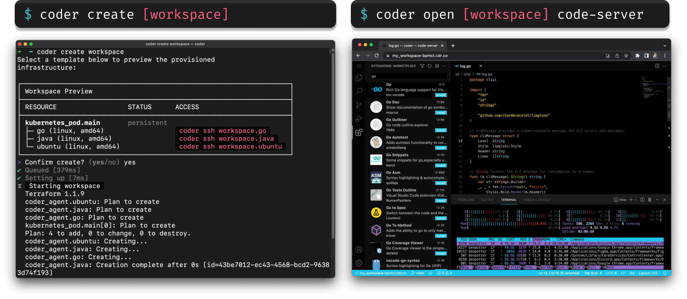

<!-- markdownlint-disable MD041 -->
<div align="center">
  <a href="https://coder.com#gh-light-mode-only">
    
  </a>
  <a href="https://coder.com#gh-dark-mode-only">
    
  </a>

  <h1>
  Self-Hosted Cloud Development Environments
  </h1>

  <a href="https://coder.com#gh-light-mode-only">
    
  </a>
  <a href="https://coder.com#gh-dark-mode-only">
    
  </a>

  <br>
  <br>

[Quickstart](#quickstart) | [Docs](https://coder.com/docs) | [Why Coder](https://coder.com/why) | [Premium](https://coder.com/pricing#compare-plans)

[](https://discord.gg/coder)
[](https://github.com/coder/coder/releases/latest)
[](https://pkg.go.dev/github.com/coder/coder)
[](https://goreportcard.com/report/github.com/coder/coder/v2)
[](https://www.bestpractices.dev/projects/9511)
[](https://scorecard.dev/viewer/?uri=github.com%2Fcoder%2Fcoder)
[](./LICENSE)

</div>

[Coder](https://coder.com) enables organizations to set up development environments in their public or private cloud infrastructure. Cloud development environments are defined with Terraform, connected through a secure high-speed Wireguard® tunnel, and automatically shut down when not used to save on costs. Coder gives engineering teams the flexibility to use the cloud for workloads most beneficial to them.

Bananas

- Define cloud development environments in Terraform
  - EC2 VMs, Kubernetes Pods, Docker Containers, etc.
- Automatically shutdown idle resources to save on costs
- Onboard developers in seconds instead of days

<p align="center">
  
</p>

## Quickstart

The most convenient way to try Coder is to install it on your local machine and experiment with provisioning cloud development environments using Docker (works on Linux, macOS, and Windows).

```shell
# First, install Coder
curl -L https://coder.com/install.sh | sh

# Start the Coder server (caches data in ~/.cache/coder)
coder server

# Navigate to http://localhost:3000 to create your initial user,
# create a Docker template and provision a workspace
```

## Install

The easiest way to install Coder is to use our
[install script](https://github.com/coder/coder/blob/main/install.sh) for Linux
and macOS. For Windows, use the latest `..._installer.exe` file from GitHub
Releases.

```shell
curl -L https://coder.com/install.sh | sh
```

You can run the install script with `--dry-run` to see the commands that will be used to install without executing them. Run the install script with `--help` for additional flags.

> See [install](https://coder.com/docs/install) for additional methods.

Once installed, you can start a production deployment with a single command:

```shell
# Automatically sets up an external access URL on *.try.coder.app
coder server

# Requires a PostgreSQL instance (version 13 or higher) and external access URL
coder server --postgres-url <url> --access-url <url>
```

Use `coder --help` to get a list of flags and environment variables. Use our [install guides](https://coder.com/docs/install) for a complete walkthrough.

## Documentation

Browse our docs [here](https://coder.com/docs) or visit a specific section below:

- [**Templates**](https://coder.com/docs/templates): Templates are written in Terraform and describe the infrastructure for workspaces
- [**Workspaces**](https://coder.com/docs/workspaces): Workspaces contain the IDEs, dependencies, and configuration information needed for software development
- [**IDEs**](https://coder.com/docs/ides): Connect your existing editor to a workspace
- [**Administration**](https://coder.com/docs/admin): Learn how to operate Coder
- [**Premium**](https://coder.com/pricing#compare-plans): Learn about our paid features built for large teams

## Support

Feel free to [open an issue](https://github.com/coder/coder/issues/new) if you have questions, run into bugs, or have a feature request.

[Join our Discord](https://discord.gg/coder) to provide feedback on in-progress features and chat with the community using Coder!

## Integrations

We are always working on new integrations. Please feel free to open an issue and ask for an integration. Contributions are welcome in any official or community repositories.

### Official

- [**VS Code Extension**](https://marketplace.visualstudio.com/items?itemName=coder.coder-remote): Open any Coder workspace in VS Code with a single click (Special thanks to Microsoft for their excellent VS Code platform!)
- [**JetBrains Gateway Extension**](https://plugins.jetbrains.com/plugin/19620-coder): Open any Coder workspace in JetBrains Gateway with a single click
- [**Dev Container Builder**](https://github.com/coder/envbuilder): Build development environments using `devcontainer.json` on Docker, Kubernetes, and OpenShift
- [**Module Registry**](https://registry.coder.com): Extend development environments with common use-cases
- [**Kubernetes Log Stream**](https://github.com/coder/coder-logstream-kube): Stream Kubernetes Pod events to the Coder startup logs
- [**Self-Hosted VS Code Extension Marketplace**](https://github.com/coder/code-marketplace): A private extension marketplace that works in restricted or airgapped networks integrating with [code-server](https://github.com/coder/code-server).
- [**Setup Coder**](https://github.com/marketplace/actions/setup-coder): An action to setup coder CLI in GitHub workflows.

### Community

- [**Provision Coder with Terraform**](https://github.com/ElliotG/coder-oss-tf): Provision Coder on Google GKE, Azure AKS, AWS EKS, DigitalOcean DOKS, IBMCloud K8s, OVHCloud K8s, and Scaleway K8s Kapsule with Terraform
- [**Coder Template GitHub Action**](https://github.com/marketplace/actions/update-coder-template): A GitHub Action that updates Coder templates

## Contributing

We are always happy to see new contributors to Coder. If you are new to the Coder codebase, we have
[a guide on how to get started](https://coder.com/docs/CONTRIBUTING). We'd love to see your
contributions!

## Hiring

Apply [here](https://jobs.ashbyhq.com/coder?utm_source=github&utm_medium=readme&utm_campaign=unknown) if you're interested in joining our team.
