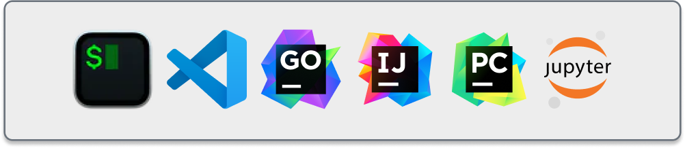

# Coder

[](https://github.com/coder/coder/discussions)
[](https://discord.gg/coder)
[](https://twitter.com/coderhq)
[](https://codecov.io/gh/coder/coder)

Coder turns your cloud into a fleet of development servers.


**Code more**

- Build and test faster, leveraging cloud CPUs, RAM, network speeds, etc.
- Access your environment from anywhere on any client (even an iPad)
- Onboard instantly then stay up to date

**Manage less**

- Ensure consistent development workspaces across your team
  - Rollout critical updates to your fleet of workspaces with one command
- Automatically shut down expensive cloud resources
- Keep your source code and data behind your firewall

## How it works

Coder workspaces are represented with terraform. But, no terraform knowledge is
required to get started. We have a database of pre-made templates built into the
product. Terraform empowers you to create
environments on _anything_, including:

- VMs across any cloud
- Kubernetes across any cloud (AKS, EKS, GKS)
- Dedicated server providers (Hetzner, OVH)
- Linux, Windows and MacOS environments

Coder workspaces don't stop at compute. You can add storage buckets, secrets, sidecars
and whatever else Terraform lets you dream up.


[Learn more about managing infrastructure.](./docs/templates.md)

## IDE Support

Coder gives you a private tunnel to any port on your workspace as well as
SSH access. You can use any Web IDE ([code-server](https://github.com/coder/code-server), [projector](https://github.com/JetBrains/projector-server), [Jupyter](https://jupyter.org/), etc.), [JetBrains Gateway](https://www.jetbrains.com/remote-development/gateway/), [VS Code Remote](https://code.visualstudio.com/docs/remote/ssh-tutorial) or even a file sync such as [mutagen](https://mutagen.io/).



## Installing Coder

We recommend installing [the latest
release](https://github.com/coder/coder/releases) on a system with at least 1
CPU core and 2 GB RAM:

1. Download the release appropriate for your operating system
1. Unzip the folder you just downloaded, and move the `coder` executable to a
   location that's on your `PATH`

> Make sure you have the appropriate credentials for your cloud provider (e.g.,
> access key ID and secret access key for AWS).

You can set up a temporary deployment, a production deployment, or a system service:

- To set up a **temporary deployment**, start with dev mode (all data is in-memory and is
  destroyed on exit):

  ```bash
  coder server --dev
  ```

- To run a **production deployment** with PostgreSQL:

  ```bash
  CODER_PG_CONNECTION_URL="postgres://<username>@<host>/<database>?password=<password>" \
      coder server
  ```

- To run as a **system service**, install with `.deb` (Debian, Ubuntu) or `.rpm`
  (Fedora, CentOS, RHEL, SUSE):

  ```bash
  # Edit the configuration!
  sudo vim /etc/coder.d/coder.env
  sudo service coder restart
  ```

> Use `coder --help` to get a complete list of flags and environment
> variables.

See the [installation guide](./docs/install.md) for additional ways to deploy Coder.

## Creating your first template and workspace

In a new terminal window, run the following to copy a sample template:

```bash
coder templates init
```

Follow the CLI instructions to modify and create the template specific for your
usage (e.g., a template to **Develop in Linux on Google Cloud**).

Create a workspace using your template:

```bash
coder create --template="yourTemplate" <workspaceName>
```

Connect to your workspace via SSH:

```bash
coder ssh <workspaceName>
```

## Modifying templates

You can edit the Terraform template using a sample template:

```sh
coder templates init
cd gcp-linux/
vim main.tf
coder templates update gcp-linux
```

## Documentation

- [About Coder](./docs/about.md#about-coder)
  - [Why remote development](./docs/about.md#why-remote-development)
  - [Why Coder](./docs/about.md#why-coder)
  - [What Coder is not](./docs/about.md#what-coder-is-not)
  - [Comparison: Coder vs. [product]](./docs/about.md#comparison)
- [Templates](./docs/templates.md)
  - [Manage templates](./docs/templates.md#manage-templates)
  - [Persistent and ephemeral
    resources](./docs/templates.md#persistent-and-ephemeral-resources)
  - [Parameters](./docs/templates.md#parameters)
- [Workspaces](./docs/workspaces.md)
  - [Create workspaces](./docs/workspaces.md#create-workspaces)
  - [Connect with SSH](./docs/workspaces.md#connect-with-ssh)
  - [Editors and IDEs](./docs/workspaces.md#editors-and-ides)
  - [Workspace lifecycle](./docs/workspaces.md#workspace-lifecycle)
  - [Updating workspaces](./docs/workspaces.md#updating-workspaces)

## Contributing

Read the [contributing docs](./docs/CONTRIBUTING.md).

## Contributors

Find our list of contributors [here](./docs/CONTRIBUTORS.md).
