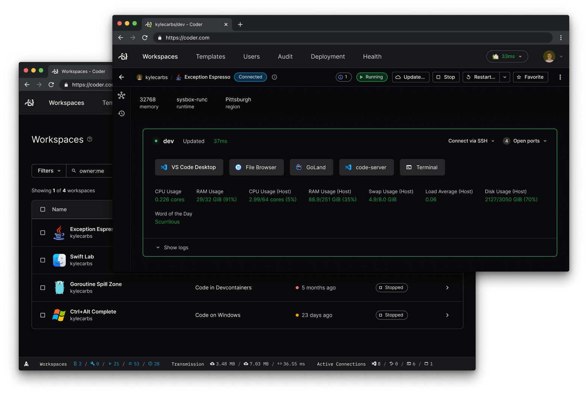

# Coder — Your Self-Hosted Remote Development Platform

[](https://coder.com/chat?utm_source=github.com/coder/coder&utm_medium=github&utm_campaign=readme.md)
[](https://codecov.io/gh/coder/coder)
[](https://pkg.go.dev/github.com/coder/coder)

Offload your team's development from local workstations to cloud servers. Onboard developers in minutes. Build, test and compile at the speed of the cloud. Keep your source code and data behind your firewall.

> "By leveraging Terraform, Coder lets developers run any IDE on any compute platform including on-prem, AWS, Azure, GCP, DigitalOcean, Kubernetes, Docker, and more, with workspaces running on Linux, Windows, or Mac." - **Kevin Fishner Chief of Staff at [HashiCorp](https://hashicorp.com/)**

<p align="center">
  
</p>

## Highlights

- Build and test faster
  - Leveraging cloud CPUs, RAM, network speeds, etc.
- Access your environment from any place on any client (even an iPad)
- Onboard instantly then stay up to date continuously

## Getting Started

The easiest way to install Coder is to use our
[install script](https://github.com/coder/coder/blob/main/install.sh) for Linux
and macOS. For Windows, use the latest `..._installer.exe` file from GitHub
Releases.

To install, run:

```bash
curl -L https://coder.com/install.sh | sh
```

You can preview what occurs during the install process:

```bash
curl -L https://coder.com/install.sh | sh -s -- --dry-run
```

You can modify the installation process by including flags. Run the help command for reference:

```bash
curl -L https://coder.com/install.sh | sh -s -- --help
```

> See [install](docs/install) for additional methods.

Once installed, you can start a production deployment<sup>1</sup> with a single command:

```console
# Automatically sets up an external access URL on *.try.coder.app
coder server

# Requires a PostgreSQL instance (version 13 or higher) and external access URL
coder server --postgres-url <url> --access-url <url>
```

> <sup>1</sup> The automatic setup is great for trying out Coder with small deployments, but do consider using an external database for increased assurance and control.

Use `coder --help` to get a complete list of flags and environment variables. Use our [quickstart guide](https://coder.com/docs/v2/latest/quickstart) for a full walkthrough.

## Documentation

Visit our docs [here](https://coder.com/docs/v2).

## Templates

Find our templates [here](./examples/templates).

## Community and Support

Join our community on [Discord](https://coder.com/chat?utm_source=github.com/coder/coder&utm_medium=github&utm_campaign=readme.md) and [Twitter](https://twitter.com/coderhq)!

[Suggest improvements and report problems](https://github.com/coder/coder/issues/new/choose)

## Contributing

Read the [contributing docs](https://coder.com/docs/v2/latest/CONTRIBUTING).

Find our list of contributors [here](https://github.com/coder/coder/graphs/contributors).

## Comparison

Please file [an issue](https://github.com/coder/coder/issues/new) if any information is out of date. Also refer to:

- [The Self-Hosting Paradox](https://coder.com/blog/the-self-hosting-paradox?utm_source=github.com/coder/coder&utm_medium=github&utm_campaign=readme.md).
- [GitHub Codespaces, Coder, and Enterprise Customers](https://coder.com/blog/github-codespaces-coder-and-enterprise-customers?utm_source=github.com/coder/coder&utm_medium=github&utm_campaign=readme.md)
- [How our development team shares one giant bare metal machine](https://coder.com/blog/how-our-development-team-shares-one-giant-bare-metal-machine?utm_source=github.com/coder/coder&utm_medium=github&utm_campaign=readme.md).

| Tool                                                                                                                                                                                      | Type     | Delivery Model                                                                                                                              | Cost                                     | Internet Access Required | Latency and Data Sovereignty                                                                                                                                               | Security isolation model                                                                                                                                                                                            | Product quality                                                                                                          | Service Availability                                          | Environments                                                                                                                                                               | IDE                                                                                                                                                                                                                                                                                                                                                                                                                                                                                                                                                                                                                                                                                                                                               |
| ----------------------------------------------------------------------------------------------------------------------------------------------------------------------------------------- | -------- | ------------------------------------------------------------------------------------------------------------------------------------------- | ---------------------------------------- | ------------------------ | -------------------------------------------------------------------------------------------------------------------------------------------------------------------------- | ------------------------------------------------------------------------------------------------------------------------------------------------------------------------------------------------------------------- | ------------------------------------------------------------------------------------------------------------------------ | ------------------------------------------------------------- | -------------------------------------------------------------------------------------------------------------------------------------------------------------------------- | ------------------------------------------------------------------------------------------------------------------------------------------------------------------------------------------------------------------------------------------------------------------------------------------------------------------------------------------------------------------------------------------------------------------------------------------------------------------------------------------------------------------------------------------------------------------------------------------------------------------------------------------------------------------------------------------------------------------------------------------------- |
| [Coder](https://coder.com/blog/how-our-development-team-shares-one-giant-bare-metal-machine?utm_source=github.com/coder/coder&utm_medium=github&utm_campaign=readme.md)                   | Platform | OSS + Self-Managed                                                                                                                          | Pay your cloud                           | No                       | Self-Hosted                                                                                                                                                                | Unopinionated (whatever/wherever you choose to deploy thus 100% configurable)                                                                                                                                       | [Defect history](https://github.com/coder/coder/issues?q=is%3Aissue+is%3Aopen+sort%3Aupdated-desc+label%3Abug)           | Self-Hosted                                                   | All [Terraform](https://www.terraform.io/registry/providers) resources, all clouds, multi-architecture: Linux, Mac, Windows, containers, VMs, amd64, arm64                 | Anything (vim, emacs, theia, code-server, openvscode-server, entire jetbrains suite inc gateway remote development, visual studio code desktop, visual studio for mac, visual studio for windows) you choose to install and deploy                                                                                                                                                                                                                                                                                                                                                                                                                                                                                                                |
| [code-server](https://coder.com/blog/code-server-multiple-users?utm_source=github.com/coder/coder&utm_medium=github&utm_campaign=readme.md)                                               | Web IDE  | OSS + Self-Managed                                                                                                                          | Pay your cloud                           | No                       | Self-Hosted                                                                                                                                                                | Self-Hosted docker container                                                                                                                                                                                        | [Defect history](https://github.com/coder/code-server/issues?q=is%3Aissue+is%3Aopen+sort%3Aupdated-desc+label%3Abug)     | Self-hosted                                                   | Linux, Mac, Windows, containers, VMs, amd64, arm64                                                                                                                         | [code-server](https://github.com/coder/code-server) (VSCode MIT) [with restrictions](https://ghuntley.com/fracture)                                                                                                                                                                                                                                                                                                                                                                                                                                                                                                                                                                                                                               |
| [openvscode-server](https://github.com/gitpod-io/openvscode-server)                                                                                                                       | Web IDE  | OSS + Self-Managed                                                                                                                          | Pay your cloud                           | No                       | Self-Hosted                                                                                                                                                                | Self-Hosted docker container                                                                                                                                                                                        | [Defect history](https://github.com/gitpod-io/openvscode-server)                                                         | Self-hosted                                                   | Linux, Mac, Windows, containers, VMs, amd64                                                                                                                                | [openvscode-server](https://github.com/gitpod-io/openvscode-server) (VSCode MIT) [with restrictions](https://ghuntley.com/fracture)                                                                                                                                                                                                                                                                                                                                                                                                                                                                                                                                                                                                               |
| [Amazon CodeCatalyst](https://coder.com/blog/the-self-hosting-paradox?utm_source=github.com/coder/coder?utm_source=github.com/coder/coder&utm_medium=github&utm_campaign=readme.md)       | Platform | SaaS                                                                                                                                        | Pay AWS                                  | Yes                      | US West (Oregon)                                                                                                                                                           | ["all customer multi-tenancy isolation is done through virtual machines" for security reasons](https://devclass.com/2022/12/05/interview-why-aws-prefers-vms-for-code-isolation-and-tips-on-developing-for-lambda/) | N/A                                                                                                                      | [Service Health](https://health.aws.amazon.com/health/status) | Linux Virtual Machines                                                                                                                                                     | Cloud9, Visual Studio Code Desktop ([no restrictions](https://ghuntley.com/fracture)) and JetBrains Gateway                                                                                                                                                                                                                                                                                                                                                                                                                                                                                                                                                                                                                                       |
| [CodeAnywhere](https://coder.com/blog/the-self-hosting-paradox?utm_source=github.com/coder/coder?utm_source=github.com/coder/coder&utm_medium=github&utm_campaign=readme.md)              | Platform | SaaS                                                                                                                                        | Per user                                 | Yes                      | N/A                                                                                                                                                                        | N/A                                                                                                                                                                                                                 | N/A                                                                                                                      | N/A                                                           | N/A                                                                                                                                                                        | Theia                                                                                                                                                                                                                                                                                                                                                                                                                                                                                                                                                                                                                                                                                                                                             |
| [GitHub Codespaces](https://coder.com/blog/github-codespaces-coder-and-enterprise-customers?utm_source=github.com/coder/coder&utm_medium=github&utm_campaign=readme.md)                   | Platform | SaaS                                                                                                                                        | 2x Azure Compute                         | Yes                      | Four regions (US West, US East, Europe West, Southeast Asia)                                                                                                               | ["two codespaces are never co-located on the same VM"](https://docs.github.com/en/codespaces/codespaces-reference/security-in-github-codespaces)                                                                    | N/A                                                                                                                      | [Incident History](https://www.githubstatus.com/history)      | Linux Virtual Machines, [GPUs supported](https://docs.github.com/en/codespaces/developing-in-codespaces/getting-started-with-github-codespaces-for-machine-learning)       | Visual Studio Code ([no restrictions](https://ghuntley.com/fracture)) and JetBrains Gateway                                                                                                                                                                                                                                                                                                                                                                                                                                                                                                                                                                                                                                                       |
| [Gitpod](https://coder.com/blog/the-self-hosting-paradox?utm_source=github.com/coder/coder?utm_source=github.com/coder/coder&utm_medium=github&utm_campaign=readme.md)                    | Platform | [SaaS](https://news.ycombinator.com/item?id=33907897)                                                                                       | [Credits](https://www.gitpod.io/pricing) | Yes                      | Two regions (Europe, US)                                                                                                                                                   | [All customers intermixed on the same machine isolated via runc](https://kinvolk.io/blog/2020/12/improving-kubernetes-and-container-security-with-user-namespaces/)                                                 | [Defect history](https://github.com/gitpod-io/gitpod/issues?q=is%3Aissue+label%3A%22type%3A+bug%22+sort%3Aupdated-desc+) | [Incident history](https://www.gitpodstatus.com/history)      | Basic Linux containers, [GPUs](https://github.com/gitpod-io/gitpod/issues/10650) and [kubernetes/k3s](https://github.com/gitpod-io/gitpod/issues/4889) is not yet possible | [openvscode-server](https://github.com/gitpod-io/openvscode-server) (VSCode MIT) [with restrictions](https://ghuntley.com/fracture) inhibiting functionality of [.NET](https://www.isdotnetopen.com), [Python](https://visualstudiomagazine.com/articles/2021/11/05/vscode-python-nov21.aspx), [C](https://marketplace.visualstudio.com/items/ms-vscode.cpptools/license), [C++](https://marketplace.visualstudio.com/items/ms-vscode.cpptools/license), [Jupyter](https://visualstudiomagazine.com/articles/2021/11/05/vscode-python-nov21.aspx) and usage of [GitHub Co-pilot](https://github.com/gitpod-io/gitpod/issues/10032). Visual Studio Code Desktop ([no restrictions](https://ghuntley.com/fracture)) and JetBrains Gateway supported |
| [Google Cloud Workstations](https://coder.com/blog/the-self-hosting-paradox?utm_source=github.com/coder/coder?utm_source=github.com/coder/coder&utm_medium=github&utm_campaign=readme.md) | Platform | SaaS (Preview, not GA)                                                                                                                      | Pay Google                               | Yes                      | southamerica-west1, us-east1, us-central1, us-west1, asia-east1, asia-southeast1, europe-north1, europe-southwest1, europe-west1, europe-west2, europe-west3, europe-west4 | N/A                                                                                                                                                                                                                 | N/A                                                                                                                      | Not generally available, offered in preview mode.             | Linux                                                                                                                                                                      | code-oss ([with restrictions](https://ghuntley.com/fracture)), Visual Studio Code Desktop ([no restrictions](https://ghuntley.com/fracture)) and JetBrains Gateway                                                                                                                                                                                                                                                                                                                                                                                                                                                                                                                                                                                |
| [JetBrains Space](https://coder.com/blog/the-self-hosting-paradox?utm_source=github.com/coder/coder?utm_source=github.com/coder/coder&utm_medium=github&utm_campaign=readme.md)           | Platform | SaaS + On-Prem ([Dev environments are not supported](https://www.jetbrains.com/help/space-on-premises/space-on-premises-installation.html)) | Pay JetBrains                            | Yes                      | EU Ireland region (eu-west-1)                                                                                                                                              | EC2                                                                                                                                                                                                                 | N/A                                                                                                                      | [Service Health](https://status.jetbrains.space/)             | Linux Virtual Machines                                                                                                                                                     | JetBrains Suite                                                                                                                                                                                                                                                                                                                                                                                                                                                                                                                                                                                                                                                                                                                                   |
| [Microsoft DevBox](https://coder.com/blog/the-self-hosting-paradox?utm_source=github.com/coder/coder?utm_source=github.com/coder/coder&utm_medium=github&utm_campaign=readme.md)          | Platform | SaaS (Preview, not GA)                                                                                                                      | Pay Microsoft                            | Yes                      | Australia East, Europe West, Japan East, Canada Central, UK South, US East, US East 2, US South Central, and US West 3                                                     | Microsoft Azure Virtual Machine                                                                                                                                                                                     | N/A                                                                                                                      | Not generally available, offered in preview mode.             | Windows Virtual Machine                                                                                                                                                    | Any application that runs on Windows via Microsoft Remote Desktop                                                                                                                                                                                                                                                                                                                                                                                                                                                                                                                                                                                                                                                                                 |

_Last updated: 14/12/2022_
