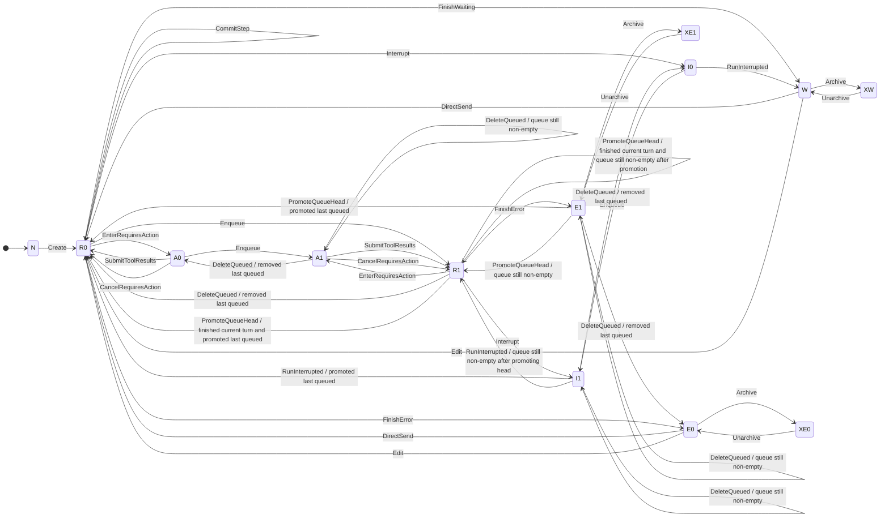
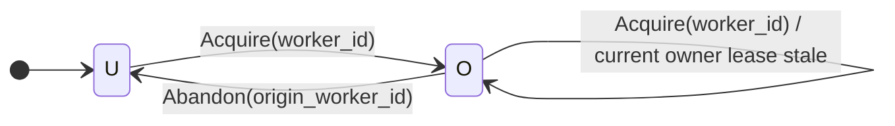

# chatd redesign

## Introduction

`chatd` currently manages chat state, but the actual execution path is spread
across direct SQL mutations, worker acquisition and heartbeats, pubsub,
in-memory fanout, relay behavior, and HTTP handlers that can race one another.
That makes correctness hard to reason about, especially around stale workers,
interrupts, queued-message promotion, and effect callbacks.

The goal of this redesign is to make the chat runtime behave like a set of
explicit state machines with clearly separated responsibilities. In broad
strokes, it does that by:

- treating the chat snapshot in `chats` plus its durable projections
  (`chat_messages`, `chat_queued_messages`, pending action, files) as the
  source of truth,
- defining durable chat behavior as pure transitions applied through
  `ApplyTransitions(...)`,
- serializing durable transition application per chat by locking the durable
  snapshot row,
- making chat ownership and lease management explicit in the durable model,
- using runtime components that re-derive needed work from the latest durable
  state rather than from ad hoc in-memory control flow,
- fencing stale callbacks with `worker_id`, `history_epoch`, and
  `generation_attempt`, and
- separating durable chat semantics, local runtime control, and client stream
  assembly into distinct machines.

Note: as of this writing, there's [a PR to auto-archive chats](https://github.com/coder/coder/pull/24486).
Once it's merged, this document will mention how it'll work with the new design.

## Runtime overview

There are 5 high-level runtime components:

1. the **acquisition loop** is responsible for finding chats that should be
   owned and attempting `Acquire(worker_id)`,
2. the **heartbeat loop** is responsible for keeping owner leases fresh for
   chats this replica owns,
3. the **runner registry** is responsible for tracking locally owned chats,
   owning `ChatRunner` lifetime, and ensuring local ownership invariants hold,
4. the **ChatRunner** is responsible for reconciling one owned chat's local
   runtime to the latest durable state, and
5. the **GenerationSession** is responsible for performing one run attempt and
   reporting its outcome back to the `ChatRunner`.

```text
Replica runtime
│
├─ Acquisition loop
├─ Heartbeat loop
└─ Runner registry
      └─ ChatRunner (one per owned chat)
            └─ GenerationSession (at most one active per chat)
```

## Document map

This plan is organized into 3 state-machine sections:

- **Section 1: Durable chat state machine** covers the durable meaning of a
  chat and all state mutated through `ApplyTransitions(...)`.
- **Section 2: ChatRunner registry and control state machine** covers the local
  runtime that reacts to durable state: the multi-chat runner registry and the
  per-chat `ChatRunner` control machine.
- **Section 3: Stream state machine** gives a high-level description of the
  machine that assembles the client-visible chat stream.

## 1. Durable chat state machine

This section covers the durable meaning of a chat and all state mutated through
`ApplyTransitions(...)`.

### 1.1 Scope

This machine owns all **durable chat semantics** for the core chat machine:

- direct transition application via `ApplyTransitions(...)`,
- serialized transition execution per chat,
- durable snapshot updates,
- committed message / queue / pending-action mutations,
- durable ownership state (`worker_id` and `heartbeat_at`), and
- durable notification emission after successful applies.

Durable chat state in this redesign has 2 layers:

- **core-machine state**, which is mutated through `ApplyTransitions(...)` and
  projected in sections 1.5 and 1.6, and
- **serialized metadata/configuration**, which is still durable chat state but
  is not part of the core machine.

Examples of serialized metadata include title, labels, workspace binding,
plan-mode, pin-order, and similar per-chat configuration fields. Some of that
metadata, such as plan-mode, still affects runtime behavior, but it is not
modeled as a node or edge in the core machine.

This machine does **not** define:

- registry behavior,
- `ChatRunner` local control behavior,
- `GenerationSession` lifecycle,
- connected stream attach behavior,
- relay handshake details, or
- the semantics of metadata-only updates, except that they must serialize with
  transition applies.

Committed transition application is serialized per chat by locking the durable
chat snapshot inside `ApplyTransitions(...)`. Metadata updates must take that
same per-chat lock, so metadata writes and transition applies are serialized
with respect to one another even though only the latter are part of the core
machine.

### 1.2 Durable state

The current durable chat state is spread across:

- the `chats` table, which acts as the primary per-chat snapshot,
- `chat_messages`, which stores committed history,
- `chat_queued_messages`, which stores queued user messages, and
- other related durable projections used by the runtime.

In the redesign, the core idea stays the same: durable chat meaning lives in
that snapshot plus its projections. The redesign mainly changes **how** those
structures are mutated and how runtime components derive work from them.

Not all durable fields belong to the core machine. The core machine models
execution status, queue/pending-action state, ownership, and history
progression. Other fields remain durable chat metadata/configuration and are
intentionally excluded from the core projections because they do not define
execution-state transitions.

Critical core-machine fields include:

- `status`,
- `history_epoch`,
- `snapshot_version`,
- `pending_action`,
- `worker_id`,
- `heartbeat_at`,
- `generation_attempt`,
- `requires_action_deadline_at`,
- `last_error`, and
- `chat_messages.compressed` plus the usage metadata carried on assistant
  messages (`input_tokens`, `cache_read_tokens`, `cache_creation_tokens`, and
  `context_limit`).

Other durable fields may still affect future turns — for example,
workspace binding, plan-mode, and related per-chat configuration —
but they are treated as serialized metadata rather than core-machine state.

The redesign treats chat compaction as ordinary `chat_messages` rows that alter
future prompt reconstruction through projection rules. Compaction is not a
separate durable execution status.

`snapshot_version` answers:

> which committed core-machine changes are included in this snapshot?

Each successful `ApplyTransitions(...)` call advances `snapshot_version` once.
That single version advance is the committed watermark for the whole applied
transition bundle. Metadata-only writes do not advance `snapshot_version`.

`history_epoch` answers:

> which committed prompt-history state was this session based on?

Every successful transition that mutates committed message history increments
`history_epoch`. Queue-only, ownership-only, and status-only transitions do not.
Every successful history-changing apply also resets `generation_attempt` to `0`.

`generation_attempt` answers:

> how many generation starts have been durably recorded for the current
> `history_epoch`?

It increments before a `GenerationSession` is launched. It does not by itself
change `status`, `history_epoch`, or ownership semantics. This redesign uses a
hardcoded attempt limit of 5 generation starts per `history_epoch`.

`requires_action_deadline_at` answers:

> when does the current pending action stop waiting for client input?

It is `NULL` unless `status = requires_action`. `EnterRequiresAction(...)` sets
it, and `SubmitToolResults(...)` plus `CancelRequiresAction(...)` clear it. It
does not by itself change `status`, `history_epoch`, or ownership semantics.

`last_error` is interpreted as active only while `status = error`. Non-error
transitions do not need to clear it, and later `FinishError(...)`
transitions overwrite it.

`worker_id` and `heartbeat_at` form a per-chat owner lease.

Rules:

- `worker_id` identifies the replica that currently owns the chat.
- Ownership is orthogonal to execution status. A chat may be owned while
  `status` is `waiting`, `error`, `requires_action`, `running`, or
  `interrupting`.
- `running` does not guarantee a currently live effect. It means the durable
  snapshot says generation should be active when an owner reconciles the chat.
- `heartbeat_at` tracks liveness of the owner process, not of an individual LLM
  goroutine.
- Heartbeats do not advance `snapshot_version`.
- `Acquire(...)` may set `worker_id` from `NULL` or replace a stale owner.
- `Abandon(...)` clears `worker_id` and `heartbeat_at`.
- No other transition changes `worker_id`.

### 1.3 Transition application API

`ApplyTransitions(chat_id, transitions...)` is the only mechanism that mutates
durable **core-machine state**.

Serialized metadata updates do not go through `ApplyTransitions(...)`. They
still mutate durable chat state, but they are outside the core machine. Those
metadata writes must lock the same chat row and therefore serialize with
`ApplyTransitions(...)`, so each chat still has a single ordered sequence of
transition bundles and metadata writes.

Rules:

- it applies one or more transitions for one chat in one DB transaction,
- metadata-only updates use separate write paths, but those write paths must
  take the same per-chat lock so they serialize with transition applies,
- it may be called by API handlers, the acquisition loop, or a `ChatRunner`,
- it returns the direct result to the caller; there is no durable result queue,
- there is no persistent idempotency layer; callers that want to retry must
  re-read snapshot state and call `ApplyTransitions(...)` again, and
- transition preconditions must support safe no-op or conflict rejection when
  the snapshot has already moved on.

Bundling rule:

- bundle multiple transitions only when the intermediate states are
  intentionally unobservable and need not survive crashes.

Allowed bundle examples:

- `ReorderQueue(qid, 0)` + `Interrupt`
- `ReorderQueue(qid, 0)` + `PromoteQueueHead`

Disallowed bundle examples:

- `Interrupt` + `RunInterrupted`

Those intermediate states are intentionally durable and must remain visible for
recovery and later reconciliation.

### 1.4 Transitions

#### External transitions

- `Create(initialUser)` creates a new chat with its initial user turn and lands
  in `running`.
- `DirectSend(m)` appends a user message directly to an idle chat and lands in
  `running`.
- `Enqueue(m)` appends a user message to the durable queue without changing the
  active history.
- `ReorderQueue(qid, new_pos)` moves a queued user message to a new durable
  queue position while preserving the relative order of all other queued
  messages. It does not change active history or chat status.
- `DeleteQueued(qid1, qid2, ...)` removes one or more queued messages without
  changing the active history.
- `Edit(k, replacement)` truncates active history at a user turn, inserts the
  replacement turn, and lands in `running`.
- `Archive` sets the archived marker for one chat. Family-scoped archive
  operations may apply it across multiple chats.
- `Unarchive` clears the archived marker for one chat. Family-scoped
  unarchive operations may apply it across multiple chats.

#### Internal transitions

- `Acquire(worker_id)` sets `worker_id` to the designated worker and refreshes
  `heartbeat_at`.
- `Abandon(origin_worker_id)` verifies that `origin_worker_id` still owns the
  chat, then clears `worker_id` and `heartbeat_at`.
- `Interrupt` requests cancellation of an active generation and lands in
  `interrupting`. It is callable only from `running`.
- `CommitStep(step)` appends one durable message suffix while remaining
  `running`. A committed step may append ordinary assistant/tool messages, and a
  compaction step may append a compressed summary boundary plus visible
  compaction tool-call and tool-result messages. `CommitStep(...)` requires a
  matching `history_epoch` and `generation_attempt`, and increments
  `history_epoch` on success.
- `EnterRequiresAction(calls)` records pending dynamic tool calls, sets
  `requires_action_deadline_at`, and lands in `requires_action`.
- `SubmitToolResults(results)` appends submitted tool-result messages, clears
  pending action and `requires_action_deadline_at`, and lands in `running`. It
  preserves queued backlog, so `A0 -> R0` and `A1 -> R1`.
- `CancelRequiresAction(reason)` closes pending dynamic tool calls with
  synthetic cancellation tool results, clears pending action and
  `requires_action_deadline_at`, and lands in `running`. If the queue is empty
  it lands in `R0`; otherwise it lands in `R1`. It does not itself promote the
  queue head.
- `RunInterrupted(optionalPartialStep)` appends one final interrupted
  assistant/tool suffix if present, or finalizes interruption without a suffix
  if none is available, clears the interrupting state, and lands in `waiting`
  if no queued message is promoted. If interrupt finalization also promotes the
  queue head, it lands in `running`.
- `FinishWaiting` completes a run with no backlog and lands in `waiting`.
- `RecordGenerationAttempt` increments `generation_attempt` while remaining in
  `running`. It does not change `history_epoch`. If the incremented count
  exceeds the hardcoded attempt limit, the runner may later emit
  `FinishError(...)` instead of launching a fresh `GenerationSession`.
- `PromoteQueueHead` removes the queue head, appends it to history as a user
  turn, and lands in `running`. The runner may emit it after a completed run,
  an interrupted run, or other reconciliation that determines the current turn
  is done and backlog remains.
- `FinishError(err)` ends a running chat in `error` and persists
  `last_error = err`, overwriting any prior stored error.

### 1.5 Execution-state projection

This is one durable state machine. Sections 1.5 and 1.6 show 2 projections of
that same machine for readability:

- the **execution-state projection**, which models `status`, queue backlog,
  pending action, and archived state, and
- the **ownership projection**, which models `worker_id`.

| Code | Meaning |
|---|---|
| `N` | chat does not exist |
| `W` | `status=waiting`, `Q=[]` |
| `E0` | `status=error`, `Q=[]` |
| `E1` | `status=error`, `Q≠[]` |
| `R0` | `status=running`, `Q=[]` |
| `R1` | `status=running`, `Q≠[]` |
| `I0` | `status=interrupting`, `Q=[]` |
| `I1` | `status=interrupting`, `Q≠[]` |
| `A0` | `status=requires_action`, `Q=[]`, `pendingCalls≠{}` |
| `A1` | `status=requires_action`, `Q≠[]`, `pendingCalls≠{}` |
| `XW` | archived idle chat (`archived=true`, `Q=[]`) |
| `XE0` | archived error chat (`archived=true`, `Q=[]`) |
| `XE1` | archived error chat (`archived=true`, `Q≠[]`) |



### 1.6 Ownership projection

`heartbeat_at` is intentionally not modeled as its own ownership-state node.
Lease freshness is a predicate over the current `heartbeat_at` value that is
consulted by `Acquire(...)` preconditions and by runtime acquisition logic.

| Code | Meaning |
|---|---|
| `U` | `worker_id IS NULL` |
| `O` | `worker_id IS NOT NULL` |



Rules:

- `Acquire(...)` sets `worker_id` and refreshes `heartbeat_at`.
- `Abandon(...)` requires the recorded owner to match `origin_worker_id` and
  clears both `worker_id` and `heartbeat_at`.
- Except for `Acquire(...)` and `Abandon(...)`, transitions preserve
  `worker_id`.
- `heartbeat_at` is updated by lease renewal while a chat remains owned. That
  update does not advance `snapshot_version` and is not shown as a separate node
  in the ownership projection.
- The execution-state and ownership projections are combined by the same
  `ApplyTransitions(...)` calls. For example, `CommitStep(...)` changes only the
  execution-state/history projection, while `Acquire(...)` changes only the
  ownership projection.

### 1.7 Notification contract

Each successful `ApplyTransitions(...)` call that advances `snapshot_version`
emits committed post-apply notifications. No-op applies emit nothing.

There are 3 notification channels:

- `chat:ownership` is a global channel used by the registry and acquisition
  loop. Its payload is:
  - `chat_id`
  - `snapshot_version`
  - `worker_id`
- `chat:update:{chat_id}` is a per-chat control channel used by the
  `ChatRunner`. Its payload is:
  - `snapshot_version`
  - `worker_id`
  - `history_epoch`
  - `generation_attempt`
  - `status`
  - `archived`
- `chat:stream:{chat_id}` is a per-chat stream-assembly channel used by the
  client stream machine. Its payload is:
  - `snapshot_version`
  - `worker_id`
  - `history_epoch`
  - `generation_attempt`
  - `status`
  - `archived`
  - `events[]`

`chat:stream:{chat_id}` event types are:

- `append_messages(message_ids[])`
- `append_queue(queued_message_id)`
- `delete_queued(ids[])`
- `move_queued(id, new_pos)`
- `set_action_required`
- `clear_action_required`
- `set_error`
- `invalidate_stream`

Emission rules:

- `chat:update:{chat_id}` is emitted after every successful apply that advances
  `snapshot_version`.
- `chat:stream:{chat_id}` is emitted after every successful apply that advances
  `snapshot_version`.
- `chat:ownership` is emitted when the apply changed `worker_id`, such as
  `Acquire(...)` or `Abandon(...)`.
- `chat:ownership` may also be emitted after other successful applies that
  should wake ownership and acquisition processing, even when `worker_id`
  itself did not change. Specifically when the `worker_id` is `NULL` or if the heartbeat is stale.
- The acquisition loop treats every newer `chat:ownership` notification as a
  wake-up signal and still queries durable state before deciding whether to call
  `Acquire(...)`.
- `chat:update:{chat_id}` and `chat:stream:{chat_id}` carry compact raw summary
  fields rather than a fully-derived Section 1 execution-state class. Receivers
  may need a durable snapshot read to derive omitted queue, pending-action, or
  deadline state.
- `chat:stream:{chat_id}` must describe the committed effect of the apply using
  one or more of the listed event types.
- `chat:stream:{chat_id}` does not inline full content payloads. It carries
  only identifiers and compact metadata, and the stream machine loads the
  referenced content from the database.
- When the committed change is too large or not safely expressible as an
  incremental identifier-based delta, it emits an `invalidate_stream` event
  instead. The receiver then knows that it's missing data and should
  compensate, likely by fetching the full durable snapshot from the database.
- Notifications are post-commit, best-effort, and versioned.
- The current pubsub API is not assumed to provide transaction atomicity or
  commit-order delivery. Receivers must tolerate duplicates, drops, and
  reordering.
- Every receiver tracks the highest `snapshot_version` it has seen per chat.
  Notifications with `snapshot_version` less than or equal to that watermark are
  discarded.
- For the fields carried in a newer notification, the receiver may treat that
  notification as authoritative without an immediate DB read.
- Decisions that depend on omitted fields must fetch the full durable snapshot.
- Runtime startup recovery and periodic sweeps remain required for correctness.

#### Stream event emission per durable transition

Each successful durable transition bundle that advances `snapshot_version` emits
exactly one `chat:stream:{chat_id}` delta for the committed result of that
bundle.

Per-transition stream event rules are:

- `Create(initialUser)` emits:
  - `append_messages(message_ids=[initial_user_message_id])`
- `DirectSend(m)` emits:
  - `append_messages(message_ids=[new_user_message_id])`
- `Enqueue(m)` emits:
  - `append_queue(queued_message_id=new_queued_message_id)`
- `ReorderQueue(qid, new_pos)` emits:
  - `move_queued(id=qid, new_pos=new_pos)`
- `DeleteQueued(qid1, qid2, ...)` emits:
  - `delete_queued(ids=[qid1, qid2, ...])`
- `Edit(k, replacement)` emits:
  - `invalidate_stream`
- `Archive` emits:
  - `events[] = []`
- `Unarchive` emits:
  - `events[] = []`
- `Acquire(worker_id)` emits:
  - `events[] = []`
- `Abandon(origin_worker_id)` emits:
  - `events[] = []`
- `CommitStep(step)` emits:
  - `append_messages(message_ids=<committed_message_ids_in_order>)`
- `EnterRequiresAction(calls)` emits:
  - `set_action_required`
- `RunInterrupted(optionalPartialStep)` emits:
  - if a final partial suffix was committed:
    - `append_messages(message_ids=<committed_message_ids_in_order>)`
  - if queue promotion happened as part of the transition:
    - `append_messages(message_ids=[promoted_user_message_id])`
    - `delete_queued(ids=[promoted_queue_head_id])`
- `FinishWaiting` emits:
  - `events[] = []`
- `RecordGenerationAttempt` emits:
  - `events[] = []`
- `PromoteQueueHead` emits:
  - `append_messages(message_ids=[promoted_user_message_id])`
  - `delete_queued(ids=[promoted_queue_head_id])`
- `FinishError(err)` emits:
  - `set_error`
- `CancelRequiresAction(reason)` emits:
  - `append_messages(message_ids=<synthetic_tool_result_message_ids_in_order>)`
  - `clear_action_required`
- `SubmitToolResults(results)` emits:
  - `append_messages(message_ids=<submitted_tool_result_message_ids_in_order>)`
  - `clear_action_required`

Bundled-transition rule:

- when one `ApplyTransitions(...)` call commits multiple durable transitions, the
  emitted `events[]` list is the ordered concatenation of the stream event types
  implied by the committed result of that bundle.

### 1.9 Public API mapping

This section maps the current public endpoints that mutate chat state to the
transitions they should use in the redesign.

#### `POST /api/experimental/chats`

Handler today: `postChats` in `coderd/exp_chats.go`.

Current behavior:

- creates a new chat with its initial user turn.

Redesign mapping:

Here are the supported transition sequences:

- `N -> Create(initialUser) -> R0`

No other transition sequence is supported.

Expected API change:

- none. It should still return the created chat directly.

#### `PATCH /api/experimental/chats/{chat}`

Handler today: `patchChat` in `coderd/exp_chats.go`.

Current behavior:

- updates labels,
- archives / unarchives chats,
- updates pin order.

Redesign mapping:

- title, labels, workspace binding, plan-mode, and pin-order updates stay
  outside the durable core state machine, even though they remain durable chat
  state, and may remain direct metadata updates,
- archive and unarchive remain family-scoped composite operations that preserve
  the current parent/child cascade semantics and child-unarchive guard, and
- the per-chat archived-state flips inside those composite operations use
  `Archive` and `Unarchive`.

Here are the supported transition sequences for `archived` updates:

- `W -> Archive -> XW`
- `E0 -> Archive -> XE0`
- `E1 -> Archive -> XE1`
- `XW -> Unarchive -> W`
- `XE0 -> Unarchive -> E0`
- `XE1 -> Unarchive -> E1`

If the request does not change `archived`, this endpoint emits no durable
chat-state transition sequence.

Other execution-state classes are not supported for archive/unarchive.

Expected API change:

- archiving becomes more restrictive: attempts to archive a chat outside the
  archived-idle precondition should fail rather than implicitly interrupting or
  draining the chat first.

#### `POST /api/experimental/chats/{chat}/messages`

Handler today: `postChatMessages` in `coderd/exp_chats.go`.

Current behavior:

- direct-send when idle,
- enqueue when busy,
- queue-first interrupt when `busy_behavior=interrupt`.

Redesign mapping:

For `busy_behavior=queue`, here are the supported transition sequences:

- `W -> DirectSend(m) -> R0`
- `E0 -> DirectSend(m) -> R0`
- `E1 -> Enqueue(m) -> E1 -> PromoteQueueHead -> R1`: this one is a little unintuitive. The scenario where this happens is:
  - the user queued some messages
  - the chat ran into an error and stopped, for example because of an unretriable problem with the LLM provider
  - the user then sends a new message, but there is a non-empty queue.
  As defined here, the UX will be "add the new message to the end of the queue and promote the queue head."
  Arguably, a better UX could be "add the new message to the chat immediately and start running it, even though there's a non-empty queue."
  I think the former is better because it's more consistent with the behavior of the endpoint in other cases.
- `R0 -> Enqueue(m) -> R1`
- `R1 -> Enqueue(m) -> R1`
- `I0 -> Enqueue(m) -> I1`
- `I1 -> Enqueue(m) -> I1`
- `A0 -> Enqueue(m) -> A1`
- `A1 -> Enqueue(m) -> A1`

For `busy_behavior=interrupt`, here are the supported end-to-end sequences:

- `W -> DirectSend(m) -> R0`
- `E0 -> DirectSend(m) -> R0`
- `E1 -> Enqueue(m) -> E1 -> PromoteQueueHead -> R1`
- from `R0`:
  - endpoint: `R0 -> Enqueue(m) -> R1 -> Interrupt -> I1`
  - later picked up by a `ChatRunner`: `I1 -> RunInterrupted(partial?) -> R0`
- from `R1`:
  - endpoint: `R1 -> Enqueue(m) -> R1 -> Interrupt -> I1`
  - later picked up by a `ChatRunner`: `I1 -> RunInterrupted(partial?) -> R1`
- from `I0`:
  - endpoint: `I0 -> Enqueue(m) -> I1`
  - later picked up by a `ChatRunner`: `I1 -> RunInterrupted(partial?) -> R0`
- from `I1`:
  - endpoint: `I1 -> Enqueue(m) -> I1`
  - later picked up by a `ChatRunner`: `I1 -> RunInterrupted(partial?) -> R1`
- `A0 -> Enqueue(m) -> A1 -> CancelRequiresAction -> R1`
- `A1 -> Enqueue(m) -> A1 -> CancelRequiresAction -> R1`

Other execution-state classes are not supported.

Expected API change:

- none. It should still return either a directly inserted message or a
  queued message, depending on which transition path committed.

#### `PATCH /api/experimental/chats/{chat}/messages/{message}`

Handler today: `patchChatMessage` in `coderd/exp_chats.go`.

Current behavior:

- edits a user message and restarts from there.

Redesign mapping:

The endpoint first moves the chat into `W` or `E0`, then applies
`Edit(k, replacement)`.

For edit, the endpoint may emit `RunInterrupted(nil)` itself instead of waiting
for the `ChatRunner`. That is intentional: edit rewrites history from `k`
onward, so preserving an interrupted partial suffix is unnecessary because the
edit operation would discard it anyway.

Here are the supported end-to-end sequences:

- `W -> Edit(k, replacement) -> R0`
- `E0 -> Edit(k, replacement) -> R0`
- `E1 -> DeleteQueued(qid1, qid2, ...) -> E0 -> Edit(k, replacement) -> R0`
- `R0 -> Interrupt -> I0 -> RunInterrupted(nil) -> W -> Edit(k, replacement) -> R0`
- `R1 -> DeleteQueued(qid1, qid2, ...) -> R0 -> Interrupt -> I0 -> RunInterrupted(nil) -> W -> Edit(k, replacement) -> R0`
- `I0 -> RunInterrupted(nil) -> W -> Edit(k, replacement) -> R0`
- `I1 -> DeleteQueued(qid1, qid2, ...) -> I0 -> RunInterrupted(nil) -> W -> Edit(k, replacement) -> R0`
- `A0 -> CancelRequiresAction(edit) -> R0 -> Interrupt -> I0 -> RunInterrupted(nil) -> W -> Edit(k, replacement) -> R0`
- `A1 -> DeleteQueued(qid1, qid2, ...) -> A0 -> CancelRequiresAction(edit) -> R0 -> Interrupt -> I0 -> RunInterrupted(nil) -> W -> Edit(k, replacement) -> R0`

Other transition sequences are not supported.

Expected API change:

- none. It should still return the replacement message.

#### `DELETE /api/experimental/chats/{chat}/queue/{queuedMessage}`

Handler today: `deleteChatQueuedMessage` in `coderd/exp_chats.go`.

Current behavior:

- deletes a queued message by stable queued-message ID.

Redesign mapping:

Here are the supported transition sequences:

- `E1 -> DeleteQueued(qid) -> E0` if removing the last queued message
- `E1 -> DeleteQueued(qid) -> E1` if the queue remains non-empty
- `R1 -> DeleteQueued(qid) -> R0` if removing the last queued message
- `R1 -> DeleteQueued(qid) -> R1` if the queue remains non-empty
- `I1 -> DeleteQueued(qid) -> I0` if removing the last queued message
- `I1 -> DeleteQueued(qid) -> I1` if the queue remains non-empty
- `A1 -> DeleteQueued(qid) -> A0` if removing the last queued message
- `A1 -> DeleteQueued(qid) -> A1` if the queue remains non-empty

No other transition sequence is supported.

Expected API change:

- none.

#### `POST /api/experimental/chats/{chat}/queue/{queuedMessage}/promote`

Handler today: `promoteChatQueuedMessage` in `coderd/exp_chats.go`.

Current behavior:

- promotes a queued message into history.

Redesign mapping:

This endpoint remains a composite operation rather than a primitive
transition.

Here are the supported end-to-end sequences:

- from `E1`, if the queue contains only the promoted item:
  - endpoint: `E1 -> PromoteQueueHead -> R0`
- from `E1`, if the promoted message is already head and the queue remains
  non-empty after promotion:
  - endpoint: `E1 -> PromoteQueueHead -> R1`
- from `E1`, if the promoted message is not already head:
  - endpoint: `E1 -> ReorderQueue(qid, 0) -> E1 -> PromoteQueueHead -> R1`
- from `R1`, if the queue contains only the promoted item:
  - endpoint: `R1 -> Interrupt -> I1`
  - later picked up by a `ChatRunner`: `I1 -> RunInterrupted(partial?) -> R0`
- from `R1`, if the promoted message is already head and the queue remains
  non-empty after promotion:
  - endpoint: `R1 -> Interrupt -> I1`
  - later picked up by a `ChatRunner`: `I1 -> RunInterrupted(partial?) -> R1`
- from `R1`, if the promoted message is not already head:
  - endpoint: `R1 -> ReorderQueue(qid, 0) -> R1 -> Interrupt -> I1`
  - later picked up by a `ChatRunner`: `I1 -> RunInterrupted(partial?) -> R1`
- from `I1`, if the queue contains only the promoted item:
  - endpoint: no durable transition
  - later picked up by a `ChatRunner`: `I1 -> RunInterrupted(partial?) -> R0`
- from `I1`, if the promoted message is already head and the queue remains
  non-empty after promotion:
  - endpoint: no durable transition
  - later picked up by a `ChatRunner`: `I1 -> RunInterrupted(partial?) -> R1`
- from `I1`, if the promoted message is not already head:
  - endpoint: `I1 -> ReorderQueue(qid, 0) -> I1`
  - later picked up by a `ChatRunner`: `I1 -> RunInterrupted(partial?) -> R1`
- from `A1`, if the promoted message is already head:
  - endpoint: `A1 -> CancelRequiresAction -> R1`
- from `A1`, if the promoted message is not already head:
  - endpoint: `A1 -> ReorderQueue(qid, 0) -> A1 -> CancelRequiresAction -> R1`

No other transition sequence is supported.

Expected API change:

- The response semantics will need to change since the operation no longer
  always inserts a history message immediately. In particular, when promotion is
  compiled into `Interrupt`, `CancelRequiresAction`, or `ReorderQueue + CancelRequiresAction`, the promoted message
  is expected to appear later after interrupt finalization and queue-head
  promotion.

#### `POST /api/experimental/chats/{chat}/interrupt`

Handler today: `interruptChat` in `coderd/exp_chats.go`.

Current behavior:

- interrupts a running chat,
- or closes a `requires_action` chat.

Redesign mapping:

Here are the supported end-to-end sequences:

- from `R0`:
  - endpoint: `R0 -> Interrupt -> I0`
  - later picked up by a `ChatRunner`: `I0 -> RunInterrupted(partial?) -> W`
- from `R1`, if interrupt finalization promotes the last queued item:
  - endpoint: `R1 -> Interrupt -> I1`
  - later picked up by a `ChatRunner`: `I1 -> RunInterrupted(partial?) -> R0`
- from `R1`, if interrupt finalization leaves the queue non-empty after promotion:
  - endpoint: `R1 -> Interrupt -> I1`
  - later picked up by a `ChatRunner`: `I1 -> RunInterrupted(partial?) -> R1`
- `A0 -> CancelRequiresAction(user_cancel) -> R0`
- `A1 -> CancelRequiresAction(user_cancel) -> R1`

No other transition sequence is supported.

Expected API change:

- probably none if we continue returning the chat snapshot after the immediate
  transition,
- but callers should expect `status=interrupting` as a new intermediate durable
  state only when canceling an active run. Canceling `requires_action` returns
  directly to `running`.

#### `POST /api/experimental/chats/{chat}/tool-results`

Handler today: `postChatToolResults` in `coderd/exp_chats.go`.

Current behavior:

- validates and persists tool results,
- resumes chat processing.

Redesign mapping:

Here are the supported transition sequences:

- `A0 -> SubmitToolResults(results) -> R0`
- `A1 -> SubmitToolResults(results) -> R1`

No other transition sequence is supported.

Expected API change:

- none.

## 2. ChatRunner registry and control state machine

This section covers the local runtime that reacts to durable state: the
multi-chat runner registry and the per-chat `ChatRunner` control machine.

### 2.1 Scope

This section owns:

- acquisition-loop behavior,
- heartbeat-loop behavior,
- runner registry behavior,
- per-chat `ChatRunner` control behavior,
- `GenerationSession` orchestration, and
- callback handling back into `ApplyTransitions(...)`.

This section does **not** own:

- durable chat semantics, or
- stream assembly and client-facing stream behavior.

### 2.2 Registry responsibilities

The runner registry is responsible for the multi-chat local ownership view.

Its responsibilities are:

- tracking the latest ownership observation for chats this replica cares about,
- owning `ChatRunner` lifetime,
- owning heartbeat enrollment for owned chats,
- reacting to ownership changes,
- coordinating startup recovery and periodic ownership sweeps, and
- coordinating graceful local release of ownership.

The acquisition loop and heartbeat loop are separate runtime components, but
they operate over the same local ownership surface that the registry maintains.

### 2.3 Registry invariants

The registry maintains these invariants:

- if the latest local ownership observation for a chat says `worker_id = me`,
  there is exactly one local `ChatRunner` for that chat,
- if the latest local ownership observation for a chat says `worker_id != me`,
  there is no local `ChatRunner` for that chat,
- every chat the registry currently believes this replica owns is enrolled in
  the registry-owned heartbeat set, and
- `ChatRunner` lifetime is registry-owned. A runner may stop local work when it
  observes ownership loss, but it does not decide whether it should keep
  existing. The registry closes it.

### 2.4 Registry inputs

The registry consumes:

- `chat:ownership` notifications,
- startup recovery results,
- periodic ownership sweep results,
- ownership-loss observations forwarded from `ChatRunner`s, and
- graceful shutdown or other explicit local release signals.

### 2.5 Registry behavior

The registry-centered multi-chat runtime behaves as follows:

- Ownership observations are merged by `snapshot_version`. For each chat, the
  highest-version ownership observation wins.
- On startup recovery, the runtime queries durable state for chats already owned
  by this replica, seeds the registry, and ensures their runners exist.
- On a newer ownership observation with `worker_id = me`, the registry ensures
  a runner exists for that chat and ensures the chat is enrolled in the
  heartbeat set.
- On a newer ownership observation with `worker_id != me`, the registry removes
  the chat from the heartbeat set and closes any runner for that chat.
- The acquisition loop wakes periodically and on newer `chat:ownership`
  notifications. It still queries durable state to determine which chats should
  be acquired.
- A chat is acquisition-eligible when its durable state is runnable
  (`status ∈ {running, interrupting, requires_action}`) and its owner lease is
  absent or stale.
- `A0` and `A1` are ordinary worker-owned runnable states. If such a chat is
  acquired, the `ChatRunner` interprets `requires_action_deadline_at` and
  decides from the latest durable snapshot whether to keep waiting or apply the
  next transition. The acquisition loop itself does not inspect that deadline.
- For each candidate chat, the acquisition loop may call:
  - `ApplyTransitions(chat_id, Acquire(worker_id = my_replica_id))`
- `Acquire(worker_id)` is what recovers stale ownership. A stale runnable chat
  is recovered by stale-owner takeover via `Acquire(...)`.
- Competing acquisition loops are serialized by the chat row lock taken by the
  acquisition-loop transaction before it decides whether to call
  `ApplyTransitions(..., Acquire(...))`.
- After taking that lock, the acquisition loop performs its own external
  durable re-check of lease freshness and recent acquisition state. Only if that
  re-check still says the chat is eligible does the transaction call
  `ApplyTransitions(..., Acquire(...))`; otherwise it skips the transition.
- This same-transaction lock plus external re-check ensures that at most one
  racing acquisition attempt proceeds to `Acquire(...)`, while the others see
  the winner's recent acquisition and back off.
- The heartbeat loop renews `heartbeat_at` for chats the registry currently
  believes are owned by this replica.
- During graceful shutdown or other explicit runtime release, the registry may
  apply `Abandon(origin_worker_id = my_replica_id)` for owned chats before
  closing their runners.

### 2.6 ChatRunner control machine scope

The per-chat `ChatRunner` control machine is responsible for reconciling one
owned chat's local runtime to the latest durable summary.

It owns:

- the local per-chat control state,
- the local `GenerationSession`, if any,
- per-chat reaction to newer summaries, and
- per-chat internal transition applies driven by reconciliation or callbacks.

It does **not** own:

- its own lifetime,
- global ownership tracking, or
- durable chat semantics.

### 2.7 ChatRunner inputs

A `ChatRunner` consumes:

- `chat:update:{chat_id}` notifications,
- full durable snapshot reads,
- `GenerationSession` callbacks, and
- registry close or shutdown signals.

On creation, the runner subscribes to `chat:update:{chat_id}` before reading
its initial durable snapshot.

### 2.8 Observed durable control summary

The `ChatRunner` reconciles against versioned durable observations. Each newer
owned observation carries the latest compact control-summary fields from
`chat:update:{chat_id}` or from a full durable snapshot:

- `V_new`, the durable `snapshot_version`,
- `H_new`, the durable `history_epoch`,
- `A_new`, the durable `generation_attempt`,
- the durable `status`, and
- the durable `archived` flag.

The runner normalizes that observation to:

`DurableSummaryUpdate(V_new, H_new, A_new, C_new)`

Where `C_new` is the durable core machine state class
(`W`, `E0`, `E1`, `R0`, `R1`, `I0`, `I1`, `A0`, `A1`, `XW`, `XE0`, `XE1`).

For readability, the control-machine sections below write this transition as
`Observe(C_new)` and treat `(V_new, H_new, A_new)` as carried parameters.

If a pubsub payload does not carry enough information to derive `C_new`, the
runner reads the full durable snapshot and derives `C_new` before applying the
control-machine transition.

The runner tracks the highest `snapshot_version` it has seen for that chat and
ignores older observations.

A newer summary with `worker_id != me` is handled by the registry by closing the
runner. The per-chat runner state machine below describes only the owned-chat
case.

### 2.9 ChatRunner state model

The per-chat runner state is:

`ChatRunnerState(V, H, C, S)`

Where:

- `V` is the durable `snapshot_version` the runner is currently reconciling,
- `H` is the durable `history_epoch` the runner is currently reconciling,
- `C` is the durable core machine state class, and
- `S` is the runner stage for that snapshot, where `S ∈ {pending, active, done}`.

The runner also carries the latest observed durable `generation_attempt = A`
alongside that state. To keep the notation readable, the control-machine
shorthand below omits `A` from `ChatRunnerState(...)`, but `A` is always part
of the current observed episode and the stage guard.

Convention:

- `C^p` means `ChatRunnerState(V, H, C, pending)`,
- `C^a` means `ChatRunnerState(V, H, C, active)`,
- `C^d` means `ChatRunnerState(V, H, C, done)`.

The runner may also hold at most one optional local effect handle, such as a
live `GenerationSession` or a `requires_action` timeout. Every such handle is
bound to one local episode identifier `(H, A)`. That handle is not part of
`ChatRunnerState(V, H, C, S)`. It is local runtime state owned by the
procedure for the current stage.

### 2.10 ChatRunner transition API and atomicity

The control machine consumes 2 input kinds:

- `DurableSummaryUpdate(V_new, H_new, A_new, C_new)`, written below as
  `Observe(C_new)`,
- `AdvanceStage(name[, H_expected[, A_expected]])`.

Completion-stage transitions may also carry the procedure-specific output needed
for the `ApplyTransitions(...)` call they emit.

The machine applies transitions through:

`ApplyChatRunnerTransition(ChatRunnerState(V, H, C, S), Event)`

Rules:

- each call is atomic,
- `Observe(C_new)` is the only transition that may change `V`, `H`, `C`, or
  the tracked `generation_attempt`,
- `AdvanceStage(...)` changes only `S`,
- `AdvanceStage(...)` may only move:
  - `pending -> active`,
  - `active -> done`, or
  - `pending -> done`,
- events that do not match the current state are ignored, and
- an atomic transition may schedule at most one deferred local action after the
  state update. That deferred action later re-enters the machine through
  `AdvanceStage(...)` or a newer `Observe(...)`.

### 2.11 Observe transition and stage procedures

Define the procedure family for each core state class:

- `Proc(W)   = quiesce`
- `Proc(E0)  = quiesce`
- `Proc(E1)  = quiesce`
- `Proc(XW)  = quiesce`
- `Proc(XE0) = quiesce`
- `Proc(XE1) = quiesce`
- `Proc(R0)  = generate`
- `Proc(R1)  = generate`
- `Proc(I0)  = interrupt`
- `Proc(I1)  = interrupt`
- `Proc(A0)  = await_requires_action`
- `Proc(A1)  = await_requires_action`

`Observe(C_new)` behaves as follows:

If `V_new <= V`, the observation is stale and ignored. Otherwise:

- `C^p --Observe(C_new)--> C_new^p`
- `C^d --Observe(C_new)--> C_new^p`
- `C^a --Observe(C_new)--> C_new^a`
  if `Proc(C_new) = Proc(C)` and the current procedure's episode identity is
  unchanged
- `C^a --Observe(C_new)--> C_new^p`
  otherwise

For `generate` and `interrupt`, that episode identity is `(H, A)`. For
`await_requires_action`, it is the current `history_epoch` while the durable
state remains in `requires_action`.

When `Observe(C_new)` maps `C^a -> C_new^p`, any inherited local effect handle
is owned by the new pending procedure. The first `AdvanceStage(...)` for
`C_new` is responsible for consuming, canceling, or ignoring that inherited
local work.

Example:

- `R0^a --Observe(I0)--> I0^p`
- then `I0^p --StartInterruptFinalization--> I0^a`

`StartInterruptFinalization` begins interrupt finalization for the new snapshot.
It cancels or drains the inherited `GenerationSession` and obtains `partial?`,
if available. `CompleteInterruptFinalization` later emits
`ApplyTransitions(RunInterrupted(partial?))`.

### 2.12 AdvanceStage transition diagram

Convention:

- `C^p` means `ChatRunnerState(V, H, C, pending)`
- `C^a` means `ChatRunnerState(V, H, C, active)`
- `C^d` means `ChatRunnerState(V, H, C, done)`

```text
For C ∈ {W, E0, E1, XW, XE0, XE1}:
  C^p --Quiesce--> C^d

For C ∈ {R0, R1}:
  C^p --StartGeneration / RecordGenerationAttempt--> C^a
  C^a --CompleteGeneration / generation outcome--> C^d
  C^a --CompleteGeneration / FinishError(attempt limit exceeded)--> C^d

For C ∈ {I0, I1}:
  C^p --StartInterruptFinalization--> C^a
  C^a --CompleteInterruptFinalization--> C^d

For C ∈ {A0, A1}:
  C^p --StartAwaitRequiresAction--> C^a
  C^a --CompleteRequiresActionTimeout--> C^d
```

Out-of-band fail-stop path:

```text
any C^p or C^a --ProcedureFailed--> [runner terminated]
[runner terminated] --registry restart from latest durable snapshot--> C_new^p
```

Stage-transition meanings:

- `Quiesce` means there is no runner-owned forward work for that snapshot.
- `StartGeneration` starts the generation procedure for `(V, H, C)`. It first
  emits `ApplyTransitions(RecordGenerationAttempt)` for that snapshot. If that
  apply succeeds, it records a new local episode `(H, A)` before any
  `GenerationSession` is launched.
- `CompleteGeneration` emits the `ApplyTransitions(...)` call(s) that commit the
  generation outcome for the current episode and then advances the runner to
  `C^d`. Depending on the observed outcome, it may emit `CommitStep(...)`,
  `EnterRequiresAction(...)`, `FinishWaiting`, `PromoteQueueHead`, or
  `FinishError(...)`. If `RecordGenerationAttempt` pushed `generation_attempt`
  past the hardcoded attempt limit, `CompleteGeneration` emits
  `ApplyTransitions(FinishError(...))` instead of launching or completing a
  `GenerationSession`.
- `StartInterruptFinalization` starts the interrupt-finalization procedure for
  the current interrupt episode.
- `CompleteInterruptFinalization` emits
  `ApplyTransitions(RunInterrupted(partial?))` for the current episode and then
  advances the runner to `C^d`.
- `StartAwaitRequiresAction` arms the local wait/timer until the durable
  `requires_action_deadline_at`. If that deadline has already passed, the
  completion path may run immediately.
- `CompleteRequiresActionTimeout` emits
  `ApplyTransitions(CancelRequiresAction(timeout_reason))` for `(V, H, C)` after
  the timeout path wins and then advances the runner to `C^d`. If the cancel
  leaves durable state in `R1`, the runner will continue reconciliation from
  that new snapshot.

### 2.13 Stage-advance guards and stale local events

`AdvanceStage(...)` transitions are conditional.

Asynchronous stage completions must carry the episode they were started for.
For readability, this section writes those as:

- `AdvanceStage(CompleteGeneration, H_expected, A_expected)`
- `AdvanceStage(CompleteInterruptFinalization, H_expected, A_expected)`
- `AdvanceStage(CompleteRequiresActionTimeout, H_expected)`

Rules:

- `AdvanceStage(...)` is accepted only if the current state still matches the
  expected core-state family, stage, and `history_epoch`.
- When `A_expected` is present, the current tracked `generation_attempt` must
  also match it.
- Otherwise the event is stale and ignored.
- `snapshot_version` is intentionally not part of this guard. Queue-only or
  status-only updates may advance `snapshot_version` without changing the
  underlying `generate`, `interrupt`, or `requires_action` episode.

Examples:

- `AdvanceStage(CompleteRequiresActionTimeout, H_expected)` is accepted only
  from `A0^a` or `A1^a` with `H = H_expected`.
- `AdvanceStage(CompleteGeneration, H_expected, A_expected)` is accepted only
  from `R0^a` or `R1^a` with `H = H_expected` and `A = A_expected`.
- `AdvanceStage(CompleteInterruptFinalization, H_expected, A_expected)` is
  accepted only from `I0^a` or `I1^a` with `H = H_expected` and
  `A = A_expected`.

This in-memory guard complements the durable core-machine guard. For example,
`CancelRequiresAction(...)` must still verify that the durable chat is still
in `requires_action` for the expected `history_epoch` before mutating state,
and generation-episode callbacks must still verify the expected
`generation_attempt`.

### 2.14 Projected prompt and procedure interaction

When `StartGeneration` launches a `GenerationSession`, it builds the next model
prompt from projected durable history rather than from raw `chat_messages`
append order.

Projected prompt rules:

- Chat compaction is represented by ordinary durable messages with
  `compressed = true`.
- The latest compressed, model-visible summary message defines the current
  compaction boundary.
- The projected prompt includes:
  - all non-compressed system messages,
  - the latest compressed summary boundary message, and
  - all later non-compressed model-visible messages.
- Earlier non-system messages before that boundary do not contribute to future
  model prompts.
- Visible compaction UI messages may remain in transcript history, but they do
  not define the compaction boundary.
- The summary boundary message is projected to the model as a `user` message.
  This preserves a non-system continuation point after compaction.
- The latest projected assistant usage observation is the newest assistant
  message in the projected prompt that carries persisted usage metadata.
- Every launched `GenerationSession` is bound to one projected prompt
  episode `(history_epoch = N, generation_attempt = M)`. That episode becomes
  part of the stage guard and the callback fencing basis.
- When the runner needs to create a session for a `running` chat, it compares
  that latest projected assistant usage observation against the effective
  compaction threshold and chooses between a normal generation session and a
  compaction session.

Procedure interaction rules:

- There is no separate durable `StartRun` transition and no `pending` status.
  Transitions that admit runnable work place the chat directly into `running`.
- `running` means generation should be active whenever an owner reconciles the
  chat. It does not imply a currently live effect.
- `R0^p` and `R1^p` advance to `R0^a` / `R1^a` through `StartGeneration`.
- `StartGeneration` first emits `ApplyTransitions(RecordGenerationAttempt)` for
  the current `(V, H, C)`.
- If the returned durable snapshot shows `generation_attempt` past the
  hardcoded attempt limit, the runner does not launch a `GenerationSession`. It
  instead proceeds through `CompleteGeneration`, which emits
  `ApplyTransitions(FinishError(...))` for the current snapshot.
- Otherwise, while in `R0^a` or `R1^a`, exactly one local `GenerationSession`
  exists.
- `GenerationSession` is a dumb effect executor for one model call against the
  current projected prompt episode. It never decides whether more work should
  run next, and it never decides whether the next session should be a normal
  generation session or a compaction session.
- A single `GenerationSession` may produce at most one history-changing durable
  outcome. After that outcome commits, any further work requires the runner to
  observe the newer durable snapshot and launch a new session for the new
  episode if more work remains.
- The `ChatRunner` is the only component that decides whether to launch another
  `GenerationSession`, and what kind of session to launch.
- A compaction session persists ordinary durable messages through
  `CommitStep(...)`. It does not introduce a separate durable status, and it
  does not change `worker_id` or ownership semantics.
- `GenerationSession`s never mutate durable chat state directly. They report
  back to the local `ChatRunner`.
- `Observe(I0)` or `Observe(I1)` from `R0^a` / `R1^a` does not directly apply
  `RunInterrupted(...)`. It installs `I0^p` / `I1^p`. The subsequent
  `StartInterruptFinalization` procedure is responsible for canceling or
  draining the inherited `GenerationSession` and obtaining `partial?`, if any.
  `CompleteInterruptFinalization` then emits
  `ApplyTransitions(RunInterrupted(partial?))`.
- `I0^a` and `I1^a` never launch a fresh `GenerationSession`. They only
  finalize the currently interrupting snapshot.
- `A0^a` and `A1^a` are timer-waiting states. While in those states, the
  runner waits either for a newer durable summary caused by submitted tool
  results or for the timeout path tied to `requires_action_deadline_at` that
  leads to `CompleteRequiresActionTimeout`.
- `E0`, `E1`, `XW`, `XE0`, and `XE1` are terminal for the runner. The runner
  only quiesces them. User actions may later produce a newer durable summary
  that re-enters another state class.

### 2.15 Callback apply rules

Effect callback transitions are applied through `ApplyTransitions(...)`.

Rules:

- every generation-episode apply initiated by the runner must carry the
  runner's `origin_worker_id`, the expected `history_epoch`, and the expected
  `generation_attempt`,
- apply verifies `origin_worker_id == chats.worker_id` and
  `history_epoch == chats.history_epoch`,
- `RecordGenerationAttempt` requires `status = running` and the expected
  preincrement `generation_attempt`; on success it increments
  `generation_attempt` without changing `history_epoch`,
- `CommitStep`, `EnterRequiresAction`, and `FinishError` require
  `status = running` and verify the expected `generation_attempt`,
- `RunInterrupted` requires `status = interrupting` and verifies the expected
  `generation_attempt`,
- compaction-step callbacks use the same `CommitStep(...)` fencing and do not
  bypass `origin_worker_id` / `history_epoch` / `generation_attempt` checks,
- every successful history-changing apply increments `history_epoch`,
- every successful history-changing apply resets `generation_attempt` to `0`,
- status-only and pending-action-only applies do not increment `history_epoch`,
- `CancelRequiresAction` requires `status = requires_action`, and
- mismatches must no-op or reject without mutating durable state.

The runner emits asynchronous `AdvanceStage(...)` completions only for the
current active snapshot/procedure. Completion events are accepted only when the
current runner state still matches the expected core-state family, stage, and
`history_epoch`, and when provided the expected `generation_attempt`;
otherwise they are stale and ignored.

### 2.16 Failure handling

This revision does not specify in-process retry behavior.

Rules:

- If a local runner procedure fails to complete its current transition, the
  `ChatRunner` terminates instead of recovering in place.
- A terminated runner is restarted, if needed, only by the registry from the
  latest durable snapshot.
- If durable ownership still says `worker_id = me`, the registry may create a
  fresh runner that starts again from `ChatRunnerState(V, H, C, pending)`.
- This design intentionally prefers fail-stop restart from durable state over
  in-process retries.
- The durable `generation_attempt` counter bounds repeated crash or restart
  loops for runnable chats by eventually forcing `FinishError(...)` for the
  current `history_epoch`.
- If a core-machine apply fails because its preconditions no longer hold, the
  runner treats the local procedure as stale and waits for a newer durable
  summary or for the polling fallback to refresh the snapshot.
- Compaction-session failure may be surfaced in transcript, metrics, or
  logging, but this revision does not specify automatic retry or recovery
  policy beyond normal snapshot refresh.
- If the `chat:ownership` subscription reports errors, the registry schedules
  ownership sweeps using exponential backoff with jitter and coalesces repeated
  failures so a broken pubsub connection cannot cause a hot loop.
- Startup recovery and periodic ownership sweeps repair missed ownership
  notifications.
- The acquisition loop remains correct even if ownership notifications are
  dropped, because durable state is still queried before `Acquire(...)`.

## 3. Stream state machine

This section covers the per-connection machine behind
`GET /api/experimental/chats/{chat}/stream`.

The stream machine is a versioned forwarding and fencing machine, not a shadow
copy of the chat transcript. Its job is to:

- bootstrap one subscriber from durable state,
- consume ordered `chat:stream:{chat_id}` deltas,
- resolve identifier-based delta payloads from the database,
- attach to the current owner worker's preview tail,
- ignore stale preview parts using `(history_epoch, generation_attempt)`, and
- force rebuild when the connection becomes uncertain.

### 3.1 Scope

This machine owns:

- the lifetime of one connected chat-stream subscriber,
- initial snapshot assembly for that subscriber,
- fast-path forwarding of committed stream deltas,
- owner-worker preview binding through `/stream/parts`,
- gap detection for missing `snapshot_version`s,
- targeted database reads needed to resolve identifier-based stream events, and
- periodic durable summary checks that may force rebuild.

It does **not** own:

- durable chat semantics,
- `ChatRunner` or `GenerationSession` lifetime,
- ownership acquisition or heartbeating, or
- client rendering behavior.

### 3.2 Endpoint surface and compatibility goals

The client-visible endpoint remains:

`GET /api/experimental/chats/{chat}/stream`

Rules:

- It stays a WebSocket endpoint.
- It continues to send batched `[]ChatStreamEvent` payloads.
- The client-visible schema remains the current `ChatStreamEvent` shape except
  for the addition of the `preview_reset` event type, and the removal of the `retry` event type.
- This revision emits `message_part`, `message`, `status`, `queue_update`,
  `action_required`, and `preview_reset` events.
- `status` may now be `interrupting`.
- `pending` is never emitted.
- The existing `retry` event type is removed from this design. Preview resets are
  represented explicitly by `preview_reset`.
- The `error` event type is emitted only when a committed stream delta includes
  `set_error`, or when the initial durable snapshot fetch discovers that the
  chat is already in `status=error` with a persisted `last_error`.

To avoid using the client-visible endpoint as a replica relay surface, add a
new replica-facing endpoint:

`GET /api/experimental/chats/{chat}/stream/parts`

That endpoint exists so the stream machine can subscribe to the current owner's
preview feed without going through the full client stream assembly path.

The stream machine does **not** distinguish between a local owner and a remote
owner. It always resolves the current `worker_id` to that worker's stream
address and dials `/stream/parts`. If the current owner is this replica, it
still dials itself.

### 3.3 Inputs

A per-connection stream machine consumes:

- stream connect and disconnect,
- `chat:stream:{chat_id}` delta notifications,
- the initial bootstrap snapshot from the database, including any persisted
  `last_error` for chats already in `status=error`,
- targeted database reads that resolve identifier-based stream events,
- periodic durable summary checks from the database,
- owner-worker address resolution from `worker_id`, and
- the owner worker's `/stream/parts` feed.

The stream machine treats pubsub as the only source of incremental committed
stream transitions. The database is used to bootstrap a fresh stream, resolve
identifier-based stream events into concrete content, and perform periodic
summary checks that may force a rebuild.

### 3.4 Observed durable stream summary

The stream machine reconciles against the latest durable observation:

`StreamSummary(V, H, A, Status, Archived, W)`

Where:

- `V` is `snapshot_version`,
- `H` is `history_epoch`,
- `A` is durable `generation_attempt`,
- `Status` is the durable `status`,
- `Archived` is the durable `archived` flag, and
- `W` is `worker_id`, which may be `NULL`.

The stream machine tracks the highest `snapshot_version` it has seen for the
connection and ignores older observations.

Define the current preview episode as:

`Episode(H, A)`

An episode exists exactly when:

- `Status ∈ {running, interrupting}`,
- `Archived = false`, and
- `A > 0`.

Rationale:

- `running` and `interrupting` are the only durable states in which preview
  parts may still be relevant,
- `requires_action`, `waiting`, `error`, and archived states are preview-inactive
  states, and
- `generation_attempt` fences retries within the same `history_epoch`.

### 3.5 Stream delta channel

The dedicated per-chat stream-assembly channel is:

`chat:stream:{chat_id}`

A stream delta is:

`StreamDelta(V, H, A, Status, Archived, W, events[])`

Where `V`, `H`, `A`, `Status`, `Archived`, and `W` are the latest compact
durable summary fields and `events[]` are one or more of the stream event types
listed in Section 1.7.

Rules:

- Every successful apply that advances `snapshot_version` emits a newer
  `StreamDelta(...)`.
- The delta channel carries only identifiers and compact metadata. It does not
  necessarily carry enough information to derive the full queue or
  pending-action projection, so the stream machine resolves referenced message
  rows, queued-message rows, and pending-action payloads from the database when
  it needs omitted data.
- When the committed change is too large or not safely expressible as an
  incremental identifier-based delta, such as a history rewrite or other
  non-append edit, the channel emits an invalidation event instead.
- Deltas are post-commit, best-effort, and may be duplicated, dropped, or
  reordered.
- `snapshot_version` is the ordering key for committed stream state. There is no
  separate durable stream version.

### 3.6 Parts stream contract

`/stream/parts` is chat-scoped and worker-scoped. It is **not** episode-scoped.

Rules:

- The stream machine binds to the current owner worker only.
- If the owner worker stays the same across episode changes, the parts
  connection stays open.
- If `worker_id` changes, the old parts connection is closed and the stream
  machine dials the new owner worker.
- `/stream/parts` accepts an optional resume cursor
  `after = PartCursor(history_epoch, generation_attempt, seq)`.
- Every part event carries:
  - `history_epoch`,
  - `generation_attempt`,
  - `seq`,
  - `role`, and
  - `part`.
- `seq` is episode-local. If all preview parts for one generation session were
  placed in an array, `seq` is that part's zero-based index in the array.
- A `GenerationSession` may publish parts only after `RecordGenerationAttempt`
  has durably recorded the current `(history_epoch, generation_attempt)`.
- The resume cursor is valid only for reconnecting to the same worker and only
  within the same episode `(history_epoch, generation_attempt)`.
- To fetch preview beginning with the first part of an episode, the caller omits
  the cursor entirely. There is no cursor value that means "before seq 0".
- If the parts connection drops while `worker_id` still points at the same
  owner, the stream machine reconnects with the last accepted
  `PartCursor(history_epoch, generation_attempt, seq)`.
- If the worker has already moved on to a newer episode and cannot resume the
  requested cursor, it attaches live from the current episode instead of
  replaying across episode boundaries.

### 3.7 Local state model

The per-subscriber stream state is:

`ClientStreamState(Summary, Binding, Gap)`

Where:

- `Summary = StreamSummary(V, H, A, Status, Archived, W)`,
- `Binding ∈ {detached, bound(worker_id, last_cursor)}` describes the current
  owner-worker parts connection, where
  `last_cursor = PartCursor(history_epoch, generation_attempt, seq)` for the
  last accepted preview part on that binding, and
- `Gap` tracks whether the stream machine is waiting for one or more missing
  committed deltas, including:
  - the next missing `snapshot_version`,
  - a timer of up to 2 seconds, and
  - an ordered buffer of future deltas with a hard cap of 16 buffered deltas.

No local committed transcript, queue projection, or pending-action projection is
retained across events. Identifier-based DB reads are resolved into
client-visible events and then discarded.

### 3.8 Local transition API

The stream machine applies transitions through:

`ApplyStreamTransition(ClientStreamState, Event)`

Normalized input events are:

- `ObserveDelta(StreamDelta)`,
- `ObservePart(Part)`,
- `ObserveSummaryCheck(StreamSummary)`, and
- `AbortConnection(reason)`.

Core local transitions are:

- `AdvanceSummary(V, H, A, Status, Archived, W)`,
- `RebindWorker(worker_id)`,
- `StartEpisode(H, A)`,
- `BeginGapWait(expected_version)`,
- `BufferFutureDelta(delta)`,
- `ClearGap`,
- `EmitMessages(message_rows[])`,
- `EmitQueueUpdate(queued_rows[])`,
- `EmitActionRequired(tool_calls[])`,
- `EmitStatus(status)`,
- `EmitError(message)`,
- `EmitPreviewReset`,
- `EmitPreviewPart(part)`, and
- `AbortConnection(reason)`.

`Emit...` transitions do not update a retained shadow projection. They only
serialize client-visible output for the current connection.

### 3.9 Delta handling and event resolution

`ObserveDelta(StreamDelta(V_new, H_new, A_new, Status_new, Archived_new, W_new, events[]))`
behaves as follows:

- If `V_new <= V`, the delta is stale or duplicate and is ignored.
- If no gap is active and `V_new = V + 1`, the machine:
  - applies `AdvanceSummary(V_new, H_new, A_new, Status_new, Archived_new, W_new)`,
  - applies `RebindWorker(W_new)` if `W_new != W`,
  - applies `StartEpisode(H_new, A_new)` if `(H_new, A_new) != (H, A)`,
  - emits `EmitPreviewReset` if that episode change invalidated previously shown
    preview output, and
  - resolves `events[]` into client-visible output.
- If no gap is active and `V_new > V + 1`, apply `BeginGapWait(V + 1)` and
  `BufferFutureDelta(delta)`.
- If a gap is already active and `V_new >= expected_version`, buffer the delta in
  version order.
- If buffering the future delta queue would exceed 16 entries, apply
  `AbortConnection("gap buffer overflow")`.
- If the missing versions arrive before the gap timer expires, apply them in
  order, then drain any newly contiguous buffered deltas, then `ClearGap`.
- If the gap timer reaches 2 seconds before the missing versions arrive, apply
  `AbortConnection("gap timeout")`.

While a gap is active, the machine continues forwarding preview parts according
to the last successfully applied durable summary. It behaves as though the
missing committed delta has not been observed yet.

`ObserveDelta(...)` event-resolution rules are:

- `append_messages(message_ids[])` fetches those message rows from the database
  by ID, preserves the event's ID order, then applies `EmitMessages(...)`.
- `append_queue(queued_message_id)`, `delete_queued(ids[])`, and
  `move_queued(id, new_pos)` fetch the current durable queue from the database
  and apply `EmitQueueUpdate(...)`.
- `set_action_required` fetches the current pending-action payload from the
  database, then applies `EmitActionRequired(...)`.
- `clear_action_required` emits no direct client event. The client observes the
  cleared state through the new durable status and later snapshots.
- `set_error` fetches the current durable `last_error` string from the database,
  then applies `EmitError(...)`.
- `invalidate_stream` applies `AbortConnection("stream invalidation")`.

If resolving any identifier-based stream event from the database fails, or if
the resolved rows do not match the event's expected identifiers, the stream
machine applies `AbortConnection("stream event resolution failed")`.

`ObservePart(Part(seq, H_part, A_part, role, part))` behaves as follows:

- accept it only if `Binding = bound(W, last_cursor)` or
  `Binding = bound(W, nil)`,
- accept it only if `Episode(H_part, A_part) = Episode(H, A)`,
- accept it only if either no cursor has been accepted yet for that episode or
  `seq > last_cursor.seq`,
- then apply `EmitPreviewPart(part)` and advance the binding cursor to
  `PartCursor(H_part, A_part, seq)`, and
- otherwise drop it as stale or duplicate.

`ObserveSummaryCheck(StreamSummary(V_chk, H_chk, A_chk, Status_chk, Archived_chk, W_chk))`
behaves as follows:

- If `StreamSummary(V_chk, H_chk, A_chk, Status_chk, Archived_chk, W_chk) =
  StreamSummary(V, H, A, Status, Archived, W)`, ignore it.
- Otherwise apply `AbortConnection("summary mismatch")`.

The summary check is not a source of incremental transitions. It only confirms
that the local stream is still synchronized or forces a rebuild if it is not.

### 3.10 Worker binding and episode-change rules

Binding is keyed by owner worker, not by preview episode.

Rules:

- If `worker_id` stays the same, the machine keeps the same `/stream/parts`
  connection open across `history_epoch` and `generation_attempt` changes.
- If `worker_id` changes, the machine reconnects to the new owner worker.
- If durable state changes from `running` to `interrupting` without changing
  `(history_epoch, generation_attempt, worker_id)`, the machine keeps the parts
  connection open.
- If `generation_attempt` changes after preview parts were already sent, the
  machine applies `StartEpisode(H_new, A_new)`, resets the local preview cursor
  and fence for the new episode, and emits `preview_reset` to the client before
  forwarding any new attempt's `message_part` events.
- If `history_epoch` changes after preview parts were already sent, the machine
  also applies `StartEpisode(H_new, A_new)`, resets the local preview cursor and
  fence for the new episode, and emits `preview_reset` to the client before
  forwarding any new episode's `message_part` events.
- If the durable summary becomes preview-inactive, the machine closes the parts
  binding.

### 3.11 Client emission rules and rebuild behavior

The local transitions map to client-visible output as follows:

- `EmitMessages(...)` emits one or more `message` events,
- `EmitQueueUpdate(...)` emits `queue_update`,
- `AdvanceSummary(...)` emits `status` when the durable status changed,
- `EmitActionRequired(...)` emits `action_required`,
- `EmitError(message)` emits `error`,
- `EmitPreviewReset` emits `preview_reset`,
- `EmitPreviewPart(part)` emits `message_part`, and
- `StartEpisode(...)` emits no direct client event by itself; the associated
  preview invalidation is surfaced through `EmitPreviewReset`.

`BeginGapWait(...)`, `BufferFutureDelta(...)`, and `ClearGap` are local
coordination transitions. They emit no direct client update.

`AbortConnection(...)` emits no in-band client event. It closes the websocket so
that the client reconnects and reboots the stream from a fresh snapshot.

Rules:

- Edit, truncate, or any other history rewrite is represented on
  `chat:stream:{chat_id}` by `invalidate_stream`.
- Invalidation does not try to compute a local committed-message replacement.
  Instead it applies `AbortConnection(...)`.
- The stream machine reads from the database on initial bootstrap, targeted
  resolution of identifier-based stream events, targeted reads of durable
  `last_error` for `set_error`, and periodic summary checks.
- If `chat:stream:{chat_id}` drops, duplicates, or reorders messages,
  `snapshot_version` still lets the machine discard stale deltas and detect
  missing committed updates.
- If the parts binding fails, the machine keeps the delta subscription alive and
  retries only if the latest durable summary still wants the same worker
  binding.
- If a summary check, invalidation event, or unresolved version gap forces a
  rebuild, the current websocket is terminated and the client reconnects from
  durable state.
- If the machine can no longer produce a coherent assembled stream for the
  connection, it may terminate the websocket and let the client reconnect from
  durable state.

### 3.12 Compaction-specific stream rules

- Compaction uses the same episode model as any other generation attempt.
- Compaction tool-call and tool-result messages appear as ordinary preview parts
  and later as ordinary durable `message` events.
- The compressed summary boundary itself is model-visible only. It affects
  future prompt reconstruction, not the user-visible transcript.
