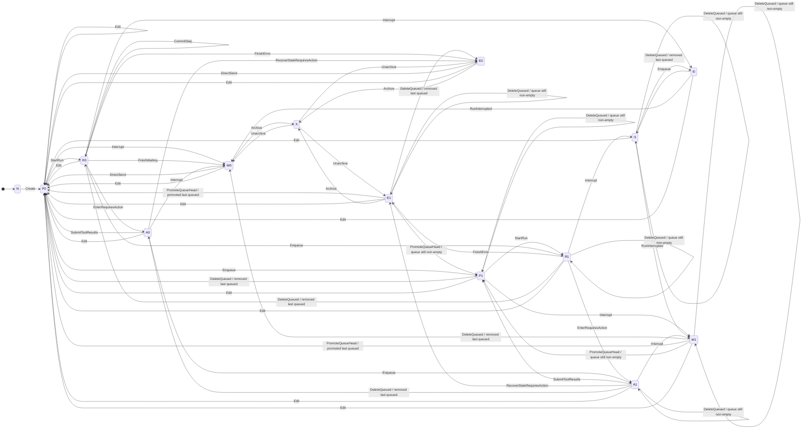
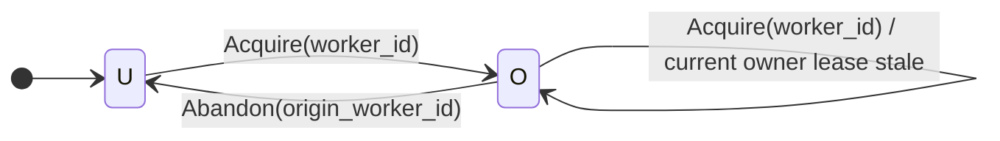
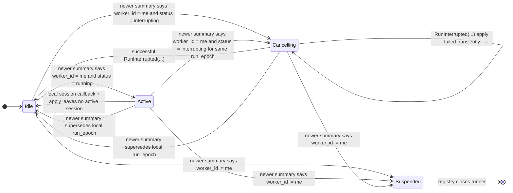

# chatd redesign

## Introduction

`chatd` currently manages chat state, but the actual execution path is spread
across direct SQL mutations, worker acquisition and heartbeats, pubsub,
in-memory fanout, relay behavior, and HTTP handlers that can race one another.
That makes correctness hard to reason about, especially around stale workers,
interrupts, queued-message promotion, and effect callbacks.

The goal of this redesign is to make the chat runtime behave like a set of
explicit state machines with clearly separated responsibilities. In broad
strokes, it does that by:

- treating the chat snapshot in `chats` plus its durable projections
  (`chat_messages`, `chat_queued_messages`, pending action, files) as the
  source of truth,
- defining durable chat behavior as pure transitions applied through
  `ApplyTransitions(...)`,
- serializing durable transition application per chat by locking the durable
  snapshot row,
- making chat ownership and lease management explicit in the durable model,
- using runtime components that re-derive needed work from the latest durable
  state rather than from ad hoc in-memory control flow,
- fencing stale callbacks with `worker_id` and `run_epoch`, and
- separating durable chat semantics, local runtime control, and client stream
  assembly into distinct machines.

## Runtime overview

There are 5 high-level runtime components:

1. the **acquisition loop** is responsible for finding chats that should be
   owned and attempting `Acquire(worker_id)`,
2. the **heartbeat loop** is responsible for keeping owner leases fresh for
   chats this replica owns,
3. the **runner registry** is responsible for tracking locally owned chats,
   owning `ChatRunner` lifetime, and ensuring local ownership invariants hold,
4. the **ChatRunner** is responsible for reconciling one owned chat's local
   runtime to the latest durable state, and
5. the **GenerationSession** is responsible for performing one run attempt and
   reporting its outcome back to the `ChatRunner`.

```text
Replica runtime
│
├─ Acquisition loop
├─ Heartbeat loop
└─ Runner registry
      └─ ChatRunner (one per owned chat)
            └─ GenerationSession (at most one active per run_epoch)
```

## Document map

This plan is organized into 3 state-machine sections:

- **Section 1: Durable chat state machine** covers the durable meaning of a
  chat and all state mutated through `ApplyTransitions(...)`.
- **Section 2: ChatRunner registry and control state machine** covers the local
  runtime that reacts to durable state: the multi-chat runner registry and the
  per-chat `ChatRunner` control machine.
- **Section 3: Stream state machine** gives a high-level description of the
  machine that assembles the client-visible chat stream.

## 1. Durable chat state machine

This section covers the durable meaning of a chat and all state mutated through
`ApplyTransitions(...)`.

### 1.1 Scope

This machine owns all **durable chat semantics**:

- direct transition application via `ApplyTransitions(...)`,
- serialized transition execution per chat,
- durable snapshot updates,
- committed message / queue / pending-action mutations,
- durable ownership state (`worker_id` and `heartbeat_at`), and
- durable notification emission after successful applies.

This machine does **not** define:

- registry behavior,
- `ChatRunner` local control behavior,
- `GenerationSession` lifecycle,
- connected stream attach behavior, or
- relay handshake details.

Committed transition application is serialized per chat by locking the durable
chat snapshot inside `ApplyTransitions(...)`.

### 1.2 Durable state

The current durable chat state is spread across:

- the `chats` table, which acts as the primary per-chat snapshot,
- `chat_messages`, which stores committed history,
- `chat_queued_messages`, which stores queued user messages, and
- other related durable projections used by the runtime.

In the redesign, the core idea stays the same: durable chat meaning lives in
that snapshot plus its projections. The redesign mainly changes **how** those
structures are mutated and how runtime components derive work from them.

Critical durable fields include:

- `status`,
- `run_epoch`,
- `snapshot_version`,
- `pending_action`,
- `worker_id`, and
- `heartbeat_at`.

`snapshot_version` answers:

> which committed state changes are included in this snapshot?

Each successful `ApplyTransitions(...)` call advances `snapshot_version` once.
That single version advance is the committed watermark for the whole applied
transition bundle.

`worker_id` and `heartbeat_at` form a per-chat owner lease.

Rules:

- `worker_id` identifies the replica that currently owns the chat.
- Ownership is orthogonal to execution status. A chat may be owned while
  `status` is `pending`, `waiting`, `error`, `requires_action`, `running`, or
  `interrupting`.
- `heartbeat_at` tracks liveness of the owner process, not of an individual LLM
  goroutine.
- Heartbeats do not advance `snapshot_version`.
- `Acquire(...)` may set `worker_id` from `NULL` or replace a stale owner.
- `Abandon(...)` clears `worker_id` and `heartbeat_at`.
- No other transition changes `worker_id`.

### 1.3 Transition application API

`ApplyTransitions(chat_id, transitions...)` is the only mechanism that mutates
durable chat state.

Rules:

- it applies one or more transitions for one chat in one DB transaction,
- it may be called by API handlers, the acquisition loop, or a `ChatRunner`,
- it returns the direct result to the caller; there is no durable result queue,
- there is no persistent idempotency layer; callers that want to retry must
  re-read snapshot state and call `ApplyTransitions(...)` again, and
- transition preconditions must support safe no-op or conflict rejection when
  the snapshot has already moved on.

Bundling rule:

- bundle multiple transitions only when the intermediate states are
  intentionally unobservable and need not survive crashes.

Allowed bundle examples:

- `ReorderQueue(qid, 0)` + `Interrupt`
- `ReorderQueue(qid, 0)` + `PromoteQueueHead`

Disallowed bundle examples:

- `Interrupt` + `RunInterrupted`
- `StartRun` + any later effect callback transition

Those intermediate states are intentionally durable and must remain visible for
recovery and later reconciliation.

### 1.4 Transitions

#### External transitions

- `Create(initialUser)` creates a new chat with its initial user turn and lands
  in `pending`.
- `DirectSend(m)` appends a user message directly to an idle chat and lands in
  `pending`.
- `Enqueue(m)` appends a user message to the durable queue without changing the
  active history.
- `ReorderQueue(qid, new_pos)` moves a queued user message to a new durable
  queue position while preserving the relative order of all other queued
  messages. It does not change active history or chat status.
- `DeleteQueued(qid)` removes one queued message without changing the active
  history.
- `Edit(k, replacement)` truncates active history at a user turn, inserts the
  replacement turn, clears queue and pending calls, and lands in `pending`.
- `SubmitToolResults(results)` appends matching tool results, clears pending
  calls, and lands in `pending`.
- `Interrupt` has status-dependent effects:
  - from `running`, it requests cancellation of the current effect and lands in
    `interrupting`
  - from `pending`, it cancels runnable-but-not-started work and lands in
    `waiting`
  - from `requires_action`, it closes pending calls with synthetic error tool
    results and lands in `waiting`
  - from `interrupting`, it is idempotent and has no further durable effect
- `Archive` archives a chat.
- `Unarchive` clears the archived marker.

#### Internal transitions

- `Acquire(worker_id)` changes `worker_id` to the designated worker.
- `Abandon(origin_worker_id)` clears `worker_id`.
- `StartRun` increments `run_epoch`, marks the chat `running`, and leaves the
  snapshot in a state that the designated owner will reconcile into a local
  `GenerationSession`.
- `CommitStep(step)` appends one durable assistant/tool suffix while remaining
  `running`.
- `EnterRequiresAction(calls)` records pending dynamic tool calls and lands in
  `requires_action`.
- `RunInterrupted(optionalPartialStep)` appends one final interrupted
  assistant/tool suffix if present, or finalizes interruption without a suffix
  if none is available, clears the interrupting state, and lands in `waiting`.
- `FinishWaiting` completes a run with no backlog and lands in `waiting`.
- `PromoteQueueHead` removes the queue head, appends it to history as a user
  turn, and lands in `pending`. When the system appends this transition
  automatically after a completed or interrupted run, the caller must enforce
  `archived = false`.
- `FinishError(err)` ends a running chat in `error`.

#### Recovery transitions

- `RecoverStaleRequiresAction(reason)` closes pending calls with synthetic error
  tool results and lands in `error`.

### 1.5 Execution-state projection

This is one durable state machine. Sections 1.5 and 1.6 show 2 projections of
that same machine for readability:

- the **execution-state projection**, which models `status`, queue backlog,
  pending action, and archived state, and
- the **ownership projection**, which models `worker_id`.

| Code | Meaning |
|---|---|
| `N` | chat does not exist |
| `W0` | `status=waiting`, `Q=[]` |
| `W1` | `status=waiting`, `Q≠[]` |
| `E0` | `status=error`, `Q=[]` |
| `E1` | `status=error`, `Q≠[]` |
| `P0` | `status=pending`, `Q=[]` |
| `P1` | `status=pending`, `Q≠[]` |
| `R0` | `status=running`, `Q=[]` |
| `R1` | `status=running`, `Q≠[]` |
| `I0` | `status=interrupting`, `Q=[]` |
| `I1` | `status=interrupting`, `Q≠[]` |
| `A0` | `status=requires_action`, `Q=[]`, `pendingCalls≠{}` |
| `A1` | `status=requires_action`, `Q≠[]`, `pendingCalls≠{}` |
| `X` | archived idle chat (`archived=true`) |



### 1.6 Ownership projection

`heartbeat_at` is intentionally not modeled as its own ownership-state node.
Lease freshness is a predicate over the current `heartbeat_at` value that is
consulted by `Acquire(...)` preconditions and by runtime acquisition logic.

| Code | Meaning |
|---|---|
| `U` | `worker_id IS NULL` |
| `O` | `worker_id IS NOT NULL` |



Rules:

- Except for `Acquire(...)` and `Abandon(...)`, transitions preserve
  `worker_id`.
- `heartbeat_at` is updated by lease renewal while a chat remains owned. That
  update does not advance `snapshot_version` and is not shown as a separate node
  in the ownership projection.
- The execution-state and ownership projections are combined by the same
  `ApplyTransitions(...)` calls. For example, `StartRun` changes only the
  execution-state projection, while `Acquire(...)` changes only the ownership
  projection.

### 1.7 Notification contract

Each successful `ApplyTransitions(...)` call that advances `snapshot_version`
emits committed post-apply notifications. No-op applies emit nothing.

There are 2 notification channels:

- `chat:ownership` is a global channel. Its payload is:
  - `chat_id`
  - `snapshot_version`
  - `worker_id`
- `chat:update:{chat_id}` is a per-chat channel. Its payload is:
  - `snapshot_version`
  - `worker_id`
  - `run_epoch`
  - `status`

Emission rules:

- `chat:update:{chat_id}` is emitted after every successful apply that advances
  `snapshot_version`.
- `chat:ownership` is emitted only when the apply changed `worker_id`, such as
  `Acquire(...)` or `Abandon(...)`.
- Notifications are post-commit, best-effort, and versioned.
- The current pubsub API is not assumed to provide transaction atomicity or
  commit-order delivery. Receivers must tolerate duplicates, drops, and
  reordering.
- Every receiver tracks the highest `snapshot_version` it has seen per chat.
  Notifications with `snapshot_version` less than or equal to that watermark are
  discarded.
- For the fields carried in a newer notification, the receiver may treat that
  notification as authoritative without an immediate DB read.
- Decisions that depend on omitted fields must fetch the full durable snapshot.
- Runtime startup recovery and periodic sweeps remain required for correctness.

### 1.8 Composite durable operations

#### Queue promotion decomposition

`PromoteQueued(qid)` is retained as an external API concept, but it is not a
primitive durable transition.

It compiles atomically into lower-level transitions based on current state:

- if `status ∈ {waiting, error}`: append `ReorderQueue(qid, 0)` and
  `PromoteQueueHead`
- if `status ∈ {pending, interrupting}`: append only `ReorderQueue(qid, 0)`
- if `status ∈ {running, requires_action}`: append `ReorderQueue(qid, 0)` and
  `Interrupt`

#### Running interrupt

Interrupting an active run is **not** a single atomic transition. It is modeled
as:

1. `Interrupt`, which moves `running -> interrupting`
2. later `RunInterrupted(optionalPartialStep)`

The first transition requests cancellation and prevents fresh generation from
being relaunched from the snapshot. The second transition commits any final
partial suffix, if any, or finalizes interruption with no suffix, and lands in
`waiting`.

#### Busy interrupt

`SendMessage` with interrupt semantics is **not** a single abstract transition.
It is modeled as:

1. `Enqueue(m)`
2. best-effort `Interrupt`

So when looking for successors, treat those as 2 separate steps.

#### Run completion or interrupt completion with queue follow-up

The refined graph in this document keeps:

- `FinishWaiting` for `running -> waiting` when `Q=[]`,
- `RunInterrupted` for `interrupting -> waiting`, and
- `PromoteQueueHead` for `waiting|error -> pending` when `Q≠[]`.

That means there is no direct `FinishWaiting -> PromoteQueueHead` or
`RunInterrupted -> PromoteQueueHead` edge in the refined
invariant-preserving graph.

### 1.9 Public API mapping

This section maps the current public endpoints that mutate chat state to the
transitions they should use in the redesign.

#### `POST /api/experimental/chats`

Handler today: `postChats` in `coderd/exp_chats.go`.

Current behavior:

- creates a new chat with its initial user turn.

Redesign mapping:

- `Create(initialUser)`

Expected API change:

- ideally none. It should still return the created chat directly.

#### `PATCH /api/experimental/chats/{chat}`

Handler today: `patchChat` in `coderd/exp_chats.go`.

Current behavior:

- updates labels,
- archives / unarchives chats,
- updates pin order.

Redesign mapping:

- labels / pin-order updates are outside the durable chat state machine and may
  stay as direct metadata updates,
- archiving uses `Archive`, and
- unarchiving uses `Unarchive`.

Expected API change:

- archiving becomes more restrictive: attempts to archive a chat outside the
  archived-idle precondition should fail rather than implicitly interrupting or
  draining the chat first.

#### `POST /api/experimental/chats/{chat}/messages`

Handler today: `postChatMessages` in `coderd/exp_chats.go`.

Current behavior:

- direct-send when idle,
- enqueue when busy,
- queue-first interrupt when `busy_behavior=interrupt`.

Redesign mapping:

- idle send: `DirectSend(m)` then later `StartRun` if processing should begin,
- busy queue: `Enqueue(m)`,
- busy interrupt: `Enqueue(m)` + `Interrupt`.

Expected API change:

- none preferred. It should still return either a directly inserted message or a
  queued message, depending on which transition path committed.

#### `PATCH /api/experimental/chats/{chat}/messages/{message}`

Handler today: `patchChatMessage` in `coderd/exp_chats.go`.

Current behavior:

- edits a user message and restarts from there.

Redesign mapping:

- `Edit(k, replacement)`

Expected API change:

- none preferred. It should still return the replacement message.

#### `DELETE /api/experimental/chats/{chat}/queue/{queuedMessage}`

Handler today: `deleteChatQueuedMessage` in `coderd/exp_chats.go`.

Current behavior:

- deletes a queued message by stable queued-message ID.

Redesign mapping:

- `DeleteQueued(qid)`

Expected API change:

- none.

#### `POST /api/experimental/chats/{chat}/queue/{queuedMessage}/promote`

Handler today: `promoteChatQueuedMessage` in `coderd/exp_chats.go`.

Current behavior:

- promotes a queued message into history.

Redesign mapping:

- this is **not** a primitive transition anymore,
- it becomes a state-dependent bundle built from:
  - `ReorderQueue(qid, 0)` + `PromoteQueueHead`, or
  - `ReorderQueue(qid, 0)` + `Interrupt`, or
  - just `ReorderQueue(qid, 0)`.

Expected API change:

- ideally none at the HTTP layer,
- but the response semantics may need to change if the operation no longer
  always inserts a history message immediately. In particular, when promotion is
  compiled into `ReorderQueue + Interrupt`, the promoted message is expected to
  appear later after interrupt finalization and queue-head promotion.
- this endpoint therefore likely needs the most product/API review.

#### `POST /api/experimental/chats/{chat}/interrupt`

Handler today: `interruptChat` in `coderd/exp_chats.go`.

Current behavior:

- interrupts a running chat,
- or closes a `requires_action` chat.

Redesign mapping:

- from `running`: `Interrupt`, then later `RunInterrupted(partial?)`,
- from `requires_action`: `Interrupt`.

Expected API change:

- probably none if we continue returning the chat snapshot after the immediate
  transition,
- but callers should expect `status=interrupting` as a new intermediate durable
  state before `waiting`.

#### `POST /api/experimental/chats/{chat}/tool-results`

Handler today: `postChatToolResults` in `coderd/exp_chats.go`.

Current behavior:

- validates and persists tool results,
- resumes chat processing.

Redesign mapping:

- `SubmitToolResults(results)`
- then later `StartRun` if processing should resume immediately.

Expected API change:

- none preferred.

## 2. ChatRunner registry and control state machine

This section covers the local runtime that reacts to durable state: the
multi-chat runner registry and the per-chat `ChatRunner` control machine.

### 2.1 Scope

This section owns:

- acquisition-loop behavior,
- heartbeat-loop behavior,
- runner registry behavior,
- per-chat `ChatRunner` control behavior,
- `GenerationSession` orchestration, and
- callback handling back into `ApplyTransitions(...)`.

This section does **not** own:

- durable chat semantics, or
- stream assembly and client-facing stream behavior.

### 2.2 Registry responsibilities

The runner registry is responsible for the multi-chat local ownership view.

Its responsibilities are:

- tracking the latest ownership observation for chats this replica cares about,
- owning `ChatRunner` lifetime,
- owning heartbeat enrollment for owned chats,
- reacting to ownership changes,
- coordinating startup recovery and periodic ownership sweeps, and
- coordinating graceful local release of ownership.

The acquisition loop and heartbeat loop are separate runtime components, but
they operate over the same local ownership surface that the registry maintains.

### 2.3 Registry invariants

The registry maintains these invariants:

- if the latest local ownership observation for a chat says `worker_id = me`,
  there is exactly one local `ChatRunner` for that chat,
- if the latest local ownership observation for a chat says `worker_id != me`,
  there is no local `ChatRunner` for that chat,
- every chat the registry currently believes this replica owns is enrolled in
  the registry-owned heartbeat set, and
- `ChatRunner` lifetime is registry-owned. A runner may stop local work when it
  observes ownership loss, but it does not decide whether it should keep
  existing. The registry closes it.

### 2.4 Registry inputs

The registry consumes:

- `chat:ownership` notifications,
- startup recovery results,
- periodic ownership sweep results,
- ownership-loss observations forwarded from `ChatRunner`s, and
- graceful shutdown or other explicit local release signals.

### 2.5 Registry behavior

The registry-centered multi-chat runtime behaves as follows:

- Ownership observations are merged by `snapshot_version`. For each chat, the
  highest-version ownership observation wins.
- On startup recovery, the runtime queries durable state for chats already owned
  by this replica, seeds the registry, and ensures their runners exist.
- On a newer ownership observation with `worker_id = me`, the registry ensures
  a runner exists for that chat and ensures the chat is enrolled in the
  heartbeat set.
- On a newer ownership observation with `worker_id != me`, the registry removes
  the chat from the heartbeat set and closes any runner for that chat.
- The acquisition loop wakes periodically and on newer `chat:ownership`
  notifications. It still queries durable state to determine which chats should
  be acquired.
- Acquisition candidates include at least:
  - `status = pending`,
  - `status = running`,
  - `status = interrupting`,
  - `status ∈ {waiting, error}` with backlog and queue-head promotion allowed,
  - `status = requires_action` once its timeout threshold has been crossed.
- For each candidate chat, the acquisition loop may call:
  - `ApplyTransitions(chat_id, Acquire(worker_id = my_replica_id))`
- `Acquire(worker_id)` is what recovers stale ownership. A stale `running` chat
  is recovered by stale-owner takeover via `Acquire(...)`, not by resetting
  status to `pending` first.
- The heartbeat loop renews `heartbeat_at` for chats the registry currently
  believes are owned by this replica.
- During graceful shutdown or other explicit runtime release, the registry may
  apply `Abandon(origin_worker_id = my_replica_id)` for owned chats before
  closing their runners.

### 2.6 ChatRunner control machine scope

The per-chat `ChatRunner` control machine is responsible for reconciling one
owned chat's local runtime to the latest durable summary.

It owns:

- the local per-chat control state,
- the local `GenerationSession`, if any,
- per-chat reaction to newer summaries, and
- per-chat internal transition applies driven by reconciliation or callbacks.

It does **not** own:

- its own lifetime,
- global ownership tracking, or
- durable chat semantics.

### 2.7 ChatRunner inputs

A `ChatRunner` consumes:

- `chat:update:{chat_id}` notifications,
- full durable snapshot reads,
- `GenerationSession` callbacks, and
- registry close or shutdown signals.

On creation, the runner subscribes to `chat:update:{chat_id}` before reading
its initial durable snapshot.

### 2.8 Observed durable summary

The `ChatRunner` reconciles against a versioned durable summary carrying:

- `snapshot_version`,
- `worker_id`,
- `run_epoch`, and
- `status`.

Rules:

- The runner tracks the highest `snapshot_version` it has seen for that chat and
  discards older summaries.
- For the fields carried in a newer summary, the runner may treat that summary
  as authoritative without an immediate DB read.
- Decisions that depend on omitted fields require a full durable snapshot read.

### 2.9 ChatRunner local states

The local control states are:

- `Idle`: the runner owns the chat locally and has no active
  `GenerationSession`.
- `Active(run_epoch)`: exactly one local `GenerationSession` exists for the
  specified `run_epoch`.
- `Cancelling(run_epoch)`: the latest durable summary says `status =
  interrupting` for that `run_epoch`, and the runner is reconciling that
  interrupting state. A local `GenerationSession` for that `run_epoch` may
  still be stopping, or it may already be gone.
- `Suspended`: the runner has observed a newer summary with `worker_id != me`,
  has stopped local work, and is awaiting registry closure.

### 2.10 ChatRunner transition diagram



### 2.11 Reconciliation rules

- Any state moves to `Suspended` when a newer summary says `worker_id != me`.
  The runner cancels any local session immediately and stops issuing new
  applies.
- `Idle -> Active(run_epoch)` when the latest known summary says
  `worker_id = me` and `status = running` for a `run_epoch` that has no local
  session. The runner fetches the durable snapshot first if omitted fields are
  needed before launch.
- `Idle -> Cancelling(run_epoch)` when the latest known summary says
  `worker_id = me` and `status = interrupting`. If a local session for that
  `run_epoch` still exists, the runner cancels it immediately. If no local
  session exists, the runner may drive `RunInterrupted(...)` directly.
- `Active(run_epoch) -> Cancelling(run_epoch)` when the latest known summary
  says `worker_id = me`, `status = interrupting`, and the local session matches
  that `run_epoch`.
- `Cancelling(run_epoch) -> Idle` after a successful `RunInterrupted(...)`
  apply.
- `Idle` may still emit internal transition applies such as `StartRun`,
  `PromoteQueueHead`, or `RecoverStaleRequiresAction`, but those decisions fetch
  the durable snapshot first when the summary alone is insufficient.

### 2.12 Stale epoch handling

If the runner has local state for one `run_epoch` and a newer durable summary
for the same owner arrives with a different `run_epoch`, the local state is
stale.

Rules:

- the runner cancels any stale local session,
- the runner drops back to `Idle`, and
- the runner reconciles again against the newer summary.

If `RunInterrupted(...)` fails because its preconditions no longer hold, the
runner treats its local view as stale, refreshes the latest summary, and
reconciles again instead of retrying the stale apply indefinitely.

### 2.13 GenerationSession interaction

`GenerationSession` is the component that performs one run attempt.

Rules:

- `StartRun` is a pure durable transition: it increments `run_epoch`, sets
  `status = running`, and leaves the snapshot in a state that says generation
  should be active.
- `Interrupt` against a running chat is also a pure durable transition: it sets
  `status = interrupting` and leaves the snapshot in a state that says the
  current `GenerationSession` should be canceled rather than relaunched.
- If the latest known summary says `worker_id = me` and `status = running`, the
  local `ChatRunner` ensures exactly one `GenerationSession` exists for that
  chat and `run_epoch`.
- If the latest known summary says `worker_id = me` and `status = interrupting`,
  the local `ChatRunner` must not launch a fresh `GenerationSession`. If it
  still has the local `GenerationSession` for the current `run_epoch`, it
  cancels that session immediately. If it does not, it may call
  `ApplyTransitions(chat_id, RunInterrupted(nil))` directly.
- Same-process `GenerationSession` restarts are handled entirely in memory by
  the local `ChatRunner`. They do not change `run_epoch`, `worker_id`, or other
  durable state, and they do not hand ownership to another replica.
- `GenerationSession`s never mutate durable chat state directly. They report
  back to the local `ChatRunner`.

### 2.14 Callback apply rules

Effect callback transitions are applied through `ApplyTransitions(...)`.

Rules:

- every effect callback transition must carry `origin_worker_id` and
  `run_epoch`,
- apply verifies `origin_worker_id == chats.worker_id` and
  `run_epoch == chats.run_epoch`,
- `CommitStep`, `EnterRequiresAction`, and `FinishError` require
  `status = running`,
- `RunInterrupted` requires `status = interrupting`, and
- mismatches must no-op or reject without mutating durable state.

The `ChatRunner` calls `ApplyTransitions(...)` for the next internal transition
only if the local `GenerationSession` that produced the callback is still
current.

### 2.15 Failure and retry behavior

Failure handling is explicitly snapshot-driven.

Rules:

- If `RunInterrupted(...)` fails transiently, the runner stays in
  `Cancelling(run_epoch)`, applies backoff, and retries reconciliation.
- If `RunInterrupted(...)` fails because its preconditions no longer hold, the
  runner treats its local view as stale and reconciles again from the newest
  durable summary.
- If the `chat:ownership` subscription reports errors, the registry schedules
  ownership sweeps using exponential backoff with jitter and coalesces repeated
  failures so a broken pubsub connection cannot cause a hot loop.
- Startup recovery and periodic ownership sweeps repair missed ownership
  notifications.
- The acquisition loop remains correct even if ownership notifications are
  dropped, because durable state is still queried before `Acquire(...)`.

## 3. Stream state machine

The stream state machine is responsible for presenting a coherent client-visible
chat stream by combining the committed messages from the database and the in-flight streaming parts from a `ChatRunner`.

That machine will be how we implement the `GET /api/experimental/chats/{chat}/stream` endpoint.

It will require a dedicated pubsub channel for chat message updates, which is currently
not mentioned in the core state machine section. It will also require a mechanism for connecting
to another replica directly to get the in-flight streaming parts.

This plan intentionally leaves the stream state machine at a high level for now.
A later revision will specify its states, attach rules, resync behavior, and
client-visible guarantees in detail.
