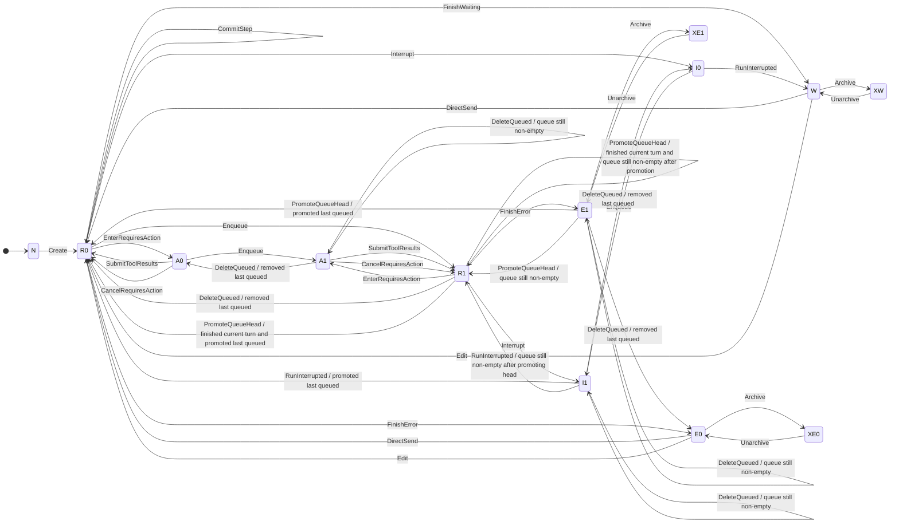
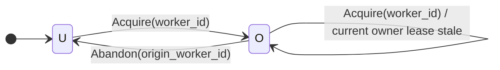
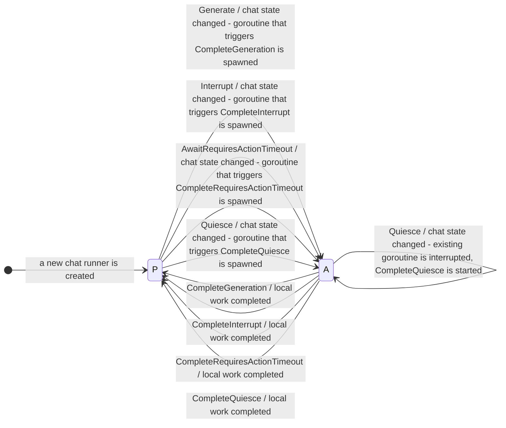
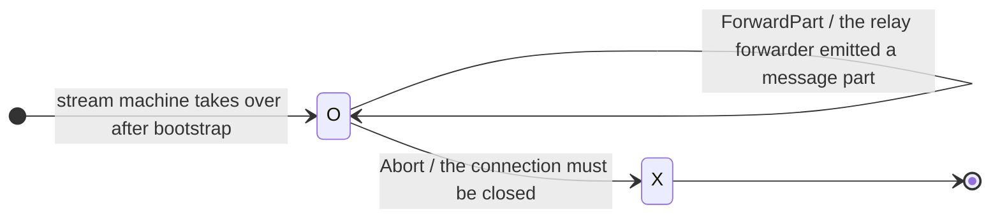

# Chatd Stabilization

Authors: Hugo Dutka Created: April 29, 2026 8:46 PM Last edited: May 4, 2026 6:25 PM Status: Pending approval Size: Small (1-2 months) Est. Delivery Date: May 18, 2026

# Stakeholders

- [x] @Cian Johnston
- [ ] @Mathias Fredriksson
- [ ] @Mike Suchacz

# Todos

Remaining work to be done on the RFC:

- add a section about manual testing: what user flows must still work after the refactor is implemented?

# Why this RFC?

Today, chatd is a sub-system of Coder that manages agentic chats. Chat state is held in the database, and it can be modified via HTTP endpoints by clients or by a chat worker handling the agent loop. Chatd emits pubsub messages, which are consumed by chat workers and by the `/chat/stream` endpoint to return a live stream of chat messages to the client.

However, the chatd implementation is not correct. Almost all of it was AI-generated, and nobody has ever thought through all the edge cases, race conditions, and liveness issues that have arisen as features were added. Over the past few weeks, we’ve seen issues such as:

- users sending messages to archived chats, workers processing them anyway
- promoting queued messages causing the agent loop to stop altogether while a chat worker is processing a message
- pubsub ordering and delivery guarantees not being taken into account in the system today - even though our pubsub system doesn’t provide perfect ordering or deliverability guarantees, the implementation assumes it in many places

We patched bugs once we discovered them, but we were always treating the symptoms of a hastily built system, rather than fixing the root cause. When I reviewed PRs that targeted those bugs, I could never say for sure if we actually fixed the underlying issue, and if the fix wouldn’t affect another part of the system in unexpected ways. The purpose of this RFC is to address the root cause: propose an architecture for chatd that is compatible with the current user-facing API and storage model, but that is free of fundamental correctness issues. This will allow the team to iterate faster on the system without introducing new bugs, and give us confidence that once we ship the GA version of Coder Agents, we will deliver a product that is robust and reliable.

The RFC aims to fulfill this promise by:

- framing the state held in the database and all the SQL queries that modify it as a **state machine**, and explicitly enumerating all the valid states and transitions
- ensuring that all HTTP endpoints and the chat worker only modify the chat state via **transitions** in the state machine
- enforcing that **every state transition is serialized** with respect to other state transitions and **executed atomically**
- designing the parts of the system that depend on pubsub to be resilient to **out-of-order delivery, duplicate, and dropped messages**

# Overview of the new architecture

This proposal has 4 main pieces:

- **core state machine**: describes how a chat’s state in the database can change over time. It defines the valid states and transitions for committed chat data: status, messages, queued messages, pending actions, worker ownership, and the fields used to reject stale work. It’s a specification - there’s no runtime component that corresponds to it. Runtime components, such as the HTTP endpoints and the chat worker, follow this spec to ensure that they modify the state only in valid ways.
- **API surface**: the HTTP endpoints that coderd exposes. Responsible for: creating chats, sending messages, editing messages, updating metadata, managing the queue, interrupting active work, and submitting tool results. These are used by the client, usually via the browser, to interact with chats.
- **chat worker**: lives inside every coderd replica. It acquires chats, calls the LLM API, executes tools, handles interrupts and tool-result waits, and commits completed outcomes through the core state machine.
- **stream machine**: powers `GET /api/experimental/chats/{chat}/stream`, the WebSocket endpoint that the UI uses to consume a live chat. It combines two kinds of data: messages committed to the database and streaming message parts emitted by the chat worker. It receives notifications over pubsub whenever the chat state is updated, fetches messages from the database, and connects to the coderd replica that currently owns the chat to relay the streaming message parts to the client.

If you’re familiar with the current chatd architecture, you’ll notice that the runtime components are mostly the same. The big change that the RFC introduces is that they’ll all follow the core state machine spec to modify the state, rather than using ad-hoc SQL queries to modify the state directly.

# Aspects not covered in this RFC

- the RFC does not cover updating the experimental CLI for Coder Agents to account for any semantic changes in the API, and no work is planned to update it. I’m not sure if anybody uses the CLI and if it’s a feature that will stay.
- the RFC does not cover the WebSocket `GET /api/experimental/chats/watch` endpoint, which is used by the UI to update the list of chats in the sidebar. It’ll remain driven by best-effort pubsub notifications over a dedicated pubsub channel not covered in this RFC.

# Proposed implementation plan and timeline

Once the RFC is approved, Hugo starts implementation. There will be 5 stacked PRs, each one implementing a slice of the plan:

- PR 1: the core state machine.
- PR 2: the HTTP endpoints.
- PR 3: the chat worker.
- PR 4: the stream machine.
- PR 5: updates to the frontend to account for slight changes to the API.

Once the implementation is complete, the PRs are reviewed. Concurrently, Cian deploys the tip of the PRs to a temporary Coder deployment. We use the temporary deployment to do final, manual checks that the refactor is working as expected. Once all the PRs are approved, we squash them all into a single, giant PR, and merge it into main.

Once the implementation starts, we’ll need to freeze work on chatd-related features until the refactor is merged into main. Any new features added to chatd while the refactor is in progress would be wiped by the merge. That makes the timeline tight: we need to implement it quickly to avoid blocking work, and we need to merge it early in May to have ample time to run it on dev.coder.com to catch any bugs in the new implementation.

The proposed timeline is:

1. May 6th: The plan is approved and implementation starts. PRs are implemented in the order proposed above, and reviewed one by one as they are completed.
2. May 13th: Implementation is complete, All PRs are up. Cian creates the temporary deployment.
3. May 15th (Friday): PRs are fully reviewed and approved.
4. May 18th (Monday): The refactor is merged into main.

The chatd freeze period would last for 8 working days: Wednesday through Friday (May 6th - May 8th), and Monday through Friday (May 11th - May 15th). The refactor would be merged into main on Monday, May 18th, early in the day EU time. That’d give us about 2 weeks to dogfood it on dev.coder.com before the June release.

# Core state machine

The core state machine describes how a chat’s execution state in the database can change over time. A fundamental component of the state machine is the set of valid **states** it can be in. We will consider 2 kinds of states: **execution states** and **ownership states**. These states let us describe what the runtime components of chatd can do with a chat at a given point in time.

## What constitutes a chat’s state?

We say that the following data constitutes a chat’s **execution state**:

- chat status on the `chats` table, such as `waiting`, `running`, `interrupting`, `requires_action`, or `error`;
- the `archived` marker on the `chats` table;
- message history in the `chat_messages` table;
- queued user messages in the `chat_queued_messages` table;
- `worker_id` and `heartbeat_at` fields on the `chats` table (ownership fields);
- the `last_error` field on the `chats` table (last error message from the agent loop);
- the `snapshot_version`, `history_epoch`, and `generation_attempt` fields on the `chats` table, defined later in the RFC;
- the `requires_action_deadline_at` field on the `chats` table (pending-action deadline, defined later in the RFC);

There is other data that is held in the database and is associated with a chat, but it’s not part of the execution state:

- title;
- labels;
- pin order;
- workspace binding;
- model configuration;
- plan mode;
- file links.

We call it **metadata**. The core state machine concerns itself with **execution state**. As a general guideline, a piece of data is execution state if the core state machine needs it to decide what the next state transition may be, or if it’s directly modified by a state transition. For example, a queued message is part of the execution state because it impacts what the next action of the agent loop can be. If the agent loop finishes processing a user message and would otherwise stop, but there’s a queued message, the agent loop will start processing the queued message instead. On the other hand, a chat’s title does not impact the agent loop at all - it’s just a label that helps the user identify the chat.

If the distinction isn’t completely clear to you at this point, don’t worry. It should become clearer as you learn more about the core state machine.

## Execution states

A chat’s execution state lets the chat worker and the HTTP endpoints decide what they can do with the chat. In total, there are 13 execution states. The states are decided by what’s in the database:

- By whether a chat exists;
- By all the chat statuses on the `chats` table: `waiting`, `running`, `interrupting`, `requires_action`, and `error`;
- By the `archived` marker on the `chats` table;
- By the queued messages in the `chat_queued_messages` table.

The shorthands in the table below use the convention that the first 1 or 2 letters indicate the status, and then `1` or `0` indicate the presence or absence of queued messages.

| Shorthand | Status | Queue | Archived | Meaning |
| --- | --- | --- | --- | --- |
| `N` | - | - | - | Chat does not exist |
| `W` | `waiting` | empty | `false` | There’s no work to be done by the chat worker |
| `E0` | `error` | empty | `false` | The worker encountered an unrecoverable error while processing the chat. There’s no more work to be done by the chat worker |
| `E1` | `error` | non-empty | `false` | The worker encountered an unrecoverable error while processing the chat, and there’s currently no work to be done by the chat worker. There’s a queued message that should be processed once the error is cleared |
| `R0` | `running` | empty | `false` | Running state with no queued messages: a chat worker should be processing the chat |
| `R1` | `running` | non-empty | `false` | Running state with queued messages: a chat worker should be processing the chat, and there’s a queued message that should be processed next |
| `I0` | `interrupting` | empty | `false` | The chat was interrupted by the user, and the chat worker should commit any partial message that had been generated before the interruption |
| `I1` | `interrupting` | non-empty | `false` | The chat was interrupted by the user, and the chat worker should commit any partial message that had been generated before the interruption, and there’s a queued message that should be processed next |
| `A0` | `requires_action` | empty | `false` | The chat worker is waiting until the user submits tool results; this state is used only by the “dynamic tools” feature |
| `A1` | `requires_action` | non-empty | `false` | The chat worker is waiting until the user submits tool results, and there’s a queued message that should be processed next; this state is used only by the “dynamic tools” feature |
| `XW` | `waiting` | empty | `true` | The chat was archived while it was in the `waiting` state, it will go back to `waiting` once unarchived |
| `XE0` | `error` | empty | `true` | The chat was archived while it was in the `error` state, it will go back to `error` once unarchived |
| `XE1` | `error` | non-empty | `true` | The chat was archived while it was in the `error` state, it will go back to `error` once unarchived, and there’s a queued message that should be processed once the error is cleared |

If these states seem arbitrary and abstract at this point, that’s expected. Each one of these states is needed by some runtime component of chatd for some specific use case, and their purpose will emerge as we discuss the implementation of the HTTP endpoints and the chat worker.

At a high-level, these states let us reason about what should be possible to happen with a chat at a given point in time. For example, a chat in the `R0` state can be picked up by a chat worker, an LLM message can be appended to its history. On the other hand, a chat in the `XW` state must be ignored by the chat worker, and most of the HTTP endpoints must refuse to interact with it. We’ll define precisely what is possible in each state in the [Transitions](https://www.notion.so/Transitions-351d579be5928137b72ded9fce36a567?pvs=21) section of the RFC.

## Ownership states

A chat’s ownership state lets the chat worker decide whether a chat can be acquired or not. It’s decided by the `worker_id` field on the `chats` table. In total there are 2 ownership states.

| Shorthand | Worker ID | Meaning      |
| --------- | --------- | ------------ |
| `U`       | null      | Unowned chat |
| `O`       | not null  | Owned chat   |

## Transitions

Now that we’ve defined the states, we can define the transitions between them. In practice, **a transition is just a sequence of SQL queries that modify the database state in a transaction**. That transaction first takes a row lock on the chat to ensure that it’s serialized with respect to other transactions that modify the chat. Multiple transitions can be executed atomically in a single transaction.

<aside>
💡

Remember!

> a transition is just a sequence of SQL queries that modify the database state in a transaction

</aside>

We will not define the SQL queries that correspond to each transition in the RFC - it’d take too much space and it’s not central to the document’s purpose. Instead, we focus on what each transition does to the database state, and how it affects the execution and ownership states.

Each transaction that applies one or more transitions advances the `snapshot_version` field on the `chats` table by 1. This lets us version the chat’s execution state. The chat worker and the stream machine rely on it to ensure they do not process outdated or out of order notifications.

Each transition that edits the chat’s history increments the `history_epoch` field on the `chats` table by 1. This lets us version the chat’s history. The chat runner and the stream machine rely on it to ensure they are fully aware of the chat’s history changes. See [Fencing stale runner updates and work](https://www.notion.so/Fencing-stale-runner-updates-and-work-351d579be5928141897cf4ae43e19c4e?pvs=21) and [Fencing stale relay forwarder parts](https://www.notion.so/Fencing-stale-relay-forwarder-parts-351d579be59281fe99f3c620d774863b?pvs=21) for how the `history_epoch` is used differently from the `snapshot_version`.

I don’t recommend reading the rest of section thoroughly if this is your first time reading the RFC. It’s an information dump that only makes sense once you pair it with a specific runtime component of chatd. Give it a cursory look, and treat it as a reference that you can return to later when you’re analyzing how an HTTP endpoint or a chat worker implements a specific feature.

### Transitions used by the HTTP endpoints

- `Create(initialUser)` creates a new chat with its initial user turn and lands in `running`.
- `DirectSend(m)` appends a user message directly to an idle chat and lands in `running`. It increments `history_epoch` by 1.
- `Enqueue(m)` appends a user message to the queue without changing the active history.
- `ReorderQueue(qid, new_pos)` moves a queued user message to a new queue position while preserving the relative order of all other queued messages. It does not change active history or chat status.
- `DeleteQueued(qid1, qid2, ...)` removes one or more queued messages without changing the active history.
- `Edit(k, replacement)` truncates active history at a user turn, inserts the replacement turn, and lands in `running`. It increments `history_epoch` by 1.
- `Archive` sets the archived marker for one chat. Family-scoped archive operations may apply it across multiple chats.
- `Unarchive` clears the archived marker for one chat. Family-scoped unarchive operations may apply it across multiple chats.
- `Interrupt` requests cancellation of an active generation and lands in `interrupting`. It is callable only from `running`.
- `CancelRequiresAction(reason)` closes pending dynamic tool calls with synthetic cancellation tool results, satisfies the pending-action projection, clears `requires_action_deadline_at`, and lands in `running`. If the queue is empty it lands in `R0`; otherwise it lands in `R1`. It does not itself promote the queue head. It increments `history_epoch` by 1.

### Transitions used by the chat worker

- `Acquire(worker_id)` sets `worker_id` to the designated worker and refreshes `heartbeat_at`.
- `Abandon(origin_worker_id)` verifies that `origin_worker_id` still owns the chat, then clears `worker_id` and `heartbeat_at`.
- `CommitStep(step)` appends one durable message suffix while remaining `running`. A committed step may append ordinary assistant/tool messages, and a compaction step may append a compressed summary boundary plus visible compaction tool-call and tool-result messages. `CommitStep(...)` requires a matching `history_epoch` and `generation_attempt`, and increments `history_epoch` on success.
- `EnterRequiresAction(calls)` records a pending-action episode by relying on the committed assistant tool-call messages as the durable call set, sets `requires_action_deadline_at`, which is a timestamp 5 minutes in the future, and lands in `requires_action`.
- `SubmitToolResults(results)` appends submitted tool-result messages, satisfies the pending-action projection, clears `requires_action_deadline_at`, and lands in `running`. It preserves queued backlog, so `A0 -> R0` and `A1 -> R1`. It increments `history_epoch` by 1.
- `RunInterrupted(optionalPartialStep)` appends one final interrupted assistant/tool suffix if present, or finalizes interruption without a suffix if none is available, clears the interrupting state, and lands in `waiting` if no queued message is promoted. If interrupt finalization also promotes the queue head, it lands in `running`. It increments `history_epoch` by 1.
- `FinishWaiting` completes a run with no backlog and lands in `waiting`.
- `RecordGenerationAttempt` increments `generation_attempt` while remaining in `running`. It does not change `history_epoch`. If the incremented count exceeds the hardcoded attempt limit, the runner may later emit `FinishError(...)` instead of launching a fresh `GenerationSession`.
- `PromoteQueueHead` removes the queue head, appends it to history as a user turn, and lands in `running`. The runner may emit it after a completed run, an interrupted run, or other reconciliation that determines the current turn is done and backlog remains. It increments `history_epoch` by 1.
- `FinishError(err)` ends a running chat in `error` and persists `last_error = err`, overwriting any prior stored error.

### Execution state transition diagram

Now comes maybe the densest part of the RFC. It’s a diagram that shows all the possible transitions between all the execution states. Again, I don’t recommend reading the diagram thoroughly at first. Take a quick look to get a sense of what it’s about and treat is as a reference you can return to later. I recommend reading the diagram as text and not looking at the rendered visual. The text is clearer.

A transition between input state `A` and output state `B` is allowed only if it’s listed in the diagram below (`A --> B: Transition Name`). If a transition is not allowed, the core state machine implementation must reject it.

### Ownership state transition diagram

The ownership state transition diagram is much simpler. It shows all the possible transitions between all the ownership states.

Notice that the `Acquire` and `Abandon` transitions only affect ownership state, and not execution state. They are fully orthogonal to the execution state transitions and have separate diagrams. This means that the chat’s execution state can change independently of its ownership state, and vice versa. An archived chat may be acquired by a chat worker, and the core state machine’s data model does not prevent that. The actual implementation of the chat worker will ignore chats that are in execution states that don’t need processing, but it’s not a concern of the core state machine.

## HTTP endpoints

This section maps the current public endpoints that mutate chat state to the transitions they should use in the redesign.

### `POST /api/experimental/chats`

Handler today: `postChats` in `coderd/exp_chats.go`.

Current behavior:

- creates a new chat with its initial user turn.

Redesign mapping:

Here are the supported transition sequences:

- `N -> Create(initialUser) -> R0`

No other transition sequence is supported.

Expected API change:

- none. It should still return the created chat directly.

### `PATCH /api/experimental/chats/{chat}`

Handler today: `patchChat` in `coderd/exp_chats.go`.

Current behavior:

- updates labels,
- archives / unarchives chats,
- updates pin order.

Redesign mapping:

- title, labels, workspace binding, plan-mode, and pin-order updates stay outside the durable core state machine, even though they remain durable chat state, and may remain direct metadata updates,
- archive and unarchive remain family-scoped composite operations that preserve the current parent/child cascade semantics and child-unarchive guard, and
- the per-chat archived-state flips inside those composite operations use `Archive` and `Unarchive`.

Here are the supported transition sequences for `archived` updates:

- `W -> Archive -> XW`
- `E0 -> Archive -> XE0`
- `E1 -> Archive -> XE1`
- `XW -> Unarchive -> W`
- `XE0 -> Unarchive -> E0`
- `XE1 -> Unarchive -> E1`

If the request does not change `archived`, this endpoint doesn’t emit any state transitions.

Other execution-state classes are not supported for archive/unarchive.

Expected API change:

- archiving becomes more restrictive: attempts to archive a chat outside the `W`, `E0`, or `E1` states should fail rather than implicitly interrupting or draining the chat first.

### `POST /api/experimental/chats/{chat}/messages`

Handler today: `postChatMessages` in `coderd/exp_chats.go`.

Current behavior:

- direct-send when idle,
- enqueue when busy,
- queue-first interrupt when `busy_behavior=interrupt`.

Redesign mapping:

For `busy_behavior=queue`, here are the supported transition sequences:

- `W -> DirectSend(m) -> R0`
- `E0 -> DirectSend(m) -> R0`
- `E1 -> Enqueue(m) -> E1 -> PromoteQueueHead -> R1`: this one is a little unintuitive. The scenario where this happens is:
  - the user queued some messages
  - the chat ran into an error and stopped, for example because of an unretriable problem with the LLM provider
  - the user then sends a new message, but there is a non-empty queue. As defined here, the UX will be “add the new message to the end of the queue and promote the queue head.” Arguably, a better UX could be “add the new message to the chat immediately and start running it, even though there’s a non-empty queue.” I think the former is better because it’s more consistent with the behavior of the endpoint in other cases.
- `R0 -> Enqueue(m) -> R1`
- `R1 -> Enqueue(m) -> R1`
- `I0 -> Enqueue(m) -> I1`
- `I1 -> Enqueue(m) -> I1`
- `A0 -> Enqueue(m) -> A1`
- `A1 -> Enqueue(m) -> A1`

For `busy_behavior=interrupt`, here are the supported end-to-end sequences:

- `W -> DirectSend(m) -> R0`
- `E0 -> DirectSend(m) -> R0`
- `E1 -> Enqueue(m) -> E1 -> PromoteQueueHead -> R1`
- from `R0`:
  - endpoint: `R0 -> Enqueue(m) -> R1 -> Interrupt -> I1`
  - later picked up by a `ChatRunner`: `I1 -> RunInterrupted(partial?) -> R0`
- from `R1`:
  - endpoint: `R1 -> Enqueue(m) -> R1 -> Interrupt -> I1`
  - later picked up by a `ChatRunner`: `I1 -> RunInterrupted(partial?) -> R1`
- from `I0`:
  - endpoint: `I0 -> Enqueue(m) -> I1`
  - later picked up by a `ChatRunner`: `I1 -> RunInterrupted(partial?) -> R0`
- from `I1`:
  - endpoint: `I1 -> Enqueue(m) -> I1`
  - later picked up by a `ChatRunner`: `I1 -> RunInterrupted(partial?) -> R1`
- `A0 -> Enqueue(m) -> A1 -> CancelRequiresAction -> R1`
- `A1 -> Enqueue(m) -> A1 -> CancelRequiresAction -> R1`

Other transition sequences are not supported.

Expected API change:

- none. It should still return either a directly inserted message or a queued message, depending on which transition path committed.

### `PATCH /api/experimental/chats/{chat}/messages/{message}`

Handler today: `patchChatMessage` in `coderd/exp_chats.go`.

Current behavior:

- edits a user message and restarts from there.

Redesign mapping:

The endpoint first moves the chat into `W` or `E0`, then applies `Edit(k, replacement)`.

Here are the supported end-to-end sequences:

- `W -> Edit(k, replacement) -> R0`
- `E0 -> Edit(k, replacement) -> R0`
- `E1 -> DeleteQueued(qid1, qid2, ...) -> E0 -> Edit(k, replacement) -> R0`
- `R0 -> Interrupt -> I0 -> RunInterrupted(nil) -> W -> Edit(k, replacement) -> R0`
- `R1 -> DeleteQueued(qid1, qid2, ...) -> R0 -> Interrupt -> I0 -> RunInterrupted(nil) -> W -> Edit(k, replacement) -> R0`
- `I0 -> RunInterrupted(nil) -> W -> Edit(k, replacement) -> R0`
- `I1 -> DeleteQueued(qid1, qid2, ...) -> I0 -> RunInterrupted(nil) -> W -> Edit(k, replacement) -> R0`
- `A0 -> CancelRequiresAction(edit) -> R0 -> Interrupt -> I0 -> RunInterrupted(nil) -> W -> Edit(k, replacement) -> R0`
- `A1 -> DeleteQueued(qid1, qid2, ...) -> A0 -> CancelRequiresAction(edit) -> R0 -> Interrupt -> I0 -> RunInterrupted(nil) -> W -> Edit(k, replacement) -> R0`

For edit, the endpoint applies `RunInterrupted(nil)` itself instead of waiting for the chat worker. That is intentional: edit rewrites history from `k` onward, so preserving an interrupted partial suffix is unnecessary because the edit operation would discard it anyway.

Other transition sequences are not supported.

Expected API change:

- none. It should still return the replacement message.

### `DELETE /api/experimental/chats/{chat}/queue/{queuedMessage}`

Handler today: `deleteChatQueuedMessage` in `coderd/exp_chats.go`.

Current behavior:

- deletes a queued message by stable queued-message ID.

Redesign mapping:

Here are the supported transition sequences:

- `E1 -> DeleteQueued(qid) -> E0` if removing the last queued message
- `E1 -> DeleteQueued(qid) -> E1` if the queue remains non-empty
- `R1 -> DeleteQueued(qid) -> R0` if removing the last queued message
- `R1 -> DeleteQueued(qid) -> R1` if the queue remains non-empty
- `I1 -> DeleteQueued(qid) -> I0` if removing the last queued message
- `I1 -> DeleteQueued(qid) -> I1` if the queue remains non-empty
- `A1 -> DeleteQueued(qid) -> A0` if removing the last queued message
- `A1 -> DeleteQueued(qid) -> A1` if the queue remains non-empty

No other transition sequence is supported.

Expected API change:

- none.

### `POST /api/experimental/chats/{chat}/queue/{queuedMessage}/promote`

Handler today: `promoteChatQueuedMessage` in `coderd/exp_chats.go`.

Current behavior:

- promotes a queued message into history.

Here are the supported end-to-end sequences:

- from `E1`, if the queue contains only the promoted item:
  - endpoint: `E1 -> PromoteQueueHead -> R0`
- from `E1`, if the promoted message is already head and the queue remains non-empty after promotion:
  - endpoint: `E1 -> PromoteQueueHead -> R1`
- from `E1`, if the promoted message is not already head:
  - endpoint: `E1 -> ReorderQueue(qid, 0) -> E1 -> PromoteQueueHead -> R1`
- from `R1`, if the queue contains only the promoted item:
  - endpoint: `R1 -> Interrupt -> I1`
  - later picked up by a chat worker: `I1 -> RunInterrupted(partial?) -> R0`
- from `R1`, if the promoted message is already head and the queue remains non-empty after promotion:
  - endpoint: `R1 -> Interrupt -> I1`
  - later picked up by a chat worker: `I1 -> RunInterrupted(partial?) -> R1`
- from `R1`, if the promoted message is not already head:
  - endpoint: `R1 -> ReorderQueue(qid, 0) -> R1 -> Interrupt -> I1`
  - later picked up by a chat worker: `I1 -> RunInterrupted(partial?) -> R1`
- from `I1`, if the queue contains only the promoted item:
  - endpoint: no durable transition
  - later picked up by a chat worker: `I1 -> RunInterrupted(partial?) -> R0`
- from `I1`, if the promoted message is already head and the queue remains non-empty after promotion:
  - endpoint: no durable transition
  - later picked up by a chat worker: `I1 -> RunInterrupted(partial?) -> R1`
- from `I1`, if the promoted message is not already head:
  - endpoint: `I1 -> ReorderQueue(qid, 0) -> I1`
  - later picked up by a chat worker: `I1 -> RunInterrupted(partial?) -> R1`
- from `A1`, if the promoted message is already head:
  - endpoint: `A1 -> CancelRequiresAction -> R1`
- from `A1`, if the promoted message is not already head:
  - endpoint: `A1 -> ReorderQueue(qid, 0) -> A1 -> CancelRequiresAction -> R1`

No other transition sequence is supported.

Expected API change:

- The response semantics will need to change since the operation no longer always inserts a history message immediately. In particular, when promotion is compiled into `Interrupt`, `CancelRequiresAction`, or `ReorderQueue + CancelRequiresAction`, the promoted message is expected to appear later after interrupt finalization and queue-head promotion.

### `POST /api/experimental/chats/{chat}/interrupt`

Handler today: `interruptChat` in `coderd/exp_chats.go`.

Current behavior:

- interrupts a running chat,
- or closes a `requires_action` chat.

Here are the supported end-to-end sequences:

- from `R0`:
  - endpoint: `R0 -> Interrupt -> I0`
  - later picked up by a `ChatRunner`: `I0 -> RunInterrupted(partial?) -> W`
- from `R1`, if interrupt finalization promotes the last queued item:
  - endpoint: `R1 -> Interrupt -> I1`
  - later picked up by a `ChatRunner`: `I1 -> RunInterrupted(partial?) -> R0`
- from `R1`, if interrupt finalization leaves the queue non-empty after promotion:
  - endpoint: `R1 -> Interrupt -> I1`
  - later picked up by a `ChatRunner`: `I1 -> RunInterrupted(partial?) -> R1`
- `A0 -> CancelRequiresAction(user_cancel) -> R0`
- `A1 -> CancelRequiresAction(user_cancel) -> R1`

No other transition sequence is supported.

Expected API change:

- none. we’ll continue returning the chat snapshot after the immediate transition,
- however, callers should expect `status=interrupting` as a new intermediate durable state when canceling an active run.

### `POST /api/experimental/chats/{chat}/tool-results`

Handler today: `postChatToolResults` in `coderd/exp_chats.go`.

Current behavior:

- validates and persists tool results,
- resumes chat processing.

Redesign mapping:

Here are the supported transition sequences:

- `A0 -> SubmitToolResults(results) -> R0`
- `A1 -> SubmitToolResults(results) -> R1`

No other transition sequence is supported.

Expected API change:

- none.

## Pubsub

The chat worker and the stream machine need real-time notifications when the chat state changes to ensure they are responsive. To achieve this, we use pubsub.

As with the transitions section, I don’t recommend reading the rest of this section thoroughly at first. Give it a cursory look, and treat it as a reference that you can return to later when you’re analyzing the `GET /api/experimental/chats/{chat}/stream` endpoint or the chat worker.

### Notification channels

There are 2 notification channels:

- `chat:ownership` is a global channel consumed by chat workers. Its payload is:
  - `chat_id`
  - `snapshot_version` It notifies chat workers about chats that need processing by a chat worker, but aren’t owned by a chat worker. A worker then picks the chat up.
- `chat:update:{chat_id}` is a per-chat channel consumed by a chat worker that owns the chat. Its payload is:
  - `snapshot_version`
  - `worker_id`
  - `history_epoch`
  - `generation_attempt`
  - `status`
  - `archived`
  - `events[]` It notifies the worker that a chat’s execution state has changed, and that it may need to react to the change. It’s also consumed by an active `GET /api/experimental/chats/{chat}/stream` endpoint to notify it that a chat’s execution state has changed, and that it may need to forward new information to the client.

The purpose of the `events[]` field is to let the stream machine know what changes to the chat’s execution state have occurred since the last notification, so it can efficiently fetch the necessary data from the database. The worker ignores the field.

`chat:update:{chat_id}` event types are:

- `append_messages(message_ids[])`: messages were appended to the chat’s history.
- `append_queue(queued_message_id)`: a queued message was appended to the chat’s queue.
- `delete_queued(ids[])`: one or more queued messages were deleted from the chat’s queue.
- `move_queued(id, new_pos)`: a queued message was moved to a new position in the chat’s queue.
- `set_action_required`: the chat entered the `requires_action` state.
- `clear_action_required`: the chat exited the `requires_action` state.
- `set_error(error)`: the chat entered the `error` state.
- `invalidate_stream`: emitted when the size of the events that should normally have been emitted exceed the maximum payload size of Postgres’s pubsub (8000 bytes). It notifies the stream machine that the pubsub stream is no longer enough to reconstruct the chat’s execution state and it should take corrective action.

Emission rules:

- `chat:update:{chat_id}` is emitted after every successful apply that advances `snapshot_version`.
- `chat:ownership` is emitted when an apply leaves the chat in a runnable state (defined in [Acquisition loop](https://www.notion.so/Acquisition-loop-351d579be592814f9f70ebdf84215a88?pvs=21)) and no worker owns it, meaning that either `worker_id` is NULL or `hearbeat_at` is expired.
- Notifications are post-commit, best-effort, and versioned via the `snapshot_version` field.
- The current pubsub API is not assumed to provide transaction atomicity or commit-order delivery. Receivers must tolerate duplicates, drops, and reordering.
- Every receiver tracks the highest `snapshot_version` it has processed per chat. Notifications with `snapshot_version` less than or equal to that watermark are discarded.

### Event emission per transition

Each successful durable transition bundle that advances `snapshot_version` emits exactly one `chat:update:{chat_id}` message for the committed result of that bundle. When one transaction commits multiple state transitions, the emitted `events[]` list is the ordered concatenation of the events emitted by the transitions.

- `Create(initialUser)` emits:
  - `append_messages(message_ids=[initial_user_message_id])`
- `DirectSend(m)` emits:
  - `append_messages(message_ids=[new_user_message_id])`
- `Enqueue(m)` emits:
  - `append_queue(queued_message_id=new_queued_message_id)`
- `ReorderQueue(qid, new_pos)` emits:
  - `move_queued(id=qid, new_pos=new_pos)`
- `DeleteQueued(qid1, qid2, ...)` emits:
  - `delete_queued(ids=[qid1, qid2, ...])`
- `Edit(k, replacement)` emits:
  - `invalidate_stream`
- `Archive` emits:
  - no events
- `Unarchive` emits:
  - no events
- `Acquire(worker_id)` emits:
  - no events
- `Abandon(origin_worker_id)` emits:
  - no events
- `CommitStep(step)` emits:
  - `append_messages(message_ids=<committed_message_ids_in_order>)`
- `EnterRequiresAction(calls)` emits:
  - `set_action_required`
- `RunInterrupted(optionalPartialStep)` emits:
  - if a message interrupted mid-way was committed:
    - `append_messages(message_ids=<committed_message_ids_in_order>)`
  - if queue promotion happened as part of the transition:
    - `append_messages(message_ids=[promoted_user_message_id])`
    - `delete_queued(ids=[promoted_queue_head_id])`
- `FinishWaiting` emits:
  - no events
- `RecordGenerationAttempt` emits:
  - no events
- `PromoteQueueHead` emits:
  - `append_messages(message_ids=[promoted_user_message_id])`
  - `delete_queued(ids=[promoted_queue_head_id])`
- `FinishError(err)` emits:
  - `set_error`
- `CancelRequiresAction(reason)` emits:
  - `append_messages(message_ids=<synthetic_tool_result_message_ids_in_order>)`
  - `clear_action_required`
- `SubmitToolResults(results)` emits:
  - `append_messages(message_ids=<submitted_tool_result_message_ids_in_order>)`
  - `clear_action_required`

# Chat worker

A chat worker lives inside every coderd replica. It acquires chats, calls the LLM API, executes tools, handles interrupts and tool-result waits, and commits completed outcomes through the core state machine. This RFC proposes a redesign of the chat worker to make it driven by the core state machine. It comprises the following components:

- the **acquisition loop**: acquires chats from the database for processing by a chat runner.
- the **runner registry**: maintains a mapping of chat IDs to chat runners.
- the **heartbeat loop**: saves heartbeats to the database to maintain ownership of acquired chats.
- the **chat runner**: scoped to a single chat, is responsible for driving a chat forward by calling the LLM API and executing tools, and reporting results to the chat runner. The chat runner commits results through the core state machine. It’s also responsible for handling interrupts.

## Acquisition loop

The acquisition loop is a simple component that greedily acquires unowned or lease-expired chats from the database anytime it has a chance. It’s driven by two triggers:

- a periodic timer that wakes up every 30 seconds.
- a pubsub message on the `chat:ownership` channel.

It finds suitable chats by fetching every chat that:

- is in a runnable execution state, meaning one of: `R0`, `R1`, `I0`, `I1`, `A0`, `A1`; and
- either has a null `worker_id` or a `heartbeat_at` that is older than 30 seconds.

For every matching chat, it locks it, checks if the chat still meets the aforementioned conditions, and performs the `Acquire(worker_id)` transition on it.

### Load balancing

The design this RFC proposes doesn’t attempt to distribute load between workers fairly. Whenever a chat needs an owner, all replicas race to acquire it. If there’s a coder replica that has a lower latency to the database, it’ll tend to acquire chats more frequently than other replicas.

This won’t matter for deployments with up to a couple hundred active concurrent chats and ≤ 3 replicas, and I don’t expect any of our customers will exceed that scale while Coder Agents is in beta, so this RFC doesn’t address it. The work that a runner has to do on a chat is cheap: it’s just network calls to the database and LLM APIs. However, it’s possible that a single replica will start getting overloaded by a couple thousand concurrent chats. Here are 2 possible load balancing strategies we may employ in the future.

1. Add a small, random delay (100-200 ms) between a replica is notified that it should pick up a chat and before it acquires the chat. This reduces the latency advantage that a replica may have over other replicas. It’s crude and it would introduce additional user-visible latency, but it’s very simple to implement.
2. Add a `target_worker_id` field to `chat:ownership` pubsub messages, which specifies which replica should pick up the chat. Only the worker with a matching id would react to that pubsub message. The database provides a global view of how many chats each worker owns, so we could find the least loaded worker before sending the notification. This is a bit tricker to implement: we’d like to avoid obtaining a global lock to see the load distribution, so we’d need to come up with a method that lets up tally it up locklessly - possibly only approximately. This method has the additional benefit of reducing database load: when multiple replicas are present, only 1 would try to acquire a given chat.

## Runner registry

Any time the acquisition loop acquires a chat, it registers a new chat runner for that chat in the runner registry. The runner registry maintains a mapping of chat IDs to chat runners. The registry is scoped locally to a coderd replica: it only knows about chat runners that are present on the same replica.

## Heartbeat loop

For every chat registered in the runner registry, the heartbeat loop updates the `heartbeat_at` field on the `chats` table to the current time every 9 seconds. 9 seconds is chosen so that a worker must miss 3 heartbeats before its lease on the chat expires, and the acquisition loop on another replica acquires its chat.

## Chat runner

A chat runner is scoped to a single chat. When it owns a chat, it does the following things:

1. Gets notified that the chat’s execution state changed, via pubsub or other means.
2. Makes a single decision based on the update: what’s next for this chat? Should the runner call the LLM API, execute a tool, or did the user just interrupt the chat and are there any in-flight LLM calls that need to be cleaned up?
3. The decision is followed by spawning an asynchronous task - a goroutine - to execute an action. For example, to call the LLM API.
4. Once that action completes, the runner receives a callback result, and makes another decision: should I commit it to the database, or did the chat’s state change in the meantime and I should discard the result? If the former, it commits the state to the database via a core state machine transition.
5. Subsequently, the runner observes an update to the chat’s execution state, and the cycle repeats.

We will model the chat runner as a state machine.

### Runner local state

The runner tracks two things:

1. the latest chat state it has observed; and
2. the local task (a goroutine) it is currently running for that chat state. The “Chat runner” section uses the terms **goroutine**, **local task**, and **local work** interchangeably.

The runner is always in one of 2 states:

| Shorthand | Stage | Meaning |
| --- | --- | --- |
| `P` | `pending` | The runner has finished local work and is waiting for a newer chat state. |
| `A` | `active` | The runner has started local work for the chat state. |

### Runner transitions triggered by chat state changes

All transitions are serialized. The runner never starts a new transition until the current one completes.

Every time the runner observes a new chat state from the following sources:

- a periodic timer every 30 seconds: the runner fetches the current state of the chat from the database;
- pubsub messages on the `chat:update:{chat_id}` channel; and
- the chat runner itself if it just performed a core machine state transition and knows what the next update will be. This is a shortcut to avoid waiting for a pubsub message.

One of the following transitions is triggered:

| Transition | Triggered by states | Outcome |
| --- | --- | --- |
| `Quiesce` | `W`, `E0`, `E1`, `XW`, `XE0`, `XE1` | The runner has no work to do for this chat state. It abandons the chat via an `Abandon(worker_id)` core state machine transition. |
| `Generate` | `R0`, `R1` | The runner spawns a goroutine that calls the LLM API and executes tools for the current turn, and later triggers `CompleteGeneration` (defined in the next section) to commit the result. |
| `Interrupt` | `I0`, `I1` | The runner stops or drains the active generation and triggers `CompleteInterrupt` (defined in the next section) to commit the partial result. |
| `AwaitRequiresActionTimeout` | `A0`, `A1` | The runner spawns a goroutine that waits for the pending-action timeout (the `requires_action_deadline_at` field on the chat table in the database) and later triggers `CompleteRequiresActionTimeout` (defined in the next section). |

For example, if the runner observes that the chat is in the `R0` core machine state, it triggers the `Generate` transition.

A transition is applied only if:

1. the `snapshot_version` of the new core machine state is higher than the `snapshot_version` of the state already tracked by the runner; AND
2. the `history_epoch` of the new core machine state is higher than the `history_epoch` of the state already tracked by the runner OR the `history_epoch`s are equal, but a matching transition hasn’t been last applied for this `history_epoch`

Rule 1 prevents the runner acting on stale updates. Rule 2 prevents the runner from re-applying the same runner transition multiple times when the core machine state changes in ways that shouldn’t affect the runner.

To illustrate rule 2 with an example, let’s say that the core machine is in state `R0`, and the runner reacted by applying the `Generate` transition. Then, a user queued a message and the core machine was moved into `R1`. The runner shouldn’t now spawn a new goroutine to call the LLM API - because the `history_epoch`s of both updates are equal and they’d both spawn `Generate` transitions, it should ignore the new update.

Let’s say that the user then interrupted the chat and moved it into the `I1` state via the [`Interrupt` core state machine transition](https://www.notion.so/Chatd-Stabilization-351d579be592805093b4d24faa67a908?pvs=21). In the state update that the runner now sees, the `history_epoch` is equal to the runner’s local value, but an `Interrupt` runner transition wasn’t the last transition applied for this `history_epoch`, so the runner transition should be applied.

### Runner transitions triggered by local work completion

Each transition from the previous section spawns a goroutine. When the goroutine completes, one of the following transitions is triggered:

| Transition | Comes from | Outcome |
| --- | --- | --- |
| `CompleteQuiesce` | Goroutine spawned by the `Quiesce` transition completed. | The runner abandons the chat via a core state machine transition. |
| `CompleteGeneration` | Goroutine spawned by the `Generate` transition completed. | The runner commits the result via the core state machine. |
| `CompleteInterrupt` | Goroutine spawned by the `Interrupt` transition completed. | The runner commits the partial result via the core state machine. |
| `CompleteRequiresActionTimeout` | Goroutine spawned by the `AwaitRequiresActionTimeout` transition completed. | The runner commits the pending-action timeout result via the core state machine. |

### Core state machine transitions performed by the runner

The list below lists the core state machine transitions the runner may perform while executing its transitions:

- `Quiesce`
  - performs no transitions
- `Generate`
  - performs no transitions
- `Interrupt`
  - performs no transitions
- `AwaitRequiresActionTimeout`
  - performs no transitions
- `CompleteQuiesce`
  - `Abandon(worker_id)`: abandons the chat since there’s no more work to do.
- `CompleteGeneration`
  `CompleteGeneration` will emit exactly one core state machine transition from the list below. Which one is emitted depends on what the chat state is and what the LLM emits based on the input it received. This is intrinsically non-deterministic.
  - `CommitStep(step)`: An LLM API call or a tool execution completed successfully, so it’s committed to the database.
  - `EnterRequiresAction`: the LLM called a dynamic tool.
  - `FinishWaiting`: there’s no more work to be done on the chat, so it enters the `W` core machine state.
  - `FinishError`: the runner ran into an unrecoverable error and its retry budget was exhausted.
  - `PromoteQueueHead`: there was no more work to be done on the latest turn, so the runner promotes the queue head.
- `CompleteInterrupt`
  - `RunInterrupted(partial?)`: the LLM API call or a tool execution was interrupted by the user. The partial result is committed to the database.
- `CompleteRequiresActionTimeout`
  - `CancelRequiresAction(reason)`: the pending-action timeout expired. The synthetic cancellation tool results are committed to the database.

Additionally, the goroutine spawned by the `Generate` transition may emit a `RecordGenerationAttempt` transition every time it calls the LLM API.

### Runner transition diagram

These are all the allowed transitions in the chat runner state machine.

### Fencing stale runner updates and work

The runner depends on 3 database fields to determine if it should take action on a runner transition:

- `snapshot_version`: an integer value that is incremented by 1 after each transaction that applies one or more core state machine transitions. Previously defined in the [Transitions](https://www.notion.so/Transitions-351d579be5928137b72ded9fce36a567?pvs=21) section of the RFC.
- `history_epoch`: an integer value that is incremented by 1 by each core state machine transition that appends a message to the chat’s history. Previously defined in the [Transitions](https://www.notion.so/Transitions-351d579be5928137b72ded9fce36a567?pvs=21) section of the RFC.
- `generation_attempt`: an integer value that is incremented by 1 by the chat runner every time it calls the LLM API or takes another action for a given `history_epoch`. The chat runner uses it to decide whether it should abort because it retried too many times, or whether it should continue trying. It’s also used by the stream machine to determine which streaming LLM response should be appended to the chat’s history. More on this in the [Stream machine](https://www.notion.so/Stream-machine-351d579be59281e1b4eced648a12f623?pvs=21) section of the RFC.

Each transition carries these 3 numbers with it. They correspond to the database values from the chat state that triggered the transition. Transitions triggered by completion of local work carry over the numbers from the transition that triggered the local work. Every time the runner processes a transition, it saves the numbers to its local state.

Rules:

- If there’s an attempt to apply a runner transition triggered by a chat state change (`Quiesce`, `Generate`, `Interrupt`, `AwaitRequiresActionTimeout`) that carries a `snapshot_version` less than or equal to the one it has saved in its local state, the runner discards the transition.
- If there’s an attempt to apply a runner transition triggered by local work completion (`CompleteQuiesce`, `CompleteGeneration`, `CompleteInterrupt`, `CompleteRequiresActionTimeout`) that carries a `history_epoch` less than or equal to the one it has saved in its local state, it discards the transition.
- All other runner transitions are accepted, unless they are not allowed by the [Runner transition diagram](https://www.notion.so/Runner-transition-diagram-351d579be592815aa5bdcfdd1549e388?pvs=21).
- If the goroutine spawned by the `Generate` transition sees a `history_epoch` in the database that is different from the one it started with, it exits.
- If the goroutine spawned by the `Generate` transition sees a `generation_attempt` in the database that is higher than a hardcoded limit (e.g. 10), it emits a `FinishError` core state machine transition.
- Whenever the runner applies a core state machine transition, after locking the chat row and before applying any transitions, it checks that its local `worker_id` and `history_epoch` match the values in the database. If they don’t, the runner exits and restarts as explained in [Runner transition error handling](https://www.notion.so/Runner-transition-error-handling-351d579be59281f5a2d1ca2d3e90c96e?pvs=21).

### Runner transition error handling

In case a transition fails, for example because of a transient database error that the implementation did not implement retries for, the runner exits and restarts. Restarts are governed by bounded exponential backoff. This is to ensure that each transition is atomic: if it fails midway through, the runner is in an unknown state and must start over from a known one.

### Features supported by the chat runner

The new runner implementation must keep full feature parity with the current implementation in terms of chat processing and LLM context management. It must support:

- chat compaction
- MCP tools
- file links
- workspace binding
- plan mode
- respecting model configuration
- provider-specific tools like web search and computer use
- turn limit after a user message (the LLM shouldn’t be able to spin forever in loop)
- and anything else that the current implementation supports

# Stream machine

The stream machine powers the `GET /api/experimental/chats/{chat}/stream` endpoint. It’s responsible for delivering a stream of chat updates to the client, including messages committed to the database and streaming message parts emitted by the chat worker.

Compared to the current implementation:

- It stays a WebSocket endpoint.
- It continues to send batched [[]ChatStreamEvent](https://github.com/coder/coder/blob/88c469c7a541491a8bdd8f66faf7627a1883f92a/codersdk/chats.go#L1427) payloads.
- The client-visible schema remains the current `ChatStreamEvent` shape except for the addition of a new `preview_reset` event type, and the removal of the existing `retry` event type.
- This revision emits `message_part`, `message`, `status`, `queue_update`, `action_required`, and `preview_reset` events.
- `status` may now be `interrupting`.
- the `pending` status is never emitted.
- The `error` event type is emitted only when a committed stream delta includes `set_error`, or when the initial durable snapshot fetch discovers that the chat is already in `status=error` with a persisted `last_error`.

## Chat stream events

The following chat stream events, delivered to the client over WebSocket, are supported:

- `message_part`: a streaming message part emitted by the chat worker.
- `message`: a committed chat message present in the database.
- `status`: the chat’s status.
- `queue_update`: a queued message update.
- `action_required`: a pending-action timeout emitted by the chat worker.
- `preview_reset`: a reset of the stream’s preview state (message parts), emitted when the worker’s LLM call fails mid-way for whatever reason.

The old `retry` event type is replaced by `preview_reset`.

## Relay mechanism

The current implementation makes use of a relay mechanism when there are multiple coderd replicas. If a client connects to the stream endpoint on replica A, but the chat worker that owns the chat is on replica B, the endpoint will connect to replica B and relay the messages to the client. That connection is recursive: the stream endpoint on replica A connects to the stream endpoint on replica B with a specific parameter that tells replica B it should only send streaming message parts and not the full chat state.

This RFC keeps the relay mechanism, but introduces a new `GET /api/experimental/chats/{chat}/stream/parts` endpoint that is responsible exclusively for streaming message parts. That endpoint talks to the chat worker on the same replica to obtain the message parts and relay them to the client. If the chat worker is on a different replica, the parts endpoint returns an error.

The new flow is:

1. Client connects to the `GET /api/experimental/chats/{chat}/stream` endpoint.
2. The endpoint checks the database to see which replica owns the chat and resolves the replica’s address.
3. The endpoint connects to the `GET /api/experimental/chats/{chat}/stream/parts` endpoint on that replica.
4. The stream endpoint relays both the full chat state and the streaming message parts to the client.

Some edge cases:

- In the case where the chat worker is on the same replica as the stream endpoint, the replica dials itself.
- When the chat’s ownership changes, the stream endpoint detects it and reconnects to the new replica.

## Endpoint lifecycle

When a client connects to the `GET /api/experimental/chats/{chat}/stream` endpoint, the following sequence of events occurs:

1. The endpoint subscribes to the `chat:update:{chat_id}` channel and starts buffering any messages it receives.
2. The endpoint performs a bootstrap procedure: it fetches the current chat state from the database and emits the events required for the client to reconstruct the chat’s state.
3. The [Stream state machine](https://www.notion.so/Stream-state-machine-351d579be59281f58322fc9e5f890fb5?pvs=21) takes over. Any buffered pubsub messages are mapped onto stream machine transitions and are applied in the correct order, which is defined in the[State update ordering](https://www.notion.so/State-update-ordering-351d579be5928162b9a5cbe7bac4f0eb?pvs=21) section.

At this point, the stream state machine is fully responsible for delivering further updates to the client and for establishing relay connections.

## Stream state machine

The stream machine tracks the current state of the stream. It’s scoped to a single chat and a single client connection.

It mainly tracks:

- which chat updates were already delivered to the client; and
- which replica owns the chat.

It has 2 states:

| Shorthand | State | Meaning |
| --- | --- | --- |
| `O` | `open` | The WebSocket is open. The machine can emit durable events and preview parts. |
| `X` | `closed` | The WebSocket is closed. Terminal. |

### Relay forwarder

The relay forwarder is a small helper component separate from the state machine. It abstracts away the details of relay connections from the state machine. The state machine tells it which worker to connect to, and the forwarder connects to the `GET /api/experimental/chats/{chat}/state/parts` endpoint and forwards the message parts to the state machine. It transparently handles reconnections in case the connection is lost.

### Stream machine transitions

The following transitions are triggered by chat state changes:

- `EmitEvents(state_update)`: Resolve `events[]`, emit client-visible durable events, save `snapshot_version`, `history_epoch`, and `generation_attempt` to the local state.
- `SetRelayTarget(worker_id?)`: Tell the relay forwarder to stream parts from `worker_id`, or to stop if `worker_id` is nil.

The relay forwarder triggers:

- `ForwardPart(message_part)`: Emit a valid `message_part` to the client and advance the accepted part cursor (`seq`, defined in [Fencing stale relay forwarder parts](https://www.notion.so/Fencing-stale-relay-forwarder-parts-351d579be59281fe99f3c620d774863b?pvs=21)).

Both sources may trigger:

- `Abort`: Close the WebSocket.

### Stream machine transition diagram

### State update ordering

The state machine makes a fundamental assumption about the ordering of state updates: it will receive exactly all updates in the order they were applied to the database. Since our notification system does not guarantee ordering or deliverability, this must be guaranteed by the endpoint implementation.

The method is as follows: when the endpoint subscribes to the `chat:update:{chat_id}` channel, it buffers all messages it receives. It keeps track of the `snapshot_version` of the last message it applied to the state machine. It only applies the next update to the state machine if the update’s new snapshot version is exactly one more than the last applied snapshot version.

It’s possible that pubsub messages will be delivered out of order, or even dropped. When the endpoint detects that the `snapshot_version` of a new pubsub message is greater than the last applied snapshot version plus one, it detects a gap. It waits up to 2 seconds for any missing messages to arrive, and if they don’t, it applies an `Abort` transition to the state machine, which forces the connection to close. The client is responsible for reconnecting and the endpoint will start over from scratch. If the gap is closed timely, the endpoint will resume applying updates to the state machine.

If a pubsub message is delivered with a snapshot version that is less than the last applied snapshot version, it is discarded.

I chose the abort behavior because it effectively ensures that the client will always see a consistent view of the chat’s state. The client must handle reconnections anyway: a websocket connection may drop at any time due to network issues, and the client must be able to recover. It may be possible to implement a reconciliation mechanism that would figure out the missing updates based on the current database state, but it’d be complex and time-consuming to design, so I’m opting for the simpler solution.

### Fencing stale relay forwarder parts

Each streaming message part is part of an **episode**. An episode maps one to one to an LLM API call that the chat worker is executing. An episode is uniquely identified by the combination of `history_epoch` and `generation_attempt`. For example, an episode with `history_epoch=5` and `generation_attempt=3` maps to the 3rd LLM API call that the chat worker made after the chat history changed 5 times.

Additionally, each message part within an episode has a `seq` number that is incremented by 1 for each message part in the episode. The first message part in an episode has `seq=1`, the second has `seq=2`, and so on. The relay forwarder always applies the message parts in order of increasing `seq` number, and never skips any. It may emit duplicate message parts in case it reconnects to the relay target.

The state machine keeps track of the `history_epoch` and `generation_attempt` from the latest state update from the `EmitEvents` transition. It also keeps track of the `history_epoch`, `generation_attempt`, and `seq` from the last message part that the relay forwarder applied.

When the state machine processes a `ForwardPart` transition, it checks if the message part’s `history_epoch` and `generation_attempt` match the saved ones, and rejects the transition if they don’t. Then it checks if the message part’s `seq` is greater than the saved one by exactly one, and rejects the transition if it’s not. If both checks pass, it applies the transition. When state updates update either the `history_epoch` or `generation_attempt`, they set the saved `seq` to 0.

There’s a race condition between the state machine and the chat worker: the chat worker may start a new episode before the state machine receives a state update that contains the matching `history_epoch` and `generation_attempt`. In this case, the state machine should reject the transition with a predefined error message, and the relay forwarder should retry applying the rejected transition every second for up to 10 seconds or until it gets another result. If all retries fail, the relay forwarder should apply the `Abort` transition to the state machine.

# Further work

- How do we make sure that the documentation about the state machines - all the execution states and transitions - does not drift from the implementation over time?
  - Generate from code?
- Prometheus metrics please for the state machines
-
