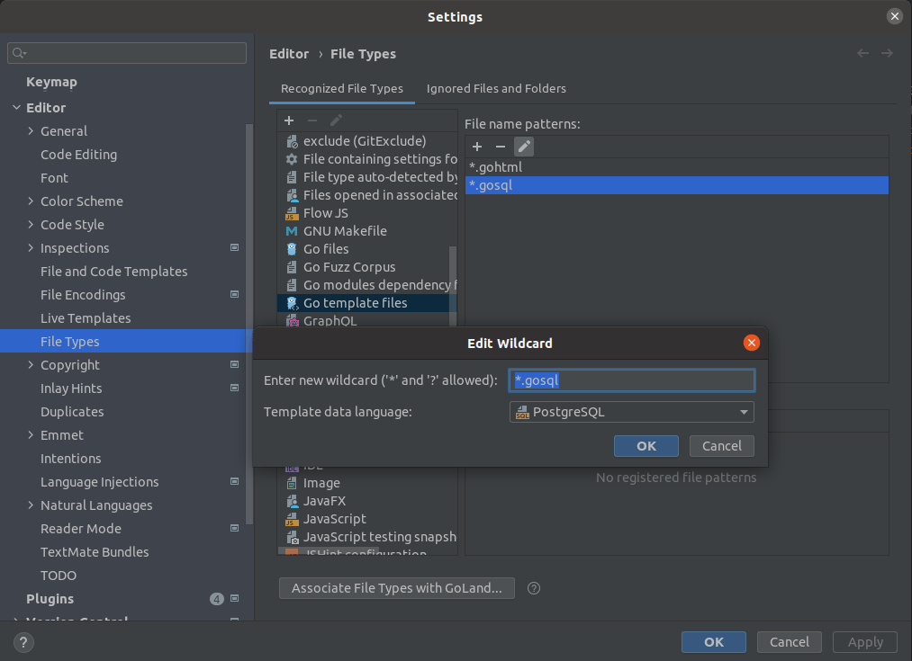
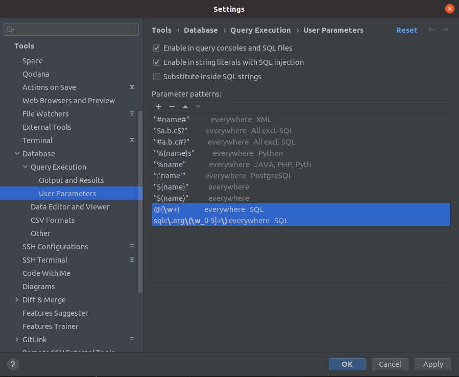

# Editor/IDE config

To edit template files, it is best to configure your IDE to work with go template files. VSCode gives better highlighting support, as the Goland highlighting tends to recognize the sql as invalid and shows many sql errors in the template file.

## VSCode

Required extension (Default Golang Extension): https://marketplace.visualstudio.com/items?itemName=golang.Go

The default extension [supports syntax highlighting](https://github.com/golang/vscode-go/wiki/features#go-template-syntax-highlighting), but requires a configuration change. You must add this section to your golang extension settings:

```json
    "gopls": {
        "ui.semanticTokens": true
    },
```

The VSCode extension does not support both go template and postgres highlighting. I suggest you use Postgres highlighting, as it is much easier to work with. You can switch between the two with:

1. `ctl + shift + p`
1. "Change language Mode"
1. "Postgres" or "Go Template File"

- Feel free to create a permanent file association with `*.gosql` files.

## Goland

Goland supports [template highlighting](https://www.jetbrains.com/help/go/integration-with-go-templates.html) out of the box. To associate sql files, add a new file type in **Editor** settings. Select "Go template files". Add a new filename of `*.gosql` and select "postgres" as the "Template Data Language".



It also helps to support the sqlc type variables. You can do this by adding ["User Parameters"](https://www.jetbrains.com/help/datagrip/settings-tools-database-user-parameters.html) in database queries.



You can also add `dump.sql` as a DDL data source for proper table column recognition.
