# chatd — Architecture & State of the Code

> **Status**: Early Access (formerly experimental).
> Moved from `coderd/chatd/` to `coderd/x/chatd/` in March 2025.
> ~120 commits in the first month of development, ~18,400 lines of Go (including ~23,100 lines of tests).

## What is chatd?

`chatd` is the **server-side chat daemon** that powers Coder's "Agents" feature. It
processes user chat messages by orchestrating LLM calls, tool execution inside
workspaces, and real-time streaming of results to the frontend.

At a high level: a user sends a message → `chatd` acquires the pending chat →
calls the configured LLM → the LLM optionally invokes tools (shell commands,
file reads/writes, workspace creation, etc.) → results are persisted and
streamed back to the user.

---

## Architecture Diagram

```mermaid
flowchart TB
    %% ── External actors ──────────────────────────────────
    User(["User / Frontend"])
    LLM["LLM Provider<br/><small>Anthropic · OpenAI · Google<br/>Azure · Bedrock · OpenRouter<br/>Vercel · OpenAI-Compat</small>"]
    MCP["External MCP Servers"]
    WA["Workspace Agent<br/><small>shell · files · desktop</small>"]

    %% ── Persistence ──────────────────────────────────────
    DB[("PostgreSQL<br/><small>chats · chat_messages<br/>chat_files · chat_model_configs<br/>chat_providers · chat_queued_messages</small>")]
    PS(["Pubsub<br/><small>cross-replica events</small>"])

    %% ── API layer ────────────────────────────────────────
    subgraph API ["coderd HTTP API"]
        REST["REST Handlers<br/><small>/api/experimental/chats/*</small>"]
        SSE["SSE Streams<br/><small>watchChat · watchChats</small>"]
    end

    %% ── chatd Server ─────────────────────────────────────
    subgraph chatd ["chatd.Server"]
        direction TB

        ACQ["Acquire Loop<br/><small>poll DB every 1s<br/>batch up to 10 chats</small>"]
        HB["Heartbeat<br/><small>every 30s</small>"]
        STALE["Stale Recovery<br/><small>reclaim after 5min</small>"]
        QUEUE["Message Queue<br/><small>up to 20 queued msgs<br/>auto-promote on complete</small>"]

        subgraph processChat ["processChat goroutine"]
            direction TB
            RC["runChat<br/><small>resolve model · load messages<br/>build prompt · connect tools</small>"]

            subgraph chatloop ["chatloop.Run  ×  up to 1200 steps"]
                direction TB
                STREAM["LLM Stream<br/><small>fantasy.Stream()</small>"]
                TOOLS["Tool Execution<br/><small>parallel tool calls</small>"]
                PERSIST["Persist Step<br/><small>assistant + tool results → DB</small>"]
                COMPACT["Compaction Check<br/><small>if context > 70% limit<br/>summarize & reload</small>"]
                RETRY["Retry Logic<br/><small>exponential backoff<br/>up to 25 attempts</small>"]

                STREAM -->|"text · reasoning · tool_calls"| TOOLS
                TOOLS -->|"tool results"| PERSIST
                PERSIST --> COMPACT
                COMPACT -->|"continue?"| STREAM
                STREAM -.->|"retryable error"| RETRY
                RETRY -.->|"backoff"| STREAM
            end

            RC --> chatloop
        end

        ACQ -->|"acquire pending"| processChat
        HB -.->|"update heartbeat_at"| DB
        STALE -.->|"reset orphaned chats"| DB
    end

    %% ── Tool subsystem ───────────────────────────────────
    subgraph tools ["Tools"]
        direction TB
        FT["File Tools<br/><small>read · write · edit</small>"]
        ET["Execute Tool<br/><small>shell commands<br/>fg/bg · process mgmt</small>"]
        WT["Workspace / Planning Tools<br/><small>list/read templates<br/>create/start workspace<br/>propose plan</small>"]
        CU["Computer Use<br/><small>Anthropic-only<br/>screenshots · clicks</small>"]
        SA["Subagent Tools<br/><small>spawn · wait · message · close</small>"]
        MT["MCP Tools<br/><small>slug__toolName prefix<br/>allow/deny filtering</small>"]
        PT["Provider-native Tools<br/><small>e.g. web_search</small>"]
    end

    %% ── Supporting packages ──────────────────────────────
    subgraph support ["Supporting Packages"]
        direction LR
        CP["chatprompt<br/><small>DB ↔ SDK ↔ LLM<br/>message conversion</small>"]
        CV["chatprovider<br/><small>ModelCatalog<br/>API key mgmt</small>"]
        CC["chatcost<br/><small>microdollar<br/>cost calc</small>"]
        UL["usagelimit<br/><small>spend limits<br/>fail-open</small>"]
        QG["quickgen<br/><small>title generation<br/>push summaries</small>"]
    end

    %% ── Connections ──────────────────────────────────────
    User -->|"send message<br/>create chat"| REST
    User <-.->|"stream events"| SSE
    REST -->|"insert message<br/>set status=pending"| DB
    REST -->|"notify"| PS
    SSE <-.->|"subscribe"| PS

    ACQ -->|"SELECT pending"| DB
    PERSIST -->|"INSERT messages"| DB
    PERSIST -->|"publish message_part"| PS
    RC -->|"load messages"| DB
    RC -->|"check limits"| UL
    RC -->|"resolve model"| CV
    RC -->|"convert messages"| CP
    STREAM <-->|"generate / stream"| LLM
    COMPACT -->|"summarize"| LLM
    QG -->|"title / summary"| LLM

    TOOLS --> FT & ET & CU
    FT & ET & CU <-->|"agent HTTP API"| WA
    TOOLS --> WT
    WT -->|"create/start"| DB
    TOOLS --> SA
    SA -->|"create child chat"| DB
    TOOLS --> MT
    MT <-->|"SSE / streamable HTTP"| MCP
    TOOLS --> PT
    PT -->|"provider executes"| LLM

    CC -.->|"calculate after persist"| PERSIST

    %% ── Styling ──────────────────────────────────────────
    classDef external fill:#e8f4f8,stroke:#2196F3,color:#000
    classDef storage fill:#fff3e0,stroke:#FF9800,color:#000
    classDef api fill:#e8f5e9,stroke:#4CAF50,color:#000
    classDef core fill:#f3e5f5,stroke:#9C27B0,color:#000
    classDef tool fill:#fce4ec,stroke:#E91E63,color:#000
    classDef support fill:#e0f2f1,stroke:#009688,color:#000
    classDef loop fill:#ede7f6,stroke:#673AB7,color:#000

    class User,LLM,MCP,WA external
    class DB,PS storage
    class REST,SSE api
    class ACQ,HB,STALE,QUEUE,RC core
    class FT,ET,WT,CU,SA,MT,PT tool
    class CP,CV,CC,UL,QG support
    class STREAM,TOOLS,PERSIST,COMPACT,RETRY loop
```



### Reading the diagram

- **Solid arrows** show the primary request/data flow.
- **Dashed arrows** show background or secondary flows (heartbeats, pubsub, cost calculation).
- The **chatloop** box is the inner step-stream loop that repeats up to `maxChatSteps` times per chat turn.
- **Tools** fan out to the workspace agent (file/exec/desktop), the database (workspace management), child chats (subagents), and external MCP servers.
- The **supporting packages** are stateless helpers used by `runChat` and the persist layer.

---

## Package Layout

```
coderd/x/chatd/
├── chatd.go              # Core Server: polling, acquire, processChat, runChat (~5,400 lines)
├── configcache.go        # Process-wide config cache (providers, model configs, user prompts)
│                         # 10s/5s TTLs, negative caching, pubsub invalidation
├── dialvalidation.go     # Dial-with-lazy-validation: dial cached agent, validate against
│                         # latest build only if dial is still pending. Terminal fast-fail
│                         # via errChatHasNoWorkspaceAgent for stopped workspaces.
├── prompt.go             # DefaultSystemPrompt constant
├── instruction.go        # AGENTS.md file reading from workspaces
├── sanitize.go           # Prompt/input sanitization for invisible Unicode + blank-line collapse
├── subagent.go           # Delegated child agent (subagent) tools
├── usagelimit.go         # Spend-limit enforcement (per-user, per-period)
├── quickgen.go           # Lightweight LLM tasks: title generation, push summaries
│
├── chatloop/             # The step-stream loop (LLM call → tool exec → persist → repeat)
│   ├── chatloop.go       # Run(), processStepStream, tool execution
│   └── compaction.go     # Context window compaction (summarization)
│
├── chatprompt/           # Message serialization/deserialization (DB ↔ fantasy)
│   └── chatprompt.go     # ConvertMessages, ParseContent, content versioning (V0/V1)
│
├── chatprovider/         # LLM provider abstraction (model catalog, API key management)
│   ├── chatprovider.go   # ModelCatalog, ProviderAPIKeys, supported providers
│   └── useragent.go      # User-agent + Coder identity headers for LLM API calls
│
├── chattool/             # Tool implementations
│   ├── chattool.go       # Shared helpers (toolResponse, truncateRunes)
│   ├── execute.go        # Shell command execution (foreground, background, process mgmt)
│   ├── readfile.go       # Line-numbered file reading
│   ├── writefile.go      # File writing
│   ├── editfiles.go      # Search-and-replace file editing
│   ├── computeruse.go    # Anthropic computer use (desktop screenshots, clicks, typing)
│   ├── listtemplates.go  # List workspace templates (with popularity sorting + allowlist)
│   ├── readtemplate.go   # Get template details + parameters
│   ├── createworkspace.go # Create workspace from template (idempotent, waits for build)
│   ├── startworkspace.go # Start a stopped workspace
│   ├── proposeplan.go    # Present a markdown plan file for user review
│   ├── mcpworkspace.go   # Workspace MCP tool discovery via .mcp.json (ListMCPTools/CallMCPTool)
│   └── skill.go          # Skills: discover .agents/skills/<name>/SKILL.md, read_skill/read_skill_file tools
│
├── chatcost/             # Token cost calculation (microdollar precision)
│   └── chatcost.go       # CalculateTotalCostMicros
│
├── chaterror/            # Error classification and user-facing message generation
│   ├── classify.go       # ClassifiedError: severity, retryability, provider Retry-After
│   ├── kind.go           # ErrorKind enum (rate_limit, auth, config, startup_timeout, …)
│   ├── message.go        # terminalMessage() + retryMessage() for frontend display
│   ├── payload.go        # Projectors for ChatStreamError / ChatStreamRetry payloads
│   ├── provider_error.go # Unwrap fantasy.ProviderError, parse Retry-After headers
│   └── signals.go        # Extract structured signals from error text
│
├── chatretry/            # Retry logic for transient LLM errors
│   └── chatretry.go      # IsRetryable, Retry with exponential backoff
│
├── chattest/             # Test helpers (mock OpenAI/Anthropic servers)
│   ├── openai.go
│   ├── anthropic.go
│   └── errors.go
│
└── mcpclient/            # MCP (Model Context Protocol) server integration
    └── mcpclient.go      # ConnectAll, tool discovery, allow/deny lists
```

---

## Core Concepts

### 1. The Server (chatd.go)

`Server` is the central orchestrator. It runs a **polling loop** that:
1. Acquires pending chats from the database (up to `DefaultMaxChatsPerAcquire = 10` at a time)
2. Processes each chat in a separate goroutine
3. Heartbeats to prevent stale chat detection
4. Recovers stale chats (running for > 5 minutes without heartbeat)

Key configuration:
- `DefaultPendingChatAcquireInterval = 1s` — how often it polls for work
- `DefaultInFlightChatStaleAfter = 5min` — when a chat is considered orphaned
- `DefaultChatHeartbeatInterval = 30s` — heartbeat frequency
- `maxChatSteps = 1200` — absolute upper bound on LLM round-trips per chat turn

Decomposition has started: `configcache.go` (config caching),
`dialvalidation.go` (agent dial validation) have been extracted.

System prompt composition uses the `include_default_system_prompt` boolean
toggle. `resolvedChatSystemPrompt()` composes `[default?, custom?]` joined
by `\n\n`.

### 2. The Chat Loop (chatloop/)

`chatloop.Run()` is the inner execution engine. For each user message it:
1. Calls the LLM via `fantasy.LanguageModel.Stream()`
2. Processes the streaming response (text, reasoning, tool calls)
3. Executes any tool calls in parallel
4. Persists the step (assistant response + tool results)
5. Checks for context compaction needs
6. Repeats if the model wants to continue (tool calls present)

The loop has retry logic (`chatretry.Retry`) wrapping each LLM call with
exponential backoff for transient errors (rate limits, 5xx, etc.).

**Compaction** happens when context token usage exceeds a configurable threshold
(default 70%). It asks the LLM to summarize the conversation so far, persists
the summary, and reloads the message history. There is a
`maxCompactionRetries = 3` safety valve to prevent infinite loops.

The LLM stream is wrapped in `guardedStream`, which enforces a **60-second
first-chunk timeout**. If the provider produces no output for 60s, the stream
is canceled with a retryable `startup_timeout` error rather than hanging
indefinitely.

### 3. Message Serialization (chatprompt/)

This package handles the gnarly problem of converting between:
- **Database format** (`database.ChatMessage` with `pqtype.NullRawMessage` content)
- **SDK format** (`codersdk.ChatMessagePart`)
- **LLM format** (`fantasy.Message` / `fantasy.MessagePart`)

There are **two content versions**:
- **V0 (legacy)**: Role-aware heuristic parsing. Assistant messages use structural
  heuristics to distinguish "fantasy envelope" format from SDK parts. This was the
  format during the initial experimental phase.
- **V1 (current)**: Clean `[]codersdk.ChatMessagePart` JSON for all roles.

The `ParseContent` function dispatches on `ContentVersion`. Legacy V0 parsing
includes fallback logic for tool results, assistant blocks, and system messages
that each had different serialization formats.

V1 content now includes a `context-file` part type
(`ChatMessagePartTypeContextFile`) used to persist workspace instruction files
(AGENTS.md) and skill metadata. `partsToMessageParts()` expands these into
`<workspace-context>` text blocks for the LLM prompt.

### 4. Provider Abstraction (chatprovider/)

Supported providers: Anthropic, Azure OpenAI, AWS Bedrock, Google, OpenAI,
OpenAI-Compatible, OpenRouter, Vercel AI Gateway.

The `ModelCatalog` resolves model names to `fantasy.LanguageModel` instances.
API keys come from a layered system: env presets → database config → static keys.
Outgoing LLM requests also attach Coder identity headers (`X-Coder-Owner-Id`,
`X-Coder-Chat-Id`, optional subchat/workspace IDs) so intermediaries such as
`aibridged` can correlate traffic back to Coder entities.

### 5. Tools (chattool/)

Tools are implemented as `fantasy.AgentTool` values. Each tool gets a
`GetWorkspaceConn` function that lazily connects to the workspace agent.

Notable tool groupings:
- **Process tools**: `execute`, `process_output`, `process_list`, `process_signal`
- **Workspace tools**: `list_templates`, `read_template`, `create_workspace`, `start_workspace`
- **Planning tool**: `propose_plan` for presenting Markdown plans to the user
- **Provider-native tools**: e.g. `web_search`, defined separately from `chattool/`

- **Workspace MCP tools**: `mcpworkspace.go` — discovers `.mcp.json` from the
  workspace agent via `ListMCPTools` and proxies calls via `CallMCPTool`. Tools
  are prefixed with server name (`slug__toolName`), same convention as
  admin-configured MCP tools.
- **Skill tools**: `skill.go` — `read_skill` lists available skills from
  `.agents/skills/` in the workspace, `read_skill_file` reads individual skill
  files. Skills are auto-discovered directories containing `SKILL.md` with
  optional frontmatter. Size limits: 64KB per SKILL.md, 512KB per skill file.

The execute tool has notable complexity:
- Detects shell-style backgrounding (trailing `&`) and promotes to background mode
- Sets non-interactive env vars (`GIT_TERMINAL_PROMPT=0`, `TERM=dumb`, etc.)
- Detects file-dump commands (`cat`, `grep -l`) and suggests `read_file` instead
- Handles foreground/background execution, process output retrieval, and signals
- Has a `snapshotTimeout = 30s` fallback for when blocking waits fail

### 6. MCP Client (mcpclient/)

Connects to external MCP servers configured in the database. Tools discovered
from MCP servers are prefixed with `serverSlug__toolName` using double-underscore
separation.

Auth types: `oauth2`, `api_key`, `custom_headers`, `none`.
Transport types: `sse`, `streamable_http` (default).

Result conversion now handles text, images, audio, structured content,
`EmbeddedResource`, and `ResourceLink` payloads from MCP servers.

- `model_intent` support: new boolean on `mcp_server_configs`. When enabled,
  wraps tool schemas with a `model_intent` string field. Strips it before
  forwarding calls. Three input shapes handled: correct wrapper, flat,
  malformed.
- `RefreshOAuth2Token` utility: expired OAuth2 tokens refreshed before MCP
  connections and when checking `auth_connected` status. Uses
  `golang.org/x/oauth2` `TokenSource` with 10s expiry buffer.
- Workspace MCP discovery: chatd calls `ListMCPTools` through `AgentConn` to
  discover tools from workspace `.mcp.json` files, merged with
  admin-configured MCP tools.

### 7. Subagents (subagent.go)

The parent chat can spawn child "subagent" chats via tools:
- `spawn_agent` — creates a child chat that runs independently
- `spawn_computer_use_agent` — child chat with Anthropic computer use (desktop)
- `wait_agent` — polls/pubsub-waits for child completion (default 5min timeout)
- `message_agent` — sends follow-up messages to a running child
- `close_agent` — interrupts and stops a child

Ancestry is verified via `isSubagentDescendant` which walks the parent chain
(O(depth) DB queries).

### 8. Usage Limits (usagelimit.go)

Spend limits are enforced per-user with configurable periods (day/week/month).
The limit resolution order is: individual override > group limit > global default.

The system **fails open** on errors — if the limit check fails, the chat proceeds.
There is an acknowledged race condition where concurrent messages can both pass the
limit check, bounded by `message_cost × concurrency`.

### 9. Cost Tracking (chatcost/)

Costs are calculated in **microdollars** (millionths of a dollar) and rounded up.
The system distinguishes "zero cost" from "unpriced" (nil return) to handle models
without pricing configuration.

Output tokens include reasoning tokens per provider semantics — adding
`ReasoningTokens` separately would double-count.

### 10. Quick Generation (quickgen.go)

`quickgen.go` handles lightweight background LLM tasks. Besides
`GenerateChatTitle` (fire-and-forget after first assistant response), it
exposes `RegenerateChatTitle` with
`POST /api/experimental/chats/{chatID}/title/regenerate`. The regenerate
endpoint uses richer context: first user turn + last 3 turns + gap markers.

---

## Key Dependencies

- **`charm.land/fantasy`** — LLM abstraction layer (streaming, tool execution, multi-provider).
  Currently a **replace directive** pointing to `github.com/kylecarbs/fantasy`, a fork.
- **`github.com/mark3labs/mcp-go`** — MCP protocol client library.
- **`github.com/coder/quartz`** — Deterministic clock for testing.

---

## Streaming Architecture

There are two distinct realtime surfaces:
- **Per-chat stream** (`/api/experimental/chats/{id}/stream`) carrying
  `message_part`, `message`, `status`, `error`, `retry`, and
  `queue_update` events.
- **Global chat watch** (`/api/experimental/chats/watch`) carrying
  sidebar-level `created`, `deleted`, `status_change`, `title_change`, and
  `diff_status_change` events.

### Source-of-truth split

| Event/data | Durability | Primary source | Notes |
|---|---|---|---|
| `message_part` | Ephemeral | In-memory stream buffer | No DB replay; can be dropped |
| `message` | Durable | `chat_messages` + same-replica durable cache | Replayed via `after_id` |
| `status` / `retry` / `error` / `queue_update` | Live control state | Local publish + pubsub notify | Not a durable event log |
| Sidebar events | Push-only | Owner-scoped pubsub | No replay; frontend refetches on reconnect |

### Delivery paths

1. **Local buffer** (`maxStreamBufferSize = 10000`) for in-flight
   `message_part` events.
2. **Pubsub notify** (`chat:stream:{chatID}`) for cross-replica durable and
   control updates.
3. **DB catch-up** (`GetChatMessagesByChatID(chat_id, after_id)`) for durable
   message replay.
4. **Enterprise relay** for remote-worker `message_part` forwarding in HA
   deployments.
5. **Durable message cache** (`maxDurableMessageCacheSize = 256`) as a
   same-replica optimization before falling back to the database.

`Subscribe()` merges these sources into one outgoing channel. It intentionally
subscribes before querying so it is less likely to miss notifications between
subscription setup and the initial snapshot.

`status` events are now also forwarded from the local in-process channel
(alongside `message_part`), not only via pubsub. `publishStatus()` is called
before the first `message_part`, so channel FIFO ordering guarantees the
frontend sees `status=running` before any content.

### Guarantees that exist

- Initial snapshots include the current `status` first, then buffered
  `message_part`s, then persisted `message`s after `after_id`, then queue state
  if present.
- Durable messages can be recovered after reconnect via `after_id`.
- Edited messages use a full-refresh path rather than trying to incrementally
  patch already-streamed history.
- Tool results are published in original tool-call order even though the tools
  themselves run concurrently.
- The frontend reconnects per-chat streams from the last durable message ID and
  invalidates sidebar queries whenever the global watch successfully reopens.

### What is not guaranteed

- There is no global sequence number or single totally ordered event log.
- There is no exactly-once, ACK, or backpressure protocol.
- `message_part` is not durable: it lives in memory, is bounded, and can be
  lost on disconnect, overflow, worker failover, or relay/pubsub issues.
- Sidebar watch has no replay mechanism.
- OSS multi-replica deployments do not relay `message_part` across replicas;
  enterprise relay adds that path, but only for live partials.

### Failure modes worth documenting

- **Slow consumers / overflow.** The per-chat buffer evicts oldest parts, and
  subscriber channels can drop events when full. This is the warn-level log
  spam that has already been seen locally.
- **Reconnect during a live answer.** Durable messages recover, but in-flight
  partial text, reasoning, and tool-call deltas may disappear until the final
  persisted assistant message arrives.
- **Stale worker recovery.** Chats can be reset from `running` to `pending`,
  but any in-memory partial stream state on the stale worker is gone.
- **Pubsub degradation.** Without pubsub, cross-replica durable/control
  delivery weakens sharply and the stream behaves much more like a same-process
  channel.

---

## Message Queue

When a chat is busy (running/pending), new user messages are **queued** (up to 20).
Two modes:
- `SendMessageBusyBehaviorQueue` — appends to queue
- `SendMessageBusyBehaviorInterrupt` — interrupts the running chat

After a chat completes, it automatically promotes the next queued message.

---

## Chat Data Lifecycle

There is currently **no retention or cleanup policy** for chat data. This is a
significant gap that needs addressing before scale becomes a concern.

### Current state

| Data | Soft-delete? | Hard-delete? | Retention policy? |
|---|---|---|---|
| `chats` | Yes (`archived = true`) | No | None |
| `chat_messages` | Yes (`deleted = true`, for edits) | No | None |
| `chat_files` | No | No | None |
| `chat_queued_messages` | N/A (deleted on consume) | Yes (on consume) | N/A |
| `chat_diff_statuses` | No | `ON DELETE CASCADE` from chats | None |

New columns on `chats`:

| Column | Type | Description |
|---|---|---|
| `last_read_message_id` | bigint | High-water mark for unread tracking. No FK. |
| `pin_order` | integer | `0` = unpinned, `1+` = pinned display order. Cleared on archive. |
| `build_id` | uuid | Persisted workspace build binding. Lazily set. |
| `agent_id` | uuid | Persisted workspace agent binding. Lazily set, repaired on stale dial. |
| `labels` | jsonb | General-purpose `map[string]string` with GIN index. Max 50. |
| `last_injected_context` | jsonb | Most recently persisted injected context parts (AGENTS.md, skills). Internal fields stripped at write. |

### Concerns at scale

- **Unbounded growth.** Every chat and every message is retained forever.
  Archived chats are hidden from the UI but remain in the database. Soft-deleted
  messages (from edits) are never pruned. With automation-driven usage, this
  could reach hundreds of thousands of chats with millions of messages.
- **`chat_messages.content` is JSONB.** Tool results (especially `execute`
  output, up to 32KB per tool call) are stored inline. A single long chat
  session can produce tens of megabytes of message content.
- **`chat_files` has no FK to `chats`.** Files are owned by user/org but not
  linked to a specific chat. When a chat is archived, its referenced files
  become orphans with no cleanup path. File data is stored as `BYTEA` directly
  in the table.
- **No partitioning.** `chat_messages` uses a `BIGSERIAL` primary key and is
  indexed by `(chat_id)` and `(chat_id, created_at)`. At high row counts,
  index maintenance and vacuum costs will grow.
- **Compaction summaries don't reduce storage.** Compaction summarizes context
  for the LLM but does not delete the original messages. The summary is stored
  as an additional hidden model-only message plus visible tool call/result
  messages, so compaction *increases* total storage.
- **Subagent chats are invisible to users** but still consume storage. A parent
  chat spawning multiple subagents creates additional chats and messages that
  are never surfaced in the UI and have no independent cleanup path.

### Questions to resolve

- Should there be a configurable retention period after which archived chats
  (and their messages) are hard-deleted?
- Should soft-deleted messages (from edits) be pruned after some period?
- Should compaction have an option to tombstone the original messages it
  summarized, reducing storage while preserving the summary?
- Should `chat_files` have a FK to `chats` or at least a `last_referenced_at`
  column to enable orphan cleanup?
- Should subagent chats have a shorter retention than user-facing chats?
- Do we need `chat_messages` table partitioning (e.g. by `created_at` range)
  for large deployments?
- Is there a role for an async background job (similar to workspace
  auto-deletion) that prunes old chat data?

---

## Organization Scoping — Pre-GA Blocker

**Chats are not scoped to organizations.** This is a significant gap that must
be resolved before GA.

### Current state

- The `chats` table has **no `organization_id` column**. Chats are owned by a
  user (`owner_id`) but have no organizational boundary.
- `chat_files` *does* have an `organization_id` FK, but this is the only
  chat-related table with org awareness.
- The `chatd` RBAC subject (`subjectChatd`) has **site-wide** permissions on
  `ResourceChat` (create/read/update/delete) with no org-scoped `ByOrgID`
  rules. It operates as a single global actor.
- `chatd.go` uses `dbauthz.AsChatd(ctx)` for background processing, bypassing
  any per-user or per-org authorization for the daemon's own DB operations.
- Chat queries (`GetChatsByOwnerID`, `GetChatByID`, etc.) filter by `owner_id`
  only, with no organization predicate.
- The `chat_model_configs` and `chat_providers` tables are global deployment
  config with no org dimension.

### What needs to happen

- Add `organization_id` to the `chats` table (migration + backfill for existing
  rows).
- Add org-scoped RBAC rules so users can only access chats within their
  organization.
- Decide whether `chat_model_configs` and `chat_providers` should be
  per-organization or remain global deployment settings.
- Decide whether usage limits (`chat_spend_limit_micros`) should be
  per-organization or remain per-user/global.
- Update the `chatd` RBAC subject to operate within org boundaries, or
  document why site-wide access is necessary for the background worker.
- Ensure subagent chats inherit the parent's organization.

---

## Authorization Model

### Principals

There are six important principals in the current design:

1. **Request user / API key subject.** This is the normal principal for
   `/api/experimental/chats/*` requests.
2. **`chatd` daemon actor** (`dbauthz.AsChatd(ctx)`). Background processing,
   message persistence, diff syncing, usage-limit resolution, and file
   resolution run with this broad site-wide actor.
3. **System-restricted actor** (`dbauthz.AsSystemRestricted(ctx)`). This is the
   escape hatch used for helper lookups that intentionally bypass normal user
   RBAC. In non-chatd paths, `AsSystemRestricted` has been partially replaced
   with narrower purpose-built actors: `AsSystemOAuth2`,
   `AsSystemReadProvisionerDaemons`, `AsProvisionerd`.
4. **Reconstructed owner actor.** Workspace create/start flows rebuild the chat
   owner's RBAC subject and then call workspace internals as that owner rather
   than as the daemon.
5. **Subagent trust inheritance.** Child chats inherit trust from the parent
   chat rather than being independently re-authorized for every internal action.
6. **`agents-access` role subject.** A new built-in site-wide role
   (`agents-access`) gates chat creation. Members without this role cannot
   create chats. The migration auto-assigns the role to users who have ever
   created a chat.

### Where authorization is actually enforced

- Routes are mounted behind authenticated API-key middleware and the Agents
  experiment gate.
- `ExtractChatParam` loads chats with request context and intentionally
  collapses unauthorized access into `404`.
- `dbauthz` is the real source of truth for most chat reads/writes; many HTTP
  handlers rely on DB auth instead of explicit `api.Authorize(...)` checks.
- The frontend only hides or admin-gates UI. It is not the authoritative
  enforcement layer.

### Current visibility model

- Chat reads are effectively **owner-scoped** today. The core DB queries and
  pubsub channels key off `owner_id`, not organization.
- The global watch channel is `chat:owner:{ownerID}`, which means sidebar and
  badge updates are also owner-scoped.
- This visibility model is one of the reasons the missing org dimension is a
  pre-GA blocker rather than a minor cleanup.

### Trust boundaries and privilege transitions

- **User request -> `AsSystemRestricted`.** Helper lookups for enabled model
  catalogs, enabled MCP configs, MCP ID validation, and some external-auth
  token reads deliberately bypass normal user RBAC.
- **Background worker -> `AsChatd`.** Chat acquisition and turn processing keep
  site-wide daemon authority.
- **Daemon -> owner impersonation.** `chatCreateWorkspace` and
  `chatStartWorkspace` rebuild the owner's RBAC subject so provisioning happens
  with owner permissions instead of daemon permissions.
- **chatd -> workspace agents / LLM providers / MCP servers / external auth
  providers.** A running turn crosses all of these trust boundaries.
- **Parent chat -> subagent.** Delegated child chats inherit both workspace and
  model context from their parent.

### Current inconsistencies and awkward edges

- Some deployment-wide getters (`system_prompt`, `desktop_enabled`,
  `workspace_ttl`) are readable by any authenticated actor, while template
  allowlist, provider/model config admin APIs, and usage-limit config require
  deployment-config RBAC. These settings live in the same conceptual bucket,
  but the read rules do not.
- `watchChatDesktop` requires both chat access and stronger workspace-connect
  or SSH permissions. `watchChatGit` is weaker: it gets chat access plus the
  implicit workspace read needed to resolve the latest agent.
- Enabled model availability and enabled MCP inventory are visible to any
  authenticated Agents user because the user-facing list endpoints call
  system-restricted helpers.
- Chat files are authorized by owner/org, not by "this specific chat", so
  files can outlive and be reused across chats.
- HTTP auth failures are inconsistent: some paths intentionally collapse to
  `404`, others return `403`.

---

## Workspace Binding Lifecycle

### What is durable

A chat is durably bound by `chats.workspace_id`, `chats.build_id`, and
`chats.agent_id`. The `build_id` and `agent_id` columns were re-added after
an earlier removal; they serve as an optimistic cache of the agent a chat
should use.

### How chats gain a workspace

A chat can start in three states:

1. **Unbound.** No workspace is attached at chat creation.
2. **Bound to an existing workspace.** `CreateChatRequest.workspace_id` stores a
   workspace reference after checking access.
3. **Late-bound by `create_workspace`.** Root chats can provision a workspace
   later and then persist the resulting `workspace_id` via `UpdateChatWorkspace`.

Subagents snapshot the parent's `WorkspaceID` at spawn time but do not get the
workspace provisioning tools themselves.

### Runtime resolution model

`runChat` creates a turn-local `turnWorkspaceContext` that:
- caches a turn-local chat snapshot,
- resolves the current agent from `GetWorkspaceAgentsInLatestBuildByWorkspaceID`,
- dials the agent connection on demand, and
- can refresh the chat row once if the turn started with no workspace yet.

This is what makes mid-turn `nil -> workspace` acquisition possible after a
successful `create_workspace` tool call. `trackWorkspaceUsage` reuses the same
reload path to keep bumping workspace activity while a turn is active.

### Semantics that are easy to miss

- Agent choice is effectively **"first agent in latest build"**, not a stable
  agent ID. Multi-agent workspaces therefore have a fuzzy contract today.
  This resolution only applies to the initial binding and the
  repair/re-resolve path. On the hot path, the bound agent is loaded by ID
  directly.
- `create_workspace` is only idempotent in the loose sense: it reuses a live
  workspace, waits for an in-progress build, suggests `start_workspace` if the
  bound workspace is stopped, and may create a brand-new workspace if the old
  one looks dead, deleted, disconnected, or agentless.
- `start_workspace` only restarts the **already-bound** workspace. It does not
  change `chats.workspace_id`.
- Pre-attached workspaces are validated for access at chat creation time, not
  for liveness, build health, or agent reachability.
- `UpdateChatWorkspace` does not publish a dedicated binding-changed event. The
  frontend currently notices `create_workspace` tool results and refetches the
  chat.
- Mid-turn refresh really only handles **`nil -> workspace`**. Rebinding from
  one valid workspace to another inside the same turn is shaky because the
  turn-local chat snapshot may keep pointing at the original workspace.
- Workspace-derived instructions (`AGENTS.md`, OS, working directory) are
  resolved from the initial snapshot and do not automatically refresh after a
  late binding.
- Soft-deleted workspaces leave `chats.workspace_id` pointing at a logically
  dead row because the FK's `ON DELETE SET NULL` only helps for hard deletes.

Instruction files (AGENTS.md) are now persisted as `context-file` message parts
on first workspace attachment via `persistInstructionFiles()`, rather than being
re-resolved per turn. The `last_injected_context` column on `chats` stores the
most recently persisted context to avoid redundant writes. Per-turn
`resolveInstructions()` + `InsertSystem()` has been removed.

### Questions to resolve

- Should chats bind to a specific agent again, or is "latest build / first
  agent" the intended long-term contract?
- Should workspace-binding changes publish their own realtime event?
- Should dead-but-existing workspaces be restarted, replaced, or surfaced to
  the user more explicitly?
- Should parent and child chats share a live workspace reference instead of
  snapshot-copying `WorkspaceID`?

---

## Configuration Layers and Ownership

### Scope layers

Agents configuration is layered rather than singular:

- **Deployment-global**: provider configs, model configs, system prompt,
  desktop toggle, workspace TTL, template allowlist, MCP server configs, and
  the global usage-limit default.
- **Per-user**: custom prompt, per-model compaction thresholds, usage-limit
  status/overrides, and MCP OAuth tokens.
- **Per-group**: usage-limit overrides.
- **Per-chat / per-message**: `last_model_config_id`, selected `mcp_server_ids`,
  and per-message overrides.
- **Browser-local**: last selected model config and last selected MCP servers.

### The three model/provider surfaces

There are three distinct surfaces that sound similar but mean different things:

1. **Provider config list.** Admin CRUD over `chat_providers`.
2. **Model config list.** Admin CRUD over `chat_model_configs`.
3. **Model catalog (`/models`).** User-facing derived runtime availability built
   from enabled providers, enabled model configs, and effective API keys.

The provider list itself is also a merged view: database rows, env-preset
providers, and synthetic "supported but unconfigured" providers all appear in
one response.

### Ownership splits that are awkward today

- The frontend has to join runtime model catalog data to admin model-config
  rows in order to recover `model_config_id` from a chosen `provider:model`.
- MCP configuration spans four layers: deployment server definitions, per-user
  OAuth tokens, per-chat selected server IDs, and browser-local saved
  selection/defaults.
- `desktop_enabled` is not a full capability toggle. Computer use also depends
  on Anthropic support, a hard-coded computer-use model, and workspace desktop
  support.
- Template allowlist only governs template-based list/read/create flows.
  `start_workspace` intentionally ignores it.
- Usage limits are layered (`user override` > `group override` > `global
  default`) but still have fail-open edges when pricing is missing, concurrent
  turns overshoot, or the resolver errors.
- Several runtime paths deliberately fail open: template allowlist load/parse
  errors, usage-limit resolution errors, missing/invalid user prompt overrides,
  and system-prompt fallback.
- Read/write auth semantics and status codes are inconsistent across config
  surfaces.

### Questions to resolve

- Should providers and model configs remain deployment-global when org scoping
  lands?
- Should read permissions and error shapes be normalized across chat config
  endpoints before GA?
- How much server-side validation should exist for provider/model option
  schemas beyond the current UI-generated forms?
- Which settings are supposed to be user-visible versus admin-visible as policy,
  rather than by incidental implementation detail?

---

## Known Technical Debt

1. **`chatd.go` needs decomposition.** At ~5,400 lines, this single file contains
   the Server struct, all HTTP-facing methods (Create/Send/Edit/Archive/Delete/
   Promote/Interrupt/RefreshStatus/Subscribe), the background processing loop,
   the full `runChat` orchestration, stream management, push notifications,
   model resolution, instruction resolution, and stale recovery. This is a
   direct result of fast iterative shipping during the experimental phase. It
   must be broken up before the codebase can scale to more contributors.
   Likely candidates for extraction: stream management, model/instruction
   resolution, push notifications, message queue handling. Decomposition has
   started: `configcache.go` (config caching) and `dialvalidation.go` (agent
   dial validation) have been extracted.

2. **`charm.land/fantasy` fork must be reconciled with upstream.** The `go.mod`
   replaces the canonical `charm.land/fantasy` module with
   `github.com/kylecarbs/fantasy`. The primary blocker is a Go version mismatch:
   Coder is on Go 1.25, upstream fantasy requires Go 1.26. There are also
   fork-only features currently being upstreamed. Once the Go version is bumped
   and patches are merged upstream, the replace directive should be removed.

3. **Decide whether to drop content version V0 support.** The `chatprompt`
   package supports two content serialization versions. V0 is the legacy format
   from the experimental phase — it uses role-aware heuristics and has a
   comment explicitly calling out a "brittle invariant tied to Go's json decoder
   behavior." V1 is the clean current format. Since Agents was never officially
   released during the V0 era, the only users with V0 data are those running
   `main`. Decision needed: drop V0 (simpler code, breaks `main` runners) or
   keep it (more code to maintain, but no data loss for anyone).

4. **`chaterror/` package extracted from `chatretry/`.** Error classification
   is now a standalone package with structured provider error extraction,
   retry-after parsing, and user-facing message generation.

---

## Open Questions

> These are things that looked unusual, surprising, or potentially problematic
> during the initial code review. They need human answers.

### Architecture

2. ~~**Why the `coderd/x/` prefix?**~~ **Resolved.** The `x/` prefix denotes an
   experimental package. Once the feature graduates from early access, `chatd`
   will be promoted out of `x/` back to `coderd/chatd/`.

3. **`charm.land/fantasy` is a fork.** ~~The `go.mod` replaces the canonical
   module with `github.com/kylecarbs/fantasy`. What is the relationship between
   Coder and this library? Is there a plan to upstream changes, or will this
   remain a fork? What happens when fantasy has breaking changes?~~
   **Resolved.** See Known Technical Debt item #2.

4. **Polling-based chat acquisition needs rethinking.** The server polls every
   1 second for pending chats (`DefaultPendingChatAcquireInterval`). With N
   idle replicas this means N queries/second of database load with zero pending
   work. Two architectural decisions are needed:
   - **Short-term**: Move to long-poll/block-until-acquire, consistent with how
     `provisionerdserver` acquires jobs.
   - **Long-term**: Decide whether `chatd` should be runnable as a standalone
     daemon (like `provisionerd`). If so, a DRPC interface and the associated
     plumbing will be needed. This is a significant architectural investment.

### Code Quality

5. ~~**Content version V0 parsing is complex.**~~ **Resolved.** See Known
   Technical Debt item #3.

6. **`maxChatSteps = 1200` is arbitrarily high and should be tuned.** This was
   set as a generous upper bound during experimental development. There should
   be sufficient internal usage data now to determine a realistic maximum and
   bring this down. TODO: query production chat step counts (p99/max) and set a
   defensible limit.

7. **The tool name separator `__` has a known ambiguity.** The TODO in
   `mcpclient.go` acknowledges that tool names containing `__` produce ambiguous
   prefixed names. No real-world issues reported yet, but worth exploring a
   more robust separator or escaping scheme before MCP adoption widens.

8. **Usage limits fail open — and may be in the wrong place.** The current
   fail-open behavior is a safety net while the feature is being ironed out;
   the intent is to eventually enforce limits strictly. Beyond that, there are
   larger architectural questions:
   - Should usage limit enforcement live inside `coderd/x/chatd`, or should it
     be a shared concern at a higher level?
   - How will this integrate with aibridge?
   - Will chatd continue to be the enforcement point, or will quotas move to a
     centralized gateway?

9. **Subagent nesting depth needs a policy decision.** The ancestry check in
   `isSubagentDescendant` is O(depth), but the more pressing question is: how
   deep should the family tree be allowed to go? Currently,
   `createChildSubagentChat` enforces a hard limit of **one level** — a child
   chat with a `ParentChatID` cannot spawn further children. The underlying architecture
   (parent/root chain tracking) supports arbitrary depth, but the guard
   prevents it. TODO: decide on a nesting policy. If depth > 1 is ever
   allowed, the O(depth) ancestry walk should be revisited (e.g. materialized
   path or depth column).

### Testing

10. ~~**No documentation or README existed before this file.**~~ **Resolved.**
    Test philosophy follows the rest of the codebase: tests all the time, in CI,
    on PRs, and locally. The `chatd` package tests take ~38s on beefy dev boxes.
    Common codebase-wide pattern: lots of tests, long runtimes, occasional
    flakiness. No chatd-specific test strategy beyond that.

11. **Most providers lack integration test coverage.** `chattest/` has mock
    servers for OpenAI and Anthropic only. The remaining 6 providers (Azure,
    Bedrock, Google, OpenRouter, OpenAI-Compatible, Vercel) are largely
    untested and not all are configured in the dogfood environment. TODO: set
    up real-world integration tests for each provider using cheap/fast models
    to catch provider-specific serialization or behavioral differences.

### Operational

12. **No Prometheus metrics or alerting for chatd.** Stale chat recovery (5-min
    threshold, 30s heartbeat = ~10 missed beats) has no monitoring. More
    broadly, the package lacks Prometheus instrumentation entirely. TODO: add
    metrics (chat processing latency, step counts, stale recoveries, queue
    depth, compaction events, retry counts) and contribute a sample dashboard
    to `coder/observability`.

13. ~~**Push notifications.**~~ **Resolved.** If the LLM summary generation
    fails, the push notification still goes out with the fallback message
    "Agent has finished running."

14. **Stream buffer eviction needs backpressure.** The 10,000-event buffer has
    been hit in practice (locally), causing warn-level log spam (mitigated by
    `streamDropWarnInterval`). The UX is degraded streaming for that one chat,
    typically caused by the client not consuming events fast enough. The buffer
    evicts oldest events silently. TODO: explore a backpressure mechanism
    (e.g. slow down LLM streaming, pause tool execution, or signal the client
    to reconnect) rather than silently dropping events.

### Design Decisions That Need Rationale

15. **Tool organization needs rethinking.** Workspace tools live in `chattool/`
    but subagent tools live in `chatd/subagent.go` because they couple directly
    to `Server` methods. Beyond the extraction question, there is a larger
    design conversation: should agents have configurable toolsets? e.g. an
    "explore/review" toolset (read-only: read_file, execute, list_templates)
    vs an "implementation" toolset (read/write: edit_files, write_file,
    create_workspace). TODO: define a toolset abstraction and decide where
    tool registration/selection lives.

16. **Computer use is Anthropic-only and will need a provider support matrix.**
    `ComputerUseModelProvider = "anthropic"` and `ComputerUseModelName =
    "claude-opus-4-6"` are hardcoded because computer use is a relatively new
    capability. As other providers ship their own computer use APIs, this will
    need per-provider implementations. TODO: before GA, build a provider
    capability/support matrix that tracks which providers support which
    features (computer use, web search, reasoning, etc.).

17. **Prompt construction is scattered and should be consolidated.** The
    `chatprompt` package handles serialization/deserialization and provides
    message manipulation helpers (PrependSystem, InsertSystem, AppendUser), but
    actual prompt assembly (system prompt prepending, instruction injection,
    user prompt wrapping) lives in `chatd.go`'s `runChat`. This is likely just
    how it grew. Given the `chatd.go` decomposition goal (debt item #1),
    moving prompt assembly into `chatprompt` is a natural extraction candidate.

18. **Preferred title/summary models should be admin-configurable.** The
    `preferredTitleModels` list in `quickgen.go` is hardcoded per provider
    (Claude Haiku 4.5, GPT-4o-mini, Gemini 2.5 Flash, etc.). When a new
    cheap model is released, the code must be updated. TODO: make this a
    deployment configuration option so admins can set their preferred
    lightweight model for background tasks.

19. **Instruction caching (5 minutes) is undocumented but intentional.**
    **Partially superseded** — instructions are now persisted as `context-file`
    parts on first workspace attachment. If a user edits `AGENTS.md`, the change won't take effect for up to 5 minutes.
    The cache exists for good reason: without it, every LLM turn would re-read
    the file from the workspace agent, and uncached system prompt changes would
    invalidate the provider's prompt cache, significantly increasing cost. In
    practice, most chats are expected to target new workspaces where `AGENTS.md`
    comes from cloning a repo or running a startup script (stable after initial
    setup). TODO: document the caching behavior somewhere user-facing so people
    aren't surprised.

20. ~~**Cost calculation uses `github.com/shopspring/decimal`.**~~ **Resolved.**
    Deliberate choice to avoid float64 precision issues in financial
    calculations. An int64 microdollar representation could also work but
    `shopspring/decimal` handles the intermediate fractional arithmetic cleanly
    before the final ceil-to-int64 step. Not a concern.

21. **Workspace MCP tool discovery caching.** Tools from `.mcp.json` are cached
    in the agent process. Cache refresh policy and interaction with
    admin-configured MCP tools needs documentation.

22. **Chat labels lifecycle.** Labels are general-purpose `map[string]string` on
    chats, designed for Automations. No label-based retention or cleanup policy
    exists yet.
