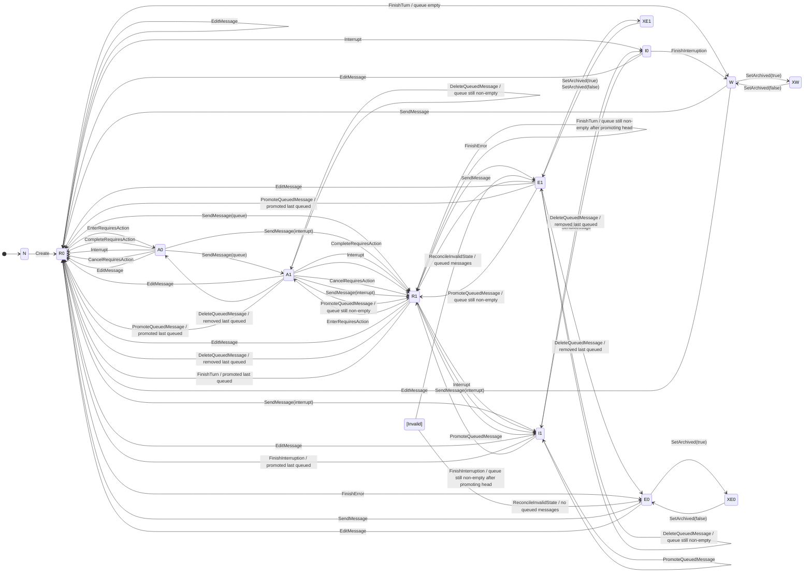
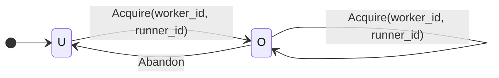

# Overview of the architecture

Chatd has 4 main pieces:

- **core state machine**: describes how a chat's state in the database can change over time. It defines the valid states and transitions for committed chat data: status, messages, queued messages, pending actions, worker ownership, and the fields used to reject stale work. It's a specification implemented by [chatstate/machine.go](./chatstate/machine.go). Runtime components, such as the HTTP endpoints and the chat worker, use it to ensure that they modify the state only in valid ways.
- **API surface**: the HTTP endpoints that coderd exposes. Responsible for: creating chats, sending messages, editing messages, updating metadata, managing the queue, interrupting active work, and submitting tool results. These are used by the client, usually via the browser, to interact with chats.
- **chat worker**: lives inside every coderd replica. It acquires chats, calls the LLM API, executes tools, handles interrupts and tool-result waits, and commits completed outcomes through the core state machine.
- **stream loop**: powers `GET /api/experimental/chats/{chat}/stream`, the WebSocket endpoint that the UI uses to consume a live chat. It combines two kinds of data: messages committed to the database and streaming message parts emitted by the chat worker. It receives notifications over pubsub whenever the chat state is updated, fetches messages from the database, and connects to the coderd replica that currently owns the chat to relay the streaming message parts to the client.

# Core state machine

The core state machine describes how a chat's execution state in the database can change over time. A fundamental component of the state machine is the set of valid **states** it can be in. We will consider 2 kinds of states: **execution states** and **ownership states**. These states let us describe what the runtime components of chatd can do with a chat at a given point in time.

## What constitutes a chat's state?

We say that the following data constitutes a chat's **execution state**:

- chat status on the `chats` table, such as `waiting`, `running`, `interrupting`, `requires_action`, or `error`;
- the `archived` marker on the `chats` table;
- message history in the `chat_messages` table, including the `revision` field;
- queued user messages in the `chat_queued_messages` table, including the `position` and `created_by` fields;
- `worker_id` and `runner_id` fields on the `chats` table (ownership fields);
- the `last_error` field on the `chats` table (last error message from the agent loop);
- the `retry_state` field on the `chats` table, a JSONB object that stores the last error message encountered by the agent loop, and information about when the next retry will be attempted;
- the `snapshot_version`, `history_version`, `queue_version`, `generation_attempt`, `retry_state_version` fields on the `chats` table, defined later in the document;
- the `requires_action_deadline_at` field on the `chats` table (pending-action deadline, defined later in the document);

There is other data that is held in the database and is associated with a chat, but it's not part of the execution state:

- title;
- labels;
- pin order;
- workspace binding;
- model configuration;
- plan mode;
- file links.

We call it **metadata**. The core state machine concerns itself with **execution state**. As a general guideline, a piece of data is execution state if the core state machine needs it to decide what the next state transition may be, or if it's directly modified by a state transition. For example, a queued message is part of the execution state because it impacts what the next action of the agent loop can be. If the agent loop finishes processing a user message and would otherwise stop, but there's a queued message, the agent loop will start processing the queued message instead. On the other hand, a chat's title does not impact the agent loop at all - it's just a label that helps the user identify the chat.

If the distinction isn't completely clear to you at this point, don't worry. It should become clearer as you learn more about the core state machine.

## Execution states

A chat's execution state lets the chat worker and the HTTP endpoints decide what they can do with the chat. In total, there are 13 execution states. The states are decided by what's in the database:

- By whether a chat exists;
- By all the chat statuses on the `chats` table: `waiting`, `running`, `interrupting`, `requires_action`, and `error`;
- By the `archived` marker on the `chats` table;
- By the queued messages in the `chat_queued_messages` table.

The shorthands in the table below use the convention that the first 1 or 2 letters indicate the status, and then `1` or `0` indicate the presence or absence of queued messages.

| Shorthand | Status | Queue | Archived | Meaning |
| --- | --- | --- | --- | --- |
| `N` | - | - | - | Chat does not exist |
| `W` | `waiting` | empty | `false` | There's no work to be done by the chat worker |
| `E0` | `error` | empty | `false` | The worker encountered an unrecoverable error while processing the chat. There's no more work to be done by the chat worker |
| `E1` | `error` | non-empty | `false` | The worker encountered an unrecoverable error while processing the chat, and there's currently no work to be done by the chat worker. There's a queued message that should be processed once the error is cleared |
| `R0` | `running` | empty | `false` | Running state with no queued messages: a chat worker should be processing the chat |
| `R1` | `running` | non-empty | `false` | Running state with queued messages: a chat worker should be processing the chat, and there's a queued message that should be processed next |
| `I0` | `interrupting` | empty | `false` | The chat was interrupted by the user, and the chat worker should commit any partial message that had been generated before the interruption |
| `I1` | `interrupting` | non-empty | `false` | The chat was interrupted by the user, and the chat worker should commit any partial message that had been generated before the interruption, and there's a queued message that should be processed next |
| `A0` | `requires_action` | empty | `false` | The chat worker is waiting until the user submits tool results; this state is used only by the “dynamic tools” feature |
| `A1` | `requires_action` | non-empty | `false` | The chat worker is waiting until the user submits tool results, and there's a queued message that should be processed next; this state is used only by the “dynamic tools” feature |
| `XW` | `waiting` | empty | `true` | The chat was archived while it was in the `waiting` state, it will go back to `waiting` once unarchived |
| `XE0` | `error` | empty | `true` | The chat was archived while it was in the `error` state, it will go back to `error` once unarchived |
| `XE1` | `error` | non-empty | `true` | The chat was archived while it was in the `error` state, it will go back to `error` once unarchived, and there's a queued message that should be processed once the error is cleared |

If these states seem arbitrary and abstract at this point, that's expected. Each one of these states is needed by some runtime component of chatd for some specific use case, and their purpose will emerge as we discuss the implementation of the HTTP endpoints and the chat worker.

At a high-level, these states let us reason about what should be possible to happen with a chat at a given point in time. For example, a chat in the `R0` state can be picked up by a chat worker, an LLM message can be appended to its history. On the other hand, a chat in the `XW` state must be ignored by the chat worker, and most of the HTTP endpoints must refuse to interact with it. We'll define precisely what is possible in each state in the [Transitions](#transitions) section.

## Ownership states

A chat's ownership state lets the chat worker decide whether a chat can be acquired or not. It's decided by the `worker_id` field on the `chats` table. In total there are 2 ownership states.

| Shorthand | Worker ID | Meaning |
| --- | --- | --- |
| `U` | null | Unowned chat |
| `O` | not null | Owned chat |

## Transitions

Now that we've defined the states, we can define the transitions between them. In practice, **a transition is just a sequence of SQL queries that modify the database state in a transaction**. That transaction first takes a row lock on the chat to ensure that it's serialized with respect to other transactions that modify the chat. Multiple transitions can be executed atomically in a single transaction.

Remember!
> a transition is just a sequence of SQL queries that modify the database state in a transaction

We will not define the SQL queries that correspond to each transition - it'd take too much space and it's not central to the document's purpose. Instead, we focus on what each transition does to the database state, and how it affects the execution and ownership states.

Each transaction that applies one or more transitions advances the `snapshot_version` field on the `chats` table by 1 immediately after locking the chat row and before mutating any tables. This lets us version the chat's execution state. The chat worker and the stream loop rely on it to ensure they do not process outdated or out of order notifications.

Chat-message changes update `history_version` on the `chats` table and the `revision` fields on the `chat_messages` table automatically via Postgres triggers described in [Message revisions and history version](#message-revisions-and-history-version). `history_version` stores the latest `snapshot_version` in which chat message history changed. The chat runner and the stream loop rely on it to ensure they are fully aware of the chat's history changes. See [Event processing](#event-processing) for how the runner uses `history_version` differently from `snapshot_version`.

Queue changes update `queue_version` automatically via Postgres triggers described in [Queue version](#queue-version).

I don't recommend reading the rest of section thoroughly if this is your first time reading this document. It's an information dump that only makes sense once you pair it with a specific runtime component of chatd. Give it a cursory look, and treat it as a reference that you can return to later when you're analyzing how an HTTP endpoint or a chat worker implements a specific feature.

### Transitions used by the HTTP endpoints

- `Create(initialMessages)` creates a new chat, initializes `snapshot_version` to 1, inserts its initial history, and lands in `running`. The inserted initial history sets `history_version` to 1. Since the queue has not changed, `queue_version` remains 0. This transition is a special case: since the chat does not exist at the time it's run, the chat row cannot be locked before the transition is applied.
- `SetArchived(archived)` sets or clears the archived marker for one chat.
- `SendMessage(m, busy_behavior)` inserts a user message directly when the chat is idle, or queues it when the chat is busy. `busy_behavior` must be either `queue` or `interrupt`. With `busy_behavior=interrupt`, it also requests interruption or cancels a pending dynamic-tool action as needed.
- `EditMessage(k, replacement)` clears queued messages, cancels or obsoletes active work, marks the truncated active-history suffix as deleted, inserts the replacement turn, and lands in `running`.
- `DeleteQueuedMessage(qid)` removes one queued message without changing the active history.
- `PromoteQueuedMessage(qid)` makes a queued message the next message to process. It reorders the queue, interrupts active work, cancels pending dynamic-tool action, or promotes into history immediately as required by the input state.
- `Interrupt(reason)` requests cancellation of an active generation or closes pending dynamic-tool action. It preserves queued backlog.
- `CompleteRequiresAction(results)` inserts submitted tool-result messages, clears `requires_action_deadline_at`, and lands in `running`. It preserves queued messages.

### Transitions used by the chat worker

- `Acquire(worker_id, runner_id)` locks the chat row, sets `chats.worker_id` and `chats.runner_id`, and inserts an initial heartbeat row for `(chat_id, runner_id)`.
- `Abandon` clears `worker_id` and `runner_id` on the chat row.
- `CommitStep(step)` inserts one durable message suffix while remaining `running`. A committed step may insert ordinary assistant/tool messages, and a compaction step may insert a compressed summary boundary plus visible compaction tool-call and tool-result messages.
- `EnterRequiresAction` records a pending-action episode by relying on the committed assistant tool-call messages as the durable call set, sets `requires_action_deadline_at`, which is a timestamp 5 minutes in the future, and lands in `requires_action`.
- `FinishInterruption(optionalPartialStep)` inserts one final interrupted assistant/tool suffix if present, or finalizes interruption without a suffix if none is available, clears the interrupting state, and lands in `waiting` if no queued message is promoted. If interrupt finalization also promotes the queue head, it inserts the promoted queued message into history and lands in `running`.
- `RecordGenerationAttempt` verifies the chat is still `running`, increments `generation_attempt`, and returns the updated chat snapshot.
- `RecordRetryState(payload)` verifies the chat is still `running`, stores the retry payload sent to clients as `retry_state`, and returns the updated chat snapshot.
- `FinishTurn` completes the current generation turn atomically. If the queue is empty, it lands in `waiting`. If the queue is non-empty, it removes the queue head, inserts it into history as a user turn, and lands in `running`.
- `FinishError(err)` ends a running chat in `error` and persists `last_error = err`, overwriting any prior stored error.
- `CancelRequiresAction(reason)` closes pending dynamic tool calls with synthetic cancellation tool results, satisfies the pending-action projection, clears `requires_action_deadline_at`, and lands in `running`.
- `ReconcileInvalidState` reconciles a chat in an invalid state by setting it to a valid state. Defined in the [Invalid states](#invalid-states) section.

### Execution state transition diagram

Now comes maybe the densest part of this document. It's a diagram that shows all the possible transitions between all the execution states. Again, I don't recommend reading the diagram thoroughly at first. Take a quick look to get a sense of what it's about and treat is as a reference you can return to later. I recommend reading the diagram as text and not looking at the rendered visual. The text is clearer.

A transition between input state `A` and output state `B` is allowed only if it's listed in the diagram below (`A --> B: Transition Name`). If a transition is not allowed, the core state machine implementation must reject it.



### Ownership state transition diagram

The ownership state transition diagram is much simpler. It shows all the possible transitions between all the ownership states.



Notice that the `Acquire` and `Abandon` transitions only affect ownership state, and not execution state. They are fully orthogonal to the execution state transitions and have separate diagrams. This means that the chat's execution state can change independently of its ownership state, and vice versa. An archived chat may be acquired by a chat worker, and the core state machine's data model does not prevent that. The actual implementation of the chat worker will ignore chats that are in execution states that don't need processing, but it's not a concern of the core state machine.

### Miscellaneous transition rules

- Any transition that's not `CompleteRequiresAction` which supports `A0` or `A1` as input states, and lands in output states different from `A0` and `A1`, must insert synthetic, cancellation tool-call results for pending dynamic tool calls to avoid corrupting the message history.
- Any transition that inserts a new user message into active history must answer outstanding tool calls in active history before inserting the user message. It may do this by inserting synthetic cancellation tool-call results.
- Any transition leaving `E0` or `E1` (except `SetArchived(true)`) should clear the `last_error` field.

### Invalid states

Right after the refactor described in this document is complete, some chats may be in invalid states. For example, a chat may have `archived` set to `true` and status to `running`, which isn't allowed by the new state machine. To get the chat out of an invalid state, the `ReconcileInvalidState` transition is used, which does the following:

1. Increment `snapshot_version` by 1.
2. Set `archived = false`.
3. Set `status = 'error'`.
4. Set `last_error` to an error message describing the chat was in an invalid state and a new message should be submitted or the message history should be edited to continue.
5. Set `requires_action_deadline_at = null`.
6. If the chat has pending dynamic tool calls, insert synthetic cancellation results for them.

This will land the chat in either `E0` or `E1`, depending on whether it has any queued messages.

Users can reconcile a chat's state by calling the `POST /api/experimental/chats/{chat}/reconcile-invalid` endpoint.

## Message revisions and history version

Each row in `chat_messages` has a `revision` column. It stores the `chats.snapshot_version` of the transition that last inserted or meaningfully updated that message row. `revision` is mutable, trigger-managed, and not unique. Multiple message rows can share the same revision when they are changed in the same transaction.

`chats.history_version` stores the latest `snapshot_version` in which chat message history changed. It starts at `0`, remains unchanged for non-history transitions, and is set to the current `snapshot_version` whenever a message is inserted or meaningfully updated. A newly created chat starts with `snapshot_version = 1`; because `Create` inserts initial history in that snapshot, the created chat's `history_version` becomes `1`. No-op message updates do not advance message `revision`, advance `history_version`, or reset `generation_attempt`. Whenever `history_version` changes, `generation_attempt` is reset to `0`; generation attempts are scoped to the current history version.

Message revision triggers depend on the transition invariant that `snapshot_version` is allocated immediately after the chat row is locked and before any message mutation happens. Runtime code must not assign `chat_messages.revision` directly.

A `BEFORE INSERT` trigger assigns the current chat `snapshot_version` to the inserted message row and records the same value as the chat's latest history version:

```sql
CREATE FUNCTION set_chat_message_revision()
RETURNS trigger AS $$
DECLARE
  chat_snapshot_version bigint;
BEGIN
  IF TG_OP = 'INSERT' AND NEW.revision IS NOT NULL THEN
    RAISE EXCEPTION 'chat_messages.revision must be assigned by trigger';
  END IF;

  IF TG_OP = 'UPDATE' THEN
    IF OLD.chat_id IS DISTINCT FROM NEW.chat_id THEN
      RAISE EXCEPTION 'chat_messages.chat_id is immutable';
    END IF;

    IF OLD.revision IS DISTINCT FROM NEW.revision THEN
      RAISE EXCEPTION 'chat_messages.revision must be assigned by trigger';
    END IF;

    IF OLD IS NOT DISTINCT FROM NEW THEN
      RETURN NEW;
    END IF;
  END IF;

  UPDATE chats
  SET
    history_version = snapshot_version,
    generation_attempt = 0
  WHERE id = NEW.chat_id
  RETURNING snapshot_version INTO chat_snapshot_version;

  IF chat_snapshot_version IS NULL THEN
    RAISE EXCEPTION 'chat % does not exist', NEW.chat_id;
  END IF;

  NEW.revision = chat_snapshot_version;
  RETURN NEW;
END;
$$ LANGUAGE plpgsql;

CREATE TRIGGER trigger_set_chat_message_revision_on_insert
BEFORE INSERT ON chat_messages
FOR EACH ROW
EXECUTE FUNCTION set_chat_message_revision();
```

A `BEFORE UPDATE` trigger uses the same function for message row updates:

```sql
CREATE TRIGGER trigger_set_chat_message_revision_on_update
BEFORE UPDATE ON chat_messages
FOR EACH ROW
EXECUTE FUNCTION set_chat_message_revision();
```

## Queue version

`chats.queue_version` stores the latest `snapshot_version` in which the queue changed. It starts at `0`, remains unchanged for non-queue transitions, and is set to the current `snapshot_version` whenever a queued message is inserted, updated, reordered, or deleted. A newly created chat with no queued messages has `queue_version = 0`.

An `AFTER INSERT`, `AFTER UPDATE`, and `AFTER DELETE` trigger records that the queue changed:

```sql
CREATE FUNCTION bump_chat_queue_version_on_queued_message_change()
RETURNS trigger AS $$
DECLARE
  changed_chat_id uuid;
BEGIN
  IF TG_OP = 'DELETE' THEN
    changed_chat_id = OLD.chat_id;
  ELSE
    changed_chat_id = NEW.chat_id;
  END IF;

  UPDATE chats
  SET queue_version = snapshot_version
  WHERE id = changed_chat_id;

  IF TG_OP = 'DELETE' THEN
    RETURN OLD;
  END IF;
  RETURN NEW;
END;
$$ LANGUAGE plpgsql;

CREATE TRIGGER trigger_bump_chat_queue_version_on_queued_message_insert
AFTER INSERT ON chat_queued_messages
FOR EACH ROW
EXECUTE FUNCTION bump_chat_queue_version_on_queued_message_change();

CREATE TRIGGER trigger_bump_chat_queue_version_on_queued_message_update
AFTER UPDATE OF content, model_config_id, position, created_by
ON chat_queued_messages
FOR EACH ROW
EXECUTE FUNCTION bump_chat_queue_version_on_queued_message_change();

CREATE TRIGGER trigger_bump_chat_queue_version_on_queued_message_delete
AFTER DELETE ON chat_queued_messages
FOR EACH ROW
EXECUTE FUNCTION bump_chat_queue_version_on_queued_message_change();
```

## Retry state version

`chats.retry_state_version` stores the latest `snapshot_version` in which `retry_state` changed. It starts at `0`, remains unchanged for transitions that do not affect retry state, and is set to the current `snapshot_version` whenever `retry_state` changes. A newly created chat starts with `retry_state = null` and `retry_state_version = 0`.

Retry state is scoped to the current generation attempt. Whenever `generation_attempt` changes, `retry_state` is cleared automatically. If that clear changes the value of `retry_state`, `retry_state_version` is set to the current `snapshot_version`.

A single `BEFORE UPDATE` trigger handles both clearing `retry_state` on generation-attempt changes and bumping `retry_state_version` on retry-state changes. The trigger mutates `NEW` directly and does not run an `UPDATE chats ...` statement, so it does not recursively trigger itself:

```sql
CREATE FUNCTION sync_chat_retry_state()
RETURNS trigger AS $$
BEGIN
  IF OLD.retry_state_version IS DISTINCT FROM NEW.retry_state_version THEN
    RAISE EXCEPTION 'chats.retry_state_version must be assigned by trigger';
  END IF;

  IF NEW.generation_attempt IS DISTINCT FROM OLD.generation_attempt THEN
    NEW.retry_state = NULL;
  END IF;

  IF NEW.retry_state IS DISTINCT FROM OLD.retry_state THEN
    NEW.retry_state_version = NEW.snapshot_version;
  END IF;

  RETURN NEW;
END;
$$ LANGUAGE plpgsql;

CREATE TRIGGER trigger_sync_chat_retry_state
BEFORE UPDATE OF retry_state, retry_state_version, generation_attempt
ON chats
FOR EACH ROW
EXECUTE FUNCTION sync_chat_retry_state();
```

## HTTP endpoints

This section maps the public endpoints that mutate chat state to the transitions they use.

### `POST /api/experimental/chats`

This endpoint uses `Create(initialMessages)`:

- `N -> Create(initialMessages) -> R0`

No other input states are supported.

### `PATCH /api/experimental/chats/{chat}`

When archiving or unarchiving a root chat, the operation applies `SetArchived(archived)` to the root and all descendants atomically. If any chat in the family cannot apply the requested archived-state transition, the whole operation fails without changing any chat. Unarchiving an individual child chat remains guarded: it must fail while its parent is archived

For `archived` updates, the supported input and output states are:

- `W -> SetArchived(true) -> XW`
- `E0 -> SetArchived(true) -> XE0`
- `E1 -> SetArchived(true) -> XE1`
- `XW -> SetArchived(false) -> W`
- `XE0 -> SetArchived(false) -> E0`
- `XE1 -> SetArchived(false) -> E1`

If the request does not change `archived`, this endpoint doesn't emit any state transitions.

Other execution-state classes are not supported for archive/unarchive.

### `POST /api/experimental/chats/{chat}/messages`

For `busy_behavior=queue`, `SendMessage(m, queue)` supports:

- `W -> SendMessage(m, queue) -> R0`
- `E0 -> SendMessage(m, queue) -> R0`
- `E1 -> SendMessage(m, queue) -> R1`: this appends `m` to the end of the queue, promotes the current queue head, and clears the error. The scenario where this happens is:
    - the user queued some messages
    - the chat ran into an error and stopped, for example because of an unretriable problem with the LLM provider
    - the user then sends a new message, but there is a non-empty queue. As defined here, the UX will be “add the new message to the end of the queue and promote the queue head.” Arguably, a better UX could be “add the new message to the chat immediately and start running it, even though there's a non-empty queue.” I think the former is better because it's more consistent with the behavior of the endpoint in other cases.
- `R0 -> SendMessage(m, queue) -> R1`
- `R1 -> SendMessage(m, queue) -> R1`
- `I0 -> SendMessage(m, queue) -> I1`
- `I1 -> SendMessage(m, queue) -> I1`
- `A0 -> SendMessage(m, queue) -> A1`
- `A1 -> SendMessage(m, queue) -> A1`

For `busy_behavior=interrupt`, `SendMessage(m, interrupt)` supports:

- `W -> SendMessage(m, interrupt) -> R0`
- `E0 -> SendMessage(m, interrupt) -> R0`
- `E1 -> SendMessage(m, interrupt) -> R1`
- `R0 -> SendMessage(m, interrupt) -> I1`
- `R1 -> SendMessage(m, interrupt) -> I1`
- `I0 -> SendMessage(m, interrupt) -> I1`
- `I1 -> SendMessage(m, interrupt) -> I1`
- `A0 -> SendMessage(m, interrupt) -> R1`
- `A1 -> SendMessage(m, interrupt) -> R1`

When `SendMessage(m, interrupt)` lands in `I1`, the queued message is promoted later by `FinishInterruption(partial?)` after the interrupted suffix is finalized.

Other input states are not supported.

### `PATCH /api/experimental/chats/{chat}/messages/{message}`

This endpoint uses `EditMessage(k, replacement)`:

- `W -> EditMessage(k, replacement) -> R0`
- `E0 -> EditMessage(k, replacement) -> R0`
- `E1 -> EditMessage(k, replacement) -> R0`
- `R0 -> EditMessage(k, replacement) -> R0`
- `R1 -> EditMessage(k, replacement) -> R0`
- `I0 -> EditMessage(k, replacement) -> R0`
- `I1 -> EditMessage(k, replacement) -> R0`
- `A0 -> EditMessage(k, replacement) -> R0`
- `A1 -> EditMessage(k, replacement) -> R0`

`EditMessage` clears queued messages, cancels or obsoletes active work without preserving partial output, clears pending dynamic-tool action if present, marks the truncated active-history suffix as deleted, inserts the replacement turn, and lands in `running`.

Other input states are not supported.

### `DELETE /api/experimental/chats/{chat}/queue/{queuedMessage}`

This endpoint uses `DeleteQueuedMessage(qid)`:

- `E1 -> DeleteQueuedMessage(qid) -> E0` if removing the last queued message
- `E1 -> DeleteQueuedMessage(qid) -> E1` if the queue remains non-empty
- `R1 -> DeleteQueuedMessage(qid) -> R0` if removing the last queued message
- `R1 -> DeleteQueuedMessage(qid) -> R1` if the queue remains non-empty
- `I1 -> DeleteQueuedMessage(qid) -> I0` if removing the last queued message
- `I1 -> DeleteQueuedMessage(qid) -> I1` if the queue remains non-empty
- `A1 -> DeleteQueuedMessage(qid) -> A0` if removing the last queued message
- `A1 -> DeleteQueuedMessage(qid) -> A1` if the queue remains non-empty

No other input states are supported.

### `POST /api/experimental/chats/{chat}/queue/{queuedMessage}/promote`

This endpoint uses `PromoteQueuedMessage(qid)`:

- `E1 -> PromoteQueuedMessage(qid) -> R0` if promoting the last queued message
- `E1 -> PromoteQueuedMessage(qid) -> R1` if the queue remains non-empty
- `R1 -> PromoteQueuedMessage(qid) -> I1`
- `I1 -> PromoteQueuedMessage(qid) -> I1`
- `A1 -> PromoteQueuedMessage(qid) -> R0` if promoting the last queued message
- `A1 -> PromoteQueuedMessage(qid) -> R1` if the queue remains non-empty

`PromoteQueuedMessage` reorders `qid` to the queue head internally when needed. From `E1` and `A1`, it removes the queued message and inserts it into history immediately. From `R1` and `I1`, it leaves the message queued at the head so `FinishInterruption(partial?)` can promote it after finalizing the interrupted suffix.

No other input states are supported.

### `POST /api/experimental/chats/{chat}/interrupt`

This endpoint uses `Interrupt(user_cancel)`:

- `R0 -> Interrupt(user_cancel) -> I0`
- `R1 -> Interrupt(user_cancel) -> I1`
- `A0 -> Interrupt(user_cancel) -> R0`
- `A1 -> Interrupt(user_cancel) -> R1`

When `Interrupt(user_cancel)` lands in `I0` or `I1`, the chat is later picked up by a `ChatRunner` to apply `FinishInterruption(partial?)`.

No other input states are supported.

### `POST /api/experimental/chats/{chat}/tool-results`

This endpoint uses `CompleteRequiresAction(results)`:

- `A0 -> CompleteRequiresAction(results) -> R0`
- `A1 -> CompleteRequiresAction(results) -> R1`

No other input states are supported.

## Pubsub

The chat worker and the stream loop need real-time notifications when the chat state changes to ensure they are responsive. To achieve this, we use pubsub.

As with the transitions section, I don't recommend reading the rest of this section thoroughly at first. Give it a cursory look, and treat it as a reference that you can return to later when you're analyzing the `GET /api/experimental/chats/{chat}/stream` endpoint or the chat worker.

### Notification channels

There are 2 notification channels:

- `chat:ownership` is a global channel consumed by chat workers. Its payload is:
    - `chat_id`
    - `snapshot_version`
    It notifies chat workers about chats that need processing by a chat worker, but aren't owned by a chat worker. A worker then picks the chat up.
- `chat:update:{chat_id}` is a per-chat channel consumed by a chat worker that owns the chat and by active stream loops. Its payload is:
    - `snapshot_version`
    - `worker_id`
    - `runner_id`
    - `history_version`
    - `queue_version`
    - `retry_state_version`
    - `generation_attempt`
    - `status`
    - `archived`
    
    It notifies receivers that a chat's execution state changed. Receivers use the payload as a hint to decide whether they should fetch the latest state from the database.
    

### Notification emission rules

- `chat:update:{chat_id}` is emitted after every successful transition bundle that advances `snapshot_version`.
- The `chat:update:{chat_id}` payload contains the committed post-transition values for the notification fields.
- `chat:ownership` is emitted when a transition leaves the chat in a runnable state, defined in [Acquisition loop](#acquisition-loop), and no worker owns it. That means either `worker_id` or `runner_id` is NULL, or there is no fresh heartbeat row for the current `(chat_id, runner_id)`.
- Notifications are post-commit, best-effort, and versioned via the `snapshot_version` field.
- The current pubsub API is not assumed to provide transaction atomicity or commit-order delivery. Receivers must tolerate duplicates, drops, and reordering.
- Every receiver tracks the highest `snapshot_version` it has processed per chat. Notifications with `snapshot_version` less than or equal to that watermark are discarded.

# Chat worker

A chat worker lives inside every coderd replica. It acquires chats, calls the LLM API, executes tools, handles interrupts and tool-result waits, and commits completed outcomes through the core state machine.

The chat worker is responsible for:

- acquiring chats when the chat is in a runnable state and no worker owns it, by listening to `chat:ownership` notifications and doing periodical checks via database queries;
- spawning a chat runner for each acquired chat: the chat runner is scoped to a single chat and is responsible for driving a chat forward by calling the LLM API and executing tools;
- upserting heartbeat rows in `chat_heartbeats` for runners owned by the worker;
- maintaining in-memory buffers of in-flight message parts for each chat;
- cleaning up runners when a chat is no longer owned by the runner, which it detects by inspecting `chat:update:{chat_id}` notifications and database sync results.

A chat worker is identified by a **worker ID**, which is regenerated on worker startup.

## Acquisition loop

The acquisition loop is a simple component that greedily acquires unowned or lease-expired chats from the database anytime it has a chance. It's driven by two triggers:

- a periodic timer that wakes up every 30 seconds.
- a pubsub message on the `chat:ownership` channel.

It finds suitable chats by fetching every chat that:

- is in a runnable execution state, meaning one of: `R0`, `R1`, `I0`, `I1`, `A0`, `A1`; and
- doesn't have an owner, meaning `worker_id` is null, or its heartbeat is expired (older than 30 seconds).

For every matching chat, it locks it, checks if the chat still meets the aforementioned conditions, and performs the `Acquire(worker_id, runner_id)` transition on it. The `runner_id` is a random UUID generated by the acquisition loop.

When a chat is successfully acquired, the acquisition loop requests the [Runner manager](#runner-manager) to spawn a chat runner for it.

### Load balancing

The design doesn't attempt to distribute load between workers fairly. Whenever a chat needs an owner, all replicas race to acquire it. If there's a coder replica that has a lower latency to the database, it'll tend to acquire chats more frequently than other replicas.

## Runner manager

The runner manager is responsible for the lifecycle of chat runners. For every chat runner that the acquisition loop requests to be spawned, it:

- spawns the runner as a goroutine;
- includes the chat in a periodic [database sync operation](#database-sync-loop);
- forwards chat state updates from the database sync to the chat runner;

The manager supports the existence of multiple runners for the same chat. This is possible when a runner abandons the chat, the acquisition loop on the same replica acquires it again, and the manager hasn't yet cleaned up the old runner.

The manager is comprised of 4 loops.

### Main loop

The main loop listens on 3 go channels:

1. a channel for chat runner spawn requests;
2. a channel for chat runner cleanup requests.
3. a channel for chat runner cleanup completion notifications.

It processes one request at a time. When it receives a spawn request, it spawns a new runner as a goroutine. When it receives a cleanup request, it cancels the runner's goroutine, but it does not wait for it to finish and does not clean up the runner's resources synchronously. Instead, it spawns a goroutine that waits for the runner to finish and sends a cleanup completion notification when it does. The loop cleans up the resources of the runner that finished when it processes the cleanup completion notification.

Events sent on all the aforementioned channels have the following shape:

```go
{
  ChatID string,
  RunnerID string,
}
```

### Database sync loop

The database sync loop is responsible for fetching the current database state of all chats registered with the runner manager. On an interval, it runs a single query like this:

```sql
SELECT ... FROM chats WHERE id = ANY($1::uuid[]);
```

where `$1::uuid[]` is the list of chat IDs registered with the runner manager. It then forwards the results to runners for the corresponding chats. There may be more than one runner for a given chat, each keyed by a different `runner_id` value, so the results must be forwarded to all of them.

### Heartbeat loop

Heartbeats are stored in a dedicated table:

```sql
CREATE UNLOGGED TABLE chat_heartbeats (
    chat_id uuid NOT NULL REFERENCES chats(id) ON DELETE CASCADE,
    runner_id uuid NOT NULL,
    heartbeat_at timestamp with time zone NOT NULL,
    PRIMARY KEY (chat_id, runner_id)
);

CREATE INDEX chat_heartbeats_heartbeat_at_idx
    ON chat_heartbeats (heartbeat_at);
```

For every runner registered with the runner manager, the heartbeat loop upserts the corresponding row in `chat_heartbeats` every 9 seconds. Rows are keyed by `(chat_id, runner_id)`. 9 seconds is chosen so that a worker must miss 3 heartbeats before its lease on the chat expires, and the acquisition loop on another replica can acquire its chat.

The loop uses this query:

```sql
INSERT INTO chat_heartbeats (chat_id, runner_id, heartbeat_at)
SELECT chat_id, runner_id, now()
FROM unnest($1::uuid[], $2::uuid[]) AS runners(chat_id, runner_id)
ON CONFLICT (chat_id, runner_id)
DO UPDATE SET heartbeat_at = EXCLUDED.heartbeat_at;
```

Updating heartbeat rows does not advance `snapshot_version` and does not emit pubsub notifications.

### Heartbeat cleanup loop

The heartbeat cleanup loop periodically removes stale heartbeat rows:

```sql
DELETE FROM chat_heartbeats
WHERE heartbeat_at < now() - interval '30 seconds';
```

Heartbeat rows are also removed automatically when their chat is deleted via the `chat_heartbeats.chat_id` foreign key.

## Message part buffer

The message part buffer is a global, scoped to a single replica, in-memory store of streaming message parts for each chat. Whenever an LLM API call returns a streaming message part, the runner synchronously adds it to the buffer. LLM responses are identified by **episodes**, which are tuples of `(chat_id, history_version, generation_attempt)`.

The buffer maintains a mapping of episodes to arrays of message parts. Each array is capped at 1MB of content, calculated by serializing the parts to JSON and inspecting the size of the resulting strings. If the array is full, attempts to add parts to it return an error.

The buffer exposes the following API:

- `CreateEpisode(chat_id, history_version, generation_attempt)`: creates a new, empty message part array for an episode. May only be called once for a given episode, subsequent calls will return errors. It must be called before adding parts to the episode.
- `CloseEpisode(chat_id, history_version, generation_attempt)`: closes an episode, preventing further parts from being added to it. May be called multiple times for a given episode, subsequent calls will be no-ops. Calling it on a non-existent episode creates the episode and closes it immediately. Concurrent parts of the system may race to create the episode and close it, so creating and closing in one operation prevents race conditions.
- `AddPart(chat_id, history_version, generation_attempt, content)`: adds a message part to the buffer. Returns a predefined error if the episode is not found or the array is full.
- `GetParts(chat_id, history_version, generation_attempt)`: returns the message parts for an episode. Returns a predefined error if the episode is not found.
- `SubscribeToEpisode(chat_id, history_version, generation_attempt)`: returns a go channel that will receive all message parts for the episode. It spawns a goroutine that delivers parts to the channel. It's live until the episode is closed or until a subscriber requests that the channel be closed. Once the goroutine delivers all message parts for a closed episode, it closes the channel and exits. If the episode is already closed at the time of the call, the goroutine delivers all message parts for the episode, closes the channel, and exits. `SubscribeToEpisode` does not return an error if the episode is not found: it waits for it to be created instead.

Closed episodes are garbage collected after at least 15 seconds since they were closed and when they have no active subscribers. The message part buffer maintains a garbage collection goroutine.

Subscribers must accept parts within 10 seconds of them being sent on the channel. If a subscriber does not accept a part within that timeframe, the subscription channel is closed.

## Chat runner

A chat runner is responsible for driving a chat forward by calling the LLM API and executing tools. It is scoped to a single chat and is responsible for committing results through the core state machine. It is also responsible for handling interrupts.

The runner is implemented as a single event loop that listens on a go channel with state updates. The loop does not perform any side effects nor does it query the database by itself. Instead, it spawns goroutines to communicate with the outside world.

State updates processed by the loop come from:

- `chat:update:{chat_id}` pubsub notifications;
- database sync results forwarded by the runner manager;
- goroutines notifying the loop after applying core state machine transitions (fast path to avoid waiting for pubsub notifications); and
- right after being spawned, from a single database call the runner makes to fetch the initial state of the chat.

The runner is responsible for subscribing to the `chat:update:{chat_id}` pubsub channel. During bootstrap, it must first subscribe to the channel and then fetch the initial state of the chat from the database to avoid missing any updates.

### Event shape

Every event that the runner loop processes has the following shape:

```go
{
  WorkerID *string,
  RunnerID *string,
  SnapshotVersion int64,
  HistoryVersion int64,
  GenerationAttempt int64,
  Archived bool,
  Status string,
}
```

### Local state

The runner maintains the following local state:

- latest processed event's `SnapshotVersion`;
- latest processed event's `HistoryVersion`;
- latest processed event's `GenerationAttempt`;
- latest processed event's `Status`;
- its own `WorkerID` and `RunnerID`.
- a list of goroutines it has spawned to perform side effects, each identified by a unique ID, together with cancellation handles and go channels that the goroutines use to notify they have finished.
- the ID of the currently active goroutine, if there is one.

### Event processing

The main idea behind the event processing logic is that a chat's status and its history version determine the work that the runner should be performing at any given time. Let's go through an example:

1. A chat's status is `running`, and history version is `42`. The runner is calling the LLM API or executing tools using the message history identified by `42`.
2. The runner sees an event with chat status still `running`, but history version changed to `46`. The runner should still be calling the LLM API, but it should be using the message history identified by `46`. So if the runner sees that it has an active goroutine doing work on `history_version=42`, it should cancel that goroutine, and spawn a new one to do work on `history_version=46`.
3. Then if the history version is still `46`, but the status changed to `interrupting`, the runner should cancel the active goroutine, and spawn a new one to handle the interrupt on the core state machine level - that is, submit the `FinishInterruption` transition.

The runner processes one event at a time. We call processing an event a **loop iteration**. For each event, it does the following things in order:

1. If the event's `SnapshotVersion` is less than or equal to the runner's latest processed event's `SnapshotVersion`, ignore the event and stop.
2. If the event's `WorkerID` is not the runner's `WorkerID`, or the event's `RunnerID` is not the runner's `RunnerID`, send a cleanup request to the runner manager, and stop.
3. If the event's `HistoryVersion` is equal to the runner's latest processed event's `HistoryVersion`, and if the event's `Status` is equal to the runner's latest processed event's `Status`, stop.
4. If the event's `HistoryVersion` is greater than the runner's latest processed event's `HistoryVersion`, or if the event's `Status` is different from the runner's latest processed event's `Status`, cancel the currently running goroutine if there is one, remove its ID from the active goroutine ID, and continue to the next step. Do not wait for the goroutine to finish.
5. Iterate through the goroutine list and remove all goroutines that have finished. This will likely not include the goroutine that may have just been cancelled: that's okay, a future loop iteration will clean it up.
6. If the event's `Archived` is `true` (core state machine is in `XW`, `XE0`, or `XE1`), spawn a goroutine to abandon the chat, mark it as active, and stop. We call this the **abandon chat goroutine**.
7. If the event's `Status` is `running` (`R0` or `R1`), spawn a goroutine to call the LLM API and execute tools, and mark it as active. We call this the **generation goroutine**.
8. If the event's `Status` is `interrupting` (`I0` or `I1`), spawn a goroutine to handle the interrupt, and mark it as active. We call this the **interrupt goroutine**.
9. If the event's `Status` is `requires_action` (`A0` or `A1`), spawn a goroutine to wait for the dynamic tool timeout to pass, and mark it as active. We call this the **dynamic tools timeout goroutine**.
10. Otherwise, spawn an **abandon chat goroutine** and mark it as active.

After stopping, the iteration updates the runner's local state to the event's values, unless it ignored the event because of a stale `SnapshotVersion`.

### Runner gouroutines

The runner spawns goroutines to perform side effects. There are 4 kinds: **generation**, **interrupt**, **dynamic tools timeout**, and **abandon chat**.

Goroutines perform core state machine transitions. The goroutines are spawned knowing their intended history version, chat status, and runner ID. Whenever they access the database, either for reading or writing, they must lock the chat and ensure that values in the database match the intended values. If they do not, they must exit to prevent performing stale work and applying stale transitions.

Locks are paramount: goroutines must not mix database reads from states with differing history versions, statuses, or runner IDs. However, locks must not be held for extended periods of time, such as during calling the LLM API. They must be obtained only for database operations.

In addition to database locks, each goroutine must also obtain a local, in-memory lock scoped to its intended `history_version` and `status`. In case 2 goroutines with the same intended values are ever active at the same time, this lock prevents them from racing with each other.

Goroutines described in this section may only exit in controlled ways. If they encounter an unexpected error, they must retry the operation they were meant to perform. Retries are not limited, but are governed by bounded exponential backoff.

Expected exit conditions include, but are not limited to:

- successful completion of the operation the goroutine was meant to perform;
- stale fence failure;
- context cancellation;
- chat deleted.

Retriable conditions include, but are not limited to:

- database connection error;
- LLM API request error, with the exception of hitting the generation attempt limit, which is considered to be a successful completion of the operation the goroutine was meant to perform.

#### Generation goroutine

The generation goroutine is responsible for calling the LLM API and executing tools. It is spawned when the event indicates the core state machine is in `R0` or `R1` (status is `running`).

It inspects the chat's message history, and decides what's the next step to take. The result of that step is the application of one of the following core state machine transitions:

- `CommitStep`: applied when an LLM API call returns a response.
- `FinishTurn`: applied when the chat processing logic determines that there's no more work to do for the current message history (no pending tool calls, user message is not the last message in the history, etc.).
- `FinishError`: applied when the LLM API call fails and the retry limit is reached, determined by the `generation_attempt` value.
- `EnterRequiresAction`: applied when there are pending dynamic tool calls.

The generation goroutine also applies the `RecordGenerationAttempt` transition every time before calling the LLM API. It may apply this transition multiple times in case of retries. When an LLM API call fails with a retryable error and the goroutine will retry after a backoff, it applies `RecordRetryState(payload)` with the retry payload that should be sent to clients.

When receiving streaming message parts from the LLM API, the generation goroutine adds them to the [Message part buffer](#message-part-buffer) in real time. Whenever it starts a new generation attempt, it must start a new episode in the buffer, and mark it as closed when the attempt is finished; either because the LLM API call returned a response, or the attempt was cancelled. If `AddPart` returns an error, the goroutine ignores it. Storing parts in the buffer is best-effort: if the buffer is full, or the episode is closed, the parts are dropped. A stale generation goroutine may keep on adding parts to the buffer until it is cancelled or exits.

Since the runner doesn't wait for goroutines to finish when it cancels them, and spawns new goroutines to perform new work immediately, the runner does not guarantee that any interrupted tool calls are fully stopped before continuing. Tool call interrupts are best-effort.

Tool calls have at least once semantics: if the goroutine executes a tool call, and the replica crashes before the result is persisted, another replica will execute the tool call again later. Future work may include adding a mechanism to ensure at most once semantics.

Parallel tool call results must be inserted in bulk after all parallel tool calls finish in a single `CommitStep` transition so that the generation goroutine only increments `history_version` once, since a change to the `history_version` interrupts the gorotuine. This is consistent with the existing chatd implementation.

The generation goroutine supports:

- chat compaction
- MCP tools
- file links
- workspace binding
- plan mode
- respecting model configuration
- provider-specific tools like web search and computer use
- turn limit after a user message (the LLM shouldn't be able to spin forever in loop)
- and other things

#### Interrupt goroutine

The interrupt goroutine is responsible for handling interrupts. It is spawned when the event indicates the core state machine is in `I0` or `I1` (status is `interrupting`).

The goroutine does the following in order:

1. It fetches the generation attempt number from the database.
2. It closes the episode corresponding to its history version and generation attempt by calling the `CloseEpisode` method on the [Message part buffer](#message-part-buffer).
3. It reads the buffered parts for that episode by calling the `GetParts` method on the message part buffer.
4. It applies the `FinishInterruption(partial?)` transition on the core state machine. If there are no buffered parts for that episode, or the episode is not found, it passes `nil` as the `partial` argument.

#### Dynamic tools timeout goroutine

The dynamic tools timeout goroutine is responsible for waiting for the dynamic tool timeout to pass, which is determined by the `requires_action_deadline_at` field on the chat. It is spawned when the event indicates the core state machine is in `A0` or `A1` (status is `requires_action`). The goroutine fetches the deadline value from the database. When the timeout passes, it applies the `CancelRequiresAction` transition on the core state machine.

#### Abandon chat goroutine

The abandon chat goroutine is responsible for abandoning the chat. It is spawned whenever the event processing logic determines that the chat no longer needs to be owned by the runner. It applies the `Abandon` transition on the core state machine after checking that the chat is still owned by the runner.

## Runner cleanup

When the manager cleans up a runner, the runner must cancel all goroutines it has spawned and unsubscribe from pubsub.

## Auto-archive loop

The worker periodically archives old, unused chats.

# Stream loop

The stream loop powers the `GET /api/experimental/chats/{chat}/stream` endpoint. It is scoped to one chat and one client WebSocket. It's responsible for delivering a stream of chat updates to the client, including:

- messages committed to the database; and
- streaming message parts emitted by the chat worker via the relay mechanism.

## Client-visible stream events

The following chat stream events, delivered to the client over WebSocket, are supported:

- `message_part`: a streaming message part emitted by the chat worker.
    - compared to the current implementation, these should additionally include the `history_version` and `generation_attempt` fields, so a client knows which episode a message part comes from
- `message`: a committed chat message present in the database.
- `status`: the chat's status.
- `error`: the chat's persisted error payload.
- `queue_update`: the full current queued-message list.
- `action_required`: a dynamic tool call was issued by the chat worker, the client must execute it and submit the result.
- `retry`: emitted when the chat worker is waiting before retrying a failed generation attempt.
- `preview_reset`: a reset of the stream's preview state (message parts), emitted when the worker's LLM call fails mid-way for whatever reason.
- `history_reset`: a reset of the stream's history state (committed messages), emitted when the message history is edited and some messages are removed from the history.

## Endpoint lifecycle

When a client connects, the endpoint:

1. Subscribes to `chat:update:{chat_id}` pubsub channel and starts buffering notifications.
2. Registers with the sync poller so the chat is included in the replica's periodic database sync.
3. Initializes the stream loop to the null local state.
4. Starts the stream loop. Its first action is an initial database fetch whose result is applied to establish the baseline state. The loop then handles:
    - triggering Sync operations from pubsub notifications and the sync poller;
    - instructing the [Relay mechanism](#relay-mechanism) which streaming parts to forward;
    - emitting client events;
    - updating local state;

When the endpoint exits, it deregisters from the sync poller, unsubscribes from pubsub, stops the stream loop, stops the relay forwarder, and closes request resources.

## Local stream state

The stream loop stores:

- latest synchronized `snapshot_version`;
- latest synchronized `history_version`;
- latest synchronized `queue_version`;
- latest synchronized `retry_state_version`;
- known committed messages:
    - message ID;
    - latest message revision sent to the client;
- latest status sent to the client;
- `history_version` for the last sent error;
- latest `history_version` for which `action_required` was sent;
- latest `worker_id`;
- latest `generation_attempt`;
- last accepted preview part `seq`;

Initial null state:

- synchronized versions are `0`;
- known committed-message revision map is empty;
- `worker_id` is null;
- `generation_attempt` is `0`;
- status is unset;
- last sent error history version is `0`;
- action-required cursor is `0`;
- preview part sequence is `0`;

## Stream loop operations

The loop has two operations:

| Operation | Description |
| --- | --- |
| `Sync(hints)` | Maybe fetch database state. If newer state is observed, emit required client events, update local cursors, and configure the relay target. Triggered by pubsub notifications and the sync poller. |
| `Part(history_version, generation_attempt, seq, content)` | Emit one live preview part. The operation succeeds only if the part matches local watermarks (history version, generation attempt, and seq). Triggered by the relay forwarder. |

The loop processes one operation at a time. It must not process another input halfway through a `Sync` or `Part`.

## Sync operation

`Sync` input fields include:

- `snapshot_version` optional int64;
- `history_version` optional int64;
- `queue_version` optional int64;
- `retry_state_version` optional int64;
- `status` optional string;
- `worker_id` optional string;
- `generation_attempt` optional int64.

`Sync` uses its hints to decide whether to fetch from the database:

1. If `snapshot_version` is present and `snapshot_version <= local.snapshot_version`, return no-op.
2. Compare each present input field to local state:
    - `history_version > local.history_version`;
    - `queue_version > local.queue_version`;
    - `retry_state_version > local.retry_state_version`;
    - `status != local.status`;
    - `worker_id != local.worker_id`;
    - `generation_attempt != local.generation_attempt`.
3. If none of the above conditions indicate that local state may be stale, return no-op.
4. Otherwise fetch from the database.

After fetching, if `db.snapshot_version <= local.snapshot_version`, return no-op. Otherwise apply the database result.

The endpoint's initial bootstrap fetch skips the hint check in steps 1 to 3, fetches unconditionally, and applies the database result the same way. Because it runs against the null local state, every database field is newer and the full state is emitted.

Applying the database result means, in deterministic order:

1. If `db.history_version > local.history_version`, run message synchronization.
2. If `db.queue_version > local.queue_version`, run queue synchronization.
3. If `db.status != local.status`, run status synchronization.
4. If `db.status = error` and `db.history_version > local.error_history_version`, run error synchronization.
5. If `db.status = requires_action` and `db.history_version > local.action_required_history_version`, run action-required synchronization.
6. If `db.retry_state_version > local.retry_state_version`, run retry-state synchronization.
7. If `db.history_version != local.history_version` or (`db.generation_attempt != local.generation_attempt` and `db.generation_attempt != 0`), set last accepted preview part `seq = 0` and emit `preview_reset`. (`generation_attempt = 0` is the initial value for the `generation_attempt` field after the message history changes, and there are never any preview parts associated with it. Episodes created by the [Generation goroutine](#generation-goroutine) always have a generation attempt number greater than 0.)
8. If `db.generation_attempt > 0`, configure the relay forwarder with `db.worker_id`, `db.history_version`, and `db.generation_attempt`.
9. Save `snapshot_version`, `history_version`, `queue_version`, `retry_state_version`, `status`, `worker_id`, and `generation_attempt` from the db to local state.

If `Sync` fetches from the database, all database reads for that `Sync` must happen in the same read transaction. This includes reading the chat row, changed messages, full-history refresh messages, queued messages, retry state, error data, and pending dynamic tool-call data.

### How pubsub notifications trigger sync

A pubsub notification is converted into:

```
Sync(
    snapshot_version?,
    history_version?,
    queue_version?,
    retry_state_version?,
    status?,
    worker_id?,
    generation_attempt?,
)
```

Each field is optional. Missing fields are ignored. `worker_id` uses a tri-state representation:

- absent means the check is ignored;
- present with a null worker means compare against a null worker;
- present with a worker ID means compare against that worker ID.

Notification fields do not directly cause client events. They only help decide whether `Sync` should fetch from the database. Only the database result decides what to emit.

### How the sync poller triggers sync

The sync poller, a helper component described in full in the [Sync poller](#sync-poller) section below, periodically reads the database state for every registered chat and delivers a hint-based `Sync` to each subscriber:

```
Sync(
    snapshot_version,
    history_version,
    queue_version,
    retry_state_version,
    status,
    worker_id,
    generation_attempt,
)
```

### Message synchronization

Message sync happens inside `Sync`.

Flow:

1. `Sync` observes `db.history_version > local.history_version`.
2. Fetch rows from `chat_messages` where `revision > local.history_version`.
3. Inspect the fetched rows.

If no fetched rows are soft-deleted:

1. Emit `message` events for rows whose revision is newer than the local known-message revision.
2. Update the known-message revision map.

If any fetched row is soft-deleted, mirror the current stream endpoint's full-refresh behavior with the addition of emitting the `history_reset` event:

1. Fetch all current non-deleted messages from the beginning in client-visible order.
2. Emit the `history_reset` event.
3. Resend all messages as `message` events.
4. Replace the known-message revision map with the revisions from the resent messages.

Required invariant:

- every client-visible message-history change advances the changed row revision and chat `history_version`.

### Queue synchronization

Queue sync happens inside `Sync`.

Flow:

1. `Sync` observes `db.queue_version > local.queue_version`.
2. Fetch the full current queue in client-visible order.
3. Emit one `queue_update` event with the full queue.

Required invariant:

- every client-visible queue insert, update, reorder, or delete advances `queue_version`.

### Retry-state synchronization

Retry-state sync happens inside `Sync`.

Flow:

1. `Sync` observes `db.retry_state_version > local.retry_state_version`.
2. If `db.retry_state` is null, emit nothing.
3. If `db.retry_state` is non-null, emit one `retry` event with `db.retry_state` as the payload.

Required invariant:

- every client-visible retry-state change advances `retry_state_version`.

### Status synchronization

Status sync happens inside `Sync`.

Flow:

1. Compare database status to local status.
2. If they differ, emit `status`.

### Error synchronization

Error sync happens inside `Sync`.

Flow:

1. If database status is not `error`, stop.
2. If database status is `error` and `db.history_version > local.error_history_version`, emit `error`.
3. Set `local.error_history_version = db.history_version`.

### Action-required synchronization

Action-required sync happens inside `Sync`.

Flow:

1. If database status is not `requires_action`, stop.
2. If database status is `requires_action` and `db.history_version > local.action_required_history_version`, emit `action_required`.
3. Set `local.action_required_history_version = db.history_version`.

## Sync poller

The sync poller is a replica-global helper, scoped to a single replica and shared by every stream loop running on it. Every 10 seconds, it fetches the current database snapshots for all registered chats and delivers them to the stream loops.

### Registration

Stream loops register and deregister through a mutex-backed map keyed by `chat_id`. Each map entry holds the set of subscribers for that chat, because one replica may serve multiple stream loops for the same chat. Each subscriber carries a handle the helper uses to deliver `Sync` operations into that stream loop's input.

### Polling

Every 10 seconds, the helper:

1. Acquires the mutex, snapshots the registered chat IDs and their subscribers, and releases the mutex.
2. Reads the current version columns for those chats in a single query.
3. Delivers a hint-based `Sync` to every subscriber of each returned chat, using the row's version columns as the hints.

The query is:

```sql
SELECT id, snapshot_version, history_version, queue_version,
       retry_state_version, generation_attempt, status, worker_id
FROM chats
WHERE id = ANY($1::uuid[]);
```

## Relay mechanism

We make use of a relay mechanism when there are multiple coderd replicas. If a client connects to the stream endpoint on replica A, but the chat worker that owns the chat is on replica B, the endpoint will connect to replica B and relay streaming message parts.

There exists a `GET /api/experimental/chats/{chat}/stream/parts` endpoint that is responsible exclusively for streaming message parts. That endpoint talks to the chat worker on the same replica to obtain the message parts and relay them to the client.

The flow is:

1. Client connects to the `GET /api/experimental/chats/{chat}/stream` endpoint.
2. The endpoint checks the database to see which replica owns the chat and resolves the replica's address.
3. The endpoint connects to the `GET /api/experimental/chats/{chat}/stream/parts` endpoint on that replica.
4. The stream endpoint relays both the full chat state and the streaming message parts to the client.

Some edge cases:

- In the case where the chat worker is on the same replica as the stream endpoint, the endpoint obtains message parts directly from memory over go channels; it doesn't dial itself over WebSocket. From the perspective of the relay mechanism, this doesn't matter. The transport method is abstracted away.
- When the chat's ownership changes, the stream endpoint detects it and reconnects to the new replica.

### Relay behavior

Each streaming message part belongs to an episode, identified by `history_version` and `generation_attempt`. Within an episode, each part has a `seq` number. The first part has `seq=1`, and each later part increments `seq` by 1.

`Sync` configures the relay forwarder with:

- `worker_id`;
- `history_version`;
- `generation_attempt`.

If `worker_id` is null, the relay forwarder stops forwarding messages and, if connected to a parts endpoint, closes the connection.

If `worker_id` changes, the relay forwarder connects to the new worker's parts endpoint. If only `history_version` or `generation_attempt` changes while `worker_id` stays the same, the relay forwarder keeps the existing WebSocket connection and sends a control message over that connection to select the new episode. It should not tear down and recreate the connection just because the requested episode changed.

The forwarder must only pass parts for the currently requested episode to the stream loop.

### Parts endpoint

The parts endpoint is a WebSocket endpoint.

Connection setup:

- the URL identifies the chat ID, for example `GET /api/experimental/chats/{chat}/stream/parts`;
- the endpoint accepts the connection regardless of whether the local replica owns the chat;
- after connecting, the client sends control messages over the WebSocket to choose which episode it wants.

Control message shape:

```json
{
	"history_version": 12,
	"generation_attempt": 3
}
```

Behavior after receiving an episode-selection message:

- stop sending parts for the previously selected episode;
- start serving only parts for the requested `history_version` and `generation_attempt`;
- send buffered parts for that episode if any exist;
- stream future parts for that episode as they are produced;
- if the worker has not produced parts for that episode yet, keep the connection open and emit nothing until matching parts become available;
- missing episode state is not an error;
- enforce contiguous `seq` delivery for the selected episode.

Only worker changes require a new parts WebSocket connection.

The endpoint uses the [Message part buffer](#message-part-buffer) to fetch parts for each episode.

### Part operation

The relay forwarder sends `Part` operations to the stream loop:

```
Part(history_version, generation_attempt, seq, content)
```

The operation succeeds only if:

```
history_version == local.history_version
generation_attempt == local.generation_attempt
seq == local.last_part_seq + 1
```

If accepted:

```
emit message_part
local.last_part_seq = seq
```

If any check fails, the operation is rejected.

A sequence gap is an invariant violation because the parts endpoint must enforce contiguous delivery for each requested episode.

## Loop termination

The loop returns when the endpoint returns.

Expected termination causes:

- client disconnect;
- request context cancellation;
- WebSocket write failure;
- database failure after bounded retry;
- internal invariant violation.

The loop should not terminate just because:

- a stale sync hint arrives;
- a duplicate sync hint arrives;
- pubsub drops a notification;
- the relay has no parts yet for the requested episode;
- the relay connection reconnects.
