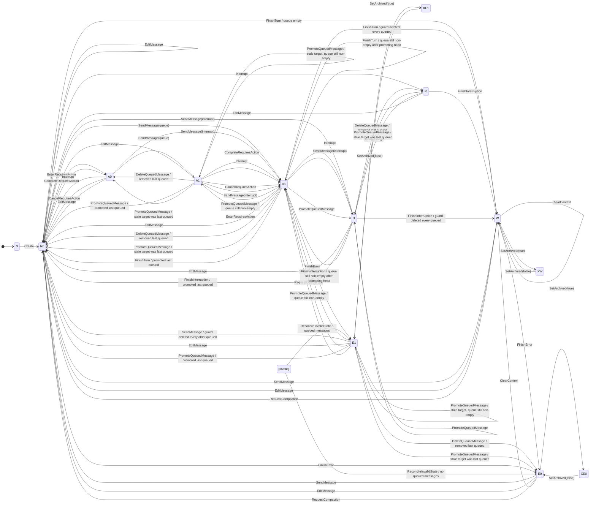
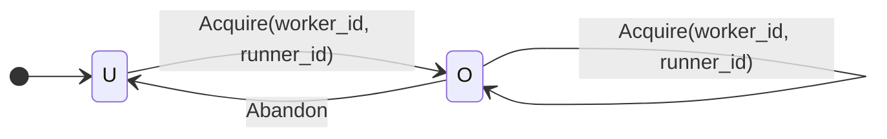

# Overview of the architecture

Chatd has 4 main pieces:

- **core state machine**: describes how a chat's state in the database can change over time. It defines the valid states and transitions for committed chat data: status, messages, queued messages, pending actions, worker ownership, and the fields used to reject stale work. It's a specification implemented by [chatstate/machine.go](./chatstate/machine.go). Runtime components, such as the HTTP endpoints and the chat worker, use it to ensure that they modify the state only in valid ways.
- **API surface**: the HTTP endpoints that coderd exposes. Responsible for: creating chats, sending messages, editing messages, updating metadata, managing the queue, interrupting active work, and submitting tool results. These are used by the client, usually via the browser, to interact with chats.
- **chat worker**: lives inside every coderd replica. It acquires chats, calls the LLM API, executes tools, handles interrupts and tool-result waits, and commits completed outcomes through the core state machine.
- **stream loop**: powers `GET /api/v2/chats/{chat}/stream`, the WebSocket endpoint that the UI uses to consume a live chat. It combines two kinds of data: messages committed to the database and streaming message parts emitted by the chat worker. It receives notifications over pubsub whenever the chat state is updated, fetches messages from the database, and connects to the coderd replica that currently owns the chat to relay the streaming message parts to the client.

# Gateway attribution keys

Chatd attributes AI Gateway requests with a synthetic API key owned by the chat owner, one key per user. There is no mapping table: the key is found in `api_keys` by its deterministic token name, `chatd_<owner_id>_session_token`, excluding `login_type = 'token'` rows. Token names are unvalidated user input, so the login type filter ensures chatd never picks up (or extends) a real bearer token a user created with the colliding name. Synthetic keys are minted with the owner's login type, which is never `'token'`. All chatd AI Gateway attribution resolves the key from `chats.owner_id`; callers do not provide the key ID.

Synthetic keys expire after 30 days. When less than 24 hours remain, chatd extends the expiry of the existing row in place instead of replacing it, because an in-flight generation may have already delegated the current key ID to the gateway. The key ID is therefore stable for the lifetime of the user. Mints and extensions are serialized with a per-user advisory lock, since the partial unique index on token names only covers `login_type = 'token'` rows. The generated token is discarded, so the stored key cannot be used as a bearer credential, and it carries a minimal scope as defense in depth.

Messages and queued messages no longer carry `api_key_id` columns; attribution is resolved solely from `chats.owner_id`. The drop migration discards any IDs stamped by older replicas, and its rollback restores the columns as nullable without backfilling them.

Deleting a synthetic key (password reset, explicit key deletion, dbpurge of long-expired keys) does not touch chat messages, queued messages, or their version fields. Chatd mints a replacement on the next request without mutating history. User suspension and deletion still block delegated gateway authorization.

# Core state machine

The core state machine describes how a chat's execution state in the database can change over time. A fundamental component of the state machine is the set of valid **states** it can be in. We will consider 2 kinds of states: **execution states** and **ownership states**. These states let us describe what the runtime components of chatd can do with a chat at a given point in time.

## What constitutes a chat's state?

We say that the following data constitutes a chat's **execution state**:

- chat status on the `chats` table, such as `waiting`, `running`, `interrupting`, `requires_action`, or `error`;
- the `archived` marker on the `chats` table;
- message history in the `chat_messages` table, including the `revision` field;
- queued user messages in the `chat_queued_messages` table, including the `position` and `created_by` fields;
- `worker_id` and `runner_id` fields on the `chats` table (ownership fields);
- the `last_error` field on the `chats` table (last error message from the agent loop);
- the `retry_state` field on the `chats` table, a JSONB object that stores the last error message encountered by the agent loop, and information about when the next retry will be attempted;
- the `snapshot_version`, `history_version`, `queue_version`, `generation_attempt`, `retry_state_version` fields on the `chats` table, defined later in the document;
- the `requires_action_deadline_at` field on the `chats` table (pending-action deadline, defined later in the document);

There is other data that is held in the database and is associated with a chat, but it's not part of the execution state:

- title;
- labels;
- pin order;
- workspace binding;
- model configuration;
- plan mode;
- project binding;
- project memory;
- file links.

We call it **metadata**. The core state machine concerns itself with **execution state**. As a general guideline, a piece of data is execution state if the core state machine needs it to decide what the next state transition may be, or if it's directly modified by a state transition. For example, a queued message is part of the execution state because it impacts what the next action of the agent loop can be. If the agent loop finishes processing a user message and would otherwise stop, but there's a queued message, the agent loop will start processing the queued message instead. On the other hand, a chat's title does not impact the agent loop at all - it's just a label that helps the user identify the chat.

Each title has a source: `fallback` for a title derived from the first prompt or the default title of a chat created without one, `generated` for a title written by automatic title generation, and `user` for a title the caller supplied. A title write applies only when the current source ranks the same as or lower than the incoming one, in the order `fallback`, `generated`, `user`. Title writes set `title_updated_at` and do not change `updated_at`; clients order title events by `title_updated_at`.

File links are metadata, but they are written inside transitions: if a transition persists message content that references uploaded files (chat create, message send, queued send, or message edit), it records the file links in the same transaction. Two invariants are enforced when links are written. A file belongs to at most one chat: attaching a file that another chat already holds is refused in the same way as attaching a file that no longer exists. There is an upper bound on the number of files a chat holds, set by the `CODER_CHAT_MAX_ATTACHMENTS_PER_CHAT` deployment option (50 by default). The core state machine does not read deployment configuration: every caller that writes links passes the cap in, and a cap below 1 fails the write instead of selecting a default. When a message's files would push the chat over the cap, the chat's earliest-uploaded files are deleted to make room, and their links go with them. Files in the same message are never evicted by that message, so only a message that is on its own larger than the cap is rejected. Files created by tools during a run take the same path, so a tool's attachment can evict a user's upload and vice versa. Desktop recordings and their thumbnails are linked to the parent chat the same way, one file per transaction; with a cap of 1 the thumbnail is skipped so it cannot evict its own recording.

Eviction means that a persisted message may reference a file that no longer exists. That's expected: the UI shows the attachment as expired, and when the history is sent to the model, an evicted user upload is replaced with a short placeholder saying the content has expired, while evicted assistant and tool files are dropped. Editing a message that still references an evicted file is refused until the attachment is removed from the edit.

TODO (#27079): messages can now carry a `workspace-file-reference` part (path, name, size, media type, workspace ID) for files uploaded into the chat's workspace. It is metadata only: no file link is written, coderd validates that the path is scoped to the chat's upload directory and that the workspace ID matches the chat's current binding, and prompt conversion renders the reference as text (`[workspace file: <name> (<size>) at <path>]`) so the bytes never reach the model. Describe this here.

If the distinction isn't completely clear to you at this point, don't worry. It should become clearer as you learn more about the core state machine.

## Execution states

A chat's execution state lets the chat worker and the HTTP endpoints decide what they can do with the chat. In total, there are 13 execution states. The states are decided by what's in the database:

- By whether a chat exists;
- By all the chat statuses on the `chats` table: `waiting`, `running`, `interrupting`, `requires_action`, and `error`;
- By the `archived` marker on the `chats` table;
- By the queued messages in the `chat_queued_messages` table.

The shorthands in the table below use the convention that the first 1 or 2 letters indicate the status, and then `1` or `0` indicate the presence or absence of queued messages.

| Shorthand | Status | Queue | Archived | Meaning |
| --- | --- | --- | --- | --- |
| `N` | - | - | - | Chat does not exist |
| `W` | `waiting` | empty | `false` | There's no work to be done by the chat worker |
| `E0` | `error` | empty | `false` | The worker encountered an unrecoverable error while processing the chat. There's no more work to be done by the chat worker |
| `E1` | `error` | non-empty | `false` | The worker encountered an unrecoverable error while processing the chat, and there's currently no work to be done by the chat worker. There's a queued message that should be processed once the error is cleared |
| `R0` | `running` | empty | `false` | Running state with no queued messages: a chat worker should be processing the chat |
| `R1` | `running` | non-empty | `false` | Running state with queued messages: a chat worker should be processing the chat, and there's a queued message that should be processed next |
| `I0` | `interrupting` | empty | `false` | The chat was interrupted by the user, and the chat worker should commit any partial message that had been generated before the interruption |
| `I1` | `interrupting` | non-empty | `false` | The chat was interrupted by the user, and the chat worker should commit any partial message that had been generated before the interruption, and there's a queued message that should be processed next |
| `A0` | `requires_action` | empty | `false` | The chat worker is waiting until the user submits tool results; this state is used only by the “dynamic tools” feature |
| `A1` | `requires_action` | non-empty | `false` | The chat worker is waiting until the user submits tool results, and there's a queued message that should be processed next; this state is used only by the “dynamic tools” feature |
| `XW` | `waiting` | empty | `true` | The chat was archived while it was in the `waiting` state, it will go back to `waiting` once unarchived |
| `XE0` | `error` | empty | `true` | The chat was archived while it was in the `error` state, it will go back to `error` once unarchived |
| `XE1` | `error` | non-empty | `true` | The chat was archived while it was in the `error` state, it will go back to `error` once unarchived, and there's a queued message that should be processed once the error is cleared |

If these states seem arbitrary and abstract at this point, that's expected. Each one of these states is needed by some runtime component of chatd for some specific use case, and their purpose will emerge as we discuss the implementation of the HTTP endpoints and the chat worker.

At a high-level, these states let us reason about what should be possible to happen with a chat at a given point in time. For example, a chat in the `R0` state can be picked up by a chat worker, an LLM message can be appended to its history. On the other hand, a chat in the `XW` state must be ignored by the chat worker, and most of the HTTP endpoints must refuse to interact with it. We'll define precisely what is possible in each state in the [Transitions](#transitions) section.

## Ownership states

A chat's ownership state lets the chat worker decide whether a chat can be acquired or not. It's decided by the `worker_id` field on the `chats` table. In total there are 2 ownership states.

| Shorthand | Worker ID | Meaning |
| --- | --- | --- |
| `U` | null | Unowned chat |
| `O` | not null | Owned chat |

## Transitions

Now that we've defined the states, we can define the transitions between them. In practice, **a transition is just a sequence of SQL queries that modify the database state in a transaction**. That transaction first takes a row lock on the chat to ensure that it's serialized with respect to other transactions that modify the chat. Multiple transitions can be executed atomically in a single transaction.

Remember!
> a transition is just a sequence of SQL queries that modify the database state in a transaction

We will not define the SQL queries that correspond to each transition - it'd take too much space and it's not central to the document's purpose. Instead, we focus on what each transition does to the database state, and how it affects the execution and ownership states.

Each transaction that applies one or more transitions advances the `snapshot_version` field on the `chats` table by 1 immediately after locking the chat row and before mutating any tables. This lets us version the chat's execution state. The chat worker and the stream loop rely on it to ensure they do not process outdated or out of order notifications.

Chat-message changes update `history_version` on the `chats` table and the `revision` fields on the `chat_messages` table automatically via Postgres triggers described in [Message revisions and history version](#message-revisions-and-history-version). `history_version` stores the latest `snapshot_version` in which chat message history changed. The chat runner and the stream loop rely on it to ensure they are fully aware of the chat's history changes. See [Event processing](#event-processing) for how the runner uses `history_version` differently from `snapshot_version`.

Queue changes update `queue_version` automatically via Postgres triggers described in [Queue version](#queue-version).

I don't recommend reading the rest of section thoroughly if this is your first time reading this document. It's an information dump that only makes sense once you pair it with a specific runtime component of chatd. Give it a cursory look, and treat it as a reference that you can return to later when you're analyzing how an HTTP endpoint or a chat worker implements a specific feature.

### Transitions used by the HTTP endpoints

- `Create(initialMessages)` creates a new chat, initializes `snapshot_version` to 1, inserts its initial history, and lands in `running`. The inserted initial history sets `history_version` to 1. Since the queue has not changed, `queue_version` remains 0. This transition is a special case: since the chat does not exist at the time it's run, the chat row cannot be locked before the transition is applied.
- TODO (#27111): `Create(initialMessages)` now lands in `waiting` instead of `running` when the initial history carries no user message (system messages only); such a chat enters `running` through its first `SendMessage`. The state diagram below needs the matching `N --> W: Create` edge. Describe this here.
- When `Create(initialMessages)` creates a child chat, it first locks the family's root chat row with `FOR SHARE` and fails if the root is archived, so a new child never joins an archived family.
- `SetArchived(archived)` sets or clears the archived marker for one chat.
- `SendMessage(m, busy_behavior)` inserts a user message directly when the chat is idle, or queues it when the chat is busy. `busy_behavior` must be either `queue` or `interrupt`. With `busy_behavior=interrupt`, it also requests interruption or cancels a pending dynamic-tool action as needed.
- `EditMessage(k, replacement)` clears queued messages, cancels or obsoletes active work, marks the truncated active-history suffix as deleted, inserts the replacement turn followed by any caller-provided suffix messages, and lands in `running`.
- `DeleteQueuedMessage(qid)` removes one queued message without changing the active history.
- `PromoteQueuedMessage(qid)` makes a queued message the next message to process. It reorders the queue, interrupts active work, cancels pending dynamic-tool action, or promotes into history immediately as required by the input state. If `qid` fails the [queue promotion guard](#automation-admission-and-the-queue-promotion-guard), it deletes `qid` instead and changes nothing else.
- `Interrupt(reason)` requests cancellation of an active generation or closes pending dynamic-tool action. It preserves queued backlog. When the chat is `running` or `interrupting` and no worker owns it, nothing is generating, so the same transaction also applies `FinishInterruption` after inserting synthetic cancellation results for any outstanding tool calls, and it promotes the queue head through the [queue promotion guard](#automation-admission-and-the-queue-promotion-guard) like any other `FinishInterruption`.
- `CompleteRequiresAction(results)` inserts submitted tool-result messages followed by any caller-provided suffix messages, clears `requires_action_deadline_at`, and lands in `running`. It preserves queued messages.
- `RequestCompaction` records a manual compaction request on an idle or errored chat by setting `compaction_requested_at` and landing in `running` without inserting any message. It clears `last_error` per the leave-error rule, advances `history_version` to the transaction's new `snapshot_version`, and resets `generation_attempt`, so the compaction turn gets a full retry budget and message part episode keys that cannot collide with episodes retained from the previous turn. The chat worker picks the chat up like any other running chat and consumes the request. See [Manual compaction](#manual-compaction).
- `ClearContext(messages)` commits a manual context reset synchronously, without involving the chat worker. It inserts the caller-built compressed clear boundary triplet (a hidden model-only sentinel user row, plus visible synthetic `chat_cleared` tool-call and tool-result messages), clears `last_error` and any pending `compaction_requested_at`, leaves ownership untouched, and lands in `waiting`. No worker turn or model call follows; the message insert trigger advances `history_version` and resets `generation_attempt`. `E1` is rejected because no waiting-with-queue state exists and a synchronous clear has no turn after which the queue would drain.

### Transitions used by the chat worker

- `Acquire(worker_id, runner_id)` locks the chat row, sets `chats.worker_id` and `chats.runner_id`, and inserts an initial heartbeat row for `(chat_id, runner_id)`.
- `Abandon` clears `worker_id` and `runner_id` on the chat row.
- `CommitStep(step)` inserts one durable message suffix while remaining `running`. A committed step may insert ordinary assistant/tool messages, and a compaction step may insert a compressed summary boundary plus visible compaction tool-call and tool-result messages, optionally followed by uncompressed model-only user rows replaying the pending-user segment (see [Manual compaction](#manual-compaction)).
- `EnterRequiresAction` records a pending-action episode by relying on the committed assistant tool-call messages as the durable call set, sets `requires_action_deadline_at`, which is a timestamp 5 minutes in the future, and lands in `requires_action`.
- `FinishInterruption(optionalPartialStep)` inserts one final interrupted assistant/tool suffix if present, or finalizes interruption without a suffix if none is available, clears the interrupting state, and lands in `waiting` if no queued message is promoted. If interrupt finalization also promotes the queue head, it inserts the promoted queued message into history and lands in `running`. The head is the first queued message that passes the [queue promotion guard](#automation-admission-and-the-queue-promotion-guard); if the guard deletes every queued message, the transition lands in `waiting` as it does from `I0`.
- `RecordGenerationAttempt` verifies the chat is still `running`, increments `generation_attempt`, and returns the updated chat snapshot.
- `RecordRetryState(payload)` verifies the chat is still `running`, stores the retry payload sent to clients as `retry_state`, and returns the updated chat snapshot.
- `FinishTurn` completes the current generation turn atomically. If the queue is empty, it lands in `waiting`. If the queue is non-empty, it removes the first queued message that passes the [queue promotion guard](#automation-admission-and-the-queue-promotion-guard), inserts it into history as a user turn, and lands in `running`. If the guard deletes every queued message, it lands in `waiting` as it does from `R0`.
- `FinishError(err)` parks the chat in `error` and persists `last_error = err`, replacing any previously stored error. It is allowed when an unarchived chat is waiting or running.
- `CancelRequiresAction(reason)` closes pending dynamic tool calls with synthetic cancellation tool results, satisfies the pending-action projection, clears `requires_action_deadline_at`, and lands in `running`.
- `ReconcileInvalidState` reconciles a chat in an invalid state by setting it to a valid state. Defined in the [Invalid states](#invalid-states) section.

Every transition that promotes a queued message into history stores the queue row's ID in `chat_messages.queued_message_id`, and fails if deleting that queue row doesn't remove exactly one row. Other messages leave it NULL.

### Automation admission and the queue promotion guard

Automations (rows in `chat_automations`) deliver messages to chats through the same `Create` and `SendMessage` transitions that users go through. Two mechanisms make that safe: an admission callback that runs inside the transition's transaction, and a guard that drops stale automation messages instead of promoting them.

**Admission.** `Create` and `SendMessage` accept an optional `AdmitInTx` callback. The HTTP endpoints never set it, so ordinary requests behave as described elsewhere in this document. `Create` runs the callback after inserting the chat row and before writing the initial history. `SendMessage` runs it after validating the transition against the locked chat row and before writing anything. The callback receives the transaction's store and the chat ID. It may only do database work through that store and must not make network calls. It returns the message's automation provenance: the automation ID, the input ID (one webhook delivery or schedule occurrence), and the automation's current `queue_generation`. The transition requires both IDs to be set and the generation to be at least 1, then stamps the provenance on the admitted message. With a callback, `Create` requires the initial history to contain exactly one user message, and that message receives the provenance. If the callback returns an error, the whole transaction rolls back: no chat, history row, or queued row is written, and the status doesn't change.

**Provenance.** Provenance is stored on the row that carries the message. A queued message stores `automation_id`, `input_id`, and `queue_generation`; an ordinary queued message leaves all three NULL. A history message stores `automation_id` and `input_id`. Every transition that promotes a queued message into history copies `automation_id` and `input_id` from the queue row to the history row, next to `queued_message_id`.

**Guard.** Before a queued message with an `automation_id` is promoted into history, the queue promotion guard locks its automation and checks that the automation exists, is enabled, and has the same `queue_generation` as the queued message. A queued message that fails the check is stale and is deleted instead of promoted. Queued messages without an `automation_id` always pass, without extra queries. Transitions apply the guard in one of two ways:

- Head promotion. `FinishTurn` from `R1`, `FinishInterruption` from `I1`, and `SendMessage` from `E1` promote the queue head. `Interrupt` and `SendMessage(m, interrupt)` on a `running` or `interrupting` chat that no worker owns apply `FinishInterruption` in the same transaction, so their promotion goes through the same guard. They delete stale heads one at a time until a head passes, then promote that head. Queued messages behind it are left in place even if they are stale; a later promotion checks them. If every queued message is stale, `FinishTurn` and `FinishInterruption` land in `waiting`, as they do from `R0` and `I0`. `SendMessage` from `E1` appends the new message before it picks the head, so it always has a message to promote. If the guard deletes every older queued message, the new message itself goes into history and the chat lands in `R0`.
- Explicit promotion. `PromoteQueuedMessage(qid)` checks only `qid`. If `qid` is stale, the transition deletes it and changes nothing else: it doesn't reorder the queue, promote another message, interrupt active work, or change the status. It reports the rejection without an error so that the delete commits, and the endpoint then answers as if `qid` didn't exist.

Deleting a stale queued message is an ordinary queue change: it advances `queue_version`, and the queue sub-state (`0` or `1`) follows the messages that remain. Any transition that promotes queued messages must run the guard on every message it promotes, including a transition that promotes several queued messages at once.

**Lock order.** Every transition locks the chat row first. A transaction that also locks automations takes those locks after the chat row, in ascending automation ID order. All automation locks go through `chatstate.LockAutomations`, which sorts and deduplicates the IDs and locks the rows in one query. The order holds only within one call. An admission callback that locks automations must pass its own automation and the automation of every queued message of the chat in a single `LockAutomations` call. When head promotion finds a head with an `automation_id`, it locks the automations of every queued message up front, so deleting several stale heads never takes automation locks out of order. `LockAutomations` runs with chatd's own authorization, so the guard sees every automation no matter who triggered the transition.

A transaction that takes automation locks out of this order can deadlock. For example, a callback might lock only its own automation X on a chat whose queue head belongs to automation A, where A has the lower ID. On the `E1` path, `SendMessage` runs the callback before it locks the queue's automations in a second `LockAutomations` call, so the transaction takes X and then A. PostgreSQL aborts one of the deadlocked transactions. `ChatMachine.Update` treats that abort as retryable: if the aborted attempt locked automations, it reruns the whole transaction, including the callback, for at most three attempts in total. Each attempt has its own publish buffer, so an aborted attempt publishes nothing. An attempt that locked no automations is never retried, and neither is an `Update` nested inside another `Update`, because the outer transaction owns the retry. Callbacks passed to `Update` must therefore be safe to rerun.

### Execution state transition diagram

Now comes maybe the densest part of this document. It's a diagram that shows all the possible transitions between all the execution states. Again, I don't recommend reading the diagram thoroughly at first. Take a quick look to get a sense of what it's about and treat is as a reference you can return to later. I recommend reading the diagram as text and not looking at the rendered visual. The text is clearer.

A transition between input state `A` and output state `B` is allowed only if it's listed in the diagram below (`A --> B: Transition Name`). If a transition is not allowed, the core state machine implementation must reject it.


```mermaid
stateDiagram-v2
    direction LR

    [*] --> N

    N --> R0: Create

    W --> R0: SendMessage
    W --> R0: EditMessage
    W --> R0: RequestCompaction
    W --> W: ClearContext
    W --> E0: FinishError
    W --> XW: SetArchived(true)

    E0 --> R0: SendMessage
    E0 --> R0: EditMessage
    E0 --> R0: RequestCompaction
    E0 --> W: ClearContext
    E0 --> XE0: SetArchived(true)

    E1 --> R1: SendMessage
    E1 --> R0: SendMessage / guard deleted every older queued
    E1 --> R0: EditMessage
    E1 --> R1: RequestCompaction
    E1 --> E0: DeleteQueuedMessage / removed last queued
    E1 --> E1: DeleteQueuedMessage / queue still non-empty
    E1 --> R0: PromoteQueuedMessage / promoted last queued
    E1 --> R1: PromoteQueuedMessage / queue still non-empty
    E1 --> E0: PromoteQueuedMessage / stale target was last queued
    E1 --> E1: PromoteQueuedMessage / stale target, queue still non-empty
    E1 --> XE1: SetArchived(true)

    R0 --> R0: RecordGenerationAttempt
    R0 --> R0: RecordRetryState
    R0 --> R0: CommitStep
    R0 --> A0: EnterRequiresAction
    R0 --> I0: Interrupt
    R0 --> I1: SendMessage(interrupt)
    R0 --> R0: EditMessage
    R0 --> W: FinishTurn / queue empty
    R0 --> E0: FinishError
    R0 --> R1: SendMessage(queue)

    R1 --> R1: RecordGenerationAttempt
    R1 --> R1: RecordRetryState
    R1 --> R1: CommitStep
    R1 --> A1: EnterRequiresAction
    R1 --> I1: Interrupt
    R1 --> I1: SendMessage(interrupt)
    R1 --> R0: EditMessage
    R1 --> E1: FinishError
    R1 --> R1: SendMessage(queue)
    R1 --> R0: DeleteQueuedMessage / removed last queued
    R1 --> R1: DeleteQueuedMessage / queue still non-empty
    R1 --> I1: PromoteQueuedMessage
    R1 --> R0: PromoteQueuedMessage / stale target was last queued
    R1 --> R1: PromoteQueuedMessage / stale target, queue still non-empty
    R1 --> R0: FinishTurn / promoted last queued
    R1 --> R1: FinishTurn / queue still non-empty after promoting head
    R1 --> W: FinishTurn / guard deleted every queued

    I0 --> I1: SendMessage
    I0 --> R0: EditMessage
    I0 --> W: FinishInterruption

    I1 --> I1: SendMessage
    I1 --> R0: EditMessage
    I1 --> I0: DeleteQueuedMessage / removed last queued
    I1 --> I1: DeleteQueuedMessage / queue still non-empty
    I1 --> I1: PromoteQueuedMessage
    I1 --> I0: PromoteQueuedMessage / stale target was last queued
    I1 --> R0: FinishInterruption / promoted last queued
    I1 --> R1: FinishInterruption / queue still non-empty after promoting head
    I1 --> W: FinishInterruption / guard deleted every queued

    A0 --> R0: CompleteRequiresAction
    A0 --> R0: Interrupt
    A0 --> R0: CancelRequiresAction
    A0 --> A1: SendMessage(queue)
    A0 --> R1: SendMessage(interrupt)
    A0 --> R0: EditMessage

    A1 --> R1: CompleteRequiresAction
    A1 --> R1: Interrupt
    A1 --> R1: CancelRequiresAction
    A1 --> A1: SendMessage(queue)
    A1 --> R1: SendMessage(interrupt)
    A1 --> R0: EditMessage
    A1 --> A0: DeleteQueuedMessage / removed last queued
    A1 --> A1: DeleteQueuedMessage / queue still non-empty
    A1 --> R0: PromoteQueuedMessage / promoted last queued
    A1 --> R1: PromoteQueuedMessage / queue still non-empty
    A1 --> A0: PromoteQueuedMessage / stale target was last queued
    A1 --> A1: PromoteQueuedMessage / stale target, queue still non-empty

    XW --> W: SetArchived(false)
    XE0 --> E0: SetArchived(false)
    XE1 --> E1: SetArchived(false)

    [Invalid] --> E0: ReconcileInvalidState / no queued messages
    [Invalid] --> E1: ReconcileInvalidState / queued messages
```

### Ownership state transition diagram

The ownership state transition diagram is much simpler. It shows all the possible transitions between all the ownership states.


```mermaid
stateDiagram-v2
    direction LR

    [*] --> U

    U --> O: Acquire(worker_id, runner_id)
    O --> O: Acquire(worker_id, runner_id)
    O --> U: Abandon
```

Notice that the `Acquire` and `Abandon` transitions only affect ownership state, and not execution state. They are fully orthogonal to the execution state transitions and have separate diagrams. This means that the chat's execution state can change independently of its ownership state, and vice versa. An archived chat may be acquired by a chat worker, and the core state machine's data model does not prevent that. The actual implementation of the chat worker will ignore chats that are in execution states that don't need processing, but it's not a concern of the core state machine.

### Miscellaneous transition rules

- Any transition that's not `CompleteRequiresAction` which supports `A0` or `A1` as input states, and lands in output states different from `A0` and `A1`, must insert synthetic, cancellation tool-call results for pending dynamic tool calls to avoid corrupting the message history.
- Any transition that inserts a new user message into active history must answer outstanding tool calls in active history before inserting the user message. It may do this by inserting synthetic cancellation tool-call results.
- Any transition leaving `E0` or `E1` (except `SetArchived(true)`) should clear the `last_error` field.

### Invalid states

Right after the refactor described in this document is complete, some chats may be in invalid states. For example, a chat may have `archived` set to `true` and status to `running`, which isn't allowed by the new state machine. To get the chat out of an invalid state, the `ReconcileInvalidState` transition is used, which does the following:

1. Increment `snapshot_version` by 1.
2. Set `archived = false`.
3. Set `status = 'error'`.
4. Set `last_error` to an error message describing the chat was in an invalid state and a new message should be submitted or the message history should be edited to continue.
5. Set `requires_action_deadline_at = null`.
6. If the chat has pending dynamic tool calls, insert synthetic cancellation results for them.

This will land the chat in either `E0` or `E1`, depending on whether it has any queued messages.

Users can reconcile a chat's state by calling the `POST /api/v2/chats/{chat}/reconcile-invalid` endpoint.

## Message revisions and history version

Each row in `chat_messages` has a `revision` column. It stores the `chats.snapshot_version` of the transition that last inserted or meaningfully updated that message row. `revision` is mutable, trigger-managed, and not unique. Multiple message rows can share the same revision when they are changed in the same transaction.

`chats.history_version` stores the latest `snapshot_version` in which chat message history changed. It starts at `0`, remains unchanged for non-history transitions, and is set to the current `snapshot_version` whenever a message is inserted or meaningfully updated. A newly created chat starts with `snapshot_version = 1`; because `Create` inserts initial history in that snapshot, the created chat's `history_version` becomes `1`. No-op message updates do not advance message `revision`, advance `history_version`, or reset `generation_attempt`. Whenever `history_version` changes, `generation_attempt` is reset to `0`; generation attempts are scoped to the current history version.

Message revision triggers depend on the transition invariant that `snapshot_version` is allocated immediately after the chat row is locked and before any message mutation happens. Runtime code must not assign `chat_messages.revision` directly, and every `chat_messages` insert or update must go through a state machine transition: the triggers advance `history_version` on any write, so an out-of-band write (even of a hidden or soft-deleted row) moves `history_version` without a matching `snapshot_version` bump and breaks the fence of an in-flight generation task.

A `BEFORE INSERT` trigger assigns the current chat `snapshot_version` to the inserted message row and records the same value as the chat's latest history version:

```sql
CREATE FUNCTION set_chat_message_revision()
RETURNS trigger AS $$
DECLARE
  chat_snapshot_version bigint;
BEGIN
  IF TG_OP = 'INSERT' AND NEW.revision IS NOT NULL THEN
    RAISE EXCEPTION 'chat_messages.revision must be assigned by trigger';
  END IF;

  IF TG_OP = 'UPDATE' THEN
    IF OLD.chat_id IS DISTINCT FROM NEW.chat_id THEN
      RAISE EXCEPTION 'chat_messages.chat_id is immutable';
    END IF;

    IF OLD.revision IS DISTINCT FROM NEW.revision THEN
      RAISE EXCEPTION 'chat_messages.revision must be assigned by trigger';
    END IF;

    IF OLD IS NOT DISTINCT FROM NEW THEN
      RETURN NEW;
    END IF;
  END IF;

  UPDATE chats
  SET
    history_version = snapshot_version,
    generation_attempt = 0
  WHERE id = NEW.chat_id
  RETURNING snapshot_version INTO chat_snapshot_version;

  IF chat_snapshot_version IS NULL THEN
    RAISE EXCEPTION 'chat % does not exist', NEW.chat_id;
  END IF;

  NEW.revision = chat_snapshot_version;
  RETURN NEW;
END;
$$ LANGUAGE plpgsql;

CREATE TRIGGER trigger_set_chat_message_revision_on_insert
BEFORE INSERT ON chat_messages
FOR EACH ROW
EXECUTE FUNCTION set_chat_message_revision();
```

A `BEFORE UPDATE` trigger uses the same function for message row updates:

```sql
CREATE TRIGGER trigger_set_chat_message_revision_on_update
BEFORE UPDATE ON chat_messages
FOR EACH ROW
EXECUTE FUNCTION set_chat_message_revision();
```

## Queue version

`chats.queue_version` stores the latest `snapshot_version` in which the queue changed. It starts at `0`, remains unchanged for non-queue transitions, and is set to the current `snapshot_version` whenever a queued message is inserted, updated, reordered, or deleted. A newly created chat with no queued messages has `queue_version = 0`.

An `AFTER INSERT`, `AFTER UPDATE`, and `AFTER DELETE` trigger records that the queue changed:

```sql
CREATE FUNCTION bump_chat_queue_version_on_queued_message_change()
RETURNS trigger AS $$
DECLARE
  changed_chat_id uuid;
BEGIN
  IF TG_OP = 'DELETE' THEN
    changed_chat_id = OLD.chat_id;
  ELSE
    changed_chat_id = NEW.chat_id;
  END IF;

  UPDATE chats
  SET queue_version = snapshot_version
  WHERE id = changed_chat_id;

  IF TG_OP = 'DELETE' THEN
    RETURN OLD;
  END IF;
  RETURN NEW;
END;
$$ LANGUAGE plpgsql;

CREATE TRIGGER trigger_bump_chat_queue_version_on_queued_message_insert
AFTER INSERT ON chat_queued_messages
FOR EACH ROW
EXECUTE FUNCTION bump_chat_queue_version_on_queued_message_change();

CREATE TRIGGER trigger_bump_chat_queue_version_on_queued_message_update
AFTER UPDATE OF content, model_config_id, position, created_by
ON chat_queued_messages
FOR EACH ROW
EXECUTE FUNCTION bump_chat_queue_version_on_queued_message_change();

CREATE TRIGGER trigger_bump_chat_queue_version_on_queued_message_delete
AFTER DELETE ON chat_queued_messages
FOR EACH ROW
EXECUTE FUNCTION bump_chat_queue_version_on_queued_message_change();
```

## Retry state version

`chats.retry_state_version` stores the latest `snapshot_version` in which `retry_state` changed. It starts at `0`, remains unchanged for transitions that do not affect retry state, and is set to the current `snapshot_version` whenever `retry_state` changes. A newly created chat starts with `retry_state = null` and `retry_state_version = 0`.

Retry state is scoped to the current generation attempt. Whenever `generation_attempt` changes, `retry_state` is cleared automatically. If that clear changes the value of `retry_state`, `retry_state_version` is set to the current `snapshot_version`.

Retry state is also scoped to the running turn. `UpdateChatExecutionState` clears `retry_state` whenever it writes a status other than `running`, so transitions that leave `running` (for example `Interrupt`, `EnterRequiresAction`, and `FinishError`) drop a pending retry. The same trigger then sets `retry_state_version` to the current `snapshot_version`.

A single `BEFORE UPDATE` trigger handles both clearing `retry_state` on generation-attempt changes and bumping `retry_state_version` on retry-state changes. The trigger mutates `NEW` directly and does not run an `UPDATE chats ...` statement, so it does not recursively trigger itself:

```sql
CREATE FUNCTION sync_chat_retry_state()
RETURNS trigger AS $$
BEGIN
  IF OLD.retry_state_version IS DISTINCT FROM NEW.retry_state_version THEN
    RAISE EXCEPTION 'chats.retry_state_version must be assigned by trigger';
  END IF;

  IF NEW.generation_attempt IS DISTINCT FROM OLD.generation_attempt THEN
    NEW.retry_state = NULL;
  END IF;

  IF NEW.retry_state IS DISTINCT FROM OLD.retry_state THEN
    NEW.retry_state_version = NEW.snapshot_version;
  END IF;

  RETURN NEW;
END;
$$ LANGUAGE plpgsql;

CREATE TRIGGER trigger_sync_chat_retry_state
BEFORE UPDATE OF retry_state, retry_state_version, generation_attempt
ON chats
FOR EACH ROW
EXECUTE FUNCTION sync_chat_retry_state();
```

## HTTP endpoints

This section maps the public endpoints that mutate chat state to the transitions they use.

Chat routes are registered by `registerChatAPIRoutes` and mounted under `/api/v2`. The routes that were not promoted are registered by `registerExperimentalChatRoutes` and answer only on `/api/experimental`: the `computer-use-provider` and `advisor` routes under `/chats/config`, `GET /chats/{chat}/stream/desktop`, and `GET /chats/{chat}/debug/runs` with `GET /chats/{chat}/debug/runs/{debugRun}`. The `/api/v2` mount reserves `/chats/model-configs` so it returns 404 instead of matching the `{chat}` wildcard and failing UUID parsing.

### Organization-scoped model discovery

Clients discover models through `GET /api/v2/organizations/{organization}/chats/models`. The handler requires either full API token scope or chat model configuration read scope, then queries only configs in the requested organization that pass the caller's RBAC filter.

Provider configuration remains deployment-scoped and is read under Chatd's restricted system context. The response projects providers to redacted descriptors rather than exposing credentials, endpoints, or custom headers. It evaluates availability for the caller from deployment credentials and user-provided keys, and returns the readable model configs, provider availability, and unsupported provider types.

### Model configuration write serialization

Model configuration writes are serialized per organization by `inChatModelConfigWriteTx`. The helper opens a `ReadCommitted` transaction and takes a Postgres advisory lock keyed by the organization ID before re-reading or changing model configs. `ReadCommitted` is required so reads after acquiring the lock observe writes committed by the previous lock holder.

The write paths maintain exactly one default whenever an organization has at least one live model config. The partial unique index permits at most one default per organization, while the locked write logic self-promotes the first config, unsets an old default before replacing it, and elects a replacement when the current default is demoted or deleted. Election prefers an enabled config whose provider is enabled, then falls back to another live config. If the only config is explicitly demoted, it is promoted again to preserve the invariant.

### `POST /api/v2/chats`

This endpoint uses `Create(initialMessages)`:

- `N -> Create(initialMessages) -> R0`

TODO (#27111): a request with an empty `content` array now takes `N -> Create(initialMessages) -> W`: the chat is created idle with system messages only and no worker picks it up, so clients can use the chat ID (for example for workspace file uploads) before the first `POST /api/v2/chats/{chat}/messages` starts generation. Describe this here.

This endpoint never sets an admission callback. Automations create chats with the same `Create` transition and a callback, as described in [Automation admission and the queue promotion guard](#automation-admission-and-the-queue-promotion-guard).

No other input states are supported.

If the request sets `title`, the chat is created with a `user` title and automatic title generation does not run. Otherwise the chat is created with a `fallback` title derived from the prompt, after any `UserPromptSubmit` override, and automatic title generation starts; the response does not wait for the title model call. With an empty `content` array the `fallback` title is `New Chat`, and both steps happen at the first `POST /api/v2/chats/{chat}/messages` instead.

The request can turn on `manage_automations_enabled`, the interim per-chat switch that offers the [`manage_automations` tool](#the-manage_automations-tool). The switch defaults to off. Turning it on returns 400 unless the `chat-automations` experiment is on for the chat owner, which is the resolved `owner_id` rather than the caller, so a creator acting through `owner_id` may set it for an owner who has the experiment.

### `PATCH /api/v2/chats/{chat}`

When archiving or unarchiving a root chat, the operation applies `SetArchived(archived)` to the root and all descendants atomically. If any chat in the family cannot apply the requested archived-state transition, the whole operation fails without changing any chat. Unarchiving an individual child chat remains guarded: it must fail while its parent is archived

The family update locks the root chat row first, and creating a child chat takes a shared lock on the same row. A concurrent child creation therefore either commits first and is included in the family update, or waits for it and fails if the root is now archived.

For `archived` updates, the supported input and output states are:

- `W -> SetArchived(true) -> XW`
- `E0 -> SetArchived(true) -> XE0`
- `E1 -> SetArchived(true) -> XE1`
- `XW -> SetArchived(false) -> W`
- `XE0 -> SetArchived(false) -> E0`
- `XE1 -> SetArchived(false) -> E1`

If the request does not change `archived`, this endpoint doesn't emit any state transitions.

Other execution-state classes are not supported for archive/unarchive.

Setting `title` writes a `user` title. The write happens even when the text is unchanged, unless the title is already a `user` title.

`manage_automations_enabled` updates write the switch directly and emit no state transition. Only the chat owner may change the switch: any other caller who may update the chat, such as an administrator, gets 403. The endpoint checks this, and the rules for turning the switch on, before it writes any field of the request. Turning the switch on returns 400 for a sub-agent chat or when the `chat-automations` experiment is off for the chat owner. Turning it off is always accepted, even with the experiment off. The audit entry of the update tracks the switch.

### `POST /api/v2/chats/{chat}/messages`

For `busy_behavior=queue`, `SendMessage(m, queue)` supports:

- `W -> SendMessage(m, queue) -> R0`
- `E0 -> SendMessage(m, queue) -> R0`
- `E1 -> SendMessage(m, queue) -> R1`: this appends `m` to the end of the queue, promotes the current queue head, and clears the error. The scenario where this happens is:
  - the user queued some messages
  - the chat ran into an error and stopped, for example because of an unretriable problem with the LLM provider
  - the user then sends a new message, but there is a non-empty queue. As defined here, the UX will be “add the new message to the end of the queue and promote the queue head.” Arguably, a better UX could be “add the new message to the chat immediately and start running it, even though there's a non-empty queue.” I think the former is better because it's more consistent with the behavior of the endpoint in other cases.
- `R0 -> SendMessage(m, queue) -> R1`
- `R1 -> SendMessage(m, queue) -> R1`
- `I0 -> SendMessage(m, queue) -> I1`
- `I1 -> SendMessage(m, queue) -> I1`
- `A0 -> SendMessage(m, queue) -> A1`
- `A1 -> SendMessage(m, queue) -> A1`

For `busy_behavior=interrupt`, `SendMessage(m, interrupt)` supports:

- `W -> SendMessage(m, interrupt) -> R0`
- `E0 -> SendMessage(m, interrupt) -> R0`
- `E1 -> SendMessage(m, interrupt) -> R1`
- `R0 -> SendMessage(m, interrupt) -> I1`
- `R1 -> SendMessage(m, interrupt) -> I1`
- `I0 -> SendMessage(m, interrupt) -> I1`
- `I1 -> SendMessage(m, interrupt) -> I1`
- `A0 -> SendMessage(m, interrupt) -> R1`
- `A1 -> SendMessage(m, interrupt) -> R1`

When `SendMessage(m, interrupt)` lands in `I1`, the queued message is promoted later by `FinishInterruption(partial?)` after the interrupted suffix is finalized. If no worker owns the chat, the same transaction applies `FinishInterruption` instead, so the queue head is promoted immediately and the chat lands in `R0` or `R1` without an owner. From `R0` or `I0` the promoted head is `m` itself, so the response returns it as `message` with `queued` set to false. The same holds from `R1` or `I1` when the guard deletes every older queued message and promotes `m`.

The promoted head in `messages` carries the old head's queue ID in `queued_message_id`. `queued_message` is the new tail, so the two IDs differ.

From `E1`, the promoted head is the first queued message that passes the [queue promotion guard](#automation-admission-and-the-queue-promotion-guard), with either busy behavior. If the guard deletes every older queued message, the new message is promoted itself and the chat lands in `R0` instead of `R1`. The new message then goes straight into history, and the result reports no queued message.

This endpoint never sets an admission callback. Automations send messages with the same `SendMessage` transition and a callback.

Other input states are not supported.

### `POST /api/experimental/chat-automations/{automation}/events`

A webhook automation with an `existing_chat` target delivers an event to its chat. The caller has no Coder session: the handler compares the SHA-256 of the bearer secret with the stored hash in constant time, and only then checks the `chat-automations` experiment for the automation owner and reads the body (at most 256 KiB of JSON). An unknown automation, a schedule automation, and a wrong secret get the same 401. The route sits outside the `/api/experimental` group, and its rate limiter keys every caller by one endpoint key, so varying the automation id in the path does not reset the caller's budget.

The delivery runs as the automation owner and uses `SendMessage(m, queue)`, always with `busy_behavior=queue`, so an automation never interrupts a running turn. `m` has two text parts: the automation's prompt, and the event body inside `<automation_event_data>` tags with a header that labels it as untrusted data. The body is HTML-escaped JSON, so it keeps its value and cannot close the tags. Lifecycle hooks see `m` before the transaction, as for any other send. Before the send, the delivery makes the checks listed below on unlocked reads, so a refused event never reaches the hooks.

The `AdmitInTx` callback runs with the chat row locked and, in one `chatstate.LockAutomations` call, locks the automation together with the automations of the chat's queued rows. `LockAutomations` locks in ascending id order, the order promotion uses later in the same transaction, so the lock order is the chat row first, then the automations. Under the locks it rechecks that the automation is enabled, that the secret version still matches the one the request was verified against, that a single-use webhook is unused, that the target is unchanged and is a non-archived root chat of the owner in the automation's organization, and that the owner is active and may update the chat. It then applies When busy. Only queued rows that promotion would deliver count; promotion drops rows of a deleted or disabled automation and rows of an older `queue_generation`. A chat is busy in every state except `W` and `E0`, classified with the counted rows only. `skip` refuses a busy chat. `queue` refuses when the chat already holds `max(1, max_queued_messages_per_chat / 2)` counted automation messages, which leaves the other half of the queue to people. Only after these checks does the callback consume a single-use webhook, so a refused delivery leaves it usable. It returns the automation's current `queue_generation` and an input id fixed for the request, which the send stamps on the history or queued row.

A webhook automation with a `new_chat` target creates a chat for every event instead, through `N -> Create(initialMessages) -> R0` as the owner. Before the transaction, the delivery checks that the automation is enabled, that the secret version matches, and that a single-use webhook is unused, and requires that the owner may create a chat in the automation's organization and read the automation's model config, which must be enabled and in the same organization. The chat uses that model config and the automation's reasoning effort, has client type `api`, and selects no MCP servers, so only the organization's Force On servers apply. Its title is the automation name followed by the acceptance time in UTC (`2006-01-02 15:04 UTC`), and no title is generated, so the event data never becomes the title. `m` is the chat's only user message, and lifecycle hooks see it before the transaction, so a denied event creates no chat.

The `AdmitInTx` callback of `Create` runs after the chat row is inserted, inside the creation transaction, and locks the automation through `chatstate.LockAutomations`. Under the lock it rechecks that the automation is enabled, that the secret version still matches, that a single-use webhook is unused, that the target mode is still `new_chat` with the same model config, that the owner is active and may create the chat, and that the owner can still read the enabled model config. A chat that does not exist yet is never busy, so When busy does not apply. The callback then sets `chats.automation_id` on the new chat, consumes a single-use webhook, and returns the provenance the transition stamps on `m`. A refusal rolls back the whole creation, so no chat is left behind. Concurrent deliveries to a single-use webhook serialize on the automation lock, and only the first creates a chat. After the send, the endpoint records the new chat in the audit log as created by the automation owner, with the automation and input ids.

### `PATCH /api/v2/chats/{chat}/messages/{message}`

This endpoint uses `EditMessage(k, replacement)`:

- `W -> EditMessage(k, replacement) -> R0`
- `E0 -> EditMessage(k, replacement) -> R0`
- `E1 -> EditMessage(k, replacement) -> R0`
- `R0 -> EditMessage(k, replacement) -> R0`
- `R1 -> EditMessage(k, replacement) -> R0`
- `I0 -> EditMessage(k, replacement) -> R0`
- `I1 -> EditMessage(k, replacement) -> R0`
- `A0 -> EditMessage(k, replacement) -> R0`
- `A1 -> EditMessage(k, replacement) -> R0`

`EditMessage` clears queued messages, cancels or obsoletes active work without preserving partial output, clears pending dynamic-tool action if present, marks the truncated active-history suffix as deleted, inserts the replacement turn, and lands in `running`.

Other input states are not supported.

### `DELETE /api/v2/chats/{chat}/queue/{queuedMessage}`

This endpoint uses `DeleteQueuedMessage(qid)`:

- `E1 -> DeleteQueuedMessage(qid) -> E0` if removing the last queued message
- `E1 -> DeleteQueuedMessage(qid) -> E1` if the queue remains non-empty
- `R1 -> DeleteQueuedMessage(qid) -> R0` if removing the last queued message
- `R1 -> DeleteQueuedMessage(qid) -> R1` if the queue remains non-empty
- `I1 -> DeleteQueuedMessage(qid) -> I0` if removing the last queued message
- `I1 -> DeleteQueuedMessage(qid) -> I1` if the queue remains non-empty
- `A1 -> DeleteQueuedMessage(qid) -> A0` if removing the last queued message
- `A1 -> DeleteQueuedMessage(qid) -> A1` if the queue remains non-empty

No other input states are supported.

Disabling or deleting an automation also removes its queued messages through `DeleteQueuedMessage`, one row per chat transaction, as chatd. Chatd runs this cleanup because an organization admin can disable or delete a member's automation without being allowed to write that member's chats. Disabling first commits an automation-only update that increments the automation's `queue_generation` and touches no chat row, then deletes each of the automation's queued rows whose `queue_generation` is below the new value. Disabling an already disabled automation increments the generation again, so a retry also removes rows that an earlier attempt missed. Deleting removes the automation row first, which needs only delete permission on the automation, and then deletes every queued row that carries its `automation_id`. Each row goes through the transition above, so queue versions and clients update as for a manual delete, and running turns are not interrupted. A row that was already promoted or deleted is skipped. The cleanup runs after the automation change commits and only logs its failures: the [queue promotion guard](#automation-admission-and-the-queue-promotion-guard) discards any row left behind, because its automation is disabled with a newer generation or no longer exists.

### `POST /api/v2/chats/{chat}/queue/{queuedMessage}/promote`

This endpoint uses `PromoteQueuedMessage(qid)`:

- `E1 -> PromoteQueuedMessage(qid) -> R0` if promoting the last queued message
- `E1 -> PromoteQueuedMessage(qid) -> R1` if the queue remains non-empty
- `R1 -> PromoteQueuedMessage(qid) -> I1`
- `I1 -> PromoteQueuedMessage(qid) -> I1`
- `A1 -> PromoteQueuedMessage(qid) -> R0` if promoting the last queued message
- `A1 -> PromoteQueuedMessage(qid) -> R1` if the queue remains non-empty

`PromoteQueuedMessage` reorders `qid` to the queue head internally when needed. From `E1` and `A1`, it removes the queued message and inserts it into history immediately. From `R1` and `I1`, it leaves the message queued at the head so `FinishInterruption(partial?)` can promote it after finalizing the interrupted suffix.

Either way, the resulting history message has `queued_message_id = qid`.

Before reordering, `PromoteQueuedMessage` runs the [queue promotion guard](#automation-admission-and-the-queue-promotion-guard) on `qid` only. If `qid` is stale, the transition deletes it, the transaction commits, and the endpoint answers `404 Not Found`, as it does for a queued message that doesn't exist. Nothing else changes: the queue isn't reordered, no other message is promoted, the status stays the same, and a running turn isn't interrupted. The queue sub-state follows the messages that remain:

- `E1 -> PromoteQueuedMessage(qid) -> E0` if the stale `qid` was the last queued message, or `E1` otherwise
- `R1 -> PromoteQueuedMessage(qid) -> R0` if the stale `qid` was the last queued message, or `R1` otherwise
- `I1 -> PromoteQueuedMessage(qid) -> I0` if the stale `qid` was the last queued message, or `I1` otherwise
- `A1 -> PromoteQueuedMessage(qid) -> A0` if the stale `qid` was the last queued message, or `A1` otherwise

No other input states are supported.

### `POST /api/v2/chats/{chat}/interrupt`

This endpoint uses `Interrupt(user_cancel)`:

- `R0 -> Interrupt(user_cancel) -> I0`
- `R1 -> Interrupt(user_cancel) -> I1`
- `A0 -> Interrupt(user_cancel) -> R0`
- `A1 -> Interrupt(user_cancel) -> R1`

When `Interrupt(user_cancel)` lands in `I0` or `I1`, the chat is later picked up by a `ChatRunner` to apply `FinishInterruption(partial?)`.

When no worker owns the chat (`worker_id` is null), for example because it is waiting for capacity, nothing is generating and no runner would finish the interruption without first taking a capacity slot. The endpoint therefore applies `FinishInterruption` in the same transaction: `R0` lands in `W`, and `R1` promotes its queue head and lands in `R0` or `R1` without an owner, so the promoted turn still goes through capacity admission.

The endpoint also accepts an unowned chat that is already in `I0` or `I1`, for example after a worker acquired the chat and then abandoned it. It applies `FinishInterruption` in the same transaction: `I0` lands in `W`, and `I1` promotes its queue head and lands in `R0` or `R1` without an owner. An owned chat in `I0` or `I1` is rejected, because its runner already finishes the interruption.

No other input states are supported.

### `POST /api/v2/chats/{chat}/tool-results`

This endpoint uses `CompleteRequiresAction(results)`:

- `A0 -> CompleteRequiresAction(results) -> R0`
- `A1 -> CompleteRequiresAction(results) -> R1`

No other input states are supported.

### `POST /api/v2/chats/{chat}/compact`

This endpoint uses `RequestCompaction`:

- `W -> RequestCompaction -> R0`
- `E0 -> RequestCompaction -> R0`
- `E1 -> RequestCompaction -> R1`

No other input states are supported: generating chats get a conflict error, and archived chats are rejected. Requesting compaction from an error state clears `last_error`, so a context-overflowed chat can recover by compacting instead of re-running the same oversized prompt. The endpoint is owner-only because the compaction runs LLM inference with the owner's delegated credentials. Inside the same transaction, after the transition succeeds, the endpoint verifies there is at least one uncompressed assistant message after the latest compaction boundary and rolls back with a "nothing to compact" conflict otherwise, so no LLM call is ever started for an empty or already-compacted chat. See [Manual compaction](#manual-compaction) for how the worker consumes the request.

### `POST /api/v2/chats/{chat}/clear`

This endpoint uses `ClearContext`:

- `W -> ClearContext -> W`
- `E0 -> ClearContext -> W`

No other input states are supported: generating chats and chats with queued messages get a conflict error, and archived chats are rejected. Unlike `/compact`, there is no worker round-trip and no model call: the endpoint builds the boundary triplet itself and commits it synchronously inside the API transaction. The transcript is preserved; only future prompts stop seeing pre-clear history. Clearing from an error state clears `last_error`, so a context-overflowed chat gets an instant recovery path that discards the oversized history instead of summarizing it. The prompt-assembly query needs no changes because the clear boundary reuses the compressed model-only anchor shape produced by compaction. Boundary detection (`latestContextBoundaryIndex`) recognizes both `chat_summarized` and `chat_cleared` boundaries, so clear and compaction never reach across each other's boundary. If no active model-visible non-system message follows the latest boundary, the transaction rolls back with a "nothing to clear" conflict, so an empty or already-cleared chat never gains a duplicate boundary. The endpoint is owner-only for symmetry with `/compact`. The web UI surfaces it as the `/clear` slash command.

### `POST /api/v2/chats/{chat}/workspace-files`

TODO (#27079): this owner-only endpoint uses no transition. It streams the raw request body to the chat's workspace agent (`/api/v0/upload-chat-file`), preferring the bound agent and otherwise falling back to `agentselect.FindChatAgent` without persisting a binding, and returns the final path so the client can attach a `workspace-file-reference` part to its next message. Describe this here.

## Pubsub

The chat worker and the stream loop need real-time notifications when the chat state changes to ensure they are responsive. To achieve this, we use pubsub.

As with the transitions section, I don't recommend reading the rest of this section thoroughly at first. Give it a cursory look, and treat it as a reference that you can return to later when you're analyzing the `GET /api/v2/chats/{chat}/stream` endpoint or the chat worker.

### Notification channels

There are 2 notification channels:

- `chat:ownership` is a global channel consumed by chat workers. Its payload is:
  - `chat_id`
  - `snapshot_version`
    It notifies chat workers about chats that need processing by a chat worker, but aren't owned by a chat worker. A worker then picks the chat up.
- `chat:update:{chat_id}` is a per-chat channel consumed by a chat worker that owns the chat and by active stream loops. Its payload is:
  - `snapshot_version`
  - `worker_id`
  - `runner_id`
  - `history_version`
  - `queue_version`
  - `retry_state_version`
  - `generation_attempt`
  - `status`
  - `archived`

    It notifies receivers that a chat's execution state changed. Receivers use the payload as a hint to decide whether they should fetch the latest state from the database.

### Notification emission rules

- `chat:update:{chat_id}` is emitted after every successful transition bundle that advances `snapshot_version`.
- The `chat:update:{chat_id}` payload contains the committed post-transition values for the notification fields.
- `chat:ownership` is emitted when a transition leaves the chat in a runnable state, defined in [Acquisition loop](#acquisition-loop), and no worker owns it. That means either `worker_id` or `runner_id` is NULL, or there is no fresh heartbeat row for the current `(chat_id, runner_id)`.
- Notifications are post-commit, best-effort, and versioned via the `snapshot_version` field.
- The current pubsub API is not assumed to provide transaction atomicity or commit-order delivery. Receivers must tolerate duplicates, drops, and reordering.
- Every receiver tracks the highest `snapshot_version` it has processed per chat. Notifications with `snapshot_version` less than or equal to that watermark are discarded.

# Chat worker

A chat worker lives inside every coderd replica. It acquires chats, calls the LLM API, executes tools, handles interrupts and tool-result waits, and commits completed outcomes through the core state machine.

The chat worker is responsible for:

- acquiring chats when the chat is in a runnable state and no worker owns it, by listening to `chat:ownership` notifications and doing periodical checks via database queries;
- spawning a chat runner for each acquired chat: the chat runner is scoped to a single chat and is responsible for driving a chat forward by calling the LLM API and executing tools;
- renewing heartbeat rows in `chat_heartbeats` for runners owned by the worker;
- maintaining in-memory buffers of in-flight message parts for each chat;
- cleaning up runners when a chat is no longer owned by the runner, which it detects by inspecting `chat:update:{chat_id}` notifications and database sync results.

A chat worker is identified by a **worker ID**, which is regenerated on worker startup.

## Organization-local model selection and fallback

A chat may use model configs only from its own organization. Chat creation, message sends, and message edits reject an explicit config that is disabled, unavailable to the caller, or belongs to another organization.

Queued-message promotion revalidates the stored model with daemon authorization. It keeps the model when the model and its provider are enabled and the model belongs to the chat's organization. Worker generation preparation revalidates with the chat owner's authorization context, so it also requires the model to remain readable by the owner. When those checks make the stored model unavailable, the path selects that organization's enabled default. If no local default is available, processing fails with `ErrNoDefaultChatModelConfig`; it never falls back to another organization's model.

## Acquisition loop

The acquisition loop is a simple component that greedily acquires unowned or lease-expired chats from the database anytime it has a chance. It's driven by two triggers:

- a periodic timer that wakes up every 30 seconds.
- a pubsub message on the `chat:ownership` channel.

It finds suitable chats by fetching every chat that:

- is in a runnable execution state, meaning one of: `R0`, `R1`, `I0`, `I1`, `A0`, `A1`; and
- doesn't have an owner, meaning `worker_id` is null, or its heartbeat is expired (older than 30 seconds).

For every matching chat, it locks it, checks if the chat still meets the aforementioned conditions, and performs the `Acquire(worker_id, runner_id)` transition on it. The `runner_id` is a random UUID generated by the acquisition loop.

When a chat is successfully acquired, the acquisition loop requests the [Runner manager](#runner-manager) to spawn a chat runner for it.

### Load balancing

The design doesn't attempt to distribute load between workers fairly. Whenever a chat needs an owner, all replicas race to acquire it. If there's a coder replica that has a lower latency to the database, it'll tend to acquire chats more frequently than other replicas.

## Runner manager

The runner manager is responsible for the lifecycle of chat runners. For every chat runner that the acquisition loop requests to be spawned, it:

- spawns the runner as a goroutine;
- includes the chat in a periodic [database sync operation](#database-sync-loop);
- forwards chat state updates from the database sync to the chat runner;

The manager supports the existence of multiple runners for the same chat. This is possible when a runner abandons the chat, the acquisition loop on the same replica acquires it again, and the manager hasn't yet cleaned up the old runner.

The manager is comprised of 4 loops.

### Main loop

The main loop listens on 3 go channels:

1. a channel for chat runner spawn requests;
2. a channel for chat runner cleanup requests.
3. a channel for chat runner cleanup completion notifications.

It processes one request at a time. When it receives a spawn request, it spawns a new runner as a goroutine. When it receives a cleanup request, it cancels the runner's goroutine, but it does not wait for it to finish and does not clean up the runner's resources synchronously. Instead, it spawns a goroutine that waits for the runner to finish and sends a cleanup completion notification when it does. The loop cleans up the resources of the runner that finished when it processes the cleanup completion notification.

Events sent on all the aforementioned channels have the following shape:

```go
{
  ChatID string,
  RunnerID string,
}
```

### Database sync loop

The database sync loop is responsible for fetching the current database state of all chats registered with the runner manager. On an interval, it runs a single query like this:

```sql
SELECT ... FROM chats WHERE id = ANY($1::uuid[]);
```

where `$1::uuid[]` is the list of chat IDs registered with the runner manager. It then forwards the results to runners for the corresponding chats. There may be more than one runner for a given chat, each keyed by a different `runner_id` value, so the results must be forwarded to all of them.

### Heartbeat loop

Heartbeats are stored in a dedicated table:

```sql
CREATE UNLOGGED TABLE chat_heartbeats (
    chat_id uuid NOT NULL REFERENCES chats(id) ON DELETE CASCADE,
    runner_id uuid NOT NULL,
    heartbeat_at timestamp with time zone NOT NULL,
    PRIMARY KEY (chat_id, runner_id)
);

CREATE INDEX chat_heartbeats_heartbeat_at_idx
    ON chat_heartbeats (heartbeat_at);
```

For every runner registered with the runner manager, the heartbeat loop renews the corresponding row in `chat_heartbeats` every 9 seconds. Rows are keyed by `(chat_id, runner_id)`. 9 seconds is chosen so that a worker must miss 3 heartbeats before its lease on the chat expires, and the acquisition loop on another replica can acquire its chat. The initial row is inserted by `Acquire`.

The loop runs this query in a transaction that holds the capacity admission lock (see [Concurrent agent limiter](#concurrent-agent-limiter)):

```sql
UPDATE chat_heartbeats hb
SET heartbeat_at = statement_timestamp()
FROM unnest($1::uuid[], $2::uuid[]) AS runners(chat_id, runner_id)
JOIN chats c
  ON c.id = runners.chat_id
 AND c.runner_id = runners.runner_id
 AND c.worker_id IS NOT NULL
WHERE hb.chat_id = runners.chat_id
  AND hb.runner_id = runners.runner_id
  AND hb.heartbeat_at > statement_timestamp() - interval '30 seconds'
RETURNING hb.chat_id, hb.runner_id;
```

It renews only leases that are still fresh and whose chat is still owned by that runner. A stale lease is never revived: capacity admission may already have given its slot to another chat. `statement_timestamp()` is read after the lock is granted, so a lease that an admission counted as stale cannot be renewed afterwards. The runner manager cleans up every runner whose lease was not renewed, which stops its generation. The chat stays owned by the stale lease until an admitted worker takes it over.

Each tick times out after a third of the stale threshold, and its wait for the lock is bounded by `lock_timeout`. A tick that fails or times out renews nothing and cleans up no runners; the next tick retries.

Updating heartbeat rows does not advance `snapshot_version` and does not emit pubsub notifications.

### Heartbeat cleanup loop

The heartbeat cleanup loop periodically removes stale heartbeat rows:

```sql
DELETE FROM chat_heartbeats
WHERE heartbeat_at < now() - interval '30 seconds';
```

Heartbeat rows are also removed automatically when their chat is deleted via the `chat_heartbeats.chat_id` foreign key.

## Message part buffer

The message part buffer is a global, scoped to a single replica, in-memory store of streaming message parts for each chat. Whenever an LLM API call returns a streaming message part, the runner synchronously adds it to the buffer. LLM responses are identified by **episodes**, which are tuples of `(chat_id, history_version, generation_attempt)`.

The buffer maintains a mapping of episodes to arrays of message parts. Each array is capped at 1MB of content, calculated by serializing the parts to JSON and inspecting the size of the resulting strings. If the array is full, attempts to add parts to it return an error.

The buffer exposes the following API:

- `CreateEpisode(chat_id, history_version, generation_attempt)`: creates a new, empty message part array for an episode. May only be called once for a given episode, subsequent calls will return errors. It must be called before adding parts to the episode.
- `CloseEpisode(chat_id, history_version, generation_attempt)`: closes an episode, preventing further parts from being added to it. May be called multiple times for a given episode, subsequent calls will be no-ops. Calling it on a non-existent episode creates the episode and closes it immediately. Concurrent parts of the system may race to create the episode and close it, so creating and closing in one operation prevents race conditions.
- `AddPart(chat_id, history_version, generation_attempt, content)`: adds a message part to the buffer. Returns a predefined error if the episode is not found or the array is full.
- `GetParts(chat_id, history_version, generation_attempt)`: returns the message parts for an episode. Returns a predefined error if the episode is not found.
- `StartModelInvocation(chat_id, history_version, generation_attempt)`: stamps the instant the episode opens its provider stream. Returns a predefined error if the episode is not found or already closed. Episodes that never invoke a model, such as local tool execution batches, are never stamped.
- `ModelInvokedAt(chat_id, history_version, generation_attempt)`: returns the instant stamped by `StartModelInvocation`, or the zero time when the episode is unknown or never opened a provider stream. It must be read before `CloseEpisode`, because closed episodes are garbage collected and reading afterwards races the cleanup loop. The interrupt goroutine reads it just before closing the episode and uses the span between that instant and the interrupt as the interrupted attempt's billable runtime.
- `RecordToolStart(chat_id, history_version, generation_attempt, call_index, started_at)` and `RecordToolCompletion(chat_id, history_version, generation_attempt, call_index, completed_at)`: record when each call occurrence starts and finishes.
- `ToolCompletions(chat_id, history_version, generation_attempt)`: returns when each tool call started and finished.
- `SubscribeToEpisode(chat_id, history_version, generation_attempt)`: returns a go channel that will receive all message parts for the episode. It spawns a goroutine that delivers parts to the channel. It's live until the episode is closed or until a subscriber requests that the channel be closed. Once the goroutine delivers all message parts for a closed episode, it closes the channel and exits. If the episode is already closed at the time of the call, the goroutine delivers all message parts for the episode, closes the channel, and exits. `SubscribeToEpisode` does not return an error if the episode is not found: it waits for it to be created instead.

Closed episodes are garbage collected after at least 15 seconds since they were closed and when they have no active subscribers. The message part buffer maintains a garbage collection goroutine.

Subscribers must accept parts within 10 seconds of them being sent on the channel. If a subscriber does not accept a part within that timeframe, the subscription channel is closed.

## Chat runner

A chat runner is responsible for driving a chat forward by calling the LLM API and executing tools. It is scoped to a single chat and is responsible for committing results through the core state machine. It is also responsible for handling interrupts.

The runner is implemented as a single event loop that listens on a go channel with state updates. The loop does not perform any side effects nor does it query the database by itself. Instead, it spawns goroutines to communicate with the outside world.

State updates processed by the loop come from:

- `chat:update:{chat_id}` pubsub notifications;
- database sync results forwarded by the runner manager;
- goroutines notifying the loop after applying core state machine transitions (fast path to avoid waiting for pubsub notifications); and
- right after being spawned, from a single database call the runner makes to fetch the initial state of the chat.

The runner is responsible for subscribing to the `chat:update:{chat_id}` pubsub channel. During bootstrap, it must first subscribe to the channel and then fetch the initial state of the chat from the database to avoid missing any updates.

### Lifecycle tracing

The runner owns a `chat_turn` trace span for each turn it runs, implemented by `runnerTurnSpan` in `turn_trace.go`. The span and the stages inside it are emitted through `chatloop.StageTracer`, which produces an OpenTelemetry span and an observation on the `coderd_chatd_stage_duration_seconds{stage, scope, chat_kind}` histogram from a single `End` call, so wherever both exist the trace and metric durations cannot disagree. The stages that are the provider's work on a model (`stream` and `provider_attempt`) are observed a second time on `coderd_chatd_model_stage_duration_seconds{stage, provider_type, chat_kind, model}`, the only stage family that carries the model, so the series count scales with the number of models only where the model explains the duration. Only turn-scoped stages are observed on the model family; background model calls appear in `coderd_chatd_stage_duration_seconds{scope="background"}` without a model. Per-model time to first token is `coderd_chatd_ttft_seconds`, which observes the same elapsed time as the `time_to_first_token` stage. Failed windows are observed like successful ones, except `time_to_first_token` and `chat_turn`: a `chat_turn` is observed only when its turn completed, so the histogram measures how long a reply takes, and every other outcome is on the span only. Every closed turn, whatever its outcome, is counted once in `coderd_chatd_turn_outcomes_total{outcome, chat_kind}` with the same value as its `turn_outcome` attribute. Tracing is enabled by the `TracerProvider` server option. A nil provider disables spans without disabling the histogram. The stage metric families are registered only when the `chat-stage-metrics` experiment is enabled; spans are emitted either way.

`chat_turn` is a standalone trace root. The HTTP request that triggered the turn ran on a different goroutine, and often a different replica, from the worker that runs it, and no trace context is persisted with the message, so there is nothing to parent the span to.

#### Turn span lifecycle

One `chat_turn` span covers one prompt, not one runner. A runner keeps ownership of a chat across queued-message promotions, and runners are also spawned for abandon, interrupt, and timeout tasks that run no turn, so the span is started lazily by the first generation task and replaced when the turn finishes.

- Start: every iteration of the generation loop calls `Ensure` with its task ID, which returns a context parented to the current turn and a `turnToken` identifying it, and records the task as holding the turn. When no turn is current, `Ensure` starts one with its start timestamp backdated to the trigger time and records an `acquisition` stage from that instant to now, covering the time between the trigger and a worker picking the chat up. The trigger time is the latest of the last user prompt's `created_at`, the `created_at` of a dynamic tool's result message after that prompt, and the chat's `compaction_requested_at`. A turn started by `/compact` is therefore anchored at the request, and a turn resumed by submitted tool results at the result message. A chat with neither a user prompt nor a compaction request has no trigger time, and its turn opens at now with no `acquisition` stage.
- Stale trigger: the anchor always follows the anchor of the previous turn on the same runner. A trigger at or before it opens the turn at now with no `acquisition` stage and is counted under `coderd_chatd_stage_anomalies_total{reason="stale_anchor"}`.
- Takeover: a runner that acquired its chat from an owner whose heartbeat went stale (`spawnRunnerRequest.TakenOver`) opens its first turn at now with no `acquisition` stage, so the previous owner's work is not reported as pickup delay. The flag is also set when the owner of a chat in `requires_action` died before the results arrived, so that turn records no `acquisition` either.
- Newer prompt: if `Ensure` is called on the current turn with a trigger after that turn's trigger, it closes that turn and opens a new one for the newer prompt. The closed turn is `abandoned` unless the task that ran it records an outcome before releasing it (see Emission below). A trigger that lands while the previous turn is still running keeps its own trigger as the anchor.
- Invalidate: `Invalidate` records an outcome and an error for the open turn. The first call is kept, and a call after `Complete` is ignored: the finishing transition has committed, so a later failure in the same step does not change the outcome. A step whose `FinishError` transition commits, including a step that fails closed, records `error` with the failure. Every other failed step records nothing. A failure the task runner retries keeps the same trigger, so the retry's `Ensure` continues the same turn. A step that exits with an expected, non-retryable error (a fence or history mismatch), or whose task context is done, leaves the turn open for the interrupt task, a newer prompt's `Ensure`, or runner exit to close. A step that commits after a stop has committed but before the runner cancels its task fails the fence check this way, and the interrupt task then closes its turn as `interrupted`.
- Interrupt: the interrupt task confirms the chat is `interrupting`, then invalidates the open turn as `interrupted` before `FinishInterruption` commits, so a queued prompt the commit promotes cannot close it first. `OpenToken`, like `Ensure`, returns the zero token once the task's context is done, so a canceled interrupt task cannot mark a turn its successor opened. After the commit, including a commit whose `Update` call reported an error, it settles the turn and records the promoted prompt's `queue_wait`; settling closes the turn even when no generation task holds it, for example when the interrupt lands between two steps. `interrupted` therefore means an interrupt request stopped the turn: a user or API client stopping the chat or promoting a queued message on a running chat, or a parent agent calling `interrupt_agent` or `message_agent` with `interrupt: true`.
- Complete: after the `FinishTurn` or `EnterRequiresAction` transition commits, the generation step calls `Complete`. This marks the turn finished but leaves the span open. A chat waiting in `requires_action` is therefore outside any turn; the generation resumed by its tool results opens a new one.
- Settle: when the step returns to the generation loop, after the step's own `generation_step` stage has ended, the loop calls `Settle`, which closes a finished or invalidated turn. Closing in two steps ensures the finishing step is counted inside the turn.
- Emission: closing a turn fixes its end time and stops `Ensure` from joining it, but its span is emitted only once every task that joined it has called `Release`. `runTask` calls `Release` after the task's function returns, so every stage the task started has ended by then. A closed turn that no task holds, such as one the interrupt task settles after its generation task exited, is emitted at once.
- Promotion: a promoting transition (`FinishTurn`, `FinishInterruption`, a message sent to an errored chat, or `PromoteQueued`) returns the promoted message's queued `created_at`. After the transition commits, its caller passes that time to `recordQueueWait`, which records a standalone, turn-scoped `queue_wait` stage from it to now. The promoted message's `created_at` is the promotion time, so the next `Ensure` opens the promoted turn there and records its `acquisition` from it.
- Next prompt: if a new prompt starts a generation task while a finished or invalidated turn is still open, `Ensure` closes the old turn first and then opens a new one.
- Runner exit: after waiting for its tasks, the runner closes the current turn and emits every turn not yet emitted, as `abandoned` unless the turn finished or was invalidated. This covers server shutdown and loss of ownership, whose canceled tasks record no outcome. When a replica hands a chat off during shutdown, the time between that close and the next owner's pickup is in no turn.

When the span is emitted it ends at the turn's end time and carries exactly one `turn_outcome` attribute: the outcome `Invalidate` recorded when there is one; otherwise `completed` for a turn `Complete` marked finished, and `abandoned` for a turn closed before it finished. Only an `error` turn's span ends with an error, the failure that stopped it, so the trace root reports error status only for real failures. `interrupted` and `abandoned` turns leave the status unset; `turn_outcome` says why they closed.

The runner cancels the active task and spawns its replacement without waiting for the old goroutine to exit (see [Event processing](#event-processing)), so an old task can still be unwinding while the new one calls `Ensure` and replaces the turn. Each task carries the `turnToken` returned by its own `Ensure` call, and `Complete`, `Invalidate`, and `Settle` act only on the turn that token identifies, until that turn is emitted. A stale task therefore cannot close the turn that replaced its own, and an outcome it records while unwinding reaches its own turn: a `FinishTurn` that commits and publishes a promoted prompt before the finishing task calls `Complete` still counts the turn as `completed`, because the finishing task holds the turn until it returns. These late outcomes are accurate because `Complete` and `Invalidate` follow a committed transition, and the task fences reject transitions from a task that was replaced. A task canceled before its `Ensure` call gets the zero token, which no turn matches, so it cannot join a turn its replacement opened, and a task canceled after `Ensure` records no outcome. A message edit is a newer prompt: the replacement task's `Ensure` closes the edited turn, which is emitted as `abandoned`. A stage of the old task that ends after its turn closed keeps its own end time, so its span can extend past its `chat_turn` parent's end.

Known limitations of the step and interrupt ordering:

- A turn left open by a step that recorded nothing, such as one that exited on a fence mismatch, stays open until the interrupt task, a newer prompt's `Ensure`, or runner exit closes it, so its span covers that wait. When the next task has the same trigger, it continues the same turn instead.
- An edit sent while the chat is `interrupting` closes the stopped turn as `interrupted` when the interrupt task marks it first, and as `abandoned` when the edit's generation task opens its turn first. Which one runs first depends on the runner's scheduling.

Work detached from the turn, such as title, summary, and status label generation, runs on a context with the span context stripped and `scope=background`, so its stages start their own trace roots and are separable from turn-scoped stages in the histogram.

#### Stages

Every stage carries `scope` (`turn` or `background`) and `chat_kind` (`root` or `subagent`) as metric labels and span attributes; `chat_kind` is empty for stages recorded without a known chat. `turn` is latency attributable to a prompt: the stages inside the prompt's `chat_turn` span, and its `queue_wait`, which is recorded before the turn opens as a standalone span. `background` is work detached from the turn. `withStageIdentity` puts the scope and chat kind on a context. Once the model is resolved, the spans of the stages that run on it also carry `provider`, `provider_type`, `model`, and `reasoning_effort` from `chatloop.StageModel`: `generation_step`, `prepare` (stamped when preparation resolves the model), `stream`, `time_to_first_token`, `provider_attempt`, `thinking`, and `tool_call`. `compaction` carries the model that runs the summary. `chat_turn`, `acquisition`, `queue_wait`, `mcp_connect`, `commit`, and `retry_backoff` carry no model attributes; a turn can use more than one model, so read the model from its child spans. `provider` is the model's wire protocol (`Model.Provider()`). Of these only `provider_type` and `model` are metric labels, and only on `coderd_chatd_model_stage_duration_seconds`. `provider_type` is the configured type of the model's AI provider (`bedrock`, `azure`, ...), the same value the AI Gateway metrics report under that label; the `provider` label on the pre-existing chatd metrics is the wire protocol the client speaks and differs from it for Bedrock and the OpenAI-compatible provider types. Like the AI Gateway and pre-existing chatd families, no chatd stage metric carries an organization label.

The histogram observes `chat_turn`, `queue_wait`, `acquisition`, `mcp_connect`, `stream`, `time_to_first_token`, `provider_attempt`, `tool_call`, `commit`, and `retry_backoff`. `generation_step`, `prepare`, `thinking`, and `compaction` are span-only.

Live stages wrap a section of code and end when it returns:

- `generation_step`: one iteration of the generation loop, from loading state to applying a transition. It carries `generation_action`; the attempt number is carried by the `commit` stage inside it, which observes it after the step increments it.
- `prepare`: generation preparation, including model resolution and tool assembly.
- `mcp_connect`: connecting to the configured MCP servers, inside `prepare`. The span carries the number of servers that connected and that failed, and is marked errored only when none connected.
- `provider_attempt`: one HTTP round trip to the model provider, emitted by the transport, so a retried request produces one stage per attempt. It ends when response headers arrive and is marked errored for HTTP status 400 and above.
- `stream`: the provider stream, from opening the request to consuming the last part.
- `time_to_first_token`: nested in `stream`, from opening the request to the first streamed output part, including block start markers such as `text_start`; warnings and finish parts do not close it. The span is emitted for every attempt, but only a window closed by an output part is observed on the histograms. A failed attempt, including one whose first part is an error part, ends the span with the error and records no observation, as does a stream released before any output part arrives. A silence timeout before the first part is recorded as the span's error.
- `retry_backoff`: the wait before retrying a failed LLM API call.
- `tool_call`: one per local tool call that runs, started in `chatloop` just before the tool runs and carrying `tool_name`. Calls that never run record no stage: calls to an inactive or unknown tool, calls rejected by the exclusive-tool policy, and calls denied by a pre-tool-use hook. The tool runs on the stage's context, so its own spans nest under it. The span ends in error only when the tool fails to execute (a `Run` error or panic), not when it returns an error result to the model. The `advisor` tool's nested model call runs inside its `tool_call` and is not instrumented as `stream` or `time_to_first_token`; the tool call is its only stage.
- `commit`: the `CommitStep` transaction.
- `compaction`: a compaction pass.

Reconstructed stages are recorded after the fact from timestamps captured elsewhere:

- `acquisition` and `queue_wait`: described above.
- `thinking`: one per reasoning part, from the part's start to its completion timestamp in the persisted step.

### Event shape

Every event that the runner loop processes has the following shape:

```go
{
  WorkerID *string,
  RunnerID *string,
  SnapshotVersion int64,
  HistoryVersion int64,
  GenerationAttempt int64,
  Archived bool,
  Status string,
}
```

### Local state

The runner maintains the following local state:

- latest processed event's `SnapshotVersion`;
- latest processed event's `HistoryVersion`;
- latest processed event's `GenerationAttempt`;
- latest processed event's `Status`;
- its own `WorkerID` and `RunnerID`.
- a list of goroutines it has spawned to perform side effects, each identified by a unique ID, together with cancellation handles and go channels that the goroutines use to notify they have finished.
- the ID of the currently active goroutine, if there is one.
- per-turn decisions that must hold across all steps of a turn, keyed by the turn's prompt row (the ID of the last user prompt message): currently the chat owner's `mcp-tool-search` experiment decision.

Each step of a turn runs as its own goroutine, so turn-wide decisions live on the runner. The first step with MCP candidates decides `mcp-tool-search` for the chat owner and later steps reuse it, so a rule change applies from the next turn and never withdraws a `find_tools` call already issued. Steps without MCP candidates never offer `find_tools`, so they skip the rule read and cache nothing. A late result from an older turn never replaces a newer decision, because prompt row IDs only increase. Turns without a prompt row are not cached. The decision lives in memory only, so a new runner after a handoff evaluates it again.

### Event processing

The main idea behind the event processing logic is that a chat's status and its history version determine the work that the runner should be performing at any given time. Let's go through an example:

1. A chat's status is `running`, and history version is `42`. The runner is calling the LLM API or executing tools using the message history identified by `42`.
2. The runner sees an event with chat status still `running`, but history version changed to `46`. The runner should still be calling the LLM API, but it should be using the message history identified by `46`. So if the runner sees that it has an active goroutine doing work on `history_version=42`, it should cancel that goroutine, and spawn a new one to do work on `history_version=46`.
3. Then if the history version is still `46`, but the status changed to `interrupting`, the runner should cancel the active goroutine, and spawn a new one to handle the interrupt on the core state machine level - that is, submit the `FinishInterruption` transition.

The runner processes one event at a time. We call processing an event a **loop iteration**. For each event, it does the following things in order:

1. If the event's `SnapshotVersion` is less than or equal to the runner's latest processed event's `SnapshotVersion`, ignore the event and stop.
2. If the event's `WorkerID` is not the runner's `WorkerID`, or the event's `RunnerID` is not the runner's `RunnerID`, send a cleanup request to the runner manager, and stop.
3. If the event's `HistoryVersion` is equal to the runner's latest processed event's `HistoryVersion`, and if the event's `Status` is equal to the runner's latest processed event's `Status`, stop.
4. If the event's `HistoryVersion` is greater than the runner's latest processed event's `HistoryVersion`, or if the event's `Status` is different from the runner's latest processed event's `Status`, cancel the currently running goroutine if there is one, remove its ID from the active goroutine ID, and continue to the next step. Do not wait for the goroutine to finish.
5. Iterate through the goroutine list and remove all goroutines that have finished. This will likely not include the goroutine that may have just been cancelled: that's okay, a future loop iteration will clean it up.
6. If the event's `Archived` is `true` (core state machine is in `XW`, `XE0`, or `XE1`), spawn a goroutine to abandon the chat, mark it as active, and stop. We call this the **abandon chat goroutine**.
7. If the event's `Status` is `running` (`R0` or `R1`), spawn a goroutine to call the LLM API and execute tools, and mark it as active. We call this the **generation goroutine**.
8. If the event's `Status` is `interrupting` (`I0` or `I1`), spawn a goroutine to handle the interrupt, and mark it as active. We call this the **interrupt goroutine**.
9. If the event's `Status` is `requires_action` (`A0` or `A1`), spawn a goroutine to wait for the dynamic tool timeout to pass, and mark it as active. We call this the **dynamic tools timeout goroutine**.
10. Otherwise, spawn an **abandon chat goroutine** and mark it as active.

After stopping, the iteration updates the runner's local state to the event's values, unless it ignored the event because of a stale `SnapshotVersion`.

### Runner gouroutines

The runner spawns goroutines to perform side effects. There are 4 kinds: **generation**, **interrupt**, **dynamic tools timeout**, and **abandon chat**.

Goroutines perform core state machine transitions. The goroutines are spawned knowing their intended history version, chat status, and runner ID. Whenever they access the database, either for reading or writing, they must lock the chat and ensure that values in the database match the intended values. If they do not, they must exit to prevent performing stale work and applying stale transitions.

Locks are paramount: goroutines must not mix database reads from states with differing history versions, statuses, or runner IDs. However, locks must not be held for extended periods of time, such as during calling the LLM API. They must be obtained only for database operations.

In addition to database locks, each goroutine must also obtain a local, in-memory lock scoped to its intended `history_version` and `status`. In case 2 goroutines with the same intended values are ever active at the same time, this lock prevents them from racing with each other.

Goroutines described in this section may only exit in controlled ways. If they encounter an unexpected error, they must retry the operation they were meant to perform. Retries are not limited, but are governed by bounded exponential backoff.

Expected exit conditions include, but are not limited to:

- successful completion of the operation the goroutine was meant to perform;
- stale fence failure;
- context cancellation;
- chat deleted.

Retriable conditions include, but are not limited to:

- database connection error;
- LLM API request error, with the exception of hitting the generation attempt limit, which is considered to be a successful completion of the operation the goroutine was meant to perform.

#### Generation goroutine

The generation goroutine is responsible for calling the LLM API and executing tools. It is spawned when the event indicates the core state machine is in `R0` or `R1` (status is `running`).

It inspects the chat's message history, and decides what's the next step to take. The result of that step is the application of one of the following core state machine transitions:

- `CommitStep`: applied when an LLM API call returns a response.
- `FinishTurn`: applied when the chat processing logic determines that there's no more work to do for the current message history (no pending tool calls, user message is not the last message in the history, etc.).
- `FinishError`: applied when the LLM API call fails and the retry limit is reached, determined by the `generation_attempt` value.
- `EnterRequiresAction`: applied when there are pending dynamic tool calls.

The retry limit is the `CODER_CHAT_MAX_GENERATION_RETRIES` deployment option (25 by default). When an attempt fails with a retryable error and `generation_attempt` exceeds the limit, the goroutine applies `FinishError` instead of retrying, so the default allows 26 attempts. A non-retryable error applies `FinishError` immediately. Because `generation_attempt` resets whenever `history_version` changes, the limit counts consecutive failed attempts since the last history change, and every committed step restores the full budget. Advisor calls and the background generation of chat titles, summaries, and turn status labels retry through `chatretry` with the same limit. Each of those calls has its own budget, which `generation_attempt` does not track. An advisor call that runs out of retries returns an error tool result, and background generation that runs out leaves the chat status unchanged.

The step limit is the `CODER_CHAT_MAX_STEPS_PER_TURN` deployment option (1200 by default). A step is one committed assistant response; compressed compaction and clear messages do not count. The count starts after the latest user message that is not model-only, so hook context and replayed compaction input do not restart it. After the tool calls requested by the last response have run, the goroutine checks the count, and once it reaches the limit, the goroutine finishes the turn the way it finishes a completed one instead of calling the LLM API again. The chat shows no error and gets no final assistant reply. With lifecycle hooks enabled, that finish dispatches the `stop` hook first, and a `stop` response with model context can continue the turn once, so a turn can exceed the limit by one response.

The generation goroutine also applies the `RecordGenerationAttempt` transition every time before calling the LLM API. It may apply this transition multiple times in case of retries. When an LLM API call fails with a retryable error and the goroutine will retry after a backoff, it applies `RecordRetryState(payload)` with the retry payload that should be sent to clients.

When receiving streaming message parts from the LLM API, the generation goroutine adds them to the [Message part buffer](#message-part-buffer) in real time. Whenever it starts a new generation attempt, it must start a new episode in the buffer, and mark it as closed when the attempt is finished; either because the LLM API call returned a response, or the attempt was cancelled. If `AddPart` returns an error, the goroutine ignores it. Storing parts in the buffer is best-effort: if the buffer is full, or the episode is closed, the parts are dropped. A stale generation goroutine may keep on adding parts to the buffer until it is cancelled or exits.

Since the runner doesn't wait for goroutines to finish when it cancels them, and spawns new goroutines to perform new work immediately, the runner does not guarantee that any interrupted tool calls are fully stopped before continuing. Tool call interrupts are best-effort.

Tool calls have at least once semantics: if the goroutine executes a tool call, and the replica crashes before the result is persisted, another replica will execute the tool call again later. Exception: the workspace agent runs `execute`, `edit_files`, and `write_file` calls once, unless it restarts. Future work may include adding a mechanism to ensure at most once semantics.

If a turn starts with a user message and there are deleted assistant messages between it and the previous user message, the goroutine sends the workspace agent a cancel request for each unresolved `execute`, `edit_files`, and `write_file` call in the last deleted assistant message. A failed request does not fail the turn.

Parallel tool call results must be inserted in bulk after all parallel tool calls finish in a single `CommitStep` transition so that the generation goroutine only increments `history_version` once, since a change to the `history_version` interrupts the gorotuine. This is consistent with the existing chatd implementation.

The generation goroutine supports:

- chat compaction (automatic and manual, see [Manual compaction](#manual-compaction))
- MCP tools
- memory tools (`read_memory`, `save_memory`, `delete_memory`) for root chats in a project, see [Project memory](#project-memory)
  <!-- TODO(f0ssel): add `consolidate_memory` to this tool list. -->
- subagents (`spawn_agent`, `wait_agent`, `message_agent`, `interrupt_agent`, `list_agents`, `list_subagent_models`)
  - `close_agent` is a deprecated alias that dispatches to `interrupt_agent`, so historical tool calls in chat history still resolve
- file links
- workspace binding
- plan mode
- respecting model configuration
- provider-specific tools like web search and computer use
- turn limit after a user message (the LLM shouldn't be able to spin forever in loop)
- and other things

##### Project memory

Root chats in a project share durable memory; other chats have none. The agent saves memory itself with `save_memory`; there is no background extraction. The system prompt gets only the memory guidance block; the live index lives in the `read_memory` tool description so the prompt prefix stays cacheable. Saves and deletes take a per-project advisory lock, and a project holds at most 200 memories. There is no background cleanup: from 180 memories `save_memory` results carry a reminder to prune, and at the cap a save of a new name fails with an error telling the agent to delete or fold in the same turn.

<!-- TODO(f0ssel): memories are now immutable (no update or upsert; save fails on an existing name). Consolidation is agent-driven via `consolidate_memory`, which deletes and saves in one transaction under the per-project advisory lock and rolls back on a missing delete, duplicate name, or result over the cap. The nudge now fires from 160 memories (80%) and asks the agent to get under 140 (70%), mirroring Claude Code's memory index nudge. -->

<!-- TODO(f0ssel): the memory index no longer lives in the `read_memory` tool description. At turn start the generation loop commits a model-only user row: a full `<project-memory-index>` snapshot when the prompt has none (first turn, or after compaction), otherwise a `<project-memory-index-update>` listing changes since the model last saw it. Tool definitions and the system prompt carry no memory state, so memory writes no longer invalidate the provider's cached prefix. Mid-turn only a snapshot dropped by compaction is restored, and never between an assistant step and its tool results. -->

##### Reasoning effort

Model configs may carry a `reasoning_effort` config (`{default, max}`) inside `chat_model_configs.options`. Users select a per-turn effort when sending or editing a message; the value is stored on `chat_messages.reasoning_effort` and on `chat_queued_messages.reasoning_effort` for queued messages. Queued messages carry the value through promotion, and `chats.last_reasoning_effort` tracks the most recent message that set one, mirroring `last_model_config_id`.

Subagent spawning is a second source of both values. Organization admin overrides are stored in `chat_organization_model_overrides`, keyed by organization and subagent context. Personal overrides are stored in `chat_user_model_overrides`, keyed by user, organization, and context. Model references are typed UUIDs constrained to configs in the same organization.

Subagent model and effort resolution follows this precedence:

1. Explicit `spawn_agent` arguments. Optional `model_config_id` and `reasoning_effort` args are discoverable via `list_subagent_models`. An explicit model becomes the child chat's `last_model_config_id`, and an explicit effort is stored on the child's initial message. Each explicit value wins over personal overrides, organization admin overrides, and parent inheritance. The values are validated at spawn time for an enabled config and provider, matching organization, usable credentials, and effort on the global scale. Invalid values produce a tool error before child creation. `computer_use` spawns reject both arguments because their model routing is specialized.
2. Personal member override. When personal overrides are enabled, Chatd reads the row for the chat owner, organization, and subagent context. Mode `chat_default` stops override resolution and preserves the subagent type's default or inheritance behavior. Mode `model` selects the row's model and optional effort; if that selection becomes unusable, resolution falls through softly to the organization admin override. Mode `deployment_default` retains its legacy name but also defers to the organization admin override.
3. Organization admin override. Chatd reads the row for the chat's organization and the `general` or `explore` context. An unset or unusable row falls through softly to the subagent type's default.
4. Subagent type default. Both `general` and `explore` subagents inherit the parent chat's current model.

During generation preparation, the effective effort is resolved as the chat's `last_reasoning_effort` if set, else the config's `default`; clamped to the config's `max` on the global scale `none < minimal < low < medium < high < xhigh < max`; and passed through to the provider. The provider verifies whether the configured value is valid for that model at runtime. If the model config has no `reasoning_effort`, any user-selected value is ignored. The resolved value is injected into the provider-native options by `chatprovider.ProviderOptionsForCall`, which converts the model config and applies the effort in one step. For Anthropic, the fantasy provider converts effort into enabled budget thinking on models older than Claude 4.6, which reject adaptive thinking.

`applyReasoningEffort` clamps `none` and `minimal` to `low` for GPT-6 Astra and its dated snapshots (`chatopenai.IsGPT6Astra`, a case-insensitive prefix match on `gpt-6-astra`), because that model rejects `none` with HTTP 400 and lists no `minimal` effort.

##### OpenAI transport selection

OpenAI models speak either the Responses API or Chat Completions. The provider SDK picks per model from a static known-model list, so a newly released model absent from that list falls back to Chat Completions. Model configs may override the choice with `openai_config.use_responses_api` inside `chat_model_configs.options`: unset keeps the known-model list, true forces Responses, false forces Chat Completions. It sits in `openai_config` rather than `provider_options.openai` because it is applied once when the client is built, while `provider_options` holds per-request parameters.

`chatopenai.UsesResponsesAPI` owns the unset-override decision for both the client (`WithResponsesAPIFunc`) and `TransportFor`. When the override is nil it consults the SDK's known-model list, except that GPT-6 Astra defaults to Responses because its function calling is Responses-only.

The transport is resolved exactly once, when the client is built, and carried on `chatprovider.Model` as a `chatopenai.Transport`. `Model` wraps the fantasy client with that resolved fact; its fields are unexported and only its constructor sets the transport, deriving it from the client, so no caller can pick a transport that disagrees with the client. `TransportInvalid` is the zero value and panics when read rather than defaulting to a wire format. A nil client yields that invalid zero value, which the construction path reports as an error.

Request preparation reads the transport from the model instead of recomputing it. Three places depend on it, and each fails silently when it disagrees with the client:

- Provider option conversion chooses between the Responses and Chat Completions option structs. The SDK type-asserts the concrete struct, so a mismatch discards every OpenAI provider option rather than failing.
- Reasoning effort injection creates those option structs when a config has no OpenAI options of its own.
- File part conversion (`Model.AcceptsFilePartMediaType`) gates attachments, because the Responses API natively accepts only images and PDFs. A mismatch here drops text attachments.

The first two happen together in `chatprovider.ProviderOptionsForCall`, the only entry point in `chatprovider` that builds provider options for a call; it delegates transport-aware OpenAI conversion to `chatopenai.ProviderOptionsFromChatConfig`. Config conversion and effort injection cannot pick different option types because one function owns both.

Debug recording replaces the wrapped client and preserves the resolved transport. Computer-use turns substitute a hardcoded default model that has no config of its own; it carries its own transport, so the chat model's `openai_config` does not follow it.

Azure is deliberately exempt: its provider always enables the Responses API for known models and exposes no equivalent per-model hook, so the transport keeps following the known-model list for Azure. Ignoring the override there is what keeps the decisions above in agreement with the Azure client. The exemption is narrower than it appears, because chatd never builds an azure-typed provider as a fantasy azure client: `fantasyConfigForAIBridge` folds every provider type other than anthropic, bedrock, and openai into openai-compat, which always speaks Chat Completions. Bedrock is the exception within that set: its fantasy client depends on the model ID, so `anthropic.*` bedrock models fold to the Anthropic Messages client while non-anthropic bedrock models fold to the OpenAI Responses client.

Both transports read the same `provider_options.openai` config, but not every field applies to both wire formats. The table below records, per field, which transport honors it; `TestProviderOptionsTransportParity` fails when a field is honored on one transport and silently ignored on the other without being recorded there as intentional.

| `provider_options.openai` field | Responses | Chat Completions |
| --- | --- | --- |
| `include` | yes | no |
| `instructions` | yes | no |
| `logit_bias` | no | yes |
| `log_probs` | yes | yes |
| `top_log_probs` | yes | yes |
| `max_tool_calls` | yes | no |
| `parallel_tool_calls` | yes | yes |
| `user` | yes | yes |
| `reasoning_summary` | yes | no |
| `max_completion_tokens` | no | yes |
| `text_verbosity` | yes | yes |
| `prediction` | no | yes |
| `store` | yes | yes |
| `metadata` | yes | yes |
| `prompt_cache_key` | yes | yes |
| `safety_identifier` | yes | yes |
| `service_tier` | yes | yes |
| `structured_outputs` | no | yes |
| `strict_json_schema` | yes | no |
| `web_search_enabled` | no | no |
| `search_context_size` | no | no |
| `allowed_domains` | no | no |

Three asymmetries are deliberate near-equivalents rather than gaps. `max_completion_tokens` is the Chat Completions cap; on Responses the transport-neutral `max_output_tokens` config bounds output instead. `structured_outputs` and `strict_json_schema` are the per-API strictness switches, each honored only by its own API. On Responses, `top_log_probs` wins over `log_probs` because that API takes a single logprobs value. The trailing web search fields configure tool wiring rather than per-request provider options, so neither transport reads them during option conversion.

The model editor scopes the field to openai-typed providers with a `providers` struct tag, which the option schema generator emits as `visible_for_providers`. Gating on the raw provider type rather than the alias table keeps the control out of editors for provider types that cannot honor it.

#### Compaction model selection

Compaction is an auxiliary LLM call: when the conversation approaches the context limit, the generation goroutine asks a model to summarize the history, commits the summary as a compressed boundary, and continues the turn on the chat model.

By default the summary is generated with the chat model. Organization admins can select a dedicated compaction model via `PUT /api/v2/organizations/{organization}/chats/model-overrides/compaction`. The selection is stored as a typed `chat_organization_model_overrides` row and resolved using the chat's organization. Its composite foreign key binds the model config UUID to that organization, so cross-organization and malformed string references cannot be stored. The override affects only the summary call; compressed-message storage and the post-compaction assistant generation keep using the chat model.

Details that follow from the override:

- Context limits: the compaction trigger uses the stricter of the chat model's and the compaction model's context limits, because the history must also fit the summarizer's window.
  The post-compaction "still over limit" check uses that same stricter limit; otherwise a smaller compaction-model window could trigger repeated compactions instead of a terminal error.
- Failure semantics: an unset override uses the chat model.
  A stored config that later becomes deleted or disabled, whose provider becomes disabled, or whose required credentials become unavailable is logged and falls back to the chat model during generation preparation.
  Failure to read the override row or load provider credentials stops preparation.
  A failure while resolving the referenced model config or provider is logged and falls back to the chat model.
  A usable override that fails at use (route or client construction, provider call failure) fails the generation visibly through the normal error path; there is no silent fallback.
  The override model client is constructed inside the compact generation action, not at prepare time, so a broken override cannot fail turns that finish without compacting (including turns over the threshold whose last assistant step already completed).
- Prompt safety: the prompt is built and sanitized for the chat model, so when the override points at a different provider the compaction copy of the prompt is re-sanitized: provider-executed tool history is flattened into plain text parts (keeping its content while dropping the provider-specific wire shape), file parts the compaction model rejects are replaced with text placeholders, and Anthropic provider-tool sanitization is re-run for the compaction provider. The assistant generation prompt is never mutated.
- Observability: compaction metrics and chat debug runs record the provider and model that actually generated the summary. This includes the "still over limit" terminal error, which is recorded before the override client is built: prepare-time resolution keeps the override's provider/model identity so that error lands on the same metric series as the compact action's own events.

#### Interrupt goroutine

The interrupt goroutine is responsible for handling interrupts. It is spawned when the event indicates the core state machine is in `I0` or `I1` (status is `interrupting`).

The goroutine does the following in order:

1. It fetches the generation attempt number from the database.
2. It closes the episode corresponding to its history version and generation attempt by calling the `CloseEpisode` method on the [Message part buffer](#message-part-buffer).
3. It reads the buffered parts for that episode by calling the `GetParts` method on the message part buffer.
4. It sends a cancel request to the workspace agent for each unresolved `execute`, `edit_files`, and `write_file` call, and waits up to 30 seconds for the responses.
5. It applies the `FinishInterruption(partial?)` transition on the core state machine. If there are no buffered parts for that episode, or the episode is not found, it passes `nil` as the `partial` argument.

#### Dynamic tools timeout goroutine

The dynamic tools timeout goroutine is responsible for waiting for the dynamic tool timeout to pass, which is determined by the `requires_action_deadline_at` field on the chat. It is spawned when the event indicates the core state machine is in `A0` or `A1` (status is `requires_action`). The goroutine fetches the deadline value from the database. When the timeout passes, it applies the `CancelRequiresAction` transition on the core state machine.

#### Abandon chat goroutine

The abandon chat goroutine is responsible for abandoning the chat. It is spawned whenever the event processing logic determines that the chat no longer needs to be owned by the runner. It applies the `Abandon` transition on the core state machine after checking that the chat is still owned by the runner.

## Runner cleanup

When the manager cleans up a runner, the runner must cancel all goroutines it has spawned and unsubscribe from pubsub.

## Concurrent agent limiter

By default, chatd runs up to five top-level chats and ten subagent chats at once. Each limit applies across the entire deployment. Enterprise deployments can remove these limits when their plan permits it. Extra chats wait for capacity, but users can still interrupt active chats.

When the limits apply, admission runs inside the acquisition transaction, before `Acquire`, under a Postgres advisory lock held until the transaction commits. A chat holds a slot in its pool while a worker owns it with a fresh heartbeat, whatever its execution state. Admission therefore applies to every runnable state, and an owned chat keeps its slot until it releases ownership, so later transitions back to `running`, such as finishing an interruption or resolving a pending action, stay within the limit. A refused chat stays unowned until a later acquisition pass admits it. A takeover of a chat whose lease expired rechecks the lease under the lock, because a heartbeat renewal may have extended it since. Admission waits at most 5 seconds for the lock.

Interrupting a running chat that no worker owns finishes the interruption without a slot (see `POST /api/v2/chats/{chat}/interrupt`). A chat that is `interrupting` or `requires_action` without a fresh lease, for example after its replica died, waits for a slot before a runner resumes it, which also delays its action deadline.

## Auto-archive loop

The worker periodically archives old, unused chats.

Each tick reads a batch of candidate root chats without holding locks. A candidate is unarchived, unpinned, not `running`, `interrupting` or `requires_action`, created before the cutoff, and the newest non-deleted message in its family is older than the cutoff. The cutoff is 00:00 UTC of the current day minus the configured number of auto-archive days.

Each candidate is archived the same way as an archive through `PATCH /api/v2/chats/{chat}`: `SetArchived(true)` applies to the root and all descendants in one transaction. Before any chat changes, that transaction locks the root and then every descendant, and rechecks the candidate conditions. A chat that no longer qualifies, for example because a message arrived after the candidate read, is skipped. Only messages count as activity, so a chat that is unarchived without a new message is archived again on the next tick.

## Automation schedule loop

Every coderd instance runs the schedule loop of its chat worker: one scan at start, then one scan every 30 seconds. A schedule automation stores its cron expression, its time zone, a `schedule_revision`, and a cursor, `schedule_next_run_at`, which is the next occurrence to run. The cursor is computed in the schedule's time zone, so a daily run keeps its wall-clock time across daylight-saving changes.

A scan reads the enabled schedule automations whose cursor is at or before now, oldest cursor first, without taking locks, in pages of 500 until a page comes back short, so rows that stay due never hide the rows behind them. The read leaves out automations of deleted or inactive owners and `existing_chat` automations whose target chat is gone or archived; their cursors stay where they are. The scan decides the `chat-automations` experiment once per owner, outside any transaction, and drops the automations of owners who have it off without writing their cursors. The scan then handles each remaining automation, publishing up to eight at a time so an occurrence that waits for a lock or a slow hook does not hold back the others past the grace window:

- A cursor more than 60 seconds (the grace window) older than the scan time is missed. The scan moves the cursor to the first cron time after a fresh clock read and publishes nothing. Missed runs are never replayed.
- Otherwise the scan publishes the saved prompt as the automation owner, through the same `SendMessage(m, queue)` or `Create` paths and `AdmitInTx` callbacks as a webhook with the same target mode, together with the revision and cursor it observed. Before the transaction, the publish checks the experiment for the owner again and refuses an occurrence that is already stale or expired, so such an occurrence never reaches the prompt hooks.

Under the locks (the chat row first, then the automation), the callback requires the automation to still have the observed revision and cursor. It then reads the injected clock, after both locks are held rather than at transaction start, and requires the occurrence to be due and at most 60 seconds old at that time. Every other check is the same as for a webhook delivery. On acceptance, the callback moves the cursor to the first cron time after that clock read, in the same transaction as the message or the new chat. Every cursor write is conditional on the observed revision and cursor, so concurrent scans on several instances accept each occurrence exactly once, and an edit that changes the schedule (which increments the revision) rolls back an in-flight publish. The clock is the local clock of the instance that holds the locks, so clock skew between instances only shifts when an occurrence can be accepted: because every cursor write is conditional and moves the cursor strictly forward, skew can neither accept an occurrence twice nor replay one behind the cursor. A failed publish rolls back its message, its chat, and its cursor move together.

When the publish is refused because the chat is busy and When busy is `skip`, because the queue or the automations' share of it is full, because a lifecycle hook denied the prompt, because the owner may no longer write the chat or create chats, or because the occurrence expired while the publish waited for a lock, the scan skips the occurrence: it moves the cursor to the first cron time after a fresh clock read, with the same conditional write. A stale, disabled, or deleted automation is left alone. Any other error leaves the cursor in place, including a refusal because the experiment is off for the owner (the evaluator reports a failed read as off, and the next scan drops an owner whose experiment really is off), so the next scan retries while the occurrence is within the grace window and treats it as missed after that. No occurrence is published before its cursor.

A chat that a `new_chat` schedule automation creates is titled with the automation name followed by the occurrence's scheduled time in the schedule's time zone (`2006-01-02 15:04 MST`). The scan records an audit entry for each such chat, as created by the automation owner, with the automation and input ids in the additional fields, as the webhook endpoint does for the chats it creates.

### Run now

`POST /api/experimental/organizations/{organization}/chat-automations/{automation}/runs` publishes the saved prompt of a schedule automation immediately. The route sits behind the same experiment check for the caller as the other management routes and loads the automation as the caller, so an automation the caller cannot read, or one in another organization, is not found. Only the owner may run an automation: an organization admin or site owner who can update it gets 403, checked before anything else about the automation is revealed. A webhook automation gets 400, and a disabled automation gets 409.

The run goes through the same publish path as a scheduled occurrence, as the owner, but with no occurrence: nothing checks or moves the cursor, and the automation row is not written, so `schedule_next_run_at` and `schedule_revision` stay as they were and the next scheduled run happens as planned. Every other admission check is the same as for an occurrence, including the owner's experiment, the enabled check under the automation lock, When busy, and the queue shares. Refusals map to the webhook endpoint's responses: a busy chat with When busy `skip`, an unavailable target, or an unavailable `new_chat` model gets 409; a target chat whose model is unavailable when no default model is configured gets 400, as a person's message does; a full queue or a full automation share gets 429; an inactive owner or an owner who may not write the chat gets 403; a hook denial gets the hook's response. An accepted run returns 202 with the input and chat ids.

A chat that a `new_chat` automation creates this way is titled with the automation name followed by the time of the run in the schedule's time zone, and the endpoint records the same audit entry for it as the webhook endpoint.

## The `manage_automations` tool

The `manage_automations` tool lets the agent of a chat manage the chat owner's automations. It supports `list`, `get`, `create`, `update`, `enable`, `disable`, `delete`, and `run_now`. The create and update fields are rejected on the other actions, and `automation_id` on `create`, so no field is silently dropped.

Generation preparation offers the tool only when every rule holds: the chat is a root chat, it is not in plan mode, it is not an explore sub-agent, it is not archived, `manage_automations_enabled` is on, and the `chat-automations` experiment is on for the chat owner. The experiment is decided once per turn, keyed by the turn's prompt row like the `mcp-tool-search` decision. The plan-mode and explore allowlists do not include the tool, and sub-agent chats are created with the switch off, so they never inherit it.

Every call reloads the chat as chatd and checks all of these rules again, evaluating the experiment fresh. If any rule fails, the call returns a tool error and changes nothing, so turning the switch or the experiment off takes effect at the next call of a running turn.

The owner and organization always come from the chat row; the tool has no owner or organization arguments. Reads and writes run as the chat owner. `list` reads the owner's automations in the chat's organization. `get`, `disable`, and `delete` load the automation by id and report it as not found unless its owner and organization match the chat's, even when the owner could act on it as an organization administrator, so the tool never reveals whether another member's automation exists. `disable` uses the same update path as the management API, and `delete` uses the same delete path. Results use the API shape of an automation, which carries no webhook secret or secret hash. `list` leaves out each automation's prompt, because tool results stay in the chat, which may be shared; `get` returns the prompt of the one automation it names.

A turn that an automation reached sees fewer automations. The tool loads the full chat history, because compaction replays unanswered user rows without their `automation_id`. The turn is the latest user prompt, the contiguous user rows before it back to the previous assistant or tool row, and any user rows after it. The latest of these rows that carries an `automation_id` is the trigger, so a human message sent right after an automation message, with no response in between, also counts as reached; this errs on the restrictive side. In a reached turn, only automations that target this chat (`existing_chat` with this chat as the target) and the automation that created this chat (`chats.automation_id`) are visible. `list` leaves the others out, and `get`, `disable`, and `delete` report them as not found. `delete` is further limited to the triggering automation, so input from one automation cannot permanently remove another automation of the chat; it can still disable one, which the owner can undo.

`create`, `update`, `enable`, and `run_now` are refused in a reached turn before any other work, so an automation's input can never add, widen, or trigger automations. The trigger is decided at call time, not when the tool was offered.

`create`, `update`, `enable`, and `run_now` use the management methods behind the API (`CreateAutomation`, `UpdateAutomation`, and `RunAutomation`) with the chat owner as the actor, so the owner-only checks stay in the service. `create` records the calling chat as `created_by_chat_id`. `enable` is an update that only sets `enabled`. `update` changes only the fields it receives and rejects `kind`, `target_mode`, and `webhook_use`, which are fixed at create time, like the API.

The tool keeps automations contained to the calling chat. An `existing_chat` automation must target the calling chat: `create` defaults `target_chat_id` to it and refuses any other chat, even another root chat of the same owner; a heartbeat is a schedule automation of this kind. A `new_chat` automation must not give new chats more tools than the calling chat has. A chat that a `new_chat` automation starts has no workspace, no plan mode, no dynamic tools, no selected MCP servers, and the switch off; Force On MCP servers apply to it and, because the tool is offered only in root chats outside explore mode, to the calling chat every turn. Only the model config's provider tools, such as web search, can differ. Until tool sets exist, the model config must therefore be the calling chat's `last_model_config_id`, which `create` uses by default, or a config whose provider tools are empty. The tool loads the config as the owner and derives the provider tools from its options the same way generation does. `update` and `enable` check containment on the stored row and on the row as it would be after the change, so the tool can neither change an automation that already reaches beyond the calling chat, for example one created in the UI, nor widen one. `run_now` checks the stored row. These checks run again inside the service on the locked automation row: `UpdateAutomation` takes an optional guard that it runs on the locked stored row and on the row as the update would leave it, before the write, and `RunAutomation` passes its guard to admission, which runs it on the locked row whose input it accepts. A concurrent change by the owner between the tool's read and the service's lock therefore cannot make the tool change, enable, or run an automation that reaches beyond the calling chat. A refused call changes nothing.

The tool never returns a webhook secret, single-use or multi-use. Tool results stay in the chat, where read-shared users, the model provider, and compaction can see them, so a returned secret would let any of them deliver an event. `create` of a webhook instead says that the secret is not shown and that the owner rotates the secret in the automations UI to get one. No result carries a secret or secret hash.

`create`, `update`, `enable`, `disable`, and `delete` record an audit entry for the automation with the old and new rows. The entry is attributed to the chat owner, whose permissions the change ran with. Its additional fields carry `chat_id` of the calling chat and, in a reached turn, `automation_id` and `input_id` of the trigger; only `disable` and `delete` can run in a reached turn. `run_now` records what the run endpoint records: no automation entry, because a run changes no configuration, and for a `new_chat` automation the same chat-create entry as the endpoint, with `automation_id`, `input_id`, and `created_by_chat_id` of the calling chat. A run to an existing chat records no entry. `run_now` returns the input and chat ids. It refuses a disabled automation and a webhook automation, and a heartbeat whose When busy is `skip` is refused while its chat runs the calling turn, as the run endpoint refuses a busy chat.

## Manual compaction

Compaction reduces the LLM prompt size by summarizing older history into a compressed boundary. It normally runs automatically: while preparing a generation, the worker compares the latest known token usage against the model's compaction threshold, and when the threshold is exceeded it makes a non-streaming LLM call to produce a summary and commits it as a compressed message triplet (a hidden model-only summary boundary, a visible `chat_summarized` tool call, and its tool result). Prompt queries prune history at the newest boundary.

Trailing user messages the assistant has not answered yet are not summarized: they are excluded from the summarizer's input and re-committed after the triplet as model-only user rows, so the pruned prompt keeps them verbatim instead of relying on summary fidelity.

Users can also request a compaction on demand via `POST /api/v2/chats/{chat}/compact` (surfaced in the web UI as the `/compact` slash command). Manual compaction is a durable one-shot request executed through the normal worker loop rather than synchronously in the HTTP handler. This reuses the worker's lock fencing, retry accounting, streamed "Summarizing..." progress parts, metrics, and debug runs, and it survives replica crashes. The flow:

1. The endpoint applies the `RequestCompaction` transition: allowed from `W`, `E0`, and `E1`, it sets `chats.compaction_requested_at = now()`, clears `last_error`, lands in `R0` (or `R1` from `E1`, preserving the queue) without inserting any message, and publishes a status-change pubsub event to wake workers. Because the transition inserts no history, it advances `history_version` to the transaction's new `snapshot_version` and resets `generation_attempt` itself, granting the fresh retry budget and episode keys a history change would otherwise provide. A timestamp is used instead of a boolean for debuggability. AI Gateway attribution needs no per-request key: generation preparation resolves the owner's synthetic API key like any other turn.
2. The generation goroutine's decision logic checks `compaction_requested_at` after the unresolved local/dynamic tool guards but before the history-completeness check (an idle chat's history is otherwise complete, which would end the turn). If the marker is set and at least one uncompressed assistant message exists after the latest compaction boundary, it selects a forced compaction; if there is nothing to compact, the marker is ignored and the turn finishes normally, clearing it.
3. A forced compaction bypasses the automatic threshold gates (usage below threshold, unknown context window, and the threshold=100 disable) and stamps `source: "manual"` instead of `source: "automatic"` into the `chat_summarized` tool call arguments, tool result JSON, and streamed parts so clients can render manual compactions distinctly.
4. The compaction `CommitStep` consumes the request by clearing `compaction_requested_at` in the same transaction that commits the summary triplet. The next decision pass finds the history complete and finishes the turn, so a chat with an empty queue returns to `waiting` with no assistant follow-up; a chat compacted from `E1` proceeds to its queued messages instead. A `post_compact` hook effect is the one exception: because the decision reads user-visible history, an effect that commits a user-visible message leaves the history incomplete and the turn continues with an assistant response. A model-only effect such as `model_context` reaches the model without resuming generation.

The `compaction_requested_at` marker is one-shot: transitions that keep an active turn alive (`Acquire`, `Abandon`, `SetArchived`, queueing a message on a busy chat) carry it forward, while every other transition that rewrites the execution state (`FinishTurn`, `FinishError`, `Interrupt`, `EditMessage`, `PromoteQueuedMessage`, `CancelRequiresAction`, `ReconcileInvalidState`, and so on) clears it by construction, so a stale request can never replay on a later turn.

# Lifecycle hooks

When the `agent-lifecycle-hooks` experiment is enabled and a hook URL is configured, chatd sends events to an external consumer at key points in a conversation: session start, prompt submission, tool use, compaction, and turn completion. The event types are `session_start`, `user_prompt_submit`, `pre_tool_use`, `post_tool_use`, `pre_compact`, `post_compact`, and `stop`.

The consumer can observe activity, add model-only or user-visible context, replace supported prompt or tool input, and deny prompts or tool calls. Only `user_prompt_submit` and `pre_tool_use` accept a `permission` decision or input override; a response carrying one on any other event is rejected as an invalid response. Prompt submission is evaluated once when the submission is accepted, including queued messages and subagent prompts. Returned context becomes part of the conversation for its intended audience, except that context returned before a compaction guides the compaction summary instead.

Lifecycle hooks fail closed. If the consumer cannot be reached or returns an invalid response, Coder stops the triggering operation rather than continuing without the consumer's decision. Affected chats can enter an error state until the consumer recovers or hooks are disabled.

Concurrent dispatches are capped per replica, and each dispatch declares whether it admits new work into a chat or belongs to work a chat already admitted. Admission can hold only part of the cap, so a burst of new submissions cannot consume the capacity that already-admitted work depends on. The caller declares this, because the event type does not determine it: a subagent spawn submits a prompt from inside a running turn, and editing a message starts a session at admission time.

Coder stores no hook-specific dispatch or decision state. Delivery is best-effort and can duplicate, and a failed dispatch is never redelivered, so the consumer owns durable policy state, audit records, and deduplication based on stable event identifiers.

# Stream loop

The stream loop powers the `GET /api/v2/chats/{chat}/stream` endpoint. It is scoped to one chat and one client WebSocket. It's responsible for delivering a stream of chat updates to the client, including:

- messages committed to the database; and
- streaming message parts emitted by the chat worker via the relay mechanism.

## Client-visible stream events

The following chat stream events, delivered to the client over WebSocket, are supported:

- `message_part`: a streaming message part emitted by the chat worker. Each carries the `history_version` and `generation_attempt` of the episode it belongs to, so a client knows which episode a message part comes from.
- `message`: a committed chat message present in the database. Messages promoted from the queue carry `queued_message_id`, so clients can match them to the queued entry without comparing content. A missing field means unknown, since older servers don't write it.
- `status`: the chat's status.
- `error`: the chat's persisted error payload.
- `queue_update`: the full current queued-message list.
- `action_required`: a dynamic tool call was issued by the chat worker, the client must execute it and submit the result.
- `retry`: emitted when the chat worker is waiting before retrying a failed generation attempt.
- `preview_reset`: a reset of the stream's preview state (message parts), emitted when the history version changes or a new generation attempt starts.
- `history_reset`: a reset of the stream's history state (committed messages), emitted when the message history is edited and some messages are removed from the history.

## Endpoint lifecycle

When a client connects, the endpoint:

1. Subscribes to `chat:update:{chat_id}` pubsub channel and starts buffering notifications.
2. Registers with the sync poller so the chat is included in the replica's periodic database sync.
3. Initializes the stream loop to the null local state.
4. Starts the stream loop. Its first action is an initial database fetch whose result is applied to establish the baseline state. The loop then handles:
    - triggering Sync operations from pubsub notifications and the sync poller;
    - instructing the [Relay mechanism](#relay-mechanism) which streaming parts to forward;
    - emitting client events;
    - updating local state;

When the endpoint exits, it deregisters from the sync poller, unsubscribes from pubsub, stops the stream loop, stops the relay forwarder, and closes request resources.

## Local stream state

The stream loop stores:

- latest synchronized `snapshot_version`;
- latest synchronized `history_version`;
- latest synchronized `queue_version`;
- latest synchronized `retry_state_version`;
- known committed messages:
  - message ID;
  - latest message revision sent to the client;
- latest status sent to the client;
- `history_version` for the last sent error;
- latest `history_version` for which `action_required` was sent;
- latest `worker_id`;
- latest `generation_attempt`;
- last accepted preview part `seq`;
- whether the current generation attempt is retired (`attempt_retired`);

Initial null state:

- synchronized versions are `0`;
- known committed-message revision map is empty;
- `worker_id` is null;
- `generation_attempt` is `0`;
- status is unset;
- last sent error history version is `0`;
- action-required cursor is `0`;
- preview part sequence is `0`;
- `attempt_retired` is false;

## Stream loop operations

The loop has two operations:

| Operation | Description |
| --- | --- |
| `Sync(hints)` | Maybe fetch database state. If newer state is observed, emit required client events, update local cursors, and configure the relay target. Triggered by pubsub notifications and the sync poller. |
| `Part(history_version, generation_attempt, seq, content)` | Emit one live preview part. The operation succeeds only if the part matches local watermarks (history version, generation attempt, and seq) and the attempt is not retired. Triggered by the relay forwarder. |

The loop processes one operation at a time. It must not process another input halfway through a `Sync` or `Part`.

## Sync operation

`Sync` input fields include:

- `snapshot_version` optional int64;
- `history_version` optional int64;
- `queue_version` optional int64;
- `retry_state_version` optional int64;
- `status` optional string;
- `worker_id` optional string;
- `generation_attempt` optional int64.

`Sync` uses its hints to decide whether to fetch from the database:

1. If `snapshot_version` is present and `snapshot_version <= local.snapshot_version`, return no-op.
2. Compare each present input field to local state:
    - `history_version > local.history_version`;
    - `queue_version > local.queue_version`;
    - `retry_state_version > local.retry_state_version`;
    - `status != local.status`;
    - `worker_id != local.worker_id`;
    - `generation_attempt != local.generation_attempt`.
3. If none of the above conditions indicate that local state may be stale, return no-op.
4. Otherwise fetch from the database.

After fetching, if `db.snapshot_version <= local.snapshot_version`, return no-op. Otherwise apply the database result.

The endpoint's initial bootstrap fetch skips the hint check in steps 1 to 3, fetches unconditionally, and applies the database result the same way. Because it runs against the null local state, every database field is newer and the full state is emitted.

Applying the database result means, in deterministic order:

1. If `db.history_version > local.history_version`, run message synchronization.
2. If `db.queue_version > local.queue_version`, run queue synchronization.
3. If `db.status != local.status`, run status synchronization.
4. If `db.status = error` and `db.history_version > local.error_history_version`, run error synchronization.
5. If `db.status = requires_action` and `db.history_version > local.action_required_history_version`, run action-required synchronization.
6. If `db.retry_state_version > local.retry_state_version`, run retry-state synchronization.
7. If `db.history_version != local.history_version` or `db.generation_attempt != local.generation_attempt`, set `attempt_retired = false`. Then, if `db.retry_state` is non-null, `db.status = error`, or `db.retry_state_version > local.retry_state_version` while the history version and generation attempt are unchanged, set `attempt_retired = true`: the current generation attempt failed, so its remaining preview parts are dropped. It stays set if the retry is later cancelled. An errored chat records a new generation attempt before it streams again.
8. If `db.history_version != local.history_version` or (`db.generation_attempt != local.generation_attempt` and `db.generation_attempt != 0`), set last accepted preview part `seq = 0` and emit `preview_reset`. (`generation_attempt = 0` is the initial value for the `generation_attempt` field after the message history changes, and there are never any preview parts associated with it. Episodes created by the [Generation goroutine](#generation-goroutine) always have a generation attempt number greater than 0.)
9. If `db.generation_attempt > 0`, configure the relay forwarder with `db.worker_id`, `db.history_version`, and `db.generation_attempt`.
10. Save `snapshot_version`, `history_version`, `queue_version`, `retry_state_version`, `status`, `worker_id`, and `generation_attempt` from the db to local state.

If `Sync` fetches from the database, all database reads for that `Sync` must happen in the same read transaction. This includes reading the chat row, changed messages, full-history refresh messages, queued messages, retry state, error data, and pending dynamic tool-call data.

### How pubsub notifications trigger sync

A pubsub notification is converted into:

```
Sync(
    snapshot_version?,
    history_version?,
    queue_version?,
    retry_state_version?,
    status?,
    worker_id?,
    generation_attempt?,
)
```

Each field is optional. Missing fields are ignored. `worker_id` uses a tri-state representation:

- absent means the check is ignored;
- present with a null worker means compare against a null worker;
- present with a worker ID means compare against that worker ID.

Notification fields do not directly cause client events. They only help decide whether `Sync` should fetch from the database. Only the database result decides what to emit.

### How the sync poller triggers sync

The sync poller, a helper component described in full in the [Sync poller](#sync-poller) section below, periodically reads the database state for every registered chat and delivers a hint-based `Sync` to each subscriber:

```
Sync(
    snapshot_version,
    history_version,
    queue_version,
    retry_state_version,
    status,
    worker_id,
    generation_attempt,
)
```

### Message synchronization

Message sync happens inside `Sync`.

Flow:

1. `Sync` observes `db.history_version > local.history_version`.
2. Fetch rows from `chat_messages` where `revision > local.history_version`.
3. Inspect the fetched rows.

If no fetched rows are soft-deleted:

1. Emit `message` events for rows whose revision is newer than the local known-message revision.
2. Update the known-message revision map.

If any fetched row is soft-deleted, mirror the current stream endpoint's full-refresh behavior with the addition of emitting the `history_reset` event:

1. Fetch all current non-deleted messages from the beginning in client-visible order.
2. Emit the `history_reset` event.
3. Resend all messages as `message` events.
4. Replace the known-message revision map with the revisions from the resent messages.

Required invariant:

- every client-visible message-history change advances the changed row revision and chat `history_version`.

### Queue synchronization

Queue sync happens inside `Sync`.

Flow:

1. `Sync` observes `db.queue_version > local.queue_version`.
2. Fetch the full current queue in client-visible order.
3. Emit one `queue_update` event with the full queue.

Required invariant:

- every client-visible queue insert, update, reorder, or delete advances `queue_version`.

### Retry-state synchronization

Retry-state sync happens inside `Sync`.

Flow:

1. `Sync` observes `db.retry_state_version > local.retry_state_version`.
2. If `db.retry_state` is null or `db.status != running`, emit nothing.
3. Otherwise emit one `retry` event with `db.retry_state` as the payload.

Required invariant:

- every client-visible retry-state change advances `retry_state_version`.

### Status synchronization

Status sync happens inside `Sync`.

Flow:

1. Compare database status to local status.
2. If they differ, emit `status`.

### Error synchronization

Error sync happens inside `Sync`.

Flow:

1. If database status is not `error`, stop.
2. If database status is `error` and `db.history_version > local.error_history_version`, emit `error`.
3. Set `local.error_history_version = db.history_version`.

### Action-required synchronization

Action-required sync happens inside `Sync`.

Flow:

1. If database status is not `requires_action`, stop.
2. If database status is `requires_action` and `db.history_version > local.action_required_history_version`, emit `action_required`.
3. Set `local.action_required_history_version = db.history_version`.

## Sync poller

The sync poller is a replica-global helper, scoped to a single replica and shared by every stream loop running on it. Every 10 seconds, it fetches the current database snapshots for all registered chats and delivers them to the stream loops.

### Registration

Stream loops register and deregister through a mutex-backed map keyed by `chat_id`. Each map entry holds the set of subscribers for that chat, because one replica may serve multiple stream loops for the same chat. Each subscriber carries a handle the helper uses to deliver `Sync` operations into that stream loop's input.

### Polling

Every 10 seconds, the helper:

1. Acquires the mutex, snapshots the registered chat IDs and their subscribers, and releases the mutex.
2. Reads the current version columns for those chats in a single query.
3. Delivers a hint-based `Sync` to every subscriber of each returned chat, using the row's version columns as the hints.

The query is:

```sql
SELECT id, snapshot_version, history_version, queue_version,
       retry_state_version, generation_attempt, status, worker_id
FROM chats
WHERE id = ANY($1::uuid[]);
```

## Relay mechanism

We make use of a relay mechanism when there are multiple coderd replicas. If a client connects to the stream endpoint on replica A, but the chat worker that owns the chat is on replica B, the endpoint will connect to replica B and relay streaming message parts.

There exists a `GET /api/v2/chats/{chat}/stream/parts` endpoint that is responsible exclusively for streaming message parts. That endpoint talks to the chat worker on the same replica to obtain the message parts and relay them to the client.

The flow is:

1. Client connects to the `GET /api/v2/chats/{chat}/stream` endpoint.
2. The endpoint checks the database to see which replica owns the chat and resolves the replica's address.
3. The endpoint connects to the `GET /api/v2/chats/{chat}/stream/parts` endpoint on that replica.
4. The stream endpoint relays both the full chat state and the streaming message parts to the client.

Some edge cases:

- In the case where the chat worker is on the same replica as the stream endpoint, the endpoint obtains message parts directly from memory over go channels; it doesn't dial itself over WebSocket. From the perspective of the relay mechanism, this doesn't matter. The transport method is abstracted away.
- When the chat's ownership changes, the stream endpoint detects it and reconnects to the new replica.

### Relay behavior

Each streaming message part belongs to an episode, identified by `history_version` and `generation_attempt`. Within an episode, each part has a `seq` number. The first part has `seq=1`, and each later part increments `seq` by 1.

`Sync` configures the relay forwarder with:

- `worker_id`;
- `history_version`;
- `generation_attempt`.

If `worker_id` is null, the relay forwarder stops forwarding messages and, if connected to a parts endpoint, closes the connection.

If `worker_id` changes, the relay forwarder connects to the new worker's parts endpoint. If only `history_version` or `generation_attempt` changes while `worker_id` stays the same, the relay forwarder keeps the existing WebSocket connection and sends a control message over that connection to select the new episode. It should not tear down and recreate the connection just because the requested episode changed.

The forwarder must only pass parts for the currently requested episode to the stream loop.

### Parts endpoint

The parts endpoint is a WebSocket endpoint.

Connection setup:

- the URL identifies the chat ID, for example `GET /api/v2/chats/{chat}/stream/parts`;
- the endpoint accepts the connection regardless of whether the local replica owns the chat;
- after connecting, the client sends control messages over the WebSocket to choose which episode it wants.

Control message shape:

```json
{
    "history_version": 12,
    "generation_attempt": 3
}
```

Behavior after receiving an episode-selection message:

- stop sending parts for the previously selected episode;
- start serving only parts for the requested `history_version` and `generation_attempt`;
- send buffered parts for that episode if any exist;
- stream future parts for that episode as they are produced;
- if the worker has not produced parts for that episode yet, keep the connection open and emit nothing until matching parts become available;
- missing episode state is not an error;
- enforce contiguous `seq` delivery for the selected episode.

Only worker changes require a new parts WebSocket connection.

The endpoint uses the [Message part buffer](#message-part-buffer) to fetch parts for each episode.

### Part operation

The relay forwarder sends `Part` operations to the stream loop:

```
Part(history_version, generation_attempt, seq, content)
```

The operation succeeds only if:

```
history_version == local.history_version
generation_attempt == local.generation_attempt
local.attempt_retired == false
seq == local.last_part_seq + 1
```

If accepted:

```
emit message_part
local.last_part_seq = seq
```

If any check fails, the operation is rejected. Parts of a retired attempt are rejected before the sequence check, so they never count as a gap.

A sequence gap is an invariant violation because the parts endpoint must enforce contiguous delivery for each requested episode.

## Loop termination

The loop returns when the endpoint returns.

Expected termination causes:

- client disconnect;
- request context cancellation;
- WebSocket write failure;
- database failure after bounded retry;
- internal invariant violation.

The loop should not terminate just because:

- a stale sync hint arrives;
- a duplicate sync hint arrives;
- pubsub drops a notification;
- the relay has no parts yet for the requested episode;
- the relay connection reconnects.
