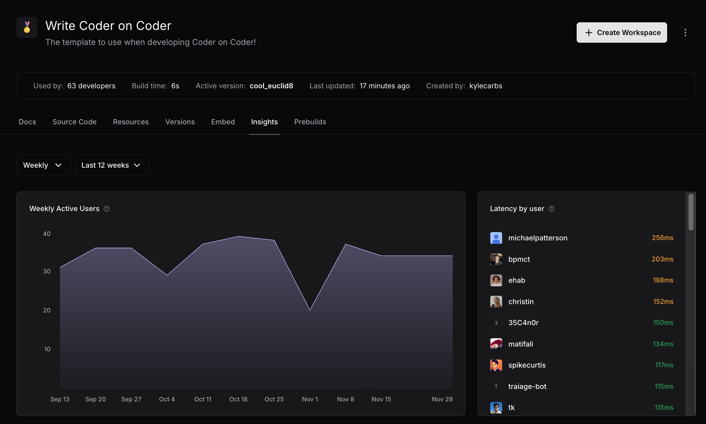
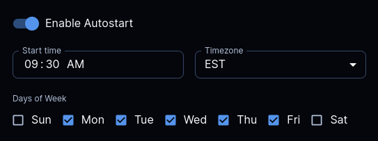

# Formatting

Coder documentation uses bold for UI elements, italics for emphasis, and code font for identifiers.
Code blocks declare a language.
The rules on this page set those defaults and the conventions for callouts, tabs, lists, tables, links, and images.

For descriptive link text and image alt text, refer to [Accessibility and inclusion](./accessibility-and-inclusion.md).
The accessibility-driven rules live on that page so heading structure, language, link text, and alt text stay together.

## One sentence per line

Write each sentence on its own Markdown source line.
Don't split a sentence across multiple lines, and don't wrap to a fixed column width.

The payoff is cleaner diffs and easier authoring.
A sentence-level edit changes one line, not a paragraph reflow, so reviewers see exactly which sentence moved.
The rule is straightforward to apply for both humans and LLMs: end a sentence, start a new line.

What counts as a single line:

- One declarative, interrogative, or imperative sentence ending in a period, question mark, or exclamation point.
- The full text of a single bullet item, numbered list entry, or blockquote line.

What doesn't get its own line:

- Mid-sentence clauses or phrases.
- Source inside fenced code blocks, where the language's own conventions apply.
- Table rows, which are governed by `markdown-table-formatter`.

**Do**:

> The Coder agent connects to the workspace, opens a Tailscale tunnel, and forwards SSH and IDE traffic over the tunnel.

**Don't** (mid-sentence clause breaks):

> The Coder agent connects to the workspace, opens a Tailscale tunnel, and forwards SSH and IDE traffic over the tunnel.

**Don't** (fixed column wrap):

> The Coder agent connects to the workspace, opens a Tailscale tunnel, and forwards SSH and IDE traffic over the tunnel.

Both **Don't** versions add noise to the source and produce diff churn on small edits.

`markdownlint`'s `MD013` (line length) is already disabled, so the convention is editorial.
Editors that auto-wrap on save should be configured to leave the source alone.

*Documentation-only.
No Vale rule.*

## Text formatting

The rules in this section cover inline formatting that lives inside a paragraph.

### Bold for UI elements

Use bold for the literal text of UI elements the reader interacts with: buttons, menu items, page titles, field labels, tab names.
Bold tells the reader "this is the thing you select or read".

When the reader navigates across multiple UI elements, join each element with a greater-than sign (`>`) surrounded by spaces.
The separator makes the navigation path scannable and matches the convention in Microsoft and Google developer documentation.

**Do**:

> Select **Templates** > **Settings** > **Schedule**.
>
> Navigate to **Workspaces** > **New workspace**.

**Don't**:

> Navigate to "Templates" > "Settings" and select the Schedule tab.
>
> Navigate to *Templates* > *Settings* and select the *Schedule* tab.
>
> Click **Templates**, then click **Settings**, then click **Schedule**.

*Documentation-only.
No Vale rule.*

### Italics for emphasis only

Reserve italics for genuine emphasis where bold would be too loud.
Do not use italics for UI elements, identifiers, or product names.

**Do**:

> Restarting the workspace deletes ephemeral state.
> Save your work *before* you select **Restart**.

**Don't**:

> Navigate to *Templates* > *Settings*.

*Documentation-only.
No Vale rule.*

### Code font

Use backticks (inline code font) for the following:

- User input.
- Command names and flag names.
- Filenames, file paths, and directory names.
- Environment variables.
- HTTP verbs and status codes.
- Configuration keys.
- Code identifiers (function names, struct names, package names).
- Placeholder variables.

**Do**:

> Run `coder login --token <token>` to authenticate.
> Set `CODER_URL` in your environment first.
>
> The server returns `404 Not Found` when the workspace doesn't exist.

**Don't**:

> Run "coder login --token \<token\>" to authenticate.
> Set CODER_URL in your environment first.
>
> The server returns 404 when the workspace doesn't exist.

*Documentation-only.
No Vale rule.*

## Block elements

The rules in this section cover block-level structures that stand on their own line or own region.

### Code blocks with language fences

Every fenced code block declares a language.
Use the most specific language tag available:

- `sh` for a shell command or a shell script.
  Use `sh` when the block is input the reader types or a script they save, and the block doesn't also show output.
- `console` for an interactive session that shows the typed command and its output together.
  Prefix each typed line with `$`.
- `powershell` for Windows command-line blocks.
  PowerShell is the default Windows shell in the Coder docs.
- `tf` for Terraform and HCL.
- `yaml` for YAML.
- `go` for Go.
- `json` for JSON.
- `text` for command output shown on its own, and for any block with no syntax to highlight.

`bash` and `shell` are aliases of `sh`.
Use `sh` so the corpus stays consistent.

A command with no output shown is `sh`, not `console`.
To show a command together with its output, either use one `console` block with `$` before the typed line, or split the command into an `sh` block and the output into a `text` block.

The auto-generated Coder CLI reference under `docs/reference/cli/` labels its command-usage blocks `console`.
That output is generated.
Do not copy the pattern into hand-written pages.

The docs site highlights code with [Speed-Highlight](https://github.com/speed-highlight/core), which detects the language from the code content, not from the fence label.
The fence label still drives highlighting on GitHub and in most editors, and `markdownlint` rule `MD040` requires one, so always declare the most specific language.
For content with no sensible language tag, fall back to `text`.

**Do**:

````markdown
```sh
coder templates push -d ~/coder-quickstart -y quickstart
```

```console
$ coder templates list NAME        LAST UPDATED quickstart  2 minutes ago
```
````

**Don't**:

````markdown
```
coder login --token <token>
```

```console
coder templates push -d ~/coder-quickstart -y quickstart
```
````

The first **Don't** omits the language.
The second labels a bare command `console` but shows no output, so `sh` is correct.

*Enforced by `markdownlint` rule `MD040` for the missing-language case.*

### Callouts

Use the GitHub callout syntax for asides.
Use them sparingly.
Prose should carry the message.

| Callout          | Use for                                                                                                              |
|------------------|----------------------------------------------------------------------------------------------------------------------|
| `> [!NOTE]`      | Supplementary context the reader benefits from but doesn't need to act on before proceeding                          |
| `> [!TIP]`       | An optional optimization, shortcut, or related feature                                                               |
| `> [!IMPORTANT]` | A required step or prerequisite the reader will miss if they skim                                                    |
| `> [!WARNING]`   | An action with a serious side effect (data loss, downtime, security exposure) that the reader must read before doing |
| `> [!CAUTION]`   | A severe or irreversible consequence; reserve for cases where `WARNING` isn't strong enough                          |

A follow-up PR will demonstrate each callout rendered against an existing docs page so reviewers can calibrate when each one fits.

*Documentation-only.
No Vale rule.*

### Tabs for parallel content

Use tabs when the reader picks one path that applies to their situation: installation methods on different operating systems, platform-specific commands, or API client SDKs in different languages.
Do not use tabs to hide information the reader needs regardless of choice.

The docs site renders a `<div class="tabs">` wrapper with H3 children as a tabbed interface.
The H3 heading text becomes the tab label, and everything from that H3 to the next H3 (or to the closing `</div>`) becomes the tab panel.

**Do**:

````markdown
<div class="tabs">

### macOS

```sh
brew install coder/coder/coder
```

### Linux

```sh
curl -L https://coder.com/install.sh | sh
```

### Windows

```powershell
winget install Coder.Coder
```

</div>
````

Leave a blank line after the opening `<div>` and before the closing `</div>` so the markdown processor parses the inner content as markdown rather than HTML.

*Documentation-only.
No Vale rule.*

### Lists

If a sentence enumerates more than five items, rewrite as a bulleted list.
A prose list of six or more items reads as a wall of commas.
A bulleted list is easier to scan and to maintain.

Unordered lists are for items that have no required order.
Ordered lists are for sequential steps the reader follows in order.
Steps in an ordered list start with an imperative verb.

Punctuation on list items follows the structure of each item:

- **Complete sentences**: end with a period.
- **Phrases that complete the lead-in clause from the preceding paragraph**: end with a period when the combined paragraph plus item reads as a sentence.
- **Single-word or short-phrase labels**: no terminal punctuation.

Do not mix the styles inside one list.
If one item is a complete sentence, rewrite the rest so every item is a complete sentence.

**Do**:

```markdown
1. Run `coder login` to authenticate.
2. Create the workspace template.
3. Build the workspace from the template.
```

```markdown
The provisioner supports:

- AWS
- Azure
- Google Cloud
```

```markdown
The agent reconnect logic uses the following timeouts:

- Initial reconnect: 1 second.
- Backoff factor: 2.
- Maximum delay: 30 seconds.
```

**Don't**:

```markdown
1. The user runs `coder login` to authenticate
2. Creating the workspace template comes next.
3. Then the workspace gets built from the template
```

```markdown
The provisioner supports:

- AWS.
- Azure
- Google Cloud.
```

The first **Don't** mixes punctuation styles and uses non-imperative leads.
The second mixes punctuation inside one list and uses periods on single-word labels.

For a "Learn more" or "See also" list of links, treat each item as a label: no terminal period, and no leading "And" or "Or".
When such a list needs a lead-in, end the lead-in with a colon on a clause that stands on its own, rather than dangling the colon off a sentence the bullets then finish.

**Do**:

```markdown
You have two options:

- Install the tool with `apt-get` in the template's startup script.
- Bake the tool into the workspace image.
```

```markdown
## Learn more

- [Extending templates](./extending-templates.md)
- [Terraform modules](https://developer.hashicorp.com/terraform/language/modules)
```

**Don't**:

```markdown
Install it where it persists across rebuilds:

- Add it to the template's startup script with `apt-get`.
- Or bake it into the workspace image.
```

The **Don't** dangles the colon off a sentence and starts a bullet with "Or".

*Documentation-only.
No Vale rule.*

### Tables

Use tables to compare options, list parameters, or show permissions.
Keep tables simple.
Avoid nested formatting and avoid tables that would read better as prose.

Keep tables narrow enough that they fit the readable text column without horizontal scrolling.
If a column needs more than a short phrase, rewrite the cell into the page body or break the table into two narrower tables.
A table that crushes column widths so words split across lines reads worse than the equivalent prose.

If a table needs many columns to capture the data, reconsider whether a table is the right structure.
A definition list or a sequence of subsections may serve the reader better.

*Documentation-only.
No Vale rule.*

### Links

Use Markdown link syntax (`[text](url)`).
Prefer relative paths within the docs (`../reference/cli/index.md`) over absolute URLs (`https://coder.com/docs/reference/cli`), so the link survives a future move of the docs site.

Links to non-docs locations in the Coder codebase (source files, CI workflows, tests) also use relative paths.
The docs site renderer resolves those paths to the canonical GitHub URLs automatically.
A relative link to [`scripts/develop.sh`](../../../scripts/develop.sh) reads correctly on GitHub when browsing the repo and on the docs site when reading the published page.

Anchor links to a specific section use the GitHub-flavored slug: lowercase the heading, replace spaces with hyphens, and drop punctuation (`./word-choice.md#refer-to-check-out-visit-not-see`).

External URLs use the full `https://` form.
Do not strip the protocol.

For the link-text rule that screen readers and reading-out-of-context demand, refer to [Descriptive link text](./accessibility-and-inclusion.md#descriptive-link-text).

*Documentation-only.
No Vale rule for the syntax conventions.*

### Images

Place image assets under the matching subdirectory of `docs/images/`.
Use lowercase filenames with hyphens between words (`template-insights-dashboard.png`).
Reference the asset with a relative path from the Markdown source.

Captions follow the image in a `<small>` tag.

```markdown


<small>The Template Insights dashboard with active-user and connection-latency widgets.</small>
```

For alt text and decorative-image conventions, refer to [Alt text for images](./accessibility-and-inclusion.md#alt-text-for-images) and [Decorative images](./accessibility-and-inclusion.md#decorative-images).

*Documentation-only for asset path conventions.
Alt-text requirement enforced by `markdownlint` rule `MD045`.*

### Screenshots sparingly

Use screenshots only when a sighted reader would be confused without the visual aid.
A worked example, a code block, or a precise written instruction is almost always better than a screenshot.

> If a picture is worth a thousand words, then a good example is worth at least twice that amount.
>
> Adapted from Lorna Jane Mitchell's [Short tech writing style guide for developers](https://lornajane.net/posts/2024/short-tech-writing-style-guide-for-developers).

Screenshots carry an ongoing maintenance burden.
The product UI changes, strings get renamed, themes get retuned, and a screenshot that was accurate at merge time silently rots.
Readers who hit a stale screenshot lose confidence in the page, and a reader using a screen reader can't use the screenshot at all.
The writer who adds a screenshot owns the cost of replacing it every time the captured surface changes.

When a screenshot is the right answer:

- Capture the minimum surface area.
  Crop to the smallest region that resolves the confusion the page is addressing.
- Provide alt text that conveys the purpose of the screenshot, per [Alt text for images](./accessibility-and-inclusion.md#alt-text-for-images).
- Pair the screenshot with the written instruction.
  The written instruction is the source of truth.
  The screenshot is a check on the reader's understanding, not a replacement for the words.

**Do**:

> Open the workspace settings page.
> Set **Autostart** to **Weekdays at 9 AM** and select **Save**.

**Don't**:

> 
>
> Configure autostart as shown in the screenshot.

The authoritative screenshot policy, including the obfuscation, PHI, and PII rules, lives in [`content-guidelines.md`](../content-guidelines.md).

*Documentation-only.
Enforcement is editorial.*

## Related

- [Style guide landing page](./README.md)
- [Accessibility and inclusion](./accessibility-and-inclusion.md)
- [Capitalization and punctuation](./capitalization-and-punctuation.md)
