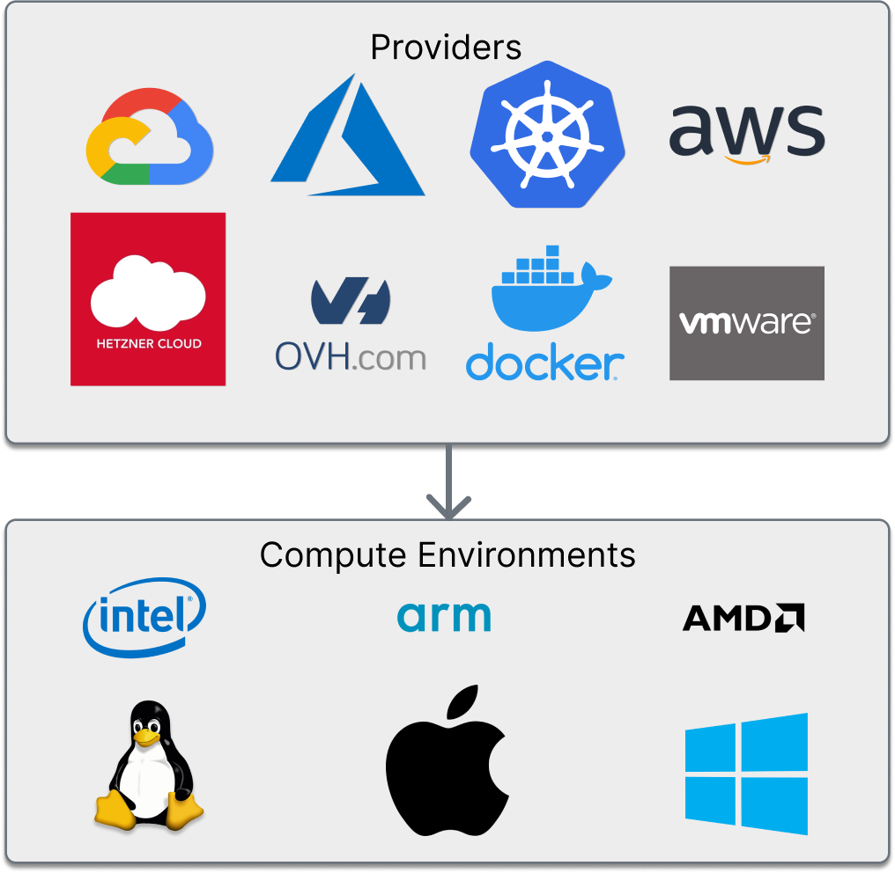
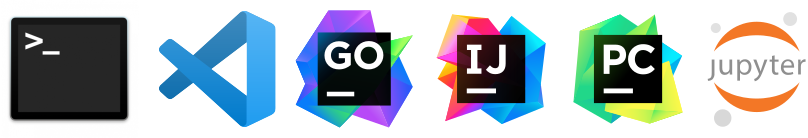

# About Coder

Coder is an open-source platform for creating and managing developer workspaces
on your preferred clouds and servers.

  

By building on top of common development interfaces (SSH) and infrastructure tools (Terraform), Coder aims to make the process of **provisioning** and **accessing** remote workspaces approachable for organizations of various sizes and stages of cloud-native maturity.

<blockquote class="warning">
  

  If you are a Coder v1 customer, view <a href="https://coder.com/docs/coder">the docs</a> or <a href="https://coder.com/docs/coder/latest/guides/v2-faq">the sunset plans</a>.
  

</blockquote>

## How it works

Coder workspaces are represented with Terraform, but no Terraform knowledge is
required to get started. We have a database of pre-made templates built into the
product.

  

Coder workspaces don't stop at compute. You can add storage buckets, secrets, sidecars
and whatever else Terraform lets you dream up.

[Learn more about managing infrastructure.](./templates/index.md)

## IDE Support

You can use any Web IDE ([code-server](https://github.com/coder/code-server), [projector](https://github.com/JetBrains/projector-server), [Jupyter](https://jupyter.org/), etc.), [JetBrains Gateway](https://www.jetbrains.com/remote-development/gateway/), [VS Code Remote](https://code.visualstudio.com/docs/remote/ssh-tutorial) or even a file sync such as [mutagen](https://mutagen.io/).

  

## Why remote development

Migrating from local developer machines to workspaces hosted by cloud services
is an [increasingly common solution for
developers](https://blog.alexellis.io/the-internet-is-my-computer/) and
[organizations
alike](https://slack.engineering/development-environments-at-slack). There are
several benefits, including:

- **Increased speed:** Server-grade compute speeds up operations in software
  development, such as IDE loading, code compilation and building, and the
  running of large workloads (such as those for monolith or microservice
  applications)

- **Easier environment management:** Tools such as Terraform, nix, Docker,
  devcontainers, and so on make developer onboarding and the troubleshooting of
  development environments easier

- **Increase security:** Centralize source code and other data onto private
  servers or cloud services instead of local developer machines

- **Improved compatibility:** Remote workspaces share infrastructure
  configuration with other development, staging, and production environments,
  reducing configuration drift

- **Improved accessibility:** Devices such as lightweight notebooks,
  Chromebooks, and iPads can connect to remote workspaces via browser-based IDEs
  or remote IDE extensions

## Why Coder

The key difference between Coder OSS and other remote IDE platforms is the added
layer of infrastructure control. This additional layer allows admins to:

- Support ARM, Windows, Linux, and macOS workspaces
- Modify pod/container specs (e.g., adding disks, managing network policies,
  setting/updating environment variables)
- Use VM/dedicated workspaces, developing with Kernel features (no container
  knowledge required)
- Enable persistent workspaces, which are like local machines, but faster and
  hosted by a cloud service

Coder includes [production-ready templates](https://github.com/coder/coder/tree/c6b1daabc5a7aa67bfbb6c89966d728919ba7f80/examples/templates) for use with AWS EC2,
Azure, Google Cloud, Kubernetes, and more.

## What Coder is _not_

- Coder is not an infrastructure as code (IaC) platform. Terraform is the first
  IaC _provisioner_ in Coder, allowing Coder admins to define Terraform
  resources as Coder workspaces.

- Coder is not a DevOps/CI platform. Coder workspaces can follow best practices
  for cloud service-based workloads, but Coder is not responsible for how you
  define or deploy the software you write.

- Coder is not an online IDE. Instead, Coder supports common editors, such as VS
  Code, vim, and JetBrains, over HTTPS or SSH.

- Coder is not a collaboration platform. You can use git and dedicated IDE
  extensions for pull requests, code reviews, and pair programming.

- Coder is not a SaaS/fully-managed offering. You must host
  Coder on a cloud service (AWS, Azure, GCP) or your private data center.

## Up next

- Learn about [Templates](./templates/index.md)
- [Install Coder](./install/index.md#install-coder)
