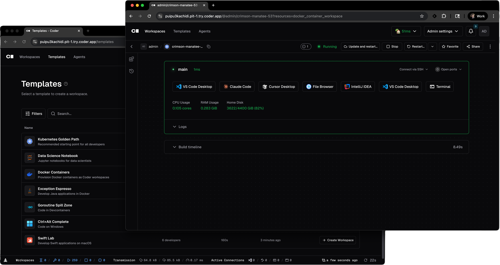
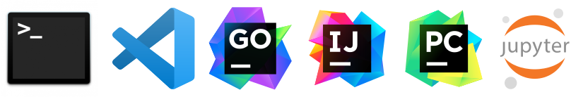
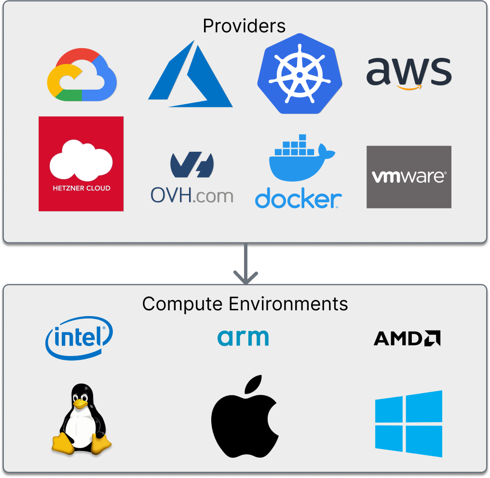

# About

<!-- Warning for docs contributors: The first route in manifest.json must be titled "About" for the static landing page to work correctly. -->

Coder is a self-hosted platform for running AI coding agents and cloud
development environments on infrastructure you control. It works with any
cloud, IDE, OS, Git provider, and IDP.

## Coder Workspaces

[Coder Workspaces](./user-guides/index.md) are cloud development environments
defined with Terraform, connected through a secure Wireguard tunnel, and
automatically shut down when not in use. Agents and developers share the same
workspace infrastructure.

- **Defined in Terraform**: Templates describe the infrastructure for each
  workspace, from EC2 VMs and Kubernetes Pods to Docker containers.
- **Any architecture and OS**: Support ARM and x86-64 across Windows, Linux,
  and macOS from a single deployment.
- **Managed by admins**: Platform teams create and maintain templates that
  enforce approved images, resource limits, and security policies.
- **Accessed from any IDE**: Connect through VS Code, JetBrains, Cursor,
  a web terminal, remote desktop, or SSH.
- **Automatic shutdown**: Idle workspaces stop automatically to reduce
  cloud spend, and restart in seconds when needed.

## Coder Agents

[Coder Agents](./ai-coder/agents/index.md) is a native AI coding agent built
into Coder. The agent loop runs in the Coder control plane on your
infrastructure, not in the workspace and not in a vendor's cloud. Developers
interact with agents through the web UI, the CLI (`coder agents`), or the REST
API for programmatic and CI-driven workflows.

- **Self-hosted agent loop**: The control plane handles planning, model
  calls, and tool dispatch. Workspaces have zero AI awareness.
- **No API keys in workspaces**: LLM credentials stay in the control plane.
- **Any model**: Anthropic, OpenAI, Google, Bedrock, or self-hosted
  endpoints. Switching is a configuration change.
- **Governance and cost controls**: Centralized model approval, per-user
  spend limits, and audit logging.
- **Open source and inspectable**: The full platform is available to audit
  and extend.

## IDE support

You can use:

- Any Web IDE, such as

  - [code-server](https://github.com/coder/code-server)
  - [JetBrains Projector](https://github.com/JetBrains/projector-server)
  - [Jupyter](https://jupyter.org/)
  - And others

- Your existing remote development environment:

  - [JetBrains Gateway](https://www.jetbrains.com/remote-development/gateway/)
  - [VS Code Remote](https://code.visualstudio.com/docs/remote/ssh-tutorial)
  - [Emacs](./user-guides/workspace-access/emacs-tramp.md)

- A file sync such as [Mutagen](https://mutagen.io/)

## Why remote development

Provisioning consistent development environments for a large engineering team
is difficult. Each developer has preferences for operating systems, editors,
and toolchains, and ensuring a reliable build environment across all of them
is a maintenance burden. A missed step during onboarding or an unsupported
local configuration can cost hours of debugging.

Remote development solves this by moving the environment off the developer's
machine and into managed infrastructure. The developer's laptop becomes a
portal into the actual compute where work happens. If a device is lost or
replaced, access is simply revoked; no source code or credentials are stored
locally.

This approach provides:

- **Speed**: Server-grade hardware accelerates builds, tests, and large
  workloads without requiring expensive local machines.
- **Consistency**: Infrastructure tools such as Terraform, nix, Docker, and
  Dev Containers produce identical environments for every developer.
- **Security**: Source code stays on private servers. Users and groups are
  managed through [SSO](./admin/users/oidc-auth/index.md) and
  [RBAC](./admin/users/groups-roles.md#roles).
- **Compatibility**: Workspaces share infrastructure configurations with
  staging and production, reducing configuration drift.
- **Accessibility**: Browser-based IDEs and remote IDE extensions let
  developers work from any device, including lightweight laptops,
  Chromebooks, and tablets.

Read more on the [Coder blog](https://coder.com/blog), the
[Slack engineering blog](https://slack.engineering/development-environments-at-slack),
or from [Alex Ellis at OpenFaaS](https://blog.alexellis.io/the-internet-is-my-computer/).

## Why Coder

The key difference between Coder and other platforms is that the entire system,
agent loop, control plane, model routing, and workspace provisioning, runs on
infrastructure you control.

For agents, this means platform teams can:

- Run the entire agent loop on their infrastructure, with no SaaS
  dependency for orchestration.
- Define MCP servers, skills, and system prompts centrally so every agent
  session starts with the same tools, policies, and context.
- Keep LLM credentials out of workspaces entirely.
- Tie every agent action to an authenticated user identity.
- Support air-gapped and restricted-network deployments with self-hosted models.

For workspaces, this means admins can:

- Support any architecture (ARM, x86-64) and operating system
  (Windows, Linux, macOS).
- Modify pod/container specs, such as adding disks, managing network policies, or
  setting/updating environment variables.
- Use VM or dedicated workspaces, developing with Kernel features (no container
  knowledge required).
- Enable persistent workspaces, which are like local machines, but faster and
  hosted by a cloud service.

## Pricing

Coder is free and open source under the
[GNU Affero General Public License v3.0](https://github.com/coder/coder/blob/main/LICENSE).
All developer productivity features are included in the open source version.
A [Premium license](https://coder.com/pricing#compare-plans) is available for
enhanced support and custom deployments.

## How Coder works

Coder workspaces are represented with Terraform, but you do not need to know
Terraform to get started. The
[Coder Registry](https://registry.coder.com/templates) provides production-ready
templates for AWS EC2, Azure, Google Cloud, Kubernetes, and other providers.

_Providers and compute environments_

Workspaces can include more than just compute. Terraform can add storage
buckets, secrets, sidecars, and
[other resources](https://developer.hashicorp.com/terraform/tutorials).

See the [templates documentation](./admin/templates/index.md) for details.

## What Coder is not

- Coder is not an infrastructure as code (IaC) platform.

  - Terraform is the first IaC _provisioner_ in Coder, allowing Coder admins to
    define Terraform resources as Coder workspaces.

- Coder is not a DevOps/CI platform.

  - Coder workspaces can be configured to follow best practices for
    cloud-service-based workloads, but Coder is not responsible for how you
    define or deploy the software you write.

- Coder is not an online IDE.

  - Coder supports common editors, such as VS Code, vim, and JetBrains,
    all over HTTPS or SSH.

- Coder is not a collaboration platform.

  - You can use Git with your favorite Git platform and dedicated IDE
    extensions for pull requests, code reviews, and pair programming.

- Coder is not a SaaS/fully-managed offering.
  - Coder is a [self-hosted](<https://en.wikipedia.org/wiki/Self-hosting_(web_services)>)
    solution.
    You must host Coder in a private data center or on a cloud service, such as
    AWS, Azure, or GCP.

## Learn more

- [Coder Agents](./ai-coder/agents/index.md)
- [Templates](./admin/templates/index.md)
- [Installing Coder](./install/index.md)
- [Quickstart tutorial](./tutorials/quickstart.md)
