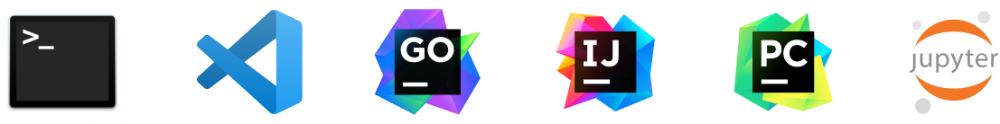
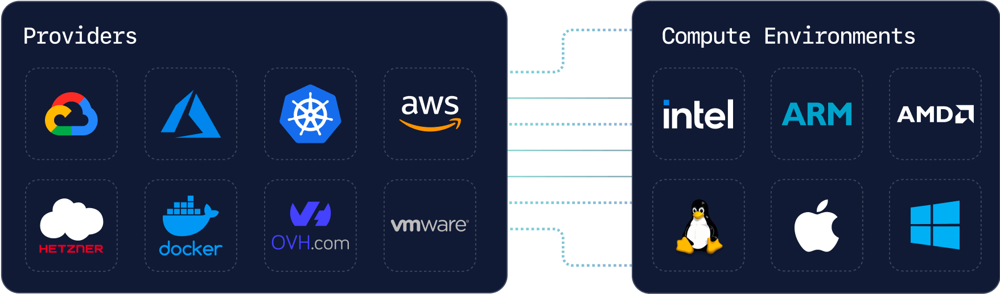

# About

<!-- Warning for docs contributors: The first route in manifest.json must be titled "About" for the static landing page to work correctly. -->

Coder is a self-hosted, open source, cloud development environment that works
with any cloud, IDE, OS, Git provider, and IDP.

_Screenshots of Coder workspaces and connections_

Coder is built on common development interfaces and infrastructure tools to
make the process of provisioning and accessing remote workspaces approachable
for organizations of various sizes and stages of cloud-native maturity.

## IDE support

You can use:

- Any Web IDE, such as

  - [code-server](https://github.com/coder/code-server)
  - [JetBrains Projector](https://github.com/JetBrains/projector-server)
  - [Jupyter](https://jupyter.org/)
  - And others

- Your existing remote development environment:

  - [JetBrains Gateway](https://www.jetbrains.com/remote-development/gateway/)
  - [VS Code Remote](https://code.visualstudio.com/docs/remote/ssh-tutorial)
  - [Emacs](./user-guides/workspace-access/emacs-tramp.md)

- A file sync such as [Mutagen](https://mutagen.io/)

## Why remote development

Remote development offers several benefits for users and administrators, including:

- **Increased speed**

  - Server-grade cloud hardware speeds up operations in software development, from
    loading the IDE to compiling and building code, and running large workloads
    such as those for monolith or microservice applications.

- **Easier environment management**

  - Built-in infrastructure tools such as Terraform, nix, Docker, Dev Containers, and others make it easier to onboard developers with consistent environments.

- **Increased security**

  - Centralize source code and other data onto private servers or cloud services instead of local developers' machines.
  - Manage users and groups with [SSO](./admin/users/oidc-auth.md) and [Role-based access controlled (RBAC)](./admin/users/groups-roles.md#roles).

- **Improved compatibility**

  - Remote workspaces can share infrastructure configurations with other
    development, staging, and production environments, reducing configuration
    drift.

- **Improved accessibility**
  - Connect to remote workspaces via browser-based IDEs or remote IDE
    extensions to enable developers regardless of the device they use, whether
    it's their main device, a lightweight laptop, Chromebook, or iPad.

Read more about why organizations and engineers are moving to remote
development on [our blog](https://coder.com/blog), the
[Slack engineering blog](https://slack.engineering/development-environments-at-slack),
or from [OpenFaaS's Alex Ellis](https://blog.alexellis.io/the-internet-is-my-computer/).

## Why Coder

The key difference between Coder and other remote IDE platforms is the added
layer of infrastructure control.
This additional layer allows admins to:

- Simultaneously support ARM, Windows, Linux, and macOS workspaces.
- Modify pod/container specs, such as adding disks, managing network policies, or
  setting/updating environment variables.
- Use VM or dedicated workspaces, developing with Kernel features (no container
  knowledge required).
- Enable persistent workspaces, which are like local machines, but faster and
  hosted by a cloud service.

## How much does it cost?

Coder is free and open source under
[GNU Affero General Public License v3.0](https://github.com/coder/coder/blob/main/LICENSE).
All developer productivity features are included in the Open Source version of
Coder.
A [Premium license is available](https://coder.com/pricing#compare-plans) for enhanced
support options and custom deployments.

## How does Coder work

Coder workspaces are represented with Terraform, but you don't need to know
Terraform to get started.
We have a [database of production-ready templates](https://registry.coder.com/templates)
for use with AWS EC2, Azure, Google Cloud, Kubernetes, and more.

_Providers and compute environments_

Coder workspaces can be used for more than just compute.
You can use Terraform to add storage buckets, secrets, sidecars,
[and more](https://developer.hashicorp.com/terraform/tutorials).

Visit the [templates documentation](./admin/templates/index.md) to learn more.

## What Coder is not

- Coder is not an infrastructure as code (IaC) platform.

  - Terraform is the first IaC _provisioner_ in Coder, allowing Coder admins to
    define Terraform resources as Coder workspaces.

- Coder is not a DevOps/CI platform.

  - Coder workspaces can be configured to follow best practices for
    cloud-service-based workloads, but Coder is not responsible for how you
    define or deploy the software you write.

- Coder is not an online IDE.

  - Coder supports common editors, such as VS Code, vim, and JetBrains,
    all over HTTPS or SSH.

- Coder is not a collaboration platform.

  - You can use Git with your favorite Git platform and dedicated IDE
    extensions for pull requests, code reviews, and pair programming.

- Coder is not a SaaS/fully-managed offering.
  - Coder is a [self-hosted](<https://en.wikipedia.org/wiki/Self-hosting_(web_services)>)
    solution.
    You must host Coder in a private data center or on a cloud service, such as
    AWS, Azure, or GCP.

## Using Coder v1?

If you're a Coder v1 customer, view [the v1 documentation](https://coder.com/docs/v1)
or [the v2 migration guide and FAQ](https://coder.com/docs/v1/guides/v2-faq).

## Up next

- [Template](./admin/templates/index.md)
- [Installing Coder](./install/index.md)
- [Quickstart](./tutorials/quickstart.md) to try Coder out for yourself.
# Test heading
