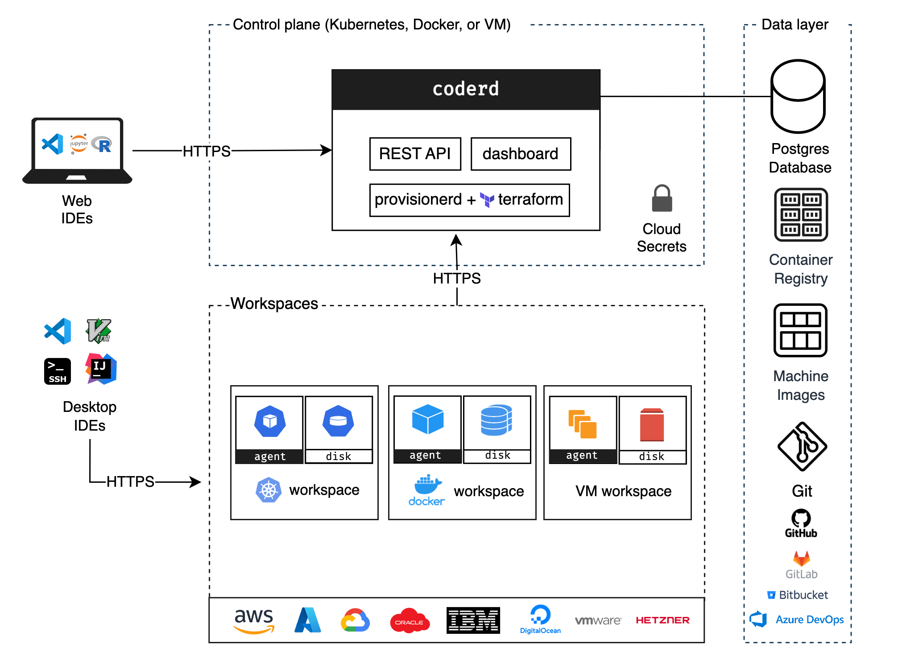

# Architecture

This document provides a high level overview of Coder's architecture.

## Diagram

## coderd

coderd is the service created by running `coder server`. It is a thin API that
connects workspaces, provisioners and users. coderd stores its state in Postgres
and is the only service that communicates with Postgres.

It offers:

- Dashboard (UI)
- HTTP API
- Dev URLs (HTTP reverse proxy to workspaces)
- Workspace Web Applications (e.g easily access code-server)
- Agent registration

## provisionerd

provisionerd is the execution context for infrastructure modifying providers. At
the moment, the only provider is Terraform (running `terraform`).

By default, the Coder server runs multiple provisioner daemons.
[External provisioners](../admin/provisioners.md) can be added for security or
scalability purposes.

## Agents

An agent is the Coder service that runs within a user's remote workspace. It
provides a consistent interface for coderd and clients to communicate with
workspaces regardless of operating system, architecture, or cloud.

It offers the following services along with much more:

- SSH
- Port forwarding
- Liveness checks
- `startup_script` automation

Templates are responsible for
[creating and running agents](../templates/index.md#coder-agent) within
workspaces.

## Service Bundling

While coderd and Postgres can be orchestrated independently, our default
installation paths bundle them all together into one system service. It's
perfectly fine to run a production deployment this way, but there are certain
situations that necessitate decomposition:

- Reducing global client latency (distribute coderd and centralize database)
- Achieving greater availability and efficiency (horizontally scale individual
  services)

## Workspaces

At the highest level, a workspace is a set of cloud resources. These resources
can be VMs, Kubernetes clusters, storage buckets, or whatever else Terraform
lets you dream up.

The resources that run the agent are described as _computational resources_,
while those that don't are called _peripheral resources_.

Each resource may also be _persistent_ or _ephemeral_ depending on whether
they're destroyed on workspace stop.
