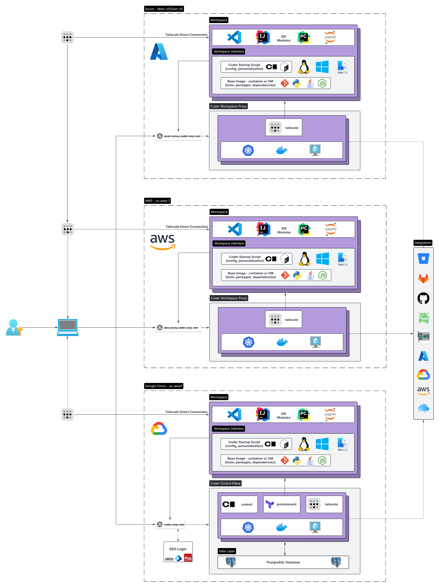
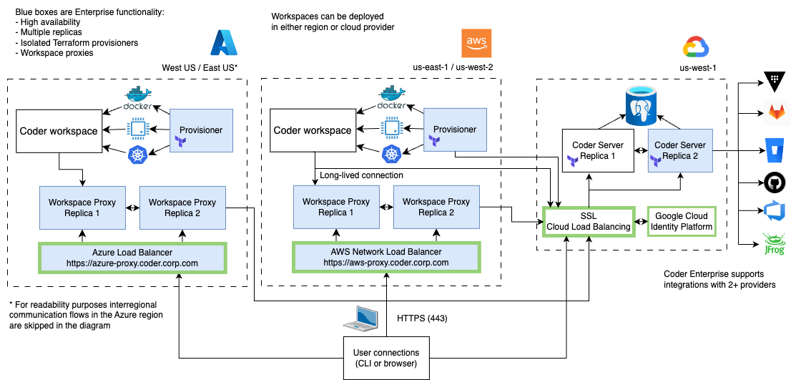

# Architecture

The Coder deployment model is flexible and offers various components that
platform administrators can deploy and scale depending on their use case. This
page describes possible deployments, challenges, and risks associated with them.

Learn more about our [Reference Architectures](../admin/architectures/index.md)
and platform scaling capabilities.

## Primary components

### coderd

_coderd_ is the service created by running `coder server`. It is a thin API that
connects workspaces, provisioners and users. _coderd_ stores its state in
Postgres and is the only service that communicates with Postgres.

It offers:

- Dashboard (UI)
- HTTP API
- Dev URLs (HTTP reverse proxy to workspaces)
- Workspace Web Applications (e.g for easy access to `code-server`)
- Agent registration

### provisionerd

_provisionerd_ is the execution context for infrastructure modifying providers.
At the moment, the only provider is Terraform (running `terraform`).

By default, the Coder server runs multiple provisioner daemons.
[External provisioners](../admin/provisioners.md) can be added for security or
scalability purposes.

### Agents

An agent is the Coder service that runs within a user's remote workspace. It
provides a consistent interface for coderd and clients to communicate with
workspaces regardless of operating system, architecture, or cloud.

It offers the following services along with much more:

- SSH
- Port forwarding
- Liveness checks
- `startup_script` automation

Templates are responsible for
[creating and running agents](../templates/index.md#coder-agent) within
workspaces.

### Service Bundling

While _coderd_ and Postgres can be orchestrated independently, our default
installation paths bundle them all together into one system service. It's
perfectly fine to run a production deployment this way, but there are certain
situations that necessitate decomposition:

- Reducing global client latency (distribute coderd and centralize database)
- Achieving greater availability and efficiency (horizontally scale individual
  services)

### Workspaces

At the highest level, a workspace is a set of cloud resources. These resources
can be VMs, Kubernetes clusters, storage buckets, or whatever else Terraform
lets you dream up.

The resources that run the agent are described as _computational resources_,
while those that don't are called _peripheral resources_.

Each resource may also be _persistent_ or _ephemeral_ depending on whether
they're destroyed on workspace stop.

## Deployment models

### Single region architecture

#### Components

This architecture consists of a single load balancer, several _coderd_ replicas,
and _Coder workspaces_ deployed in the same region.

##### Workload resources

- Deploy at least one _coderd_ replica per availability zone with _coderd_
  instances and provisioners. High availability is recommended but not essential
  for small deployments.
- Single replica deployment is a special case that can address a
  tiny/small/proof-of-concept installation on a single virtual machine. If you
  are serving more than 100 users/workspaces, you should add more replicas.

**Coder workspace**

- For small deployments consider a lightweight workspace runtime like the
  [Sysbox](https://github.com/nestybox/sysbox) container runtime. Learn more how
  to enable
  [docker-in-docker using Sysbox](https://asciinema.org/a/kkTmOxl8DhEZiM2fLZNFlYzbo?speed=2).

**HA Database**

- Monitor node status and resource utilization metrics.
- Implement robust backup and disaster recovery strategies to protect against
  data loss.

##### Workload supporting resources

**Load balancer**

- Distributes and load balances traffic from agents and clients to _Coder
  Server_ replicas across availability zones.
- Layer 7 load balancing. The load balancer can decrypt SSL traffic, and
  re-encrypt using an internal certificate.
- Session persistence (sticky sessions) can be disabled as _coderd_ instances
  are stateless.
- WebSocket and long-lived connections must be supported.

**Single sign-on**

- Integrate with existing Single Sign-On (SSO) solutions used within the
  organization via the supported OAuth 2.0 or OpenID Connect standards.
- Learn more about [Authentication in Coder](../admin/auth.md).

### Multi-region architecture

#### Components

This architecture is for globally distributed developer teams using Coder
workspaces on daily basis. It features a single load balancer with regionally
deployed _Workspace Proxies_, several _coderd_ replicas, and _Coder workspaces_
provisioned in different regions.

Note: The _multi-region architecture_ assumes the same deployment principles as
the _single region architecture_, but it extends them to multi region deployment
with workspace proxies. Proxies are deployed in regions closest to developers to
offer the fastest developer experience.

##### Workload resources

**Workspace proxy**

- Workspace proxy offers developers the option to establish a fast relay
  connection when accessing their workspace via SSH, a workspace application, or
  port forwarding.
- Dashboard connections, API calls (e.g. _list workspaces_) are not served over
  proxies.
- Proxies do not establish connections to the database.
- Proxy instances do not share authentication tokens between one another.

##### Workload supporting resources

**Proxy load balancer**

- Distributes and load balances workspace relay traffic in a single region
  across availability zones.
- Layer 7 load balancing. The load balancer can decrypt SSL traffic, and
  re-encrypt using internal certificate.
- Session persistence (sticky sessions) can be disabled as _coderd_ instances
  are stateless.
- WebSocket and long-lived connections must be supported.

### Multi-cloud architecture

By distributing Coder workspaces across different cloud providers, organizations
can mitigate the risk of downtime caused by provider-specific outages or
disruptions. Additionally, multi-cloud deployment enables organizations to
leverage the unique features and capabilities offered by each cloud provider,
such as region availability and pricing models.

#### Components

The deployment model comprises:

- `coderd` instances deployed within a single region of the same cloud provider,
  with replicas strategically distributed across availability zones.
- Workspace provisioners deployed in each cloud, communicating with `coderd`
  instances.
- Workspace proxies running in the same locations as provisioners to optimize
  user connections to workspaces for maximum speed.

Due to the relatively large overhead of cross-regional communication, it is not
advised to set up multi-cloud control planes. It is recommended to keep coderd
replicas and the database within the same cloud-provider and region.

Note: The _multi-cloud architecture_ follows the deployment principles outlined
in the _multi-region architecture_. However, it adapts component selection based
on the specific cloud provider. Developers can initiate workspaces based on the
nearest region and technical specifications provided by the cloud providers.

##### Workload resources

**Workspace provisioner**

- _Security recommendation_: Create a long, random pre-shared key (PSK) and add
  it to the regional secret store, so that local _provisionerd_ can access it.
  Remember to distribute it using safe, encrypted communication channel. The PSK
  must also be added to the _coderd_ configuration.

**Workspace proxy**

- _Security recommendation_: Use `coder` CLI to create
  [authentication tokens for every workspace proxy](../admin/workspace-proxies.md#requirements),
  and keep them in regional secret stores. Remember to distribute them using
  safe, encrypted communication channel.

**Managed database**

- For AWS: _Amazon RDS for PostgreSQL_
- For Azure: _Azure Database for PostgreSQL - Flexible Server_
- For GCP: _Cloud SQL for PostgreSQL_

##### Workload supporting resources

**Kubernetes platform (optional)**

- For AWS: _Amazon Elastic Kubernetes Service_
- For Azure: _Azure Kubernetes Service_
- For GCP: _Google Kubernetes Engine_

See how to deploy
[Coder on Azure Kubernetes Service](https://github.com/ericpaulsen/coder-aks).

Learn more about [security requirements](../install/kubernetes.md) for deploying
Coder on Kubernetes.

**Load balancer**

- For AWS:
  - _AWS Network Load Balancer_
    - Level 4 load balancing
    - For Kubernetes deployment: annotate service with
      `service.beta.kubernetes.io/aws-load-balancer-type: "nlb"`, preserve the
      client source IP with `externalTrafficPolicy: Local`
  - _AWS Classic Load Balancer_
    - Level 7 load balancing
    - For Kubernetes deployment: set `sessionAffinity` to `None`
- For Azure:
  - _Azure Load Balancer_
    - Level 7 load balancing
  - Azure Application Gateway
    - Deploy Azure Application Gateway when more advanced traffic routing
      policies are needed for Kubernetes applications.
    - Take advantage of features such as WebSocket support and TLS termination
      provided by Azure Application Gateway, enhancing the capabilities of
      Kubernetes deployments on Azure.
- For GCP:
  - _Cloud Load Balancing_ with SSL load balancer:
    - Layer 4 load balancing, SSL enabled
  - _Cloud Load Balancing_ with HTTPS load balancer:
    - Layer 7 load balancing
    - For Kubernetes deployment: annotate service (with ingress enabled) with
      `kubernetes.io/ingress.class: "gce"`, leverage the `NodePort` service
      type.
    - Note: HTTP load balancer rejects DERP upgrade, Coder will fallback to
      WebSockets

**Single sign-on**

- For AWS:
  [AWS IAM Identity Center](https://docs.aws.amazon.com/singlesignon/latest/userguide/what-is.html)
- For Azure:
  [Microsoft Entra ID Sign-On](https://learn.microsoft.com/en-us/entra/identity/app-proxy/)
- For GCP:
  [Google Cloud Identity Platform](https://cloud.google.com/architecture/identity/single-sign-on)
