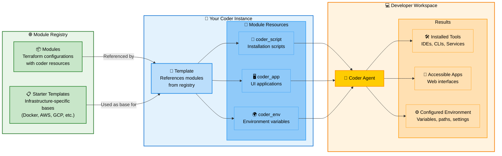

# Coder modules

Coder modules are reusable Terraform configurations that extend workspace functionality through the Coder Terraform provider. This guide focuses on understanding and creating effective modules.

## Architecture Overview

Understanding how modules fit into the Coder ecosystem:



**How Modules Work in the Coder Ecosystem:**

1. **Module Registry**: External registry hosts reusable modules and starter templates
   - Modules are Terraform configurations using Coder-specific resources
   - Starter templates provide infrastructure-specific bases (Docker, AWS, GCP, etc.) to start building your own templates
   - Community and official modules available at [registry.coder.com](https://registry.coder.com)

2. **Template Development**: Your Coder templates reference modules from the registry
   - Use starter templates as infrastructure-specific starting points for your own templates
   - Reference individual modules to add functionality to your templates
   - Modules add `coder_script`, `coder_app`, and `coder_env` resources to templates

3. **Workspace Execution**: When workspaces are created, modules run through the Coder agent
   - **Scripts** install and configure tools (IDEs, languages, services)
   - **Apps** provide web interfaces accessible through Coder dashboard  
   - **Environment** sets up variables, paths, and development settings

**Example Flow**: A template references the `code-server` module → Module adds a `coder_script` to install VS Code and a `coder_app` for browser access → Agent executes the script and serves the app → Developer gets VS Code in their workspace

## Module Integration

```tf
module "example" {
  source   = "registry.coder.com/modules/example/coder"
  version  = "1.0.0"
  agent_id = coder_agent.main.id
}
```

Browse available modules at [registry.coder.com](https://registry.coder.com).

## Module Structure

Every module consists of exactly four files:

```
module-name/
├── main.tf          # Terraform configuration with Coder resources
├── main.test.ts     # Test suite
├── README.md        # Documentation with frontmatter
└── run.sh           # Installation script
```

### File Purposes

- **`main.tf`**: Primary Terraform configuration defining Coder resources
- **`main.test.ts`**: Test suite validating module functionality
- **`README.md`**: Documentation with required frontmatter and usage examples
- **`run.sh`**: Shell script for software installation and configuration

## Understanding Coder Resources

The Coder Terraform provider offers several resource types for different aspects of workspace functionality. Understanding when and how to use each resource is crucial for effective module development.

### Coder Resources

#### coder_script - Command Execution

Execute commands during workspace lifecycle events. This is the primary mechanism for software installation, service configuration, and environment setup.

**When to use**:
- Installing software packages, binaries, or development tools
- Configuring services and generating configuration files
- Setting up directories, permissions, and initial workspace state
- Running background services or daemons

**Key properties**:
- `agent_id`: The Coder agent to execute the script on
- `display_name`: Name shown in the Coder dashboard during execution
- `run_on_start`: Execute when workspace starts (most common)
- `run_on_stop`: Execute during workspace shutdown for cleanup
- `script`: The actual shell script content to execute
- `start_blocks_login`: Whether script completion is required before user access

Example:
```tf
resource "coder_script" "install" {
  agent_id          = var.agent_id
  display_name      = "Install Tool"
  script            = templatefile("${path.module}/run.sh", {
    VERSION = var.version
    ARCH    = data.coder_provisioner.me.arch
  })
  run_on_start      = true
  start_blocks_login = true
}
```

#### coder_app - User Interface

Create accessible applications in the Coder workspace interface, providing users with one-click access to tools and services.

**When to use**:
- Exposing web-based development tools (IDEs, dashboards)
- Creating links to desktop applications via custom protocols
- Providing access to running services

**Key properties**:
- `agent_id`: The Coder agent
- `external`: `true` for protocol handlers, `false` for web apps
- `healthcheck`: Monitor service availability
- `subdomain`: Access method for web apps
- `url`: Service URL or protocol handler

Example:
```tf
resource "coder_app" "service" {
  agent_id = var.agent_id
  slug     = "service"
  url      = "http://localhost:${var.port}"
  
  healthcheck {
    url       = "http://localhost:${var.port}/health"
    interval  = 5
    threshold = 6
  }
}
```

#### coder_env - Environment Variables

Set environment variables in workspace sessions for tool configuration and authentication.

**When to use**:
- Configuring development tools and CLIs
- Providing authentication tokens
- Setting service endpoints

Example:
```tf
resource "coder_env" "config" {
  agent_id = var.agent_id
  name     = "TOOL_CONFIG"
  value    = jsonencode(var.config)
}
```

#### Data Sources

Access workspace context through Coder data sources:

```tf
data "coder_provisioner" "me" {}
# Provides: arch, os for platform-specific logic

data "coder_workspace" "me" {}
# Provides: name, id, access_url, start_count

data "coder_workspace_owner" "me" {}
# Provides: name, email, full_name
```

### Variable Design

**Required Variables**:
```tf
variable "agent_id" {
  type        = string
  description = "The ID of a Coder agent."
  # No default - always required
}
```

**Optional Variables with Validation**:
```tf
variable "version" {
  type        = string
  description = "Software version to install."
  default     = "latest"
  validation {
    condition     = can(regex("^(latest|[0-9]+\\.[0-9]+\\.[0-9]+)$", var.version))
    error_message = "Version must be 'latest' or semantic version (e.g., 1.2.3)."
  }
}
```

**Complex Configuration Objects**:
```tf
variable "service_config" {
  type = object({
    port         = optional(number, 8080)
    enable_ssl   = optional(bool, false)
    log_level    = optional(string, "info")
    features     = optional(list(string), [])
  })
  description = "Service configuration options."
  default     = {}
}
```

**Sensitive Variables**:
```tf
variable "api_key" {
  type        = string
  description = "API key for service authentication."
  default     = ""
  sensitive   = true
}
```

### Script Development

**Template-driven scripts** pass variables to your `run.sh`:
```tf
resource "coder_script" "install" {
  agent_id = var.agent_id
  script = templatefile("${path.module}/run.sh", {
    VERSION     = var.version
    ARCH        = data.coder_provisioner.me.arch
    CONFIG      = jsonencode(var.config)
    WORKSPACE   = data.coder_workspace.me.name
    USER_EMAIL  = data.coder_workspace_owner.me.email
  })
}
```

**Error handling** in your shell scripts:
```bash
#!/bin/bash
set -euo pipefail

# Platform detection
case "${ARCH}" in
  "amd64") ARCH_SUFFIX="" ;;
  "arm64") ARCH_SUFFIX="-arm64" ;;
  *) echo "ERROR: Unsupported architecture: ${ARCH}"; exit 1 ;;
esac

# Tool installation with error checking
if ! command -v tool &> /dev/null; then
    echo "Installing tool..."
    # Installation commands
fi
```

### Integration Patterns

**Conditional resources** using `start_count`:
```tf
resource "coder_app" "service" {
  count    = data.coder_workspace.me.start_count
  agent_id = var.agent_id
  # Only created when workspace is running
}
```

**Multi-step installation** with dependencies:
```tf
resource "coder_script" "install_deps" {
  agent_id = var.agent_id
  script   = "install_dependencies.sh"
  order    = 1
}

resource "coder_script" "configure_service" {
  agent_id   = var.agent_id
  script     = "configure_service.sh"
  depends_on = [coder_script.install_deps]
  order      = 2
}
```

**Health checks** for web services:
```tf
resource "coder_app" "service" {
  agent_id = var.agent_id
  url      = "http://localhost:${var.port}"
  
  healthcheck {
    url       = "http://localhost:${var.port}/health"
    interval  = 5
    threshold = 6
  }
}
```

## Testing and Documentation

### Module Testing

While not mandatory, **tests are recommended** for all modules. A `main.test.ts` file validates that the module works correctly. Tests use **Bun** as the test runner and verify that:

- **Custom configurations** work with different variable values
- **Default configuration** creates expected resources
- **Input validation** catches invalid parameters
- **Required variables** are properly validated

The test framework provides utilities from `~test` import to:
- Initialize Terraform in the module directory
- Apply Terraform with test variables
- Validate the resulting infrastructure state
- Test error conditions and edge cases

Tests run in Docker with `--network=host` capabilities and help ensure module quality and reliability.

### Documentation Requirements

Every module requires a `README.md` with YAML frontmatter containing metadata like display name, description, icon, maintainer, and tags. The README must include:

- **Purpose and functionality** - What the module does and when to use it
- **Variable documentation** - All input variables with types, defaults, and descriptions  
- **Resource listing** - What Coder resources the module creates
- **Usage examples** - Basic and advanced configuration examples
- **Requirements** - Any prerequisites or dependencies

The documentation format is validated automatically and must pass validation before modules can be accepted. See the [Registry Contributing Guide](https://github.com/coder/registry/blob/main/CONTRIBUTING.md) for detailed formatting requirements and examples.

## Common Use Case Patterns

### External IDE Integration

**Browser-based IDE Pattern**: Install web-based development environment with health monitoring and configuration management.

**Desktop IDE Pattern**: Provide protocol-based integration for native applications with backend service management.

**Editor Extension Pattern**: Configure existing editors with workspace-specific settings and extensions.

### Authentication and Secrets

**OAuth Integration Pattern**: Handle external authentication flows with token management and service configuration.

**API Key Management Pattern**: Securely distribute credentials and configure authenticated tools.

**Certificate Management Pattern**: Handle SSL certificates and secure communication setup.

### Development Environment Setup

**Language Runtime Pattern**: Install and configure programming language environments with package managers.

**Database Service Pattern**: Deploy and configure database services with connection management.

**Configuration Management Pattern**: Apply dotfiles, settings, and workspace personalization.

## Contributing to the Registry

The [Coder Registry](https://github.com/coder/registry) hosts all community and official modules. For detailed contribution guidelines, code standards, and submission processes, refer to the [Registry Contributing Guide](https://github.com/coder/registry/blob/main/CONTRIBUTING.md).

**Quick contribution steps**:

1. Fork the [registry repository](https://github.com/coder/registry)
2. Follow the [registry contribution guidelines](https://github.com/coder/registry/blob/main/CONTRIBUTING.md) for module creation process
3. Implement tests: `bun test`
4. Format code: `bun run fmt`
5. Validate documentation: `bun run readme-validate`
6. Submit pull request with detailed description

**Important**: The registry repository contains specific requirements for module structure, testing, documentation format, and submission process. Always consult the [official contributing documentation](https://github.com/coder/registry/blob/main/CONTRIBUTING.md) for the most current guidelines.

## Next Steps

- Explore [registry.coder.com](https://registry.coder.com) for existing modules
- Review [Coder Terraform provider documentation](https://registry.terraform.io/providers/coder/coder/latest/docs)
- Study [existing module implementations](https://github.com/coder/registry/tree/main/registry/coder/modules)
- Join the [Coder community](https://discord.gg/coder) for support and collaboration
