# Coder modules

Coder modules are reusable [Terraform configurations](https://developer.hashicorp.com/terraform/language) that extend workspace functionality through the Coder Terraform provider. This guide focuses on understanding and creating effective modules.

## Prerequisites

This guide assumes basic familiarity with Terraform concepts. If you're new to Terraform, we recommend reviewing these resources first:

- **[What is Terraform?](https://developer.hashicorp.com/terraform/intro)** - Introduction to infrastructure as code
- **[Terraform Configuration Language](https://developer.hashicorp.com/terraform/language)** - Learn the HCL syntax used in `.tf` files
- **[Terraform Variables](https://developer.hashicorp.com/terraform/language/values/variables)** - Understanding input variables and configuration
- **[Terraform Modules](https://developer.hashicorp.com/terraform/language/modules)** - How modules work and module structure

For hands-on learning, try the [Terraform tutorials](https://developer.hashicorp.com/terraform/tutorials) to get comfortable with basic concepts before creating Coder modules.

## Architecture Overview

Understanding how modules fit into the Coder ecosystem:

```mermaid
flowchart LR
    subgraph Registry["🌐 Module Registry"]
        ModuleCode["📦 Modules<br/>Terraform configurations<br/>with coder resources"]
        StarterTemplates["📋 Starter Templates<br/>Infrastructure-specific bases<br/>(Docker, AWS, GCP, etc.)"]
    end
    
    subgraph CoderInstance["🏢 Your Coder Instance"]
        Template["📄 Template<br/>References modules<br/>from registry"]
        
        subgraph ModuleResources["🔧 Module Resources"]
            Script["📜 coder_script<br/>Installation scripts"]
            App["🖥️ coder_app<br/>UI applications"]  
            Env["🌍 coder_env<br/>Environment variables"]
        end
    end
    
    subgraph Workspace["💻 Developer Workspace"]
        Agent["🤖 Coder Agent"]
        
        subgraph Results["Results"]
            Tools["🛠️ Installed Tools<br/>IDEs, CLIs, Services"]
            Apps["📱 Accessible Apps<br/>Web interfaces"]
            Environment["⚙️ Configured Environment<br/>Variables, paths, settings"]
        end
    end
    
    %% Module flow
    ModuleCode -->|"&nbsp;Referenced by&nbsp;"| Template
    StarterTemplates -->|"&nbsp;Used as base for&nbsp;"| Template
    
    %% Template to resources
    Template --> Script
    Template --> App
    Template --> Env
    
    %% Resources to agent
    Script --> Agent
    App --> Agent
    Env --> Agent
    
    %% Agent to results
    Agent --> Tools
    Agent --> Apps
    Agent --> Environment
    
    %% Styling
    style Registry fill:#e8f5e8,stroke:#2e7d32,stroke-width:2px,color:#000000
    style ModuleCode fill:#c8e6c9,stroke:#388e3c,stroke-width:2px,color:#000000
    style StarterTemplates fill:#c8e6c9,stroke:#388e3c,stroke-width:2px,color:#000000
    
    style CoderInstance fill:#e3f2fd,stroke:#1976d2,stroke-width:2px,color:#000000
    style Template fill:#bbdefb,stroke:#1e88e5,stroke-width:2px,color:#000000
    style ModuleResources fill:#90caf9,stroke:#42a5f5,stroke-width:2px,color:#000000
    style Script fill:#90caf9,stroke:#42a5f5,stroke-width:1px,color:#000000
    style App fill:#90caf9,stroke:#42a5f5,stroke-width:1px,color:#000000
    style Env fill:#90caf9,stroke:#42a5f5,stroke-width:1px,color:#000000
    
    style Workspace fill:#fff3e0,stroke:#f57c00,stroke-width:2px,color:#000000
    style Agent fill:#ffcc02,stroke:#ff9800,stroke-width:2px,color:#000000
    style Results fill:#ffe0b2,stroke:#ffa726,stroke-width:2px,color:#000000
    style Tools fill:#ffe0b2,stroke:#ffa726,stroke-width:1px,color:#000000
    style Apps fill:#ffe0b2,stroke:#ffa726,stroke-width:1px,color:#000000
    style Environment fill:#ffe0b2,stroke:#ffa726,stroke-width:1px,color:#000000
    
    %% Link styling to make arrows visible
    linkStyle default stroke:#333333,stroke-width:2px
```



**How Modules Work in the Coder Ecosystem:**

1. **Module Registry**: External registry hosts reusable modules and starter templates
   - Modules are Terraform configurations using Coder-specific resources
   - Starter templates provide infrastructure-specific bases (Docker, AWS, GCP, etc.) to start building your own templates
   - [Coder registry](https://registry.coder.com) hosts a collection of official, partner, and community contributed templates and modules.

2. **Templates**: Your Coder templates reference modules from the registry
   - Use starter templates as infrastructure-specific starting points for your own templates
   - Reference individual modules to add functionality to your templates

3. **Workspace Execution**: When workspaces are created, modules run through the Coder agent
   - **Scripts** install and configure tools (IDEs, languages, services)
   - **Apps** provide web interfaces accessible through Coder dashboard  
   - **Environment** sets up variables, paths, and development settings

**Example Flow**: A template references the `code-server` module → Module adds a `coder_script` to install VS Code and a `coder_app` for browser access → Agent executes the script and serves the app → Developer gets VS Code in their workspace

## Module Types and Examples

The Coder Registry organizes modules into different categories based on their functionality. Here are the main types with examples of actual available modules:

### [IDE Modules](https://registry.coder.com/modules?search=tag%3Aide)

Integrate development environments and code editors into workspaces.

- **[code-server](https://registry.coder.com/modules/coder/code-server)**: VS Code in the browser
- **[Cursor](https://registry.coder.com/modules/coder/cursor)**: Add a one-click button to launch Cursor IDE
- **[JetBrains Gateway](https://registry.coder.com/modules/coder/jetbrains-gateway)**: Add a one-click button to launch JetBrains Gateway IDEs in the dashboard
- **[Jupyter Notebook](https://registry.coder.com/modules/coder/jupyter-notebook)**: A module that adds Jupyter Notebook in your Coder template
- **[JupyterLab](https://registry.coder.com/modules/coder/jupyterlab)**: A module that adds JupyterLab in your Coder template
- **[VS Code Desktop](https://registry.coder.com/modules/coder/vscode-desktop)**: Add a one-click button to launch VS Code Desktop
- **[VS Code Web](https://registry.coder.com/modules/coder/vscode-web)**: VS Code Web - Visual Studio Code in the browser
- **[Windsurf Editor](https://registry.coder.com/modules/coder/windsurf)**: Add a one-click button to launch Windsurf Editor

### [Helper Modules](https://registry.coder.com/modules?search=tag%3Ahelper)

Simplify template creation and workspace configuration.

- **[AWS Region](https://registry.coder.com/modules/coder/aws-region)**: A parameter with human region names and icons
- **[Azure Region](https://registry.coder.com/modules/coder/azure-region)**: A parameter with human region names and icons
- **[Coder Login](https://registry.coder.com/modules/coder/coder-login)**: Automatically logs the user into Coder on their workspace
- **[Dotfiles](https://registry.coder.com/modules/coder/dotfiles)**: Allow developers to optionally bring their own dotfiles repository to customize their shell and IDE settings
- **[Fly.io Region](https://registry.coder.com/modules/coder/fly-region)**: A parameter with human region names and icons
- **[GCP Region](https://registry.coder.com/modules/coder/gcp-region)**: Add Google Cloud Platform regions to your Coder template
- **[Git Clone](https://registry.coder.com/modules/coder/git-clone)**: Clone a Git repository by URL and skip if it exists
- **[Git commit signing](https://registry.coder.com/modules/coder/git-commit-signing)**: Configures Git to sign commits using your Coder SSH key
- **[Git Config](https://registry.coder.com/modules/coder/git-config)**: Stores Git configuration from Coder credentials
- **[Github Upload Public Key](https://registry.coder.com/modules/coder/github-upload-public-key)**: Automates uploading Coder public key to Github so users don't have to
- **[Personalize](https://registry.coder.com/modules/coder/personalize)**: Allow developers to customize their workspace on start
- **[Slack Me](https://registry.coder.com/modules/coder/slackme)**: Send a Slack message when a command finishes inside a workspace

### [Desktop Modules](https://registry.coder.com/modules?search=tag%3Adesktop)

Provide graphical desktop environments for visual development workflows.

- **[Amazon DCV Windows](https://registry.coder.com/modules/coder/amazon-dcv-windows)**: Amazon DCV Server and Web Client for Windows
- **[KasmVNC](https://registry.coder.com/modules/coder/kasmvnc)**: A modern open source VNC server
- **[Windows RDP](https://registry.coder.com/modules/coder/windows-rdp)**: RDP Server and Web Client, powered by Devolutions Gateway
- **[Windows RDP Desktop](https://registry.coder.com/modules/coder/local-windows-rdp)**: Enable RDP on Windows and add a one-click Coder Desktop button for seamless access

### [AI Modules](https://registry.coder.com/modules?search=tag%3Aai)

Integrate AI-powered development tools and assistants.

- **[Aider](https://registry.coder.com/modules/coder/aider)**: Run Aider AI pair programming in your workspace
- **[Amazon Q](https://registry.coder.com/modules/coder/amazon-q)**: Run Amazon Q in your workspace to access Amazon's AI coding assistant
- **[Claude Code](https://registry.coder.com/modules/coder/claude-code)**: Run Claude Code in your workspace
- **[Goose](https://registry.coder.com/modules/coder/goose)**: Run Goose in your workspace

### [Integration Modules](https://registry.coder.com/modules?search=tag%3Aintegration)

Connect with external services and platforms.

- **[Hashicorp Vault Integration (GitHub)](https://registry.coder.com/modules/coder/vault-github)**: Authenticates with Vault using GitHub
- **[Hashicorp Vault Integration (JWT)](https://registry.coder.com/modules/coder/vault-jwt)**: Authenticates with Vault using a JWT from Coder's OIDC provider
- **[Hashicorp Vault Integration (Token)](https://registry.coder.com/modules/coder/vault-token)**: Authenticates with Vault using Token
- **[HCP Vault Secrets](https://registry.coder.com/modules/coder/hcp-vault-secrets)**: Fetch secrets from HCP Vault
- **[JFrog (OAuth)](https://registry.coder.com/modules/coder/jfrog-oauth)**: Install the JF CLI and authenticate with Artifactory using OAuth
- **[JFrog (Token)](https://registry.coder.com/modules/coder/jfrog-token)**: Install the JF CLI and authenticate with Artifactory using Artifactory terraform provider

### [Web-based Tools](https://registry.coder.com/modules?search=tag%3Aweb)

Browser-accessible applications and interfaces.

- **[File Browser](https://registry.coder.com/modules/coder/filebrowser)**: A file browser for your workspace

Browse all available modules and explore specific categories at [registry.coder.com](https://registry.coder.com).

## Module Integration

```tf
module "example" {
  source   = "registry.coder.com/modules/example/coder"
  version  = "1.0.0"
  agent_id = coder_agent.main.id
}
```

Browse available modules at [registry.coder.com](https://registry.coder.com).

## Module Structure

Every module consists of exactly four files:

```text
module-name/
├── main.tf          # Terraform configuration with Coder resources
├── main.test.ts     # Test suite
├── README.md        # Documentation with frontmatter
└── run.sh           # Installation or setup script
```

### File Purposes

- **`main.tf`**: Primary Terraform configuration defining Coder resources
- **`main.test.ts`**: Test suite validating module functionality
- **`README.md`**: Documentation with required frontmatter and usage examples
- **`run.sh`**: Shell script for software installation and configuration

## Understanding Coder Resources

The Coder Terraform provider offers several resource types for different aspects of workspace functionality. Understanding when and how to use each resource is crucial for effective module development.

### [Coder Resources](https://registry.terraform.io/providers/coder/coder/latest/docs)

#### [coder_script - Command Execution](https://registry.terraform.io/providers/coder/coder/latest/docs/resources/script)

Execute commands during workspace lifecycle events. This is the primary mechanism for software installation, service configuration, and environment setup.

**When to use**:

- Installing software packages, binaries, or development tools
- Configuring services and generating configuration files
- Setting up directories, permissions, and initial workspace state
- Running background services or daemons

**Key properties**:

- `agent_id`: The Coder agent to execute the script on
- `display_name`: Name shown in the Coder dashboard during execution
- `run_on_start`: Execute when workspace starts (most common)
- `run_on_stop`: Execute during workspace shutdown for cleanup
- `script`: The actual shell script content to execute
- `start_blocks_login`: Whether script completion is required before user access

Example:

```tf
resource "coder_script" "install" {
  agent_id          = var.agent_id
  display_name      = "Install Tool"
  script            = templatefile("${path.module}/run.sh", {
    VERSION = var.version
    ARCH    = data.coder_provisioner.me.arch
  })
  run_on_start      = true
  start_blocks_login = true
}
```

#### [coder_app - User Interface](https://registry.terraform.io/providers/coder/coder/latest/docs/resources/app)

Create accessible applications in the Coder workspace interface, providing users with one-click access to tools and services.

**When to use**:

- Exposing web-based development tools (IDEs, dashboards)
- Creating links to desktop applications via custom protocols
- Providing access to running services

**Key properties**:

- `agent_id`: The Coder agent
- `external`: `true` for protocol handlers, `false` for web apps
- `group`: Name of a group that this app belongs to.
- `healthcheck`: Monitor service availability
- `order`: Control the display order of apps in the dashboard
- `subdomain`: Access method for web apps
- `url`: Service URL or protocol handler

Example:

```tf
resource "coder_app" "service" {
  agent_id = var.agent_id
  slug     = "service"
  url      = "http://localhost:${var.port}"
  
  healthcheck {
    url       = "http://localhost:${var.port}/api/status"  # Service-specific endpoint
    interval  = 5
    threshold = 6
  }
}
```

> **⚠️ Important**: Health check URLs are service-specific. Common paths include `/health`, `/healthz`, `/ping`, `/status`, or `/api/health`. Check your service's documentation or use the main service URL if no dedicated health endpoint exists.

#### [coder_env - Environment Variables](https://registry.terraform.io/providers/coder/coder/latest/docs/resources/env)

Set environment variables in workspace sessions for tool configuration and authentication.

**When to use**:

- Configuring development tools and CLIs
- Providing authentication tokens
- Setting service endpoints

Example:

```tf
resource "coder_env" "config" {
  agent_id = var.agent_id
  name     = "TOOL_CONFIG"
  value    = jsonencode(var.config)
}
```

#### Data Sources

Access workspace context through Coder data sources:

```tf
data "coder_provisioner" "me" {}
# Provides: arch, os for platform-specific logic

data "coder_workspace" "me" {}
# Provides: name, id, access_url, start_count

data "coder_workspace_owner" "me" {}
# Provides: name, email, full_name, groups of the workspace owner. 
```

### Variable Design

**Required Variables**:

```tf
variable "agent_id" {
  type        = string
  description = "The ID of a Coder agent."
  # No default - always required
}
```

**Optional Variables with Validation**:

```tf
variable "version" {
  type        = string
  description = "Software version to install."
  default     = "latest"
  validation {
    condition     = can(regex("^(latest|[0-9]+\\.[0-9]+\\.[0-9]+)$", var.version))
    error_message = "Version must be 'latest' or semantic version (e.g., 1.2.3)."
  }
}
```

**Complex Configuration Objects**:

```tf
variable "service_config" {
  type = object({
    port         = optional(number, 8080)
    enable_ssl   = optional(bool, false)
    log_level    = optional(string, "info")
    features     = optional(list(string), [])
  })
  description = "Service configuration options."
  default     = {}
}
```

**Sensitive Variables**:

```tf
variable "api_key" {
  type        = string
  description = "API key for service authentication."
  default     = ""
  sensitive   = true
}
```

### Script Development

**Template-driven scripts** pass variables to your `run.sh`:

```tf
resource "coder_script" "install" {
  agent_id = var.agent_id
  script = templatefile("${path.module}/run.sh", {
    VERSION     = var.version
    ARCH        = data.coder_provisioner.me.arch
    CONFIG      = jsonencode(var.config)
    WORKSPACE   = data.coder_workspace.me.name
    USER_EMAIL  = data.coder_workspace_owner.me.email
  })
}
```

**Error handling** in your shell scripts:

```bash
#!/bin/bash
set -euo pipefail

# Platform detection
case "${ARCH}" in
  "amd64") ARCH_SUFFIX="" ;;
  "arm64") ARCH_SUFFIX="-arm64" ;;
  *) echo "ERROR: Unsupported architecture: ${ARCH}"; exit 1 ;;
esac

# Tool installation with error checking
if ! command -v tool &> /dev/null; then
    echo "Installing tool..."
    # Installation commands
fi
```

### Integration Patterns

**Conditional resources** using `start_count`:

```tf
resource "coder_app" "service" {
  count    = data.coder_workspace.me.start_count
  agent_id = var.agent_id
  # Only created when workspace is running
}
```

**Multi-step installation** with dependencies:

```tf
resource "coder_script" "install_deps" {
  agent_id = var.agent_id
  script   = "install_dependencies.sh"
  order    = 1
}

resource "coder_script" "configure_service" {
  agent_id   = var.agent_id
  script     = "configure_service.sh"
  depends_on = [coder_script.install_deps]
  order      = 2
}
```

**Health checks** for web services:

```tf
resource "coder_app" "service" {
  agent_id = var.agent_id
  url      = "http://localhost:${var.port}"
  
  healthcheck {
    url       = "http://localhost:${var.port}/health"
    interval  = 5
    threshold = 6
  }
}
```

## Next Steps

- Explore [registry.coder.com](https://registry.coder.com) for existing modules
- Review [Coder Terraform provider documentation](https://registry.terraform.io/providers/coder/coder/latest/docs)
- Study [existing module implementations](https://github.com/coder/registry/tree/main/registry/coder/modules)
- Join the [Coder community](https://discord.gg/coder) for support and collaboration
