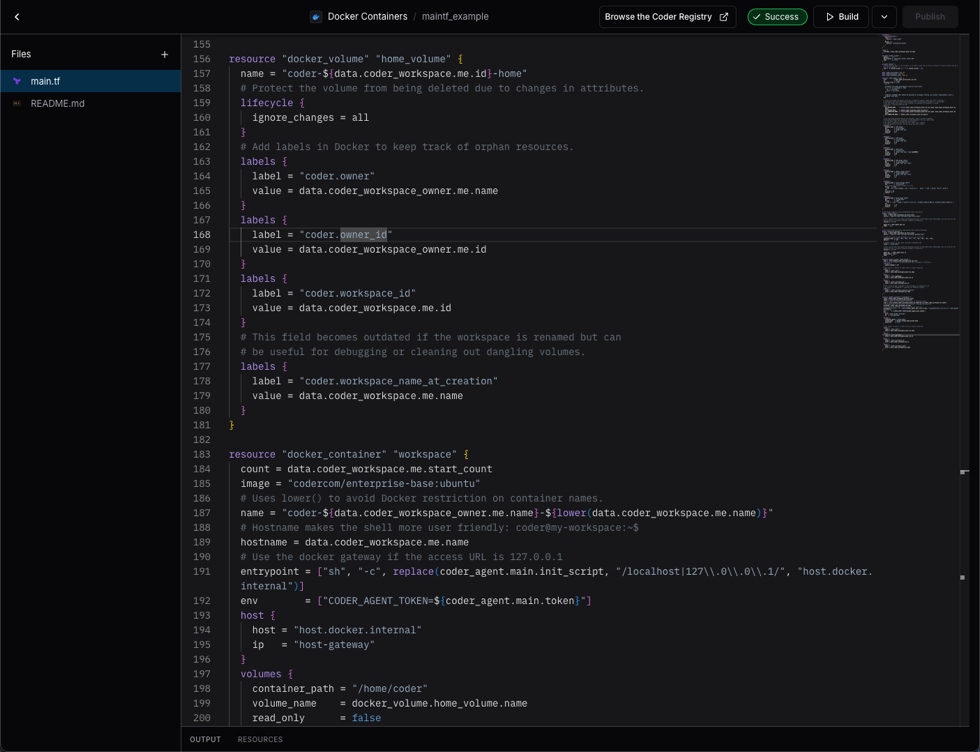
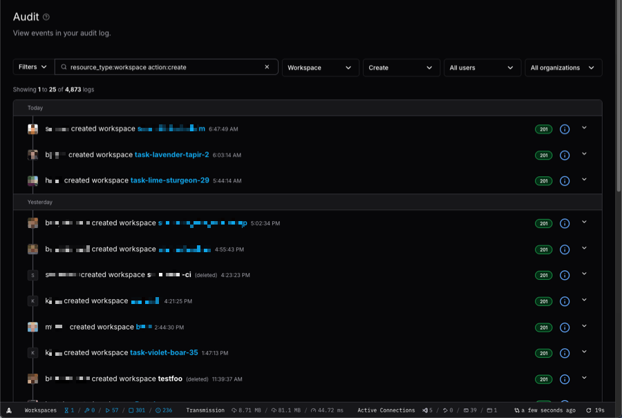
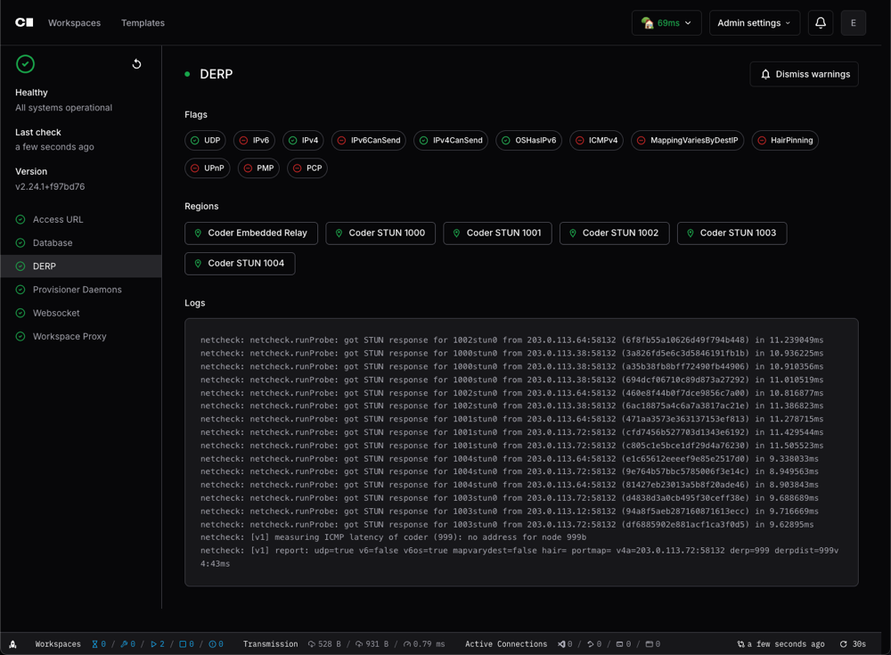

# Screenshots

## Log in

Install Coder in your cloud or air-gapped on-premises. Developers simply log in
via their browser to access their Workspaces.

## Templates

Developers provision their own ephemeral Workspaces in minutes using pre-defined
Templates that include approved tooling and infrastructure.

Template administrators can either create a new Template from scratch or choose
a Starter Template.

Template administrators build Templates using Terraform. Templates define the
underlying infrastructure that Coder Workspaces run on.

## Workspaces

Developers create and delete their own workspaces. Coder administrators can
easily enforce Workspace scheduling and autostop policies to ensure idle
Workspaces don’t burn unnecessary cloud budget.

Developers launch their favorite web-based or desktop IDE, browse files, or
access their Workspace’s Terminal.

## Administration

Coder administrators can access Template usage insights to understand which
Templates are most popular and how well they perform for developers.

Coder administrators can control _every_ aspect of their Coder deployment.

Coder administrators and auditor roles can review how users are interacting with
their Coder Workspaces and Templates.

Coder administrators can monitor the health of their Coder deployment, including
database latency, active provisioners, and more.
