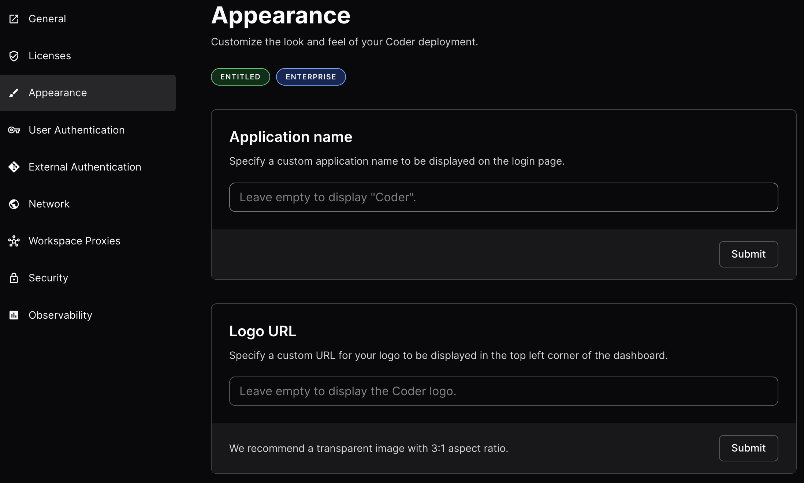
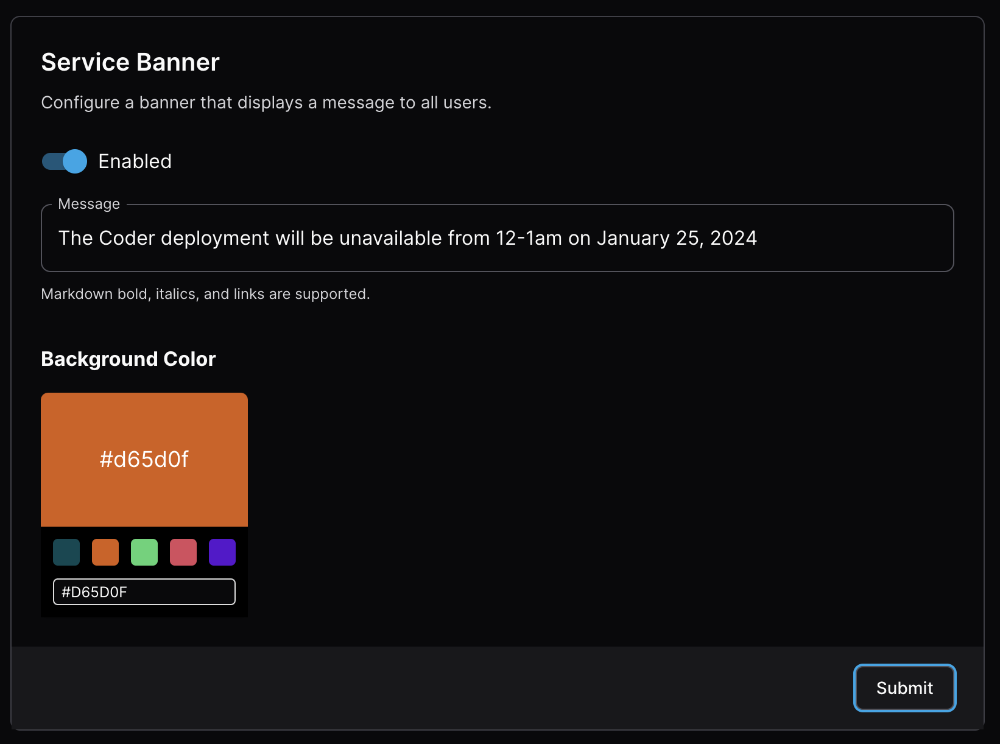
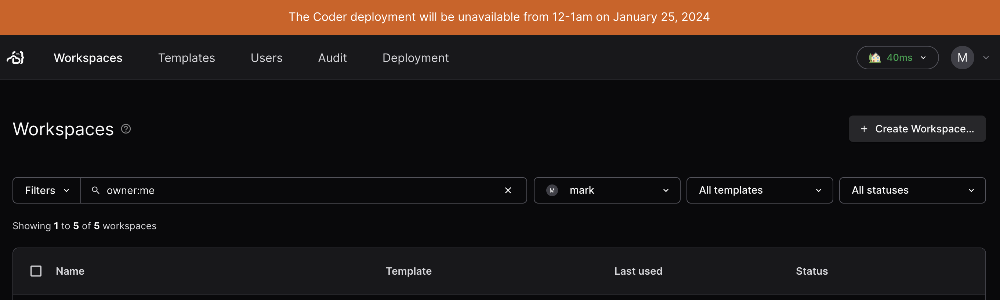
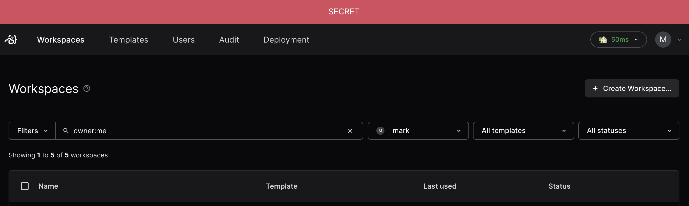
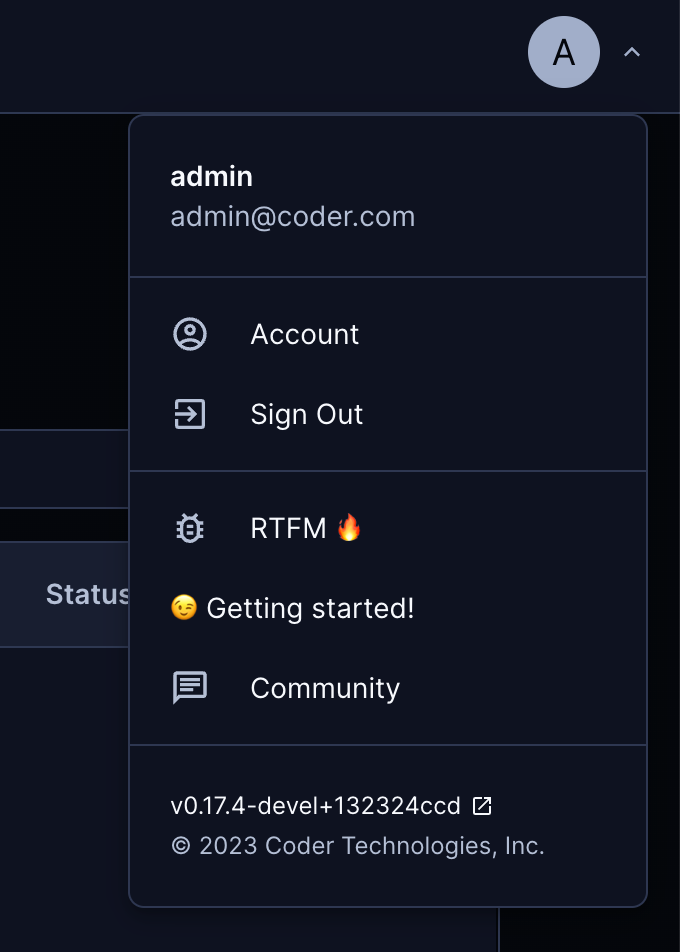

# Appearance (enterprise)

Customize the look of your Coder deployment to meet your enterprise
requirements.

You can access the Appearance settings by navigating to
`Deployment > Appearance`.



## Application Name

Specify a custom application name to be displayed on the login page. The default
is Coder.

## Logo URL

Specify a custom URL for your enterprise's logo to be displayed on the sign in
page and in the top left corner of the dashboard. The default is the Coder logo.

## Service Banner



A Service Banner lets admins post important messages to all site users. Only
Site Owners may set the service banner.

Example: Notify users of scheduled maintenance of the Coder deployment.



Example: Adhere to government network classification requirements and notify
users of which network their Coder deployment is on.



## OIDC Login Button Customization

[Use environment variables to customize](../auth#oidc-login-customization) the
text and icon on the OIDC button on the Sign In page.

## Support Links

Support links let admins adjust the user dropdown menu to include links
referring to internal company resources. The menu section replaces the original
menu positions: documentation, report a bug to GitHub, or join the Discord
server.



### Icons

The link icons are optional, and can be set to any url or
[builtin icon](../templates/icons.md#bundled-icons), additionally `bug`, `chat`,
and `docs` are available as three special icons.

### Configuration

#### Kubernetes

To configure support links in your Coder Kubernetes deployment, update your Helm
chart values as follows:

```yaml
coder:
  env:
    - name: CODER_SUPPORT_LINKS
      value: >
        [{"name": "Hello GitHub", "target": "https://github.com/coder/coder",
        "icon": "bug"},
         {"name": "Hello Slack", "target":
        "https://codercom.slack.com/archives/C014JH42DBJ", "icon":
        "/icon/slack.svg"},
         {"name": "Hello Discord", "target": "https://discord.gg/coder", "icon":
        "/icon/discord.svg"},
         {"name": "Hello Foobar", "target": "https://foo.com/bar", "icon":
        "/emojis/1f3e1.png"}]
```

#### System package

if running as a system service, set an environment variable
`CODER_SUPPORT_LINKS` in `/etc/coder.d/coder.env` as follows,

```env
CODER_SUPPORT_LINKS='[{"name": "Hello GitHub", "target": "https://github.com/coder/coder", "icon": "bug"}, {"name": "Hello Slack", "target": "https://codercom.slack.com/archives/C014JH42DBJ", "icon": "https://raw.githubusercontent.com/coder/coder/main/site/static/icon/slack.svg"}, {"name": "Hello Discord", "target": "https://discord.gg/coder", "icon": "https://raw.githubusercontent.com/coder/coder/main/site/static/icon/discord.svg"}, {"name": "Hello Foobar", "target": "https://discord.gg/coder", "icon": "/emojis/1f3e1.png"}]'
```

For CLI, use,

```shell
export CODER_SUPPORT_LINKS='[{"name": "Hello GitHub", "target": "https://github.com/coder/coder", "icon": "bug"}, {"name": "Hello Slack", "target": "https://codercom.slack.com/archives/C014JH42DBJ", "icon": "https://raw.githubusercontent.com/coder/coder/main/site/static/icon/slack.svg"}, {"name": "Hello Discord", "target": "https://discord.gg/coder", "icon": "https://raw.githubusercontent.com/coder/coder/main/site/static/icon/discord.svg"}, {"name": "Hello Foobar", "target": "https://discord.gg/coder", "icon": "/emojis/1f3e1.png"}]'
coder-server
```

## Up next

- [Enterprise](../enterprise.md)
