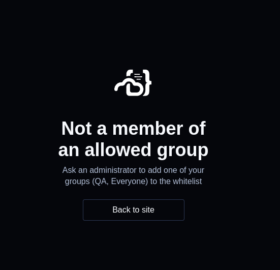

# Authentication

[OIDC with Coder Sequence Diagram](https://raw.githubusercontent.com/coder/coder/138ee55abb3635cb2f3d12661f8caef2ca9d0961/docs/images/oidc-sequence-diagram.svg).

By default, Coder is accessible via password authentication. Coder does not
recommend using password authentication in production, and recommends using an
authentication provider with properly configured multi-factor authentication
(MFA). It is your responsibility to ensure the auth provider enforces MFA
correctly.

The following steps explain how to set up GitHub OAuth or OpenID Connect.

## GitHub

### Step 1: Configure the OAuth application in GitHub

First,
[register a GitHub OAuth app](https://developer.github.com/apps/building-oauth-apps/creating-an-oauth-app/).
GitHub will ask you for the following Coder parameters:

- **Homepage URL**: Set to your Coder deployments
  [`CODER_ACCESS_URL`](../cli/server.md#--access-url) (e.g.
  `https://coder.domain.com`)
- **User Authorization Callback URL**: Set to `https://coder.domain.com`

> Note: If you want to allow multiple coder deployments hosted on subdomains
> e.g. coder1.domain.com, coder2.domain.com, to be able to authenticate with the
> same GitHub OAuth app, then you can set **User Authorization Callback URL** to
> the `https://domain.com`

Note the Client ID and Client Secret generated by GitHub. You will use these
values in the next step.

Coder will need permission to access user email addresses. Find the "Account
Permissions" settings for your app and select "read-only" for "Email addresses".

### Step 2: Configure Coder with the OAuth credentials

Navigate to your Coder host and run the following command to start up the Coder
server:

```shell
coder server --oauth2-github-allow-signups=true --oauth2-github-allowed-orgs="your-org" --oauth2-github-client-id="8d1...e05" --oauth2-github-client-secret="57ebc9...02c24c"
```

> For GitHub Enterprise support, specify the
> `--oauth2-github-enterprise-base-url` flag.

Alternatively, if you are running Coder as a system service, you can achieve the
same result as the command above by adding the following environment variables
to the `/etc/coder.d/coder.env` file:

```env
CODER_OAUTH2_GITHUB_ALLOW_SIGNUPS=true
CODER_OAUTH2_GITHUB_ALLOWED_ORGS="your-org"
CODER_OAUTH2_GITHUB_CLIENT_ID="8d1...e05"
CODER_OAUTH2_GITHUB_CLIENT_SECRET="57ebc9...02c24c"
```

**Note:** To allow everyone to signup using GitHub, set:

```env
CODER_OAUTH2_GITHUB_ALLOW_EVERYONE=true
```

Once complete, run `sudo service coder restart` to reboot Coder.

If deploying Coder via Helm, you can set the above environment variables in the
`values.yaml` file as such:

```yaml
coder:
  env:
    - name: CODER_OAUTH2_GITHUB_ALLOW_SIGNUPS
      value: "true"
    - name: CODER_OAUTH2_GITHUB_CLIENT_ID
      value: "533...des"
    - name: CODER_OAUTH2_GITHUB_CLIENT_SECRET
      value: "G0CSP...7qSM"
    # If setting allowed orgs, comment out CODER_OAUTH2_GITHUB_ALLOW_EVERYONE and its value
    - name: CODER_OAUTH2_GITHUB_ALLOWED_ORGS
      value: "your-org"
    # If allowing everyone, comment out CODER_OAUTH2_GITHUB_ALLOWED_ORGS and it's value
    #- name: CODER_OAUTH2_GITHUB_ALLOW_EVERYONE
    #  value: "true"
```

To upgrade Coder, run:

```shell
helm upgrade <release-name> coder-v2/coder -n <namespace> -f values.yaml
```

> We recommend requiring and auditing MFA usage for all users in your GitHub
> organizations. This can be enforced from the organization settings page in the
> "Authentication security" sidebar tab.

## OpenID Connect

The following steps through how to integrate any OpenID Connect provider (Okta,
Active Directory, etc.) to Coder.

### Step 1: Set Redirect URI with your OIDC provider

Your OIDC provider will ask you for the following parameter:

- **Redirect URI**: Set to `https://coder.domain.com/api/v2/users/oidc/callback`

### Step 2: Configure Coder with the OpenID Connect credentials

Navigate to your Coder host and run the following command to start up the Coder
server:

```shell
coder server --oidc-issuer-url="https://issuer.corp.com" --oidc-email-domain="your-domain-1,your-domain-2" --oidc-client-id="533...des" --oidc-client-secret="G0CSP...7qSM"
```

If you are running Coder as a system service, you can achieve the same result as
the command above by adding the following environment variables to the
`/etc/coder.d/coder.env` file:

```env
CODER_OIDC_ISSUER_URL="https://issuer.corp.com"
CODER_OIDC_EMAIL_DOMAIN="your-domain-1,your-domain-2"
CODER_OIDC_CLIENT_ID="533...des"
CODER_OIDC_CLIENT_SECRET="G0CSP...7qSM"
```

Once complete, run `sudo service coder restart` to reboot Coder.

If deploying Coder via Helm, you can set the above environment variables in the
`values.yaml` file as such:

```yaml
coder:
  env:
    - name: CODER_OIDC_ISSUER_URL
      value: "https://issuer.corp.com"
    - name: CODER_OIDC_EMAIL_DOMAIN
      value: "your-domain-1,your-domain-2"
    - name: CODER_OIDC_CLIENT_ID
      value: "533...des"
    - name: CODER_OIDC_CLIENT_SECRET
      value: "G0CSP...7qSM"
```

To upgrade Coder, run:

```shell
helm upgrade <release-name> coder-v2/coder -n <namespace> -f values.yaml
```

## OIDC Claims

When a user logs in for the first time via OIDC, Coder will merge both the
claims from the ID token and the claims obtained from hitting the upstream
provider's `userinfo` endpoint, and use the resulting data as a basis for
creating a new user or looking up an existing user.

To troubleshoot claims, set `CODER_VERBOSE=true` and follow the logs while
signing in via OIDC as a new user. Coder will log the claim fields returned by
the upstream identity provider in a message containing the string
`got oidc claims`, as well as the user info returned.

> **Note:** If you need to ensure that Coder only uses information from the ID
> token and does not hit the UserInfo endpoint, you can set the configuration
> option `CODER_OIDC_IGNORE_USERINFO=true`.

### Email Addresses

By default, Coder will look for the OIDC claim named `email` and use that value
for the newly created user's email address.

If your upstream identity provider users a different claim, you can set
`CODER_OIDC_EMAIL_FIELD` to the desired claim.

> **Note** If this field is not present, Coder will attempt to use the claim
> field configured for `username` as an email address. If this field is not a
> valid email address, OIDC logins will fail.

### Email Address Verification

Coder requires all OIDC email addresses to be verified by default. If the
`email_verified` claim is present in the token response from the identity
provider, Coder will validate that its value is `true`. If needed, you can
disable this behavior with the following setting:

```env
CODER_OIDC_IGNORE_EMAIL_VERIFIED=true
```

> **Note:** This will cause Coder to implicitly treat all OIDC emails as
> "verified", regardless of what the upstream identity provider says.

### Usernames

When a new user logs in via OIDC, Coder will by default use the value of the
claim field named `preferred_username` as the the username.

If your upstream identity provider uses a different claim, you can set
`CODER_OIDC_USERNAME_FIELD` to the desired claim.

> **Note:** If this claim is empty, the email address will be stripped of the
> domain, and become the username (e.g. `example@coder.com` becomes `example`).
> To avoid conflicts, Coder may also append a random word to the resulting
> username.

## OIDC Login Customization

If you'd like to change the OpenID Connect button text and/or icon, you can
configure them like so:

```env
CODER_OIDC_SIGN_IN_TEXT="Sign in with Gitea"
CODER_OIDC_ICON_URL=https://gitea.io/images/gitea.png
```

To change the icon and text above the OpenID Connect button, see application
name and logo url in [appearance](./appearance.md) settings.

## Disable Built-in Authentication

To remove email and password login, set the following environment variable on
your Coder deployment:

```env
CODER_DISABLE_PASSWORD_AUTH=true
```

## SCIM (enterprise)

Coder supports user provisioning and deprovisioning via SCIM 2.0 with header
authentication. Upon deactivation, users are
[suspended](./users.md#suspend-a-user) and are not deleted.
[Configure](./configure.md) your SCIM application with an auth key and supply it
the Coder server.

```env
CODER_SCIM_API_KEY="your-api-key"
```

## TLS

If your OpenID Connect provider requires client TLS certificates for
authentication, you can configure them like so:

```env
CODER_TLS_CLIENT_CERT_FILE=/path/to/cert.pem
CODER_TLS_CLIENT_KEY_FILE=/path/to/key.pem
```

## Group Sync (enterprise)

If your OpenID Connect provider supports group claims, you can configure Coder
to synchronize groups in your auth provider to groups within Coder.

To enable group sync, ensure that the `groups` claim is set by adding the
correct scope to request. If group sync is enabled, the user's groups will be
controlled by the OIDC provider. This means manual group additions/removals will
be overwritten on the next login.

```env
# as an environment variable
CODER_OIDC_SCOPES=openid,profile,email,groups
```

```shell
# as a flag
--oidc-scopes openid,profile,email,groups
```

With the `groups` scope requested, we also need to map the `groups` claim name.
Coder recommends using `groups` for the claim name. This step is necessary if
your **scope's name** is something other than `groups`.

```env
# as an environment variable
CODER_OIDC_GROUP_FIELD=groups
```

```shell
# as a flag
--oidc-group-field groups
```

On login, users will automatically be assigned to groups that have matching
names in Coder and removed from groups that the user no longer belongs to.

For cases when an OIDC provider only returns group IDs ([Azure AD][azure-gids])
or you want to have different group names in Coder than in your OIDC provider,
you can configure mapping between the two.

```env
# as an environment variable
CODER_OIDC_GROUP_MAPPING='{"myOIDCGroupID": "myCoderGroupName"}'
```

```shell
# as a flag
--oidc-group-mapping '{"myOIDCGroupID": "myCoderGroupName"}'
```

Below is an example mapping in the Coder Helm chart:

```yaml
coder:
  env:
    - name: CODER_OIDC_GROUP_MAPPING
      value: >
        {"myOIDCGroupID": "myCoderGroupName"}
```

From the example above, users that belong to the `myOIDCGroupID` group in your
OIDC provider will be added to the `myCoderGroupName` group in Coder.

> **Note:** Groups are only updated on login.

[azure-gids]:
  https://github.com/MicrosoftDocs/azure-docs/issues/59766#issuecomment-664387195

### Group allowlist

You can limit which groups from your identity provider can log in to Coder with
[CODER_OIDC_ALLOWED_GROUPS](https://coder.com/docs/v2/latest/cli/server#--oidc-allowed-groups).
Users who are not in a matching group will see the following error:



### Troubleshooting

Some common issues when enabling group sync.

#### User not being assigned / Group does not exist

If you want Coder to create groups that do not exist, you can set the following
environment variable. If you enable this, your OIDC provider might be sending
over many unnecessary groups. Use filtering options on the OIDC provider to
limit the groups sent over to prevent creating excess groups.

```env
# as an environment variable
CODER_OIDC_GROUP_AUTO_CREATE=true
```

```shell
# as a flag
--oidc-group-auto-create=true
```

A basic regex filtering option on the Coder side is available. This is applied
**after** the group mapping (`CODER_OIDC_GROUP_MAPPING`), meaning if the group
is remapped, the remapped value is tested in the regex. This is useful if you
want to filter out groups that do not match a certain pattern. For example, if
you want to only allow groups that start with `my-group-` to be created, you can
set the following environment variable.

```env
# as an environment variable
CODER_OIDC_GROUP_REGEX_FILTER="^my-group-.*$"
```

```shell
# as a flag
--oidc-group-regex-filter="^my-group-.*$"
```

#### Invalid Scope

If you see an error like the following, you may have an invalid scope.

```console
The application '<oidc_application>' asked for scope 'groups' that doesn't exist on the resource...
```

This can happen because the identity provider has a different name for the
scope. For example, Azure AD uses `GroupMember.Read.All` instead of `groups`.
You can find the correct scope name in the IDP's documentation. Some IDP's allow
configuring the name of this scope.

The solution is to update the value of `CODER_OIDC_SCOPES` to the correct value
for the identity provider.

#### No `group` claim in the `got oidc claims` log

Steps to troubleshoot.

1. Ensure the user is a part of a group in the IDP. If the user has 0 groups, no
   `groups` claim will be sent.
2. Check if another claim appears to be the correct claim with a different name.
   A common name is `memberOf` instead of `groups`. If this is present, update
   `CODER_OIDC_GROUP_FIELD=memberOf`.
3. Make sure the number of groups being sent is under the limit of the IDP. Some
   IDPs will return an error, while others will just omit the `groups` claim. A
   common solution is to create a filter on the identity provider that returns
   less than the limit for your IDP.
   - [Azure AD limit is 200, and omits groups if exceeded.](https://learn.microsoft.com/en-us/azure/active-directory/hybrid/connect/how-to-connect-fed-group-claims#options-for-applications-to-consume-group-information)
   - [Okta limit is 100, and returns an error if exceeded.](https://developer.okta.com/docs/reference/api/oidc/#scope-dependent-claims-not-always-returned)

## Role sync (enterprise)

If your OpenID Connect provider supports roles claims, you can configure Coder
to synchronize roles in your auth provider to deployment-wide roles within
Coder.

Set the following in your Coder server [configuration](./configure.md).

```env
 # Depending on your identity provider configuration, you may need to explicitly request a "roles" scope
CODER_OIDC_SCOPES=openid,profile,email,roles

# The following fields are required for role sync:
CODER_OIDC_USER_ROLE_FIELD=roles
CODER_OIDC_USER_ROLE_MAPPING='{"TemplateAuthor":["template-admin","user-admin"]}'
```

> One role from your identity provider can be mapped to many roles in Coder
> (e.g. the example above maps to 2 roles in Coder.)

## Provider-Specific Guides

Below are some details specific to individual OIDC providers.

### Active Directory Federation Services (ADFS)

> **Note:** Tested on ADFS 4.0, Windows Server 2019

1. In your Federation Server, create a new application group for Coder. Follow
   the steps as described
   [here.](https://learn.microsoft.com/en-us/windows-server/identity/ad-fs/development/msal/adfs-msal-web-app-web-api#app-registration-in-ad-fs)
   - **Server Application**: Note the Client ID.
   - **Configure Application Credentials**: Note the Client Secret.
   - **Configure Web API**: Set the Client ID as the relying party identifier.
   - **Application Permissions**: Allow access to the claims `openid`, `email`,
     `profile`, and `allatclaims`.
1. Visit your ADFS server's `/.well-known/openid-configuration` URL and note the
   value for `issuer`.
   > **Note:** This is usually of the form
   > `https://adfs.corp/adfs/.well-known/openid-configuration`
1. In Coder's configuration file (or Helm values as appropriate), set the
   following environment variables or their corresponding CLI arguments:

   - `CODER_OIDC_ISSUER_URL`: the `issuer` value from the previous step.
   - `CODER_OIDC_CLIENT_ID`: the Client ID from step 1.
   - `CODER_OIDC_CLIENT_SECRET`: the Client Secret from step 1.
   - `CODER_OIDC_AUTH_URL_PARAMS`: set to

     ```console
     {"resource":"$CLIENT_ID"}
     ```

     where `$CLIENT_ID` is the Client ID from step 1
     ([see here](https://learn.microsoft.com/en-us/windows-server/identity/ad-fs/overview/ad-fs-openid-connect-oauth-flows-scenarios#:~:text=scope%E2%80%AFopenid.-,resource,-optional)).
     This is required for the upstream OIDC provider to return the requested
     claims.

   - `CODER_OIDC_IGNORE_USERINFO`: Set to `true`.

1. Configure
   [Issuance Transform Rules](https://learn.microsoft.com/en-us/windows-server/identity/ad-fs/operations/create-a-rule-to-send-ldap-attributes-as-claims)
   on your federation server to send the following claims:

   - `preferred_username`: You can use e.g. "Display Name" as required.
   - `email`: You can use e.g. the LDAP attribute "E-Mail-Addresses" as
     required.
   - `email_verified`: Create a custom claim rule:

     ```console
     => issue(Type = "email_verified", Value = "true")
     ```

   - (Optional) If using Group Sync, send the required groups in the configured
     groups claim field. See [here](https://stackoverflow.com/a/55570286) for an
     example.

### Keycloak

The access_type parameter has two possible values: "online" and "offline." By
default, the value is set to "offline". This means that when a user
authenticates using OIDC, the application requests offline access to the user's
resources, including the ability to refresh access tokens without requiring the
user to reauthenticate.

To enable the `offline_access` scope, which allows for the refresh token
functionality, you need to add it to the list of requested scopes during the
authentication flow. Including the `offline_access` scope in the requested
scopes ensures that the user is granted the necessary permissions to obtain
refresh tokens.

By combining the `{"access_type":"offline"}` parameter in the OIDC Auth URL with
the `offline_access` scope, you can achieve the desired behavior of obtaining
refresh tokens for offline access to the user's resources.
