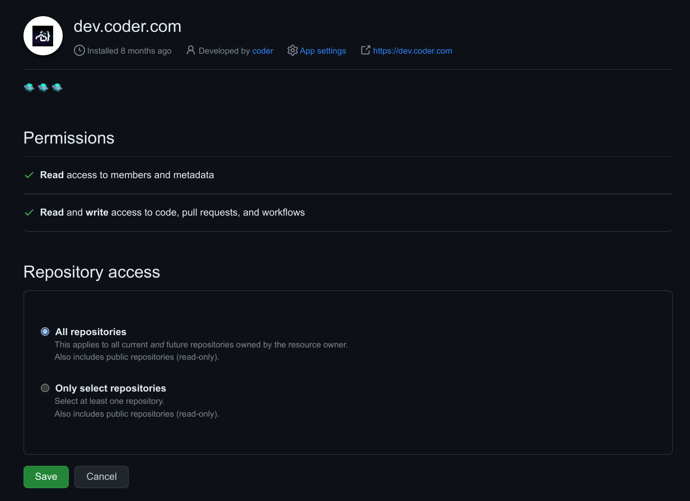

# External Authentication

Coder supports external authentication via OAuth2.0. This allows enabling any OAuth provider as well as integrations with Git providers,
such as GitHub, GitLab, and Bitbucket.

External authentication can also be used to integrate with external services
like JFrog Artifactory and others.

To add an external authentication provider, you'll need to create an OAuth
application. The following providers have been tested and work with Coder:

- [Azure DevOps](https://learn.microsoft.com/en-us/azure/devops/integrate/get-started/authentication/oauth?view=azure-devops)
- [Azure DevOps (via Entra ID)](https://learn.microsoft.com/en-us/entra/architecture/auth-oauth2)
- [BitBucket](https://support.atlassian.com/bitbucket-cloud/docs/use-oauth-on-bitbucket-cloud/)
- [GitHub](#github)
- [GitLab](https://docs.gitlab.com/ee/integration/oauth_provider.html)

If you have experience with a provider that is not listed here, please
[file an issue](https://github.com/coder/internal/issues/new?title=request%28docs%29%3A+external-auth+-+request+title+here%0D%0A&labels=["customer-feedback","docs"]&body=doc%3A+%5Bexternal-auth%5D%28https%3A%2F%2Fcoder.com%2Fdocs%2Fadmin%2Fexternal-auth%29%0D%0A%0D%0Aplease+enter+your+request+here%0D%0A)

## Configuration

After you create an OAuth application, set environment variables to configure the Coder server to use it:

```env
CODER_EXTERNAL_AUTH_0_ID="<USER_DEFINED_ID>"
CODER_EXTERNAL_AUTH_0_TYPE=<github|gitlab|azure-devops|bitbucket-cloud|bitbucket-server|etc>
CODER_EXTERNAL_AUTH_0_CLIENT_ID=<OAuth app client ID>
CODER_EXTERNAL_AUTH_0_CLIENT_SECRET=<OAuth app client secret>

# Optionally, configure a custom display name and icon:
CODER_EXTERNAL_AUTH_0_DISPLAY_NAME="Google Calendar"
CODER_EXTERNAL_AUTH_0_DISPLAY_ICON="https://mycustomicon.com/google.svg"
```

The `CODER_EXTERNAL_AUTH_0_ID` environment variable is used as an identifier for the authentication provider. **This ID is also used as part of the callback URL path** that you must configure in your OAuth provider settings. Set it with a value that helps you identify the provider. For example, you can use `CODER_EXTERNAL_AUTH_0_ID="primary-github"` for your GitHub provider. Your callback URL would then be `https://your-coder-domain.com/external-auth/primary-github/callback`.

Add the following code to any template to add a button to the workspace setup page which will allow you to authenticate with your provider:

```tf
data "coder_external_auth" "<github|gitlab|azure-devops|bitbucket-cloud|bitbucket-server|other>" {
    id = "<USER_DEFINED_ID>"
}

# GitHub Example (CODER_EXTERNAL_AUTH_0_ID="primary-github")
# makes a GitHub authentication token available at data.coder_external_auth.github.access_token
data "coder_external_auth" "github" {
   id = "primary-github"
}

```

Inside your Terraform code, you now have access to authentication variables. Reference the documentation for your chosen provider for more information on how to supply it with a token.

### Workspace CLI

Use [`external-auth`](../reference/cli/external-auth.md) in the Coder CLI to access a token within the workspace:

```shell
coder external-auth <USER_DEFINED_ID> access-token
```

## Git-provider specific env variables

### Azure DevOps

Azure DevOps requires the following environment variables:

```env
CODER_EXTERNAL_AUTH_0_ID="primary-azure-devops"
CODER_EXTERNAL_AUTH_0_TYPE=azure-devops
CODER_EXTERNAL_AUTH_0_CLIENT_ID=xxxxxx
# Ensure this value is your "Client Secret", not "App Secret"
CODER_EXTERNAL_AUTH_0_CLIENT_SECRET=xxxxxxx
CODER_EXTERNAL_AUTH_0_AUTH_URL="https://app.vssps.visualstudio.com/oauth2/authorize"
CODER_EXTERNAL_AUTH_0_TOKEN_URL="https://app.vssps.visualstudio.com/oauth2/token"
```

### Azure DevOps (via Entra ID)

Azure DevOps (via Entra ID) requires the following environment variables:

```env
CODER_EXTERNAL_AUTH_0_ID="primary-azure-devops"
CODER_EXTERNAL_AUTH_0_TYPE=azure-devops-entra
CODER_EXTERNAL_AUTH_0_CLIENT_ID=xxxxxx
CODER_EXTERNAL_AUTH_0_CLIENT_SECRET=xxxxxxx
CODER_EXTERNAL_AUTH_0_AUTH_URL="https://login.microsoftonline.com/<TENANT ID>/oauth2/authorize"
```

> [!NOTE]
> Your app registration in Entra ID requires the `vso.code_write` scope

### Bitbucket Server

Bitbucket Server requires the following environment variables:

```env
CODER_EXTERNAL_AUTH_0_ID="primary-bitbucket-server"
CODER_EXTERNAL_AUTH_0_TYPE=bitbucket-server
CODER_EXTERNAL_AUTH_0_CLIENT_ID=xxx
CODER_EXTERNAL_AUTH_0_CLIENT_SECRET=xxx
CODER_EXTERNAL_AUTH_0_AUTH_URL=https://bitbucket.domain.com/rest/oauth2/latest/authorize
```

When configuring your Bitbucket OAuth application, set the Redirect URI to `https://your-coder-domain.com/external-auth/primary-bitbucket-server/callback`. The callback path includes the value of `CODER_EXTERNAL_AUTH_0_ID`.

### Gitea

```env
CODER_EXTERNAL_AUTH_0_ID="gitea"
CODER_EXTERNAL_AUTH_0_TYPE=gitea
CODER_EXTERNAL_AUTH_0_CLIENT_ID=xxxxxxx
CODER_EXTERNAL_AUTH_0_CLIENT_SECRET=xxxxxxx
# If self managed, set the Auth URL to your Gitea instance
CODER_EXTERNAL_AUTH_0_AUTH_URL="https://gitea.com/login/oauth/authorize"
```

The Redirect URI for Gitea should be
`https://coder.company.org/external-auth/gitea/callback`.

### GitHub

> [!TIP]
> If you don't require fine-grained access control, it's easier to [configure a GitHub OAuth app](#configure-a-github-oauth-app).

```env
CODER_EXTERNAL_AUTH_0_ID="USER_DEFINED_ID"
CODER_EXTERNAL_AUTH_0_TYPE=github
CODER_EXTERNAL_AUTH_0_CLIENT_ID=xxxxxx
CODER_EXTERNAL_AUTH_0_CLIENT_SECRET=xxxxxxx
```

### GitHub Enterprise

GitHub Enterprise requires the following environment variables:

```env
CODER_EXTERNAL_AUTH_0_ID="primary-github"
CODER_EXTERNAL_AUTH_0_TYPE=github
CODER_EXTERNAL_AUTH_0_CLIENT_ID=xxxxxx
CODER_EXTERNAL_AUTH_0_CLIENT_SECRET=xxxxxxx
CODER_EXTERNAL_AUTH_0_VALIDATE_URL="https://github.example.com/api/v3/user"
CODER_EXTERNAL_AUTH_0_AUTH_URL="https://github.example.com/login/oauth/authorize"
CODER_EXTERNAL_AUTH_0_TOKEN_URL="https://github.example.com/login/oauth/access_token"
```

### GitLab self-managed

GitLab self-managed requires the following environment variables:

```env
CODER_EXTERNAL_AUTH_0_ID="primary-gitlab"
CODER_EXTERNAL_AUTH_0_TYPE=gitlab
# This value is the "Application ID"
CODER_EXTERNAL_AUTH_0_CLIENT_ID=xxxxxx
CODER_EXTERNAL_AUTH_0_CLIENT_SECRET=xxxxxxx
CODER_EXTERNAL_AUTH_0_VALIDATE_URL="https://gitlab.company.org/oauth/token/info"
CODER_EXTERNAL_AUTH_0_AUTH_URL="https://gitlab.company.org/oauth/authorize"
CODER_EXTERNAL_AUTH_0_TOKEN_URL="https://gitlab.company.org/oauth/token"
CODER_EXTERNAL_AUTH_0_REGEX=gitlab\.company\.org
```

> [!IMPORTANT]
> When configuring your GitLab OAuth application, set the Redirect URI to `https://your-coder-domain.com/external-auth/primary-gitlab/callback`. Note that the callback URL must include the value of `CODER_EXTERNAL_AUTH_0_ID` (in this example, "primary-gitlab").

### JFrog Artifactory

Visit the [JFrog Artifactory](../admin/integrations/jfrog-artifactory.md) guide for instructions on how to set up for JFrog Artifactory.

## Self-managed Git providers

Custom authentication and token URLs should be used for self-managed Git
provider deployments.

```env
CODER_EXTERNAL_AUTH_0_AUTH_URL="https://github.example.com/oauth/authorize"
CODER_EXTERNAL_AUTH_0_TOKEN_URL="https://github.example.com/oauth/token"
CODER_EXTERNAL_AUTH_0_VALIDATE_URL="https://your-domain.com/oauth/token/info"
CODER_EXTERNAL_AUTH_0_REGEX=github\.company\.org
```

> [!NOTE]
> The `REGEX` variable must be set if using a custom git domain.

## Custom scopes

Optionally, you can request custom scopes:

```env
CODER_EXTERNAL_AUTH_0_SCOPES="repo:read repo:write write:gpg_key"
```

## OAuth provider

### Configure a GitHub OAuth app

1. [Create a GitHub App](https://docs.github.com/en/apps/creating-github-apps/registering-a-github-app/registering-a-github-app)

   - Set the callback URL to
     `https://coder.example.com/external-auth/USER_DEFINED_ID/callback`, where `USER_DEFINED_ID` 
     is the value you set for `CODER_EXTERNAL_AUTH_0_ID`.
   - Deactivate Webhooks.
   - Enable fine-grained access to specific repositories or a subset of
     permissions for security.

   

1. Adjust the GitHub app permissions. You can use more or fewer permissions than
   are listed here, this example allows users to clone
   repositories:

   

   | Name          | Permission   | Description                                            |
   |---------------|--------------|--------------------------------------------------------|
   | Contents      | Read & Write | Grants access to code and commit statuses.             |
   | Pull requests | Read & Write | Grants access to create and update pull requests.      |
   | Workflows     | Read & Write | Grants access to update files in `.github/workflows/`. |
   | Metadata      | Read-only    | Grants access to metadata written by GitHub Apps.      |
   | Members       | Read-only    | Grants access to organization members and teams.       |

1. Install the App for your organization. You may select a subset of
   repositories to grant access to.

   

## Multiple External Providers (Enterprise)(Premium)

Below is an example configuration with multiple providers:

> [!IMPORTANT]
> To support regex matching for paths like `github\.com/org`, add the following `git config` line to the [Coder agent startup script](https://registry.terraform.io/providers/coder/coder/latest/docs/resources/agent#startup_script):
>
> ```shell
> git config --global credential.useHttpPath true
> ```

```env
# Provider 1) github.com
CODER_EXTERNAL_AUTH_0_ID=primary-github
CODER_EXTERNAL_AUTH_0_TYPE=github
CODER_EXTERNAL_AUTH_0_CLIENT_ID=xxxxxx
CODER_EXTERNAL_AUTH_0_CLIENT_SECRET=xxxxxxx
CODER_EXTERNAL_AUTH_0_REGEX=github\.com/org

# Provider 2) github.example.com
CODER_EXTERNAL_AUTH_1_ID=secondary-github
CODER_EXTERNAL_AUTH_1_TYPE=github
CODER_EXTERNAL_AUTH_1_CLIENT_ID=xxxxxx
CODER_EXTERNAL_AUTH_1_CLIENT_SECRET=xxxxxxx
CODER_EXTERNAL_AUTH_1_REGEX=github\.example\.com
CODER_EXTERNAL_AUTH_1_AUTH_URL="https://github.example.com/login/oauth/authorize"
CODER_EXTERNAL_AUTH_1_TOKEN_URL="https://github.example.com/login/oauth/access_token"
CODER_EXTERNAL_AUTH_1_VALIDATE_URL="https://github.example.com/api/v3/user"
```
