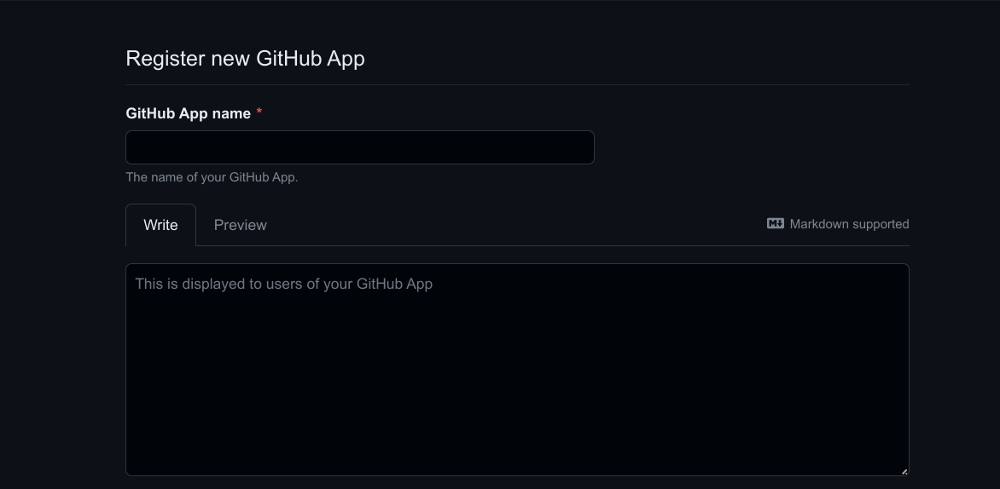

# External Authentication

Coder integrates with Git and OpenID Connect to automate away the need for
developers to authenticate with external services within their workspace.

## Git Providers

When developers use `git` inside their workspace, they are prompted to
authenticate. After that, Coder will store and refresh tokens for future
operations.

<video autoplay playsinline loop>
  <source src="https://github.com/coder/coder/blob/main/site/static/external-auth.mp4?raw=true" type="video/mp4">
Your browser does not support the video tag.
</video>

## Configuration

To add an external authentication provider, you'll need to create an OAuth
application. The following providers are supported:

- [GitHub](#github)
- [GitLab](https://docs.gitlab.com/ee/integration/oauth_provider.html)
- [BitBucket](https://support.atlassian.com/bitbucket-cloud/docs/use-oauth-on-bitbucket-cloud/)
- [Azure DevOps](https://learn.microsoft.com/en-us/azure/devops/integrate/get-started/authentication/oauth?view=azure-devops)
- [Azure DevOps (via Entra ID)](https://learn.microsoft.com/en-us/entra/architecture/auth-oauth2)

The next step is to [configure the Coder server](./configure.md) to use the
OAuth application by setting the following environment variables:

```env
CODER_EXTERNAL_AUTH_0_ID="<USER_DEFINED_ID>"
CODER_EXTERNAL_AUTH_0_TYPE=<github|gitlab|azure-devops|bitbucket-cloud|bitbucket-server|etc>
CODER_EXTERNAL_AUTH_0_CLIENT_ID=xxxxxx
CODER_EXTERNAL_AUTH_0_CLIENT_SECRET=xxxxxxx

# Optionally, configure a custom display name and icon
CODER_EXTERNAL_AUTH_0_DISPLAY_NAME="Google Calendar"
CODER_EXTERNAL_AUTH_0_DISPLAY_ICON="https://mycustomicon.com/google.svg"
```

The `CODER_EXTERNAL_AUTH_0_ID` environment variable is used for internal
reference. Therefore, it can be set arbitrarily (e.g., `primary-github` for your
GitHub provider).

### GitHub

> If you don't require fine-grained access control, it's easier to configure a
> GitHub OAuth app!

1. [Create a GitHub App](https://docs.github.com/en/apps/creating-github-apps/registering-a-github-app/registering-a-github-app)

   - Set the callback URL to
     `https://coder.example.com/external-auth/USER_DEFINED_ID/callback`.
   - Deactivate Webhooks.
   - Enable fine-grained access to specific repositories or a subset of
     permissions for security.

   

2. Adjust the GitHub App permissions. You can use more or less permissions than
   are listed here, this is merely a suggestion that allows users to clone
   repositories:

   

   | Name          | Permission   | Description                                            |
   | ------------- | ------------ | ------------------------------------------------------ |
   | Contents      | Read & Write | Grants access to code and commit statuses.             |
   | Pull requests | Read & Write | Grants access to create and update pull requests.      |
   | Workflows     | Read & Write | Grants access to update files in `.github/workflows/`. |
   | Metadata      | Read-only    | Grants access to metadata written by GitHub Apps.      |
   | Members       | Rad-only     | Grabts access to organization members and teams.       |

3. Install the App for your organization. You may select a subset of
   repositories to grant access to.

   

```env
CODER_EXTERNAL_AUTH_0_ID="USER_DEFINED_ID"
CODER_EXTERNAL_AUTH_0_TYPE=github
CODER_EXTERNAL_AUTH_0_CLIENT_ID=xxxxxx
CODER_EXTERNAL_AUTH_0_CLIENT_SECRET=xxxxxxx
```

### GitHub Enterprise

GitHub Enterprise requires the following environment variables:

```env
CODER_EXTERNAL_AUTH_0_ID="primary-github"
CODER_EXTERNAL_AUTH_0_TYPE=github
CODER_EXTERNAL_AUTH_0_CLIENT_ID=xxxxxx
CODER_EXTERNAL_AUTH_0_CLIENT_SECRET=xxxxxxx
CODER_EXTERNAL_AUTH_0_VALIDATE_URL="https://github.example.com/api/v3/user"
CODER_EXTERNAL_AUTH_0_AUTH_URL="https://github.example.com/login/oauth/authorize"
CODER_EXTERNAL_AUTH_0_TOKEN_URL="https://github.example.com/login/oauth/access_token"
```

### Bitbucket Server

Bitbucket Server requires the following environment variables:

```env
CODER_EXTERNAL_AUTH_0_ID="primary-bitbucket-server"
CODER_EXTERNAL_AUTH_0_TYPE=bitbucket-server
CODER_EXTERNAL_AUTH_0_CLIENT_ID=xxx
CODER_EXTERNAL_AUTH_0_CLIENT_SECRET=xxx
CODER_EXTERNAL_AUTH_0_AUTH_URL=https://bitbucket.domain.com/rest/oauth2/latest/authorize
```

### Azure DevOps

Azure DevOps requires the following environment variables:

```env
CODER_EXTERNAL_AUTH_0_ID="primary-azure-devops"
CODER_EXTERNAL_AUTH_0_TYPE=azure-devops
CODER_EXTERNAL_AUTH_0_CLIENT_ID=xxxxxx
# Ensure this value is your "Client Secret", not "App Secret"
CODER_EXTERNAL_AUTH_0_CLIENT_SECRET=xxxxxxx
CODER_EXTERNAL_AUTH_0_AUTH_URL="https://app.vssps.visualstudio.com/oauth2/authorize"
CODER_EXTERNAL_AUTH_0_TOKEN_URL="https://app.vssps.visualstudio.com/oauth2/token"
```

### Azure DevOps (via Entra ID)

Azure DevOps (via Entra ID) requires the following environment variables:

```env
CODER_EXTERNAL_AUTH_0_ID="primary-azure-devops"
CODER_EXTERNAL_AUTH_0_TYPE=azure-devops-entra
CODER_EXTERNAL_AUTH_0_CLIENT_ID=xxxxxx
CODER_EXTERNAL_AUTH_0_CLIENT_SECRET=xxxxxxx
CODER_EXTERNAL_AUTH_0_AUTH_URL="https://login.microsoftonline.com/<TENANT ID>/oauth2/authorize"
```

> Note: Your app registration in Entra ID requires the `vso.code_write` scope

### GitLab self-managed

GitLab self-managed requires the following environment variables:

```env
CODER_EXTERNAL_AUTH_0_ID="primary-gitlab"
CODER_EXTERNAL_AUTH_0_TYPE=gitlab
# This value is the "Application ID"
CODER_EXTERNAL_AUTH_0_CLIENT_ID=xxxxxx
CODER_EXTERNAL_AUTH_0_CLIENT_SECRET=xxxxxxx
CODER_EXTERNAL_AUTH_0_VALIDATE_URL="https://gitlab.company.org/oauth/token/info"
CODER_EXTERNAL_AUTH_0_AUTH_URL="https://gitlab.company.org/oauth/authorize"
CODER_EXTERNAL_AUTH_0_TOKEN_URL="https://gitlab.company.org/oauth/token"
CODER_EXTERNAL_AUTH_0_REGEX=gitlab\.company\.org
```

### Gitea

```env
CODER_EXTERNAL_AUTH_0_ID="gitea"
CODER_EXTERNAL_AUTH_0_TYPE=gitea
CODER_EXTERNAL_AUTH_0_CLIENT_ID=xxxxxxx
CODER_EXTERNAL_AUTH_0_CLIENT_SECRET=xxxxxxx
# If self managed, set the Auth URL to your Gitea instance
CODER_EXTERNAL_AUTH_0_AUTH_URL="https://gitea.com/login/oauth/authorize"
```

The Redirect URI for Gitea should be
https://coder.company.org/external-auth/gitea/callback

### Self-managed git providers

Custom authentication and token URLs should be used for self-managed Git
provider deployments.

```env
CODER_EXTERNAL_AUTH_0_AUTH_URL="https://github.example.com/oauth/authorize"
CODER_EXTERNAL_AUTH_0_TOKEN_URL="https://github.example.com/oauth/token"
CODER_EXTERNAL_AUTH_0_VALIDATE_URL="https://your-domain.com/oauth/token/info"
CODER_EXTERNAL_AUTH_0_REGEX=github\.company\.org
```

> Note: The `REGEX` variable must be set if using a custom git domain.

### JFrog Artifactory

See
[this](https://coder.com/docs/v2/latest/guides/artifactory-integration#jfrog-oauth)
guide on instructions on how to set up for JFrog Artifactory.

### Custom scopes

Optionally, you can request custom scopes:

```env
CODER_EXTERNAL_AUTH_0_SCOPES="repo:read repo:write write:gpg_key"
```

### Multiple External Providers (enterprise)

Multiple providers are an Enterprise feature. [Learn more](../enterprise.md).
Below is an example configuration with multiple providers.

```env
# Provider 1) github.com
CODER_EXTERNAL_AUTH_0_ID=primary-github
CODER_EXTERNAL_AUTH_0_TYPE=github
CODER_EXTERNAL_AUTH_0_CLIENT_ID=xxxxxx
CODER_EXTERNAL_AUTH_0_CLIENT_SECRET=xxxxxxx
CODER_EXTERNAL_AUTH_0_REGEX=github.com/orgname

# Provider 2) github.example.com
CODER_EXTERNAL_AUTH_1_ID=secondary-github
CODER_EXTERNAL_AUTH_1_TYPE=github
CODER_EXTERNAL_AUTH_1_CLIENT_ID=xxxxxx
CODER_EXTERNAL_AUTH_1_CLIENT_SECRET=xxxxxxx
CODER_EXTERNAL_AUTH_1_REGEX=github.example.com
CODER_EXTERNAL_AUTH_1_AUTH_URL="https://github.example.com/login/oauth/authorize"
CODER_EXTERNAL_AUTH_1_TOKEN_URL="https://github.example.com/login/oauth/access_token"
CODER_EXTERNAL_AUTH_1_VALIDATE_URL="https://github.example.com/api/v3/user"
```

To support regex matching for paths (e.g. github.com/orgname), you'll need to
add this to the
[Coder agent startup script](https://registry.terraform.io/providers/coder/coder/latest/docs/resources/agent#startup_script):

```shell
git config --global credential.useHttpPath true
```

### Kubernetes environment variables

If you deployed Coder with Kubernetes you can set the environment variables in
your `values.yaml` file:

```yaml
coder:
  env:
    # […]
    - name: CODER_EXTERNAL_AUTH_0_ID
      value: USER_DEFINED_ID

    - name: CODER_EXTERNAL_AUTH_0_TYPE
      value: github

    - name: CODER_EXTERNAL_AUTH_0_CLIENT_ID
      valueFrom:
        secretKeyRef:
          name: github-primary-basic-auth
          key: client-id

    - name: CODER_EXTERNAL_AUTH_0_CLIENT_SECRET
      valueFrom:
        secretKeyRef:
          name: github-primary-basic-auth
          key: client-secret
```

You can set the secrets by creating a `github-primary-basic-auth.yaml` file and
applying it.

```yaml
apiVersion: v1
kind: Secret
metadata:
  name: github-primary-basic-auth
type: Opaque
stringData:
  client-secret: xxxxxxxxx
  client-id: xxxxxxxxx
```

Make sure to restart the affected pods for the change to take effect.

## Require git authentication in templates

If your template requires git authentication (e.g. running `git clone` in the
[startup_script](https://registry.terraform.io/providers/coder/coder/latest/docs/resources/agent#startup_script)),
you can require users authenticate via git prior to creating a workspace:


### Native git authentication will auto-refresh tokens

<blockquote class="info">
  <p>
  This is the preferred authentication method.
  </p>
</blockquote>

By default, the coder agent will configure native `git` authentication via the
`GIT_ASKPASS` environment variable. Meaning, with no additional configuration,
external authentication will work with native `git` commands.

To check the auth token being used **from inside a running workspace**, run:

```shell
# If the exit code is non-zero, then the user is not authenticated with the
# external provider.
coder external-auth access-token <external-auth-id>
```

Note: Some IDE's override the `GIT_ASKPASS` environment variable and need to be
configured.

**VSCode**

Use the
[Coder](https://marketplace.visualstudio.com/items?itemName=coder.coder-remote)
extension to automatically configure these settings for you!

Otherwise, you can manually configure the following settings:

- Set `git.terminalAuthentication` to `false`
- Set `git.useIntegratedAskPass` to `false`

### Hard coded tokens do not auto-refresh

If the token is required to be inserted into the workspace, for example
[GitHub cli](https://cli.github.com/), the auth token can be inserted from the
template. This token will not auto-refresh. The following example will
authenticate via GitHub and auto-clone a repo into the `~/coder` directory.

```hcl
data "coder_external_auth" "github" {
  # Matches the ID of the external auth provider in Coder.
  id = "github"
}

resource "coder_agent" "dev" {
  os   = "linux"
  arch = "amd64"
  dir  = "~/coder"
  env = {
    GITHUB_TOKEN : data.coder_external_auth.github.access_token
  }
  startup_script = <<EOF
if [ ! -d ~/coder ]; then
    git clone https://github.com/coder/coder
fi
EOF
}
```

See the
[Terraform provider documentation](https://registry.terraform.io/providers/coder/coder/latest/docs/data-sources/external_auth)
for all available options.
