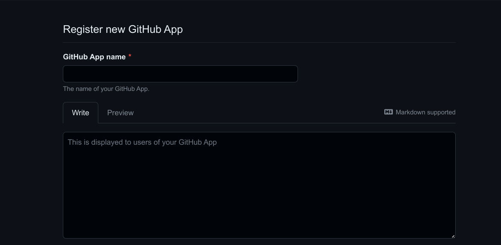
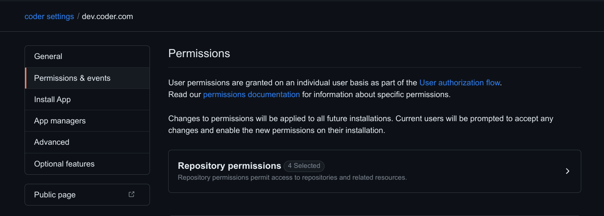
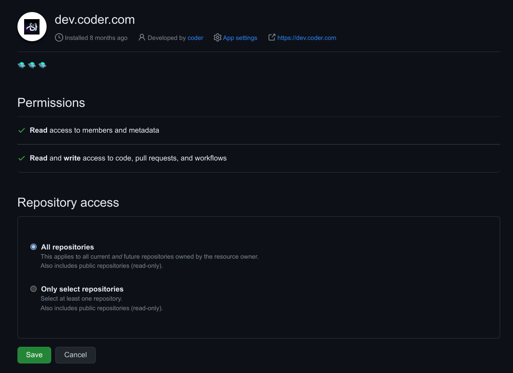
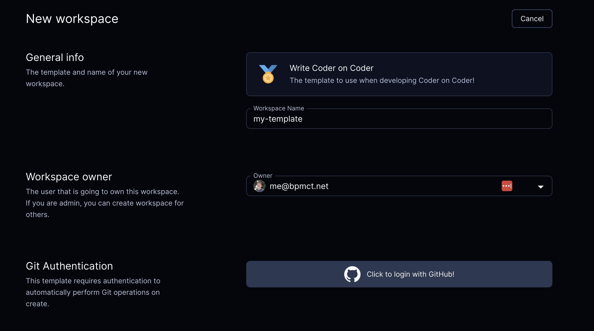

# Git Providers

Coder integrates with git providers to automate away the need for developers to
authenticate with repositories within their workspace.

## How it works

When developers use `git` inside their workspace, they are prompted to
authenticate. After that, Coder will store and refresh tokens for future
operations.

<video autoplay playsinline loop>
  <source src="https://github.com/coder/coder/blob/main/site/static/external-auth.mp4?raw=true" type="video/mp4">
Your browser does not support the video tag.
</video>

## Configuration

To add a git provider, you'll need to create an OAuth application. The following
providers are supported:

- [GitHub](#github-app)
- [GitLab](https://docs.gitlab.com/ee/integration/oauth_provider.html)
- [BitBucket](https://support.atlassian.com/bitbucket-cloud/docs/use-oauth-on-bitbucket-cloud/)
- [Azure DevOps](https://learn.microsoft.com/en-us/azure/devops/integrate/get-started/authentication/oauth?view=azure-devops)

Example callback URL:
`https://coder.example.com/gitauth/primary-github/callback`. Use an arbitrary ID
for your provider (e.g. `primary-github`).

Set the following environment variables to
[configure the Coder server](./configure.md):

```env
CODER_GITAUTH_0_ID="primary-github"
CODER_GITAUTH_0_TYPE=github|gitlab|azure-devops|bitbucket
CODER_GITAUTH_0_CLIENT_ID=xxxxxx
CODER_GITAUTH_0_CLIENT_SECRET=xxxxxxx
```

### GitHub

1. [Create a GitHub App](https://docs.github.com/en/apps/creating-github-apps/registering-a-github-app/registering-a-github-app)
   to enable fine-grained access to specific repositories, or a subset of
   permissions for security.

   

2. Adjust the GitHub App permissions. You can use more or less permissions than
   are listed here, this is merely a suggestion that allows users to clone
   repositories:

   

   | Name          | Permission   | Description                                            |
   | ------------- | ------------ | ------------------------------------------------------ |
   | Contents      | Read & Write | Grants access to code and commit statuses.             |
   | Pull requests | Read & Write | Grants access to create and update pull requests.      |
   | Workflows     | Read & Write | Grants access to update files in `.github/workflows/`. |
   | Metadata      | Read-only    | Grants access to metadata written by GitHub Apps.      |

3. Install the App for your organization. You may select a subset of
   repositories to grant access to.

   

### GitHub Enterprise

GitHub Enterprise requires the following authentication and token URLs:

```env
CODER_GITAUTH_0_VALIDATE_URL="https://github.example.com/login/oauth/access_token/info"
CODER_GITAUTH_0_AUTH_URL="https://github.example.com/login/oauth/authorize"
CODER_GITAUTH_0_TOKEN_URL="https://github.example.com/login/oauth/access_token"
```

### Azure DevOps

Azure DevOps requires the following environment variables:

```env
CODER_GITAUTH_0_ID="primary-azure-devops"
CODER_GITAUTH_0_TYPE=azure-devops
CODER_GITAUTH_0_CLIENT_ID=xxxxxx
# Ensure this value is your "Client Secret", not "App Secret"
CODER_GITAUTH_0_CLIENT_SECRET=xxxxxxx
CODER_GITAUTH_0_AUTH_URL="https://app.vssps.visualstudio.com/oauth2/authorize"
CODER_GITAUTH_0_TOKEN_URL="https://app.vssps.visualstudio.com/oauth2/token"
```

### Self-managed git providers

Custom authentication and token URLs should be used for self-managed Git
provider deployments.

```env
CODER_GITAUTH_0_AUTH_URL="https://github.example.com/oauth/authorize"
CODER_GITAUTH_0_TOKEN_URL="https://github.example.com/oauth/token"
CODER_GITAUTH_0_VALIDATE_URL="https://your-domain.com/oauth/token/info"
```

### Custom scopes

Optionally, you can request custom scopes:

```env
CODER_GITAUTH_0_SCOPES="repo:read repo:write write:gpg_key"
```

### Multiple git providers (enterprise)

Multiple providers are an Enterprise feature. [Learn more](../enterprise.md).

A custom regex can be used to match a specific repository or organization to
limit auth scope. Here's a sample config:

```env
# Provider 1) github.com
CODER_GITAUTH_0_ID=primary-github
CODER_GITAUTH_0_TYPE=github
CODER_GITAUTH_0_CLIENT_ID=xxxxxx
CODER_GITAUTH_0_CLIENT_SECRET=xxxxxxx
CODER_GITAUTH_0_REGEX=github.com/orgname

# Provider 2) github.example.com
CODER_GITAUTH_1_ID=secondary-github
CODER_GITAUTH_1_TYPE=github
CODER_GITAUTH_1_CLIENT_ID=xxxxxx
CODER_GITAUTH_1_CLIENT_SECRET=xxxxxxx
CODER_GITAUTH_1_REGEX=github.example.com
CODER_GITAUTH_1_AUTH_URL="https://github.example.com/login/oauth/authorize"
CODER_GITAUTH_1_TOKEN_URL="https://github.example.com/login/oauth/access_token"
CODER_GITAUTH_1_VALIDATE_URL="https://github.example.com/login/oauth/access_token/info"
```

To support regex matching for paths (e.g. github.com/orgname), you'll need to
add this to the
[Coder agent startup script](https://registry.terraform.io/providers/coder/coder/latest/docs/resources/agent#startup_script):

```shell
git config --global credential.useHttpPath true
```

## Require git authentication in templates

If your template requires git authentication (e.g. running `git clone` in the
[startup_script](https://registry.terraform.io/providers/coder/coder/latest/docs/resources/agent#startup_script)),
you can require users authenticate via git prior to creating a workspace:



The following example will require users authenticate via GitHub and auto-clone
a repo into the `~/coder` directory.

```hcl
data "coder_git_auth" "github" {
  # Matches the ID of the git auth provider in Coder.
  id = "github"
}

resource "coder_agent" "dev" {
  os   = "linux"
  arch = "amd64"
  dir  = "~/coder"
  env = {
    GITHUB_TOKEN : data.coder_git_auth.github.access_token
  }
  startup_script = <<EOF
if [ ! -d ~/coder ]; then
    git clone https://github.com/coder/coder
fi
EOF
}
```

See the
[Terraform provider documentation](https://registry.terraform.io/providers/coder/coder/latest/docs/data-sources/git_auth)
for all available options.
