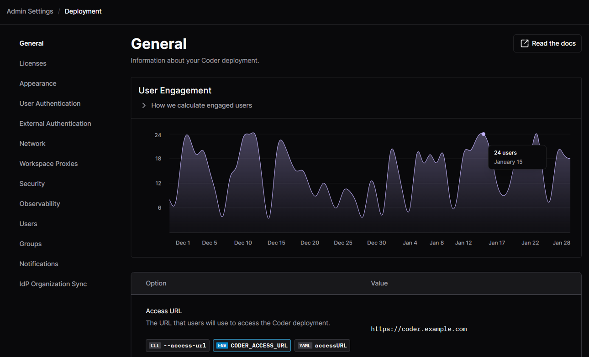

# Administration

These guides contain information on managing the Coder control plane and
[authoring templates](./templates/index.md).

First time viewers looking to set up control plane access can start with the
[configuration guide](./setup/index.md). If you're a team lead looking to design
environments for your developers, check out our
[templates guides](./templates/index.md). If you are a developer using Coder, we
recommend the [user guides](../user-guides/index.md).

For automation and scripting workflows, see our [CLI](../reference/cli/index.md)
and [API](../reference/api/index.md) docs.

For any information not strictly contained in these sections, check out our
[Tutorials](../tutorials/index.md) and [FAQs](../tutorials/faqs.md).

## What is an image, template, dev container, or workspace

### Image

- A [base image](./templates/managing-templates/image-management.md) contains
  OS-level packages and utilities that the Coder workspace is built on. It can
  be an [example image](https://github.com/coder/images), custom image in your
  registry, or one from [Docker Hub](https://hub.docker.com/search). It is
  defined in each template.
- Managed by: Externally to Coder.

### Template

- [Templates](./templates/index.md) include infrastructure-level dependencies
  for the workspace. For example, a template can include Kubernetes
  PersistentVolumeClaims, Docker containers, or EC2 VMs.
- Managed by: Template administrators from within the Coder deployment.

### Startup scripts

- Agent startup scripts apply to all users of a template. This is an
  intentionally flexible area that template authors have at their disposal to
  manage the "last mile" of workspace creation.
- Managed by: Coder template administrators.

### Workspace

- A [workspace](../user-guides/workspace-management.md) is the environment that
  a developer works in. Developers on a team each work from their own workspace
  and can use [multiple IDEs](../user-guides/workspace-access/index.md).
- Managed by: Developers

### Development containers (dev containers)

- A
  [Development Container](./templates/managing-templates/devcontainers/index.md)
  is an open-source specification for defining development environments (called
  dev containers). It is generally stored in VCS alongside associated source
  code. It can reference an existing base image, or a custom Dockerfile that
  will be built on-demand.
- Managed by: Dev Teams

### Dotfiles / personalization

- Users may have their own specific preferences relating to shell prompt, custom
  keybindings, color schemes, and more. Users can leverage Coder's
  [dotfiles support](../user-guides/workspace-dotfiles.md) or create their own
  script to personalize their workspace. Be aware that users with root
  permissions in their workspace can override almost all of the previous
  configuration.
- Managed by: Individual Users

<children></children>
