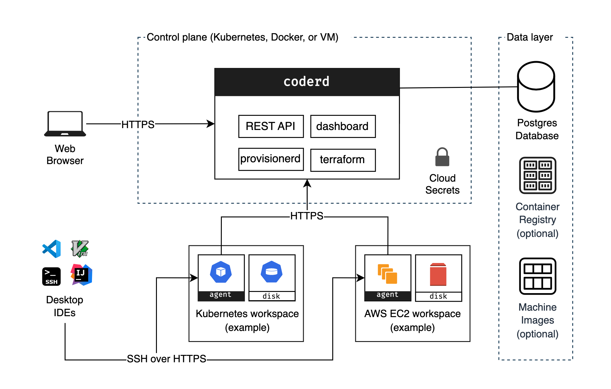
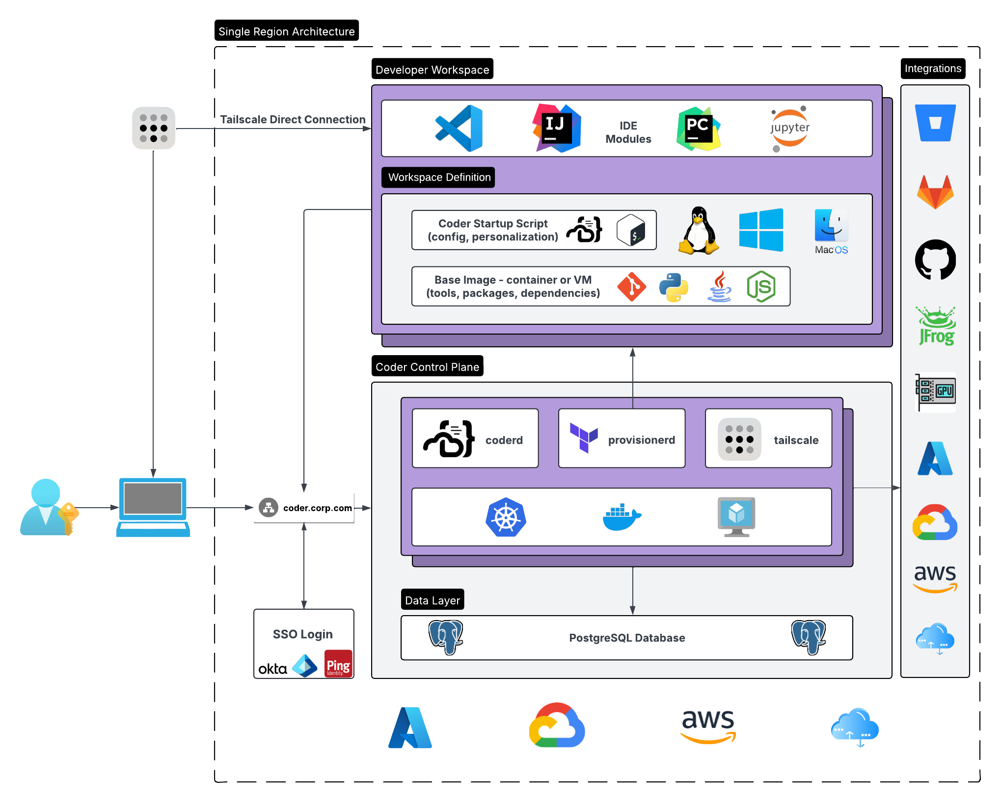
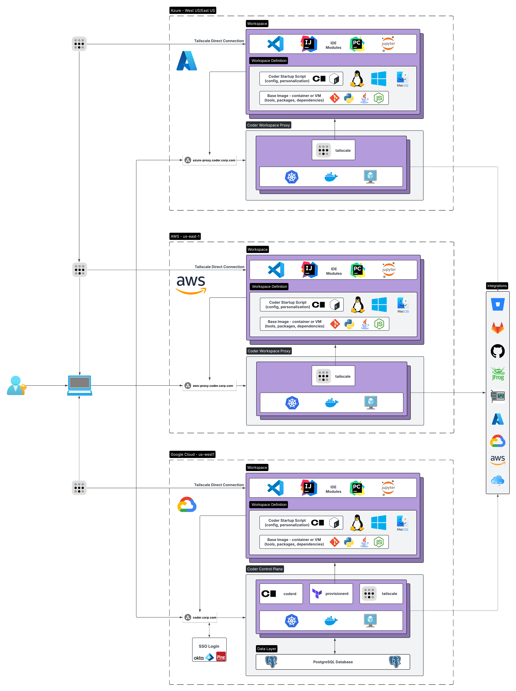

# Architecture

The Coder deployment model is flexible and offers various components that
platform administrators can deploy and scale depending on their use case. This
page describes possible deployments, challenges, and risks associated with them.

## Community Edition

## Premium

## Multi-Region Premium

## Primary components

### coderd

_coderd_ is the service created by running `coder server`. It is a thin API that
connects workspaces, provisioners and users. _coderd_ stores its state in
Postgres and is the only service that communicates with Postgres.

It offers:

- Dashboard (UI)
- HTTP API
- Dev URLs (HTTP reverse proxy to workspaces)
- Workspace Web Applications (e.g for easy access to `code-server`)
- Agent registration

### provisionerd

_provisionerd_ is the execution context for infrastructure modifying providers.
At the moment, the only provider is Terraform (running `terraform`).

By default, the Coder server runs multiple provisioner daemons.
[External provisioners](../provisioners/index.md) can be added for security or
scalability purposes.

### Workspaces

At the highest level, a workspace is a set of cloud resources. These resources
can be VMs, Kubernetes clusters, storage buckets, or whatever else Terraform
lets you dream up.

The resources that run the agent are described as _computational resources_,
while those that don't are called _peripheral resources_.

Each resource may also be _persistent_ or _ephemeral_ depending on whether
they're destroyed on workspace stop.

### Agents

An agent is the Coder service that runs within a user's remote workspace. It
provides a consistent interface for coderd and clients to communicate with
workspaces regardless of operating system, architecture, or cloud.

It offers the following services along with much more:

- SSH
- Port forwarding
- Liveness checks
- `startup_script` automation

Templates are responsible for
[creating and running agents](../templates/extending-templates/index.md#workspace-agents)
within workspaces.

## Service Bundling

While _coderd_ and Postgres can be orchestrated independently, our default
installation paths bundle them all together into one system service. It's
perfectly fine to run a production deployment this way, but there are certain
situations that necessitate decomposition:

- Reducing global client latency (distribute coderd and centralize database)
- Achieving greater availability and efficiency (horizontally scale individual
  services)

## Data Layer

### PostgreSQL (Recommended)

While `coderd` runs a bundled version of PostgreSQL, we recommend running an
external PostgreSQL 13+ database for production deployments.

A managed PostgreSQL database, with daily backups, is recommended:

- For AWS: Amazon RDS for PostgreSQL (preferably using
  [RDS IAM authentication](../../reference/cli/server.md#--postgres-auth)).
- For Azure: Azure Database for PostgreSQL
- Flexible Server For GCP: Cloud SQL for PostgreSQL

Learn more about database requirements:
[Database Health](../monitoring/health-check.md#database)

### Git Providers (Recommended)

Users will likely need to pull source code and other artifacts from a git
provider. The Coder control plane and workspaces will need network connectivity
to the git provider.

- [GitHub Enterprise](../external-auth.md#github-enterprise)
- [GitLab](../external-auth.md#gitlab-self-managed)
- [BitBucket](../external-auth.md#bitbucket-server)
- [Other Providers](../external-auth.md#self-managed-git-providers)

### Artifact Manager (Optional)

Workspaces and templates can pull artifacts from an artifact manager, such as
JFrog Artifactory. This can be configured on the infrastructure level, or in
some cases within Coder:

- Tutorial: [JFrog Artifactory and Coder](../integrations/jfrog-artifactory.md)

### Container Registry (Optional)

If you prefer not to pull container images for the control plane (`coderd`,
`provisionerd`) and workspaces from public container registry (Docker Hub,
GitHub Container Registry) you can run your own container registry with Coder.

To shorten the provisioning time, it is recommended to deploy registry mirrors
in the same region as the workspace nodes.
