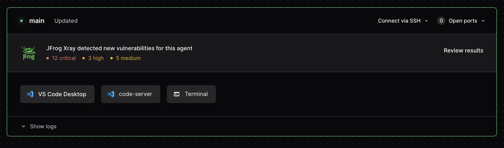

# Integrating JFrog Xray with Coder Kubernetes Workspaces

<div>
  <a href="https://github.com/matifali" style="text-decoration: none; color: inherit;">
    <span style="vertical-align:middle;">Muhammad Atif Ali</span>
    

  </a>
</div>
March 17, 2024

---

This guide describes the process of integrating [JFrog Xray](https://jfrog.com/xray/) to Coder Kubernetes-backed
workspaces using Coder's [JFrog Xray Integration](https://github.com/coder/coder-xray).

## Prerequisites

- A self-hosted JFrog Platform instance.
- Kubernetes workspaces running on Coder.

## Deploy the **Coder - JFrog Xray** Integration

1. Create a JFrog Platform [Access Token](https://jfrog.com/help/r/jfrog-platform-administration-documentation/access-tokens) with a user that has the `read` [permission](https://jfrog.com/help/r/jfrog-platform-administration-documentation/permissions)
   for the repositories you want to scan.

1. Create a Coder [token](../../reference/cli/tokens_create.md#tokens-create) with a user that has the [`owner`](../users/index.md#roles) role.

1. Create Kubernetes secrets for the JFrog Xray and Coder tokens.

   ```bash
   kubectl create secret generic coder-token \
     --from-literal=coder-token='<token>'
   ```

   ```bash
   kubectl create secret generic jfrog-token \
     --from-literal=user='<user>' \
     --from-literal=token='<token>'
   ```

1. Deploy the **Coder - JFrog Xray** integration.

   ```bash
   helm repo add coder-xray https://helm.coder.com/coder-xray
   ```

   ```bash
   helm upgrade --install coder-xray coder-xray/coder-xray \
     --namespace coder-xray \
     --create-namespace \
     --set namespace="<your-coder-workspaces-namespace-name>" \
     --set coder.url="https://<your-coder-url>" \
     --set coder.secretName="coder-token" \
     --set artifactory.url="https://<your-artifactory-url>" \
     --set artifactory.secretName="jfrog-token"
   ```

     > [!IMPORTANT]
     > To authenticate with the Artifactory registry, you may need to
     > create a [Docker config](https://jfrog.com/help/r/jfrog-artifactory-documentation/docker-advanced-topics) and use it in the
     > `imagePullSecrets` field of the Kubernetes Pod.
     > See the [Defining ImagePullSecrets for Coder workspaces](../../tutorials/image-pull-secret.md) guide for more information.

## Validate your installation

Once installed, configured workspaces will now have a banner appear on any
workspace with vulnerabilities reported by JFrog Xray.


