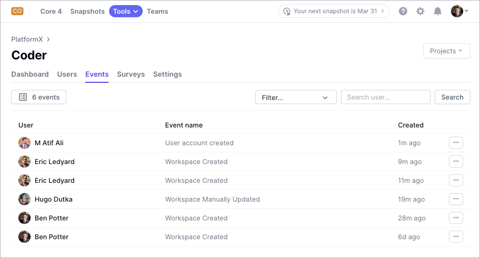

# DX PlatformX

[DX](https://getdx.com) is a developer intelligence platform used by engineering
leaders and platform engineers. Coder notifications can be transformed to
[PlatformX](https://getdx.com/platformx) events, allowing platform engineers to
measure activity and send pulse surveys to subsets of Coder users to understand
their experience.

## Requirements

You'll need:

- A running Coder v2.19+ deployment
- A PlatformX subscription from [DX](https://getdx.com/)
- A platform to host the integration (choose any of these):
  - AWS Lambda
  - Heroku
  - Kubernetes
  - Or any other platform that can run Python web applications

## Getting Started

Refer to the instructions in the
[coder-platformx-notifications](https://github.com/coder/coder-platformx-notifications)
repository to deploy a lightweight web server to forward Coder Notifications to
PlatformX.
