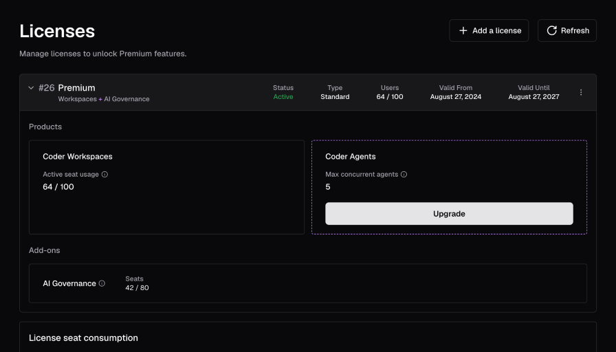
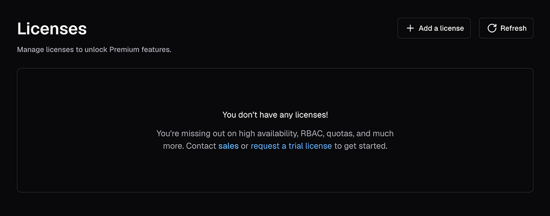
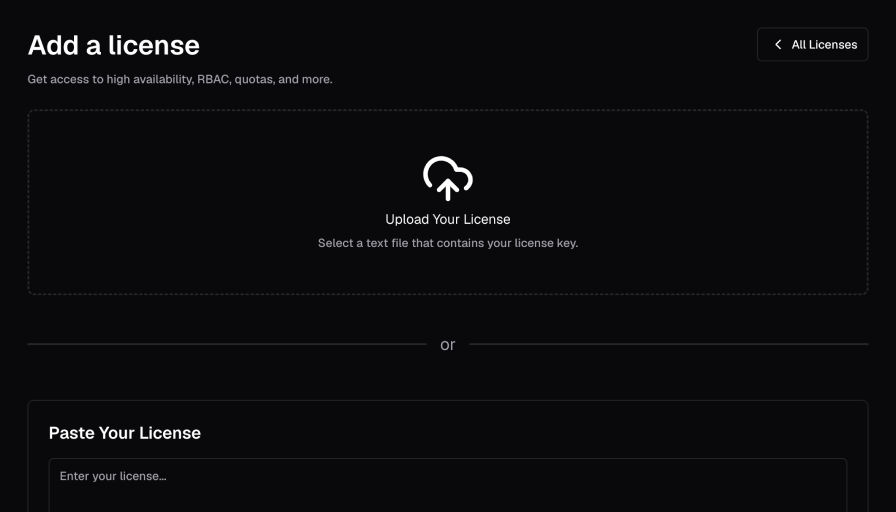
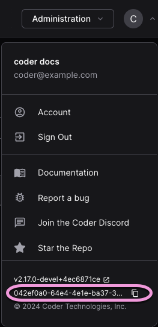

# Licensing

Some features are only accessible with a Premium license, including
[AI Governance](../../ai-coder/ai-governance.md). See our
[pricing page](https://coder.com/pricing) for more details. To try paid
features, you can [request a trial](https://coder.com/trial) or
[contact sales](https://coder.com/contact).



## Offline license validation

Coder license keys are signed JWTs that are validated locally using cryptographic
signatures. No outbound connection to Coder's servers is required for license
validation. This means licenses work in
[air-gapped and offline deployments](../../install/airgap.md) without any
additional configuration.

## Adding your license key

There are two ways to add a license to a Coder deployment:

<div class="tabs">

### Coder UI

1. With an `Owner` account, go to **Admin settings** > **Deployment**.

1. Select **Licenses** from the sidebar, then **Add a license**:

   

1. On the **Add a license** screen, drag your `.jwt` license file into the
   **Upload Your License** section, or paste your license in the
   **Paste Your License** text box, then select **Upload License**:

   

### Coder CLI

1. Ensure you have the [Coder CLI](../../install/cli.md) installed.
1. Save your license key to disk and make note of the path.
1. Open a terminal.
1. Log in to your Coder deployment:

   ```sh
   coder login <access url>
   ```

1. Run `coder licenses add`:

   - For a `.jwt` license file:

     ```sh
     coder licenses add -f <path to your license key>
     ```

   - For a text string:

     ```sh
     coder licenses add -l 1f5...765
     ```

</div>

## Usage data publishing

Some licenses enable publishing usage data to Coder's servers. The
`usage_publishing` object in `/api/v2/entitlements` reports whether publishing
is enabled and the health observed by the coderd process that serves the
request.

Coder shows an administrator warning after publishing fails continuously for
24 hours. The warning clears after the next publishing cycle that completes
without an error. A cycle with no events to publish is successful unless the
previous failure prevented Coder from saving publish results. In that case, a
later cycle must save results successfully to clear the warning.

The status is process-local and best effort. Its timestamps reset when coderd
restarts and can differ between replicas in a high availability deployment. If
publishing is disabled by the active licenses, both timestamps are null and
Coder does not show the warning.

## FAQ

### Find your deployment ID

You'll need your deployment ID to request a trial or license key.

From your Coder dashboard, select your user avatar, then select the **Copy to
clipboard** icon at the bottom:



### How we calculate license seat consumption

Licenses are consumed based on the status of user accounts.
Only users who have been active in the last 90 days consume license seats.

Consult the [user status documentation](../users/index.md#user-status) for more information about active, dormant, and suspended user statuses.
