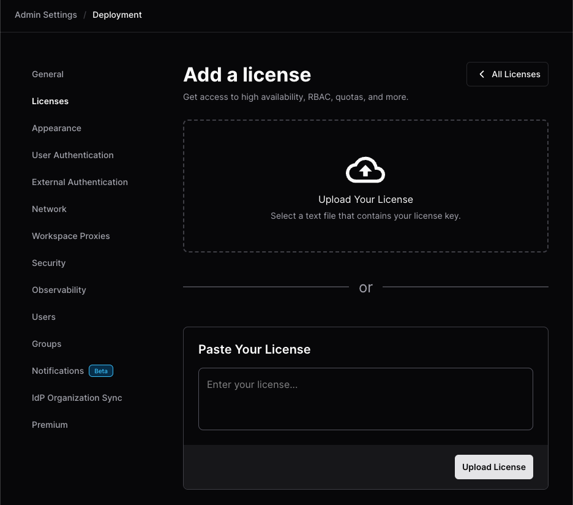
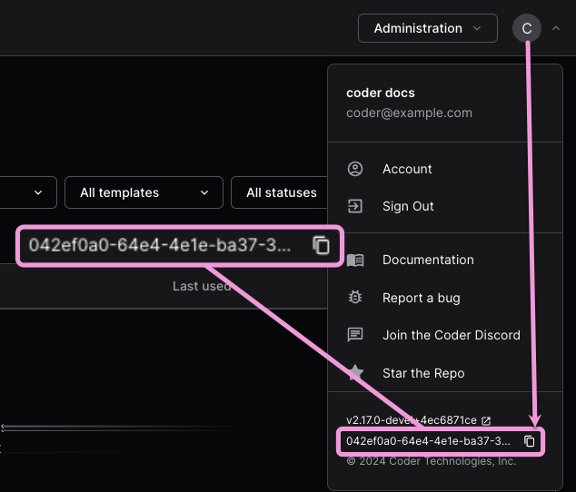

# Licensing

Some features are only accessible with a Premium or Enterprise license. See our
[pricing page](https://coder.com/pricing) for more details. To try Premium
features, you can [request a trial](https://coder.com/trial) or
[contact sales](https://coder.com/contact).

<!-- markdown-link-check-disable -->

> If you are an existing customer, you can learn more our new Premium plan in
> the [Coder v2.16 blog post](https://coder.com/blog/release-recap-2-16-0)

<!-- markdown-link-check-enable -->


## Adding your license key

There are two ways to add a license to a Coder deployment:

<div class="tabs">

### Coder UI

1. With an `Owner` account, go to **Admin settings** > **Deployment**.

1. Select **Licenses** from the sidebar, then **Add a license**:

   

1. On the **Add a license** screen, drag your `.jwt` license file into the
   **Upload Your License** section, or paste your license in the
   **Paste Your License** text box, then select **Upload License**:

   

### Coder CLI

1. Ensure you have the [Coder CLI](../../install/cli.md) installed.
1. Save your license key to disk and make note of the path.
1. Open a terminal.
1. Log in to your Coder deployment:

   ```shell
   coder login <access url>
   ```

1. Run `coder licenses add`:

   - For a `.jwt` license file:

     ```shell
     coder licenses add -f <path to your license key>
     ```

   - For a text string:

     ```sh
     coder licenses add -l 1f5...765
     ```

</div>

## FAQ

### Find your deployment ID

You'll need your deployment ID to request a trial or license key.

From your Coder dashboard, select your user avatar, then select the **Copy to
clipboard** icon at the bottom:



### How we calculate license seat consumption

Licenses are consumed based on the status of user accounts.
Only users who have been active in the last 90 days consume license seats.

Consult the [user status documentation](../users/index.md#user-status) for more information about active, dormant, and suspended user statuses.
