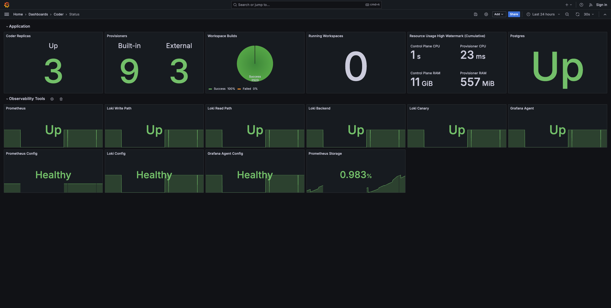

# Monitoring Coder

Learn about our the tools, techniques, and best practices to monitor your Coder
deployment.

## Quick Start: Observability Helm Chart

Deploy Prometheus, Grafana, Alert Manager, and pre-built dashboards on your
Kubernetes cluster to monitor the Coder control plane, provisioners, and
workspaces.

Learn how to install & read the docs on the
[Observability Helm Chart GitHub](https://github.com/coder/observability)

## Table of Contents

- [Logs](./logs.md): Learn how to access to Coder server logs, agent logs, and
  even how to expose Kubernetes pod scheduling logs.
- [Metrics](./metrics.md): Learn about the valuable metrics to measure on a
  Coder deployment, regardless of your monitoring stack.
- [Health Check](./health-check.md): Learn about the periodic health check and
  error codes that run on Coder deployments.
