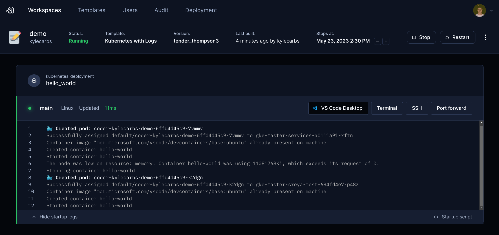

# Logs

All Coder services log to standard output, which can be critical for identifying
errors and monitoring Coder's deployment health. Like any service, logs can be
captured via Splunk, Datadog, Grafana Loki, or other ingestion tools.

## `coderd` Logs

By default, the Coder server exports human-readable logs to standard output. You
can access these logs via `kubectl logs deployment/coder -n <coder-namespace>`
on Kubernetes or `journalctl -u coder` if you deployed Coder on a host
machine/VM.

- To change the log format/location, you can set
  [`CODER_LOGGING_HUMAN`](../../reference/cli/server.md#--log-human) and
  [`CODER_LOGGING_JSON](../../reference/cli/server.md#--log-json) server config.
  options.
- To only display certain types of logs, use
  the[`CODER_LOG_FILTER`](../../reference/cli/server.md#-l---log-filter) server
  config.

Events such as server errors, audit logs, user activities, and SSO & OpenID
Connect logs are all captured in the `coderd` logs.

## `provisionerd` Logs

Logs for [external provisioners](../provisioners.md) are structured
[and configured](../../reference/cli/provisioner_start.md#--log-human) similarly
to `coderd` logs. Use these logs to troubleshoot and monitor the Terraform
operations behind workspaces and templates.

## Workspace Logs

The [Coder agent](../infrastructure/architecture.md#agents) inside workspaces
provides useful logs around workspace-to-server and client-to-workspace
connections. For Kubernetes workspaces, these are typically the pod logs as the
agent runs via the container entrypoint.

Agent logs are also stored in the workspace filesystem by default:

- macOS/Linux: `/tmp/coder-agent.log`
- Windows: Refer to the template code (e.g.
  [azure-windows](https://github.com/coder/coder/blob/2cfadad023cb7f4f85710cff0b21ac46bdb5a845/examples/templates/azure-windows/Initialize.ps1.tftpl#L64))
  to see where logs are stored.

> [!NOTE]
> Logs are truncated once they reach 5MB in size.

Startup script logs are also stored in the temporary directory of macOS and
Linux workspaces.

## Kubernetes Event Logs

Sometimes, a workspace may take a while to start or even fail to start due to
underlying events on the Kubernetes cluster such as a node being out of
resources or a missing image. You can install
[coder-logstream-kube](../integrations/kubernetes-logs.md) to stream Kubernetes
events to the Coder UI.

