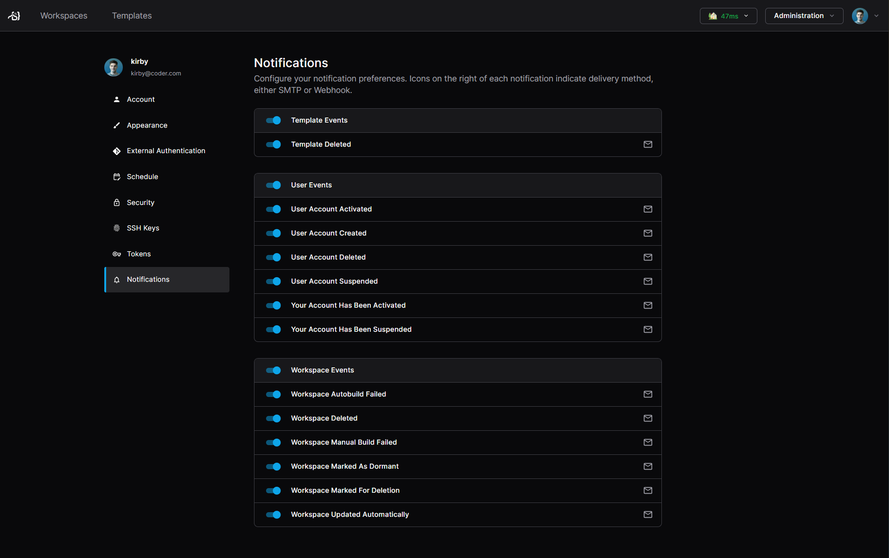
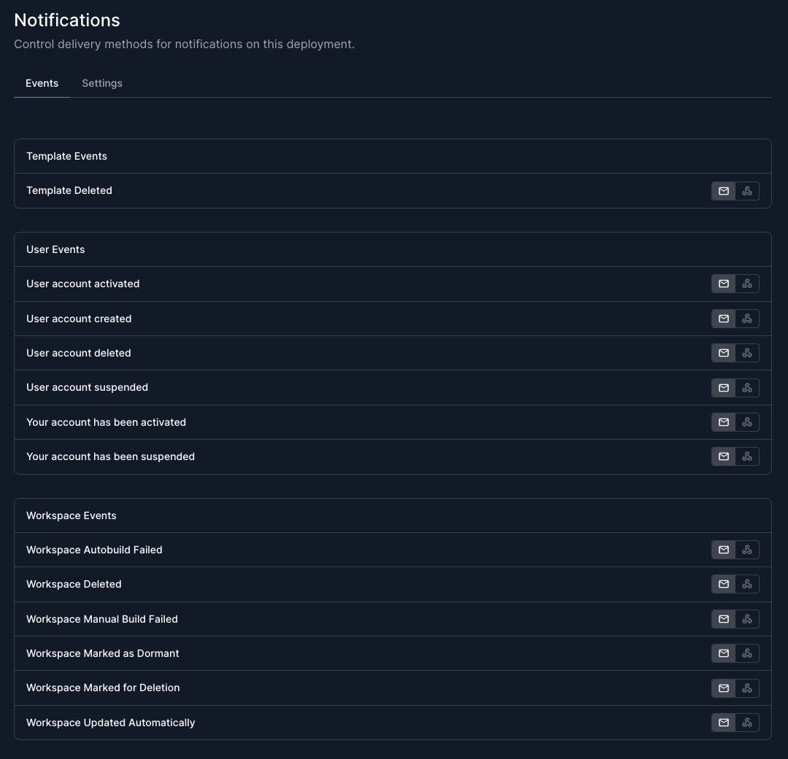
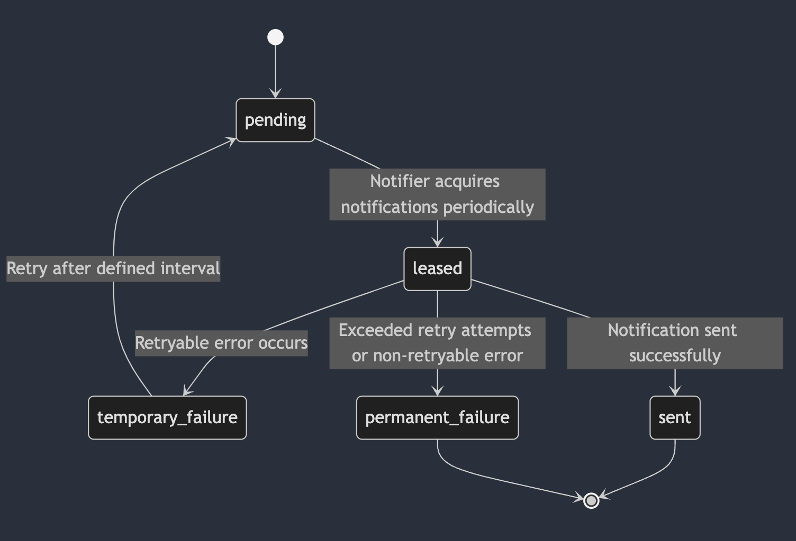

# Notifications

Notifications are sent by Coder in response to specific internal events, such as
a workspace being deleted or a user being created.

Available events may differ between versions.
For a list of all events, visit your Coder deployment's
`https://coder.example.com/deployment/notifications`.

## Event Types

Notifications are sent in response to internal events, to alert the affected
user(s) of the event.

Coder supports the following list of events:

### Workspace Events

These notifications are sent to the workspace owner:

- Workspace created
- Workspace deleted
- Workspace manual build failure
- Workspace automatic build failure
- Workspace manually updated
- Workspace automatically updated
- Workspace marked as dormant
- Workspace marked for deletion

### User Events

These notifications are sent to users with **owner** and **user admin** roles:

- User account created
- User account deleted
- User account suspended
- User account activated

These notifications are sent to users themselves:

- User account suspended
- User account activated
- User password reset (One-time passcode)

### Template Events

These notifications are sent to users with **template admin** roles:

- Template deleted
- Template deprecated
- Out of memory (OOM) / Out of disk (OOD)
  - [Configure](#configure-oomood-notifications) in the template `main.tf`.
- Report: Workspace builds failed for template
  - This notification is delivered as part of a weekly cron job and summarizes
    the failed builds for a given template.

## Configuration

You can modify the notification delivery behavior using the following server
flags.

| Required | CLI                                 | Env                                     | Type       | Description                                                                                                           | Default |
|:--------:|-------------------------------------|-----------------------------------------|------------|-----------------------------------------------------------------------------------------------------------------------|---------|
|    ✔️    | `--notifications-dispatch-timeout`  | `CODER_NOTIFICATIONS_DISPATCH_TIMEOUT`  | `duration` | How long to wait while a notification is being sent before giving up.                                                 | 1m      |
|    ✔️    | `--notifications-method`            | `CODER_NOTIFICATIONS_METHOD`            | `string`   | Which delivery method to use (available options: 'smtp', 'webhook'). See [Delivery Methods](#delivery-methods) below. | smtp    |
|    -️    | `--notifications-max-send-attempts` | `CODER_NOTIFICATIONS_MAX_SEND_ATTEMPTS` | `int`      | The upper limit of attempts to send a notification.                                                                   | 5       |

### Configure OOM/OOD notifications

You can monitor out of memory (OOM) and out of disk (OOD) errors and alert users
when they overutilize memory and disk.

This can help prevent agent disconnects due to OOM/OOD issues.

To enable OOM/OOD notifications on a template, follow the steps in the
[resource monitoring guide](../../templates/extending-templates/resource-monitoring.md).

## Delivery Methods

Notifications can currently be delivered by either SMTP or webhook. Each message
can only be delivered to one method, and this method is configured globally with
[`CODER_NOTIFICATIONS_METHOD`](../../../reference/cli/server.md#--notifications-method)
(default: `smtp`). When there are no delivery methods configured, notifications
will be disabled.

Premium customers can configure which method to use for each of the supported
[Events](#workspace-events); see the [Preferences](#delivery-preferences)
section below for more details.

## SMTP (Email)

Use the `smtp` method to deliver notifications by email to your users. Coder
does not ship with an SMTP server, so you will need to configure Coder to use an
existing one.

**Server Settings:**

| Required | CLI                 | Env                     | Type     | Description                                                     | Default   |
|:--------:|---------------------|-------------------------|---------|-----------------------------------------------------------------|-----------|
|    ✔️    | `--email-from`      | `CODER_EMAIL_FROM`      | `string` | The sender's address to use.                                    |           |
|    ✔️    | `--email-smarthost` | `CODER_EMAIL_SMARTHOST` | `string` | The SMTP relay to send messages (format: `hostname:port`)       |           |
|    ✔️    | `--email-hello`     | `CODER_EMAIL_HELLO`     | `string` | The hostname identifying the SMTP server.                       | localhost |

**Authentication Settings:**

| Required | CLI                          | Env                              | Type     | Description                                                               |
|:--------:|------------------------------|----------------------------------|----------|---------------------------------------------------------------------------|
|    -     | `--email-auth-username`      | `CODER_EMAIL_AUTH_USERNAME`      | `string` | Username to use with PLAIN/LOGIN authentication.                          |
|    -     | `--email-auth-password`      | `CODER_EMAIL_AUTH_PASSWORD`      | `string` | Password to use with PLAIN/LOGIN authentication.                          |
|    -     | `--email-auth-password-file` | `CODER_EMAIL_AUTH_PASSWORD_FILE` | `string` | File from which to load password for use with PLAIN/LOGIN authentication. |
|    -     | `--email-auth-identity`      | `CODER_EMAIL_AUTH_IDENTITY`      | `string` | Identity to use with PLAIN authentication.                                |

**TLS Settings:**

| Required | CLI                         | Env                           | Type     | Description                                                                                                                                                        | Default |
|:--------:|-----------------------------|-------------------------------|----------|--------------------------------------------------------------------------------------------------------------------------------------------------------------------|---------|
|    -     | `--email-force-tls`         | `CODER_EMAIL_FORCE_TLS`       | `bool`   | Force a TLS connection to the configured SMTP smarthost. If port 465 is used, TLS will be forced. See <https://datatracker.ietf.org/doc/html/rfc8314#section-3.3>. | false   |
|    -     | `--email-tls-starttls`      | `CODER_EMAIL_TLS_STARTTLS`    | `bool`   | Enable STARTTLS to upgrade insecure SMTP connections using TLS. Ignored if `CODER_EMAIL_FORCE_TLS` is set.                                           | false   |
|    -     | `--email-tls-skip-verify`   | `CODER_EMAIL_TLS_SKIPVERIFY`  | `bool`   | Skip verification of the target server's certificate (**insecure**).                                                                                               | false   |
|    -     | `--email-tls-server-name`   | `CODER_EMAIL_TLS_SERVERNAME`  | `string` | Server name to verify against the target certificate.                                                                                                              |         |
|    -     | `--email-tls-cert-file`     | `CODER_EMAIL_TLS_CERTFILE`    | `string` | Certificate file to use.                                                                                                                                           |         |
|    -     | `--email-tls-cert-key-file` | `CODER_EMAIL_TLS_CERTKEYFILE` | `string` | Certificate key file to use.                                                                                                                                       |         |

**NOTE:** you _MUST_ use `CODER_EMAIL_FORCE_TLS` if your smarthost supports TLS
on a port other than `465`.

### Send emails using G-Suite

After setting the required fields above:

1. Create an [App Password](https://myaccount.google.com/apppasswords) using the
   account you wish to send from.

1. Set the following configuration options:

   ```text
   CODER_EMAIL_SMARTHOST=smtp.gmail.com:465
   CODER_EMAIL_AUTH_USERNAME=<user>@<domain>
   CODER_EMAIL_AUTH_PASSWORD="<app password created above>"
   ```

See
[this help article from Google](https://support.google.com/a/answer/176600?hl=en)
for more options.

### Send emails using Outlook.com

After setting the required fields above:

1. Set up an account on Microsoft 365 or outlook.com
1. Set the following configuration options:

   ```text
   CODER_EMAIL_SMARTHOST=smtp-mail.outlook.com:587
   CODER_EMAIL_TLS_STARTTLS=true
   CODER_EMAIL_AUTH_USERNAME=<user>@<domain>
   CODER_EMAIL_AUTH_PASSWORD="<account password>"
   ```

See
[this help article from Microsoft](https://support.microsoft.com/en-us/office/pop-imap-and-smtp-settings-for-outlook-com-d088b986-291d-42b8-9564-9c414e2aa040)
for more options.

## Webhook

The webhook delivery method sends an HTTP POST request to the defined endpoint.
The purpose of webhook notifications is to enable integrations with other
systems.

**Settings**:

| Required | CLI                                | Env                                    | Type  | Description                             |
|:--------:|------------------------------------|----------------------------------------|-------|-----------------------------------------|
|    ✔️    | `--notifications-webhook-endpoint` | `CODER_NOTIFICATIONS_WEBHOOK_ENDPOINT` | `url` | The endpoint to which to send webhooks. |

Here is an example payload for Coder's webhook notification:

```json
{
    "_version": "1.0",
    "msg_id": "88750cad-77d4-4663-8bc0-f46855f5019b",
    "payload": {
        "_version": "1.0",
        "notification_name": "Workspace Deleted",
        "user_id": "4ac34fcb-8155-44d5-8301-e3cd46e88b35",
        "user_email": "danny@coder.com",
        "user_name": "danny",
        "user_username": "danny",
        "actions": [
            {
                "label": "View workspaces",
                "url": "https://et23ntkhpueak.pit-1.try.coder.app/workspaces"
            },
            {
                "label": "View templates",
                "url": "https://et23ntkhpueak.pit-1.try.coder.app/templates"
            }
        ],
        "labels": {
            "initiator": "danny",
            "name": "my-workspace",
            "reason": "initiated by user"
        }
    },
    "title": "Workspace \"my-workspace\" deleted",
    "body": "Hi danny\n\nYour workspace my-workspace was deleted.\nThe specified reason was \"initiated by user (danny)\"."
}
```

The top-level object has these keys:

- `_version`: describes the version of this schema; follows semantic versioning
- `msg_id`: the UUID of the notification (matches the ID in the
  `notification_messages` table)
- `payload`: contains the specific details of the notification; described below
- `title`: the title of the notification message (equivalent to a subject in
  SMTP delivery)
- `body`: the body of the notification message (equivalent to the message body
  in SMTP delivery)

The `payload` object has these keys:

- `_version`: describes the version of this inner schema; follows semantic
  versioning
- `notification_name`: name of the event which triggered the notification
- `user_id`: Coder internal user identifier of the target user (UUID)
- `user_email`: email address of the target user
- `user_name`: name of the target user
- `user_username`: username of the target user
- `actions`: a list of CTAs (Call-To-Action); these are mainly relevant for SMTP
  delivery in which they're shown as buttons
- `labels`: dynamic map of zero or more string key-value pairs; these vary from
  event to event

## User Preferences

All users have the option to opt-out of any notifications. Go to **Account** ->
**Notifications** to turn notifications on or off. The delivery method for each
notification is indicated on the right hand side of this table.



## Delivery Preferences

> [!NOTE]
> Delivery preferences is an Enterprise and Premium feature.
> [Learn more](https://coder.com/pricing#compare-plans).

Administrators can configure which delivery methods are used for each different
[event type](#event-types).



You can find this page under
`https://$CODER_ACCESS_URL/deployment/notifications?tab=events`.

## Stop sending notifications

Administrators may wish to stop _all_ notifications across the deployment. We
support a killswitch in the CLI for these cases.

To pause sending notifications, execute
[`coder notifications pause`](../../../reference/cli/notifications_pause.md).

To resume sending notifications, execute
[`coder notifications resume`](../../../reference/cli/notifications_resume.md).

## Troubleshooting

If notifications are not being delivered, use the following methods to
troubleshoot:

1. Ensure notifications are being added to the `notification_messages` table.
1. Review any available error messages in the `status_reason` column
1. Review the logs. Search for the term `notifications` for diagnostic information.

   - If you do not see any relevant logs, set
    `CODER_VERBOSE=true` or `--verbose` to output debug logs.
1. If you are on version 2.15.x, notifications must be enabled using the
    `notifications`
    [experiment](../../../about/feature-stages.md#early-access-features).

    Notifications are enabled by default in Coder v2.16.0 and later.

## Internals

The notification system is built to operate concurrently in a single- or
multi-replica Coder deployment, and has a built-in retry mechanism. It uses the
configured Postgres database to store notifications in a queue and facilitate
concurrency.

All messages are stored in the `notification_messages` table.

Messages older than seven days are deleted.

### Message States



_A notifier here refers to a Coder replica which is responsible for dispatching
the notification. All running replicas act as notifiers to process pending
messages._

- a message begins in `pending` state
- transitions to `leased` when a Coder replica acquires new messages from the
  database
  - new messages are checked for every `CODER_NOTIFICATIONS_FETCH_INTERVAL`
    (default: 15s)
- if a message is delivered successfully, it transitions to `sent` state
- if a message encounters a non-retryable error (e.g. misconfiguration), it
  transitions to `permanent_failure`
- if a message encounters a retryable error (e.g. temporary server outage), it
  transitions to `temporary_failure`
  - this message will be retried up to `CODER_NOTIFICATIONS_MAX_SEND_ATTEMPTS`
    (default: 5)
  - this message will transition back to `pending` state after
    `CODER_NOTIFICATIONS_RETRY_INTERVAL` (default: 5m) and be retried
  - after `CODER_NOTIFICATIONS_MAX_SEND_ATTEMPTS` is exceeded, it transitions to
    `permanent_failure`

See [Troubleshooting](#troubleshooting) above for more details.
