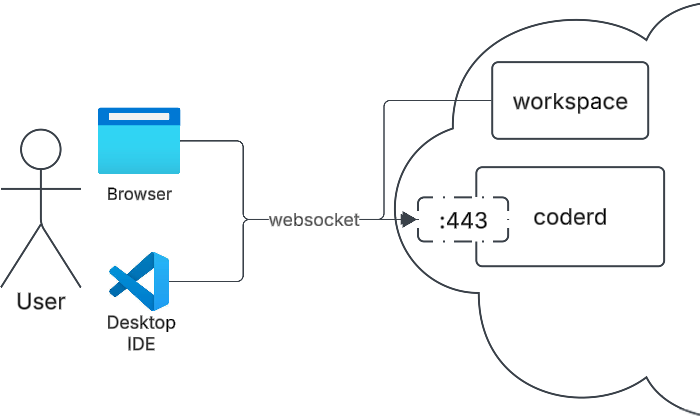

# Networking

The pages in this section outline Coder's networking stack and how aspects
connect to or interact with each other.

This page is a high-level reference of Coder's network topology, requirements,
and connection types.



For more in-depth information, visit our docs on [connections and geo-distribution](./more-networking/index.md) or [the underlying networking stack and Coder agent](./more-networking/underlying-stack.md), or use the [troubleshooting doc](./troubleshooting.md) for ways to resolve common issues.

## Coder server, workspaces, users

Coder's network topology has three general types of nodes or ways of interacting
with Coder:

- Coder servers
- Workspaces
- Users

The Coder server must have an inbound address reachable by users and workspaces,
but otherwise, all topologies _just work_ with Coder.

When possible, we establish direct connections between users and workspaces.
Direct connections are as fast as connecting to the workspace outside of Coder.
When NAT traversal fails, connections are relayed through the Coder server. All
user-workspace connections are end-to-end encrypted.

[Tailscale](https://tailscale.com)'s implementation of
[Wireguard](https://www.wireguard.com/) backs our websocket/HTTPS networking logic.

## Requirements

Coder’s networking is designed to support a wide range of infrastructure targets.
Because of that, there are very few requirements for running Coder in your network:

- The central server (coderd) needs port 443 to be open for HTTPS and websocket traffic
- Workspaces, clients (developer laptops), and provisioners only need to reach the Coder server and establish a websocket connection. No ports need to be open.

In order for clients and workspaces to be able to connect:

- All clients and agents must be able to establish a connection to the Coder
  server (`CODER_ACCESS_URL`) over HTTP/HTTPS.
- Any reverse proxy or ingress between the Coder control plane and
  clients/agents must support WebSockets.

## Coder server

Workspaces connect to the Coder server via the server's external address, set
via [`ACCESS_URL`](../../admin/setup/index.md#access-url). There must not be a
NAT between workspaces and the Coder server.

Users connect to the Coder server's dashboard and API through its `ACCESS_URL`
as well. There must not be a NAT between users and the Coder server.

Template admins can overwrite the site-wide access URL at the template level by
leveraging the `url` argument when
[defining the Coder provider](https://registry.terraform.io/providers/coder/coder/latest/docs#url):

```terraform
provider "coder" {
  url = "https://coder.namespace.svc.cluster.local"
}
```

This is useful when debugging connectivity issues between the workspace agent
and the Coder server.

## Web Apps

The Coder server relays dashboard-initiated connections between the user and
the workspace.
Connections between the web terminal and workspace are an exception and may be
direct.

In general, [port forwarded](./port-forwarding.md) web apps are faster than
dashboard-accessed web apps.

## Up next

- Learn about [Port Forwarding](./port-forwarding.md)
- Troubleshoot [Networking Issues](./troubleshooting.md)
