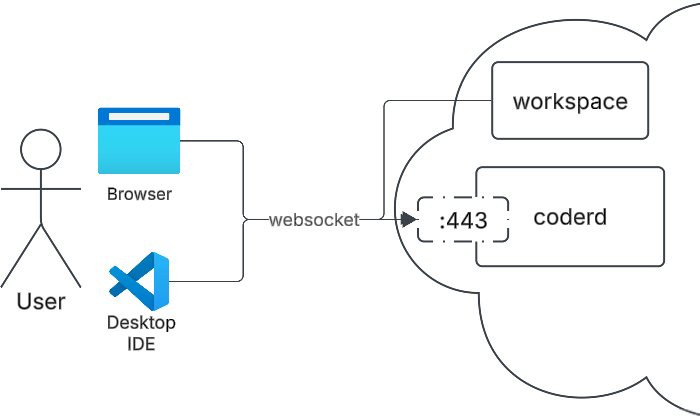

# Networking

The pages in this section outline Coder's networking stack and how aspects
connect to or interact with each other.

This page is a high-level reference of Coder's network topology, requirements,
and connection types.



For more in-depth information, visit our docs on [connections and geo-distribution](./more-networking/index.md) or [the underlying networking stack and Coder agent](./more-networking/underlying-stack.md), or use the [troubleshooting doc](./troubleshooting.md) for ways to resolve common issues.

## Coder server, workspaces, users

Coder's network topology has three general types of nodes or ways of interacting
with Coder:

- Coder servers
- Workspaces
- Users

The Coder server must have an inbound address reachable by users and workspaces,
but otherwise, all topologies _just work_ with Coder.

When possible, we establish direct connections between users and workspaces.
Direct connections are as fast as connecting to the workspace outside of Coder.
When NAT traversal fails, connections are relayed through the Coder server. All
user-workspace connections are end-to-end encrypted.

[Tailscale](https://tailscale.com)'s implementation of
[Wireguard](https://www.wireguard.com/) backs our websocket/HTTPS networking logic.

## Requirements

Coder’s networking is designed to support a wide range of infrastructure targets.
Because of that, there are very few requirements for running Coder in your network:

- The central server (coderd) needs port 443 to be open for HTTPS and websocket traffic
- Workspaces, clients (developer laptops), and provisioners only need to reach the Coder server and establish a websocket connection. No ports need to be open.

In order for clients and workspaces to be able to connect:

- All clients and agents must be able to establish a connection to the Coder
  server (`CODER_ACCESS_URL`) over HTTP/HTTPS.
- Any reverse proxy or ingress between the Coder control plane and
  clients/agents must support WebSockets.

## Coder server

Workspaces connect to the Coder server via the server's external address, set
via [`ACCESS_URL`](../../admin/setup/index.md#access-url). There must not be a
NAT between workspaces and the Coder server.

Users connect to the Coder server's dashboard and API through its `ACCESS_URL`
as well. There must not be a NAT between users and the Coder server.

Template admins can overwrite the site-wide access URL at the template level by
leveraging the `url` argument when
[defining the Coder provider](https://registry.terraform.io/providers/coder/coder/latest/docs#url):

```terraform
provider "coder" {
  url = "https://coder.namespace.svc.cluster.local"
}
```

This is useful when debugging connectivity issues between the workspace agent
and the Coder server.

## Web Apps

The Coder server relays dashboard-initiated connections between the user and
the workspace.
Connections between the web terminal and workspace are an exception and may be
direct.

In general, [port forwarded](./port-forwarding.md) web apps are faster than
dashboard-accessed web apps.

## Latency

Coder measures and reports several types of latency, providing insights into the performance of your deployment. Understanding these metrics can help you diagnose issues and optimize the user experience.

There are three main types of latency metrics for your Coder deployment:

- Dashboard-to-server latency:
  
  The Coder UI measures round-trip time to the Coder server using the browser's Performance API.
  
  This appears in the user interface next to your username, showing how responsive the dashboard is.

- Workspace connection latency:
  
  When users connect to workspaces, Coder measures and displays the latency between the user and:
  - Workspace (direct P2P connection when possible)
  - DERP relay servers (when P2P isn't possible)

  This latency is visible in workspace cards and resource pages. It shows the round-trip time in milliseconds.

- Database latency:
  
  For administrators, Coder monitors and reports database query performance in the health dashboard.

### How latency is classified

Latency measurements are color-coded in the dashboard:

- **Green** (<150ms): Good performance.
- **Yellow** (150-300ms): Moderate latency that might affect user experience.
- **Red** (>300ms): High latency that will noticeably affect user experience.

### View latency information

- **Dashboard**: The global latency indicator appears in the top navigation bar.
- **Workspace list**: Each workspace shows its connection latency.
- **Health dashboard**: Administrators can view advanced metrics including database latency.
- **CLI**: Use `coder ping <workspace>` to measure and analyze latency from the command line.

### Factors that affect latency

- **Geographic distance**: Physical distance between users, Coder server, and workspaces.
- **Network connectivity**: Quality of internet connections and routing.
- **Infrastructure**: Cloud provider regions and network optimization.
- **P2P connectivity**: Whether direct connections can be established or relays are needed.

### How to optimize latency

To improve latency and user experience:

- **Deploy workspace proxies**: Place [proxies](./workspace-proxies.md) in regions closer to users.
- **Use P2P connections**: Ensure network configurations permit direct connections.
- **Regional deployments**: Place Coder servers in regions where most users work.
- **Network configuration**: Optimize routing between users and workspaces.
- **Check firewall rules**: Ensure they don't block necessary Coder connections.

For help troubleshooting connection issues, including latency problems, refer to the [networking troubleshooting guide](./troubleshooting.md).

## Up next

- Troubleshoot [Networking Issues](./troubleshooting.md)
- [More about Coder networking](./more-networking/index.md)
- [Underlying networking stack](./more-networking/underlying-stack.md)
- Learn about [Port Forwarding](./port-forwarding.md)
