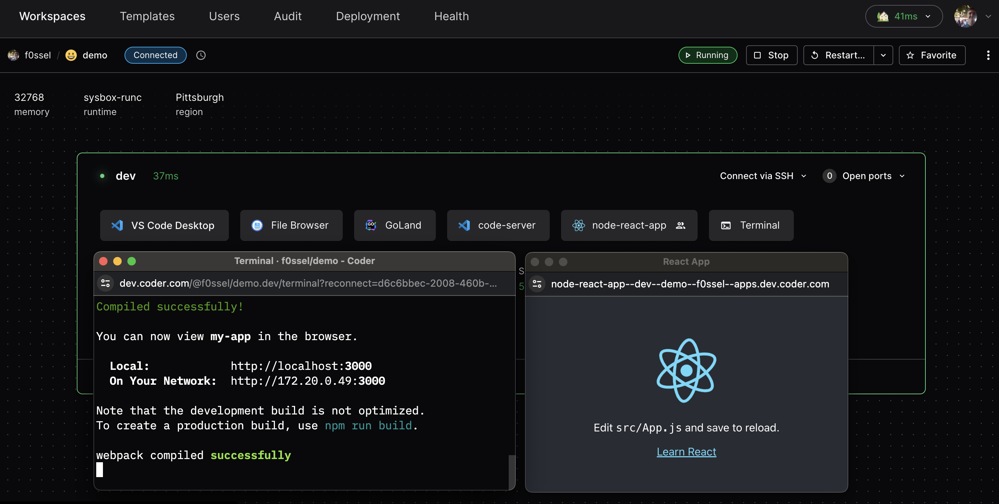
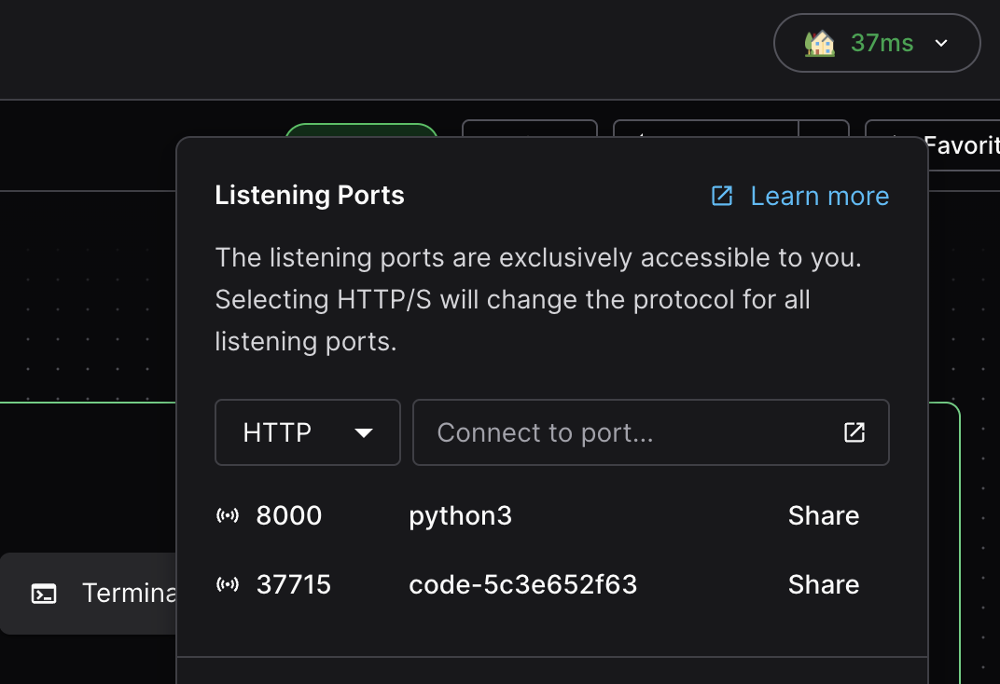
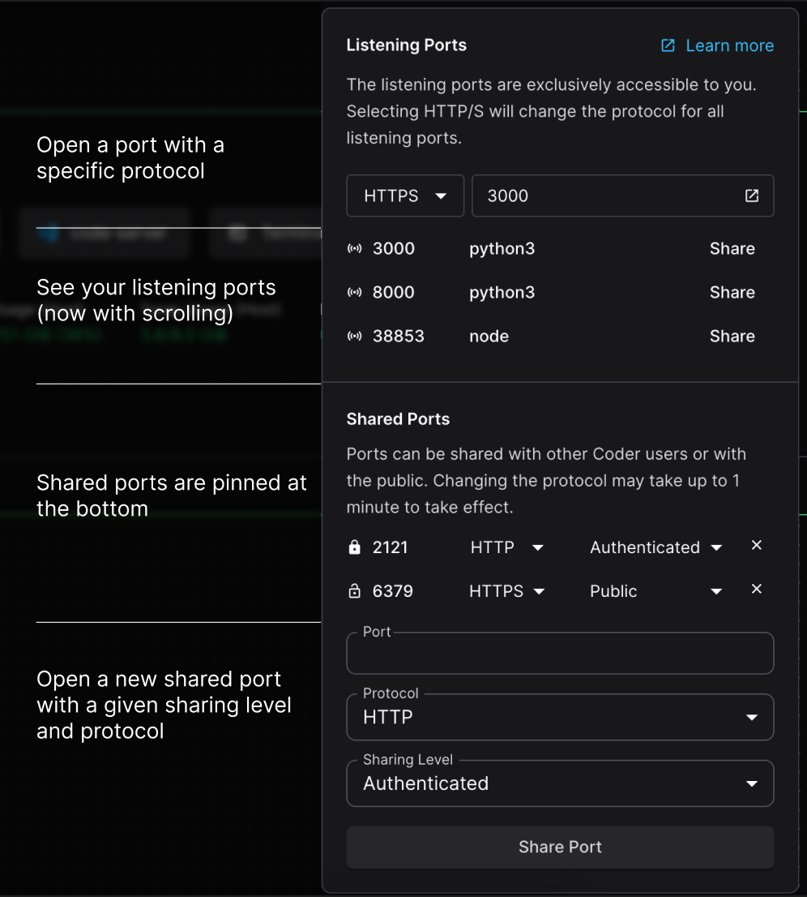
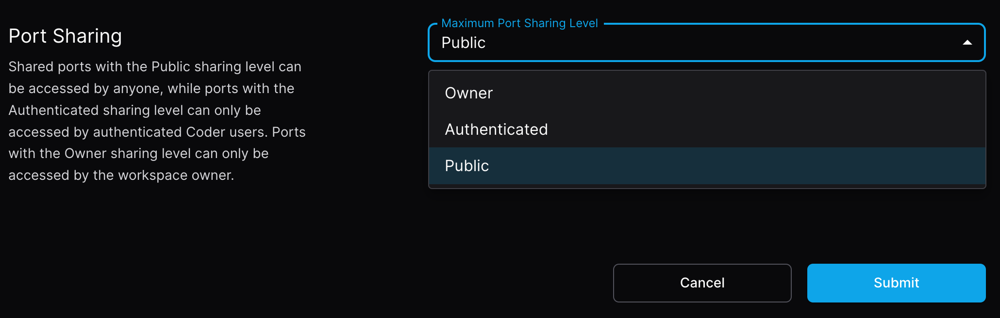

# Port Forwarding

Port forwarding lets developers securely access processes on their Coder
workspace from a local machine. A common use case is testing web applications in
a browser.

There are three ways to forward ports in Coder:

- The `coder port-forward` command
- Dashboard
- SSH

The `coder port-forward` command is generally more performant than:

1. The Dashboard which proxies traffic through the Coder control plane versus
   peer-to-peer which is possible with the Coder CLI
1. `sshd` which does double encryption of traffic with both Wireguard and SSH

## The `coder port-forward` command

This command can be used to forward TCP or UDP ports from the remote workspace
so they can be accessed locally. Both the TCP and UDP command line flags
(`--tcp` and `--udp`) can be given once or multiple times.

The supported syntax variations for the `--tcp` and `--udp` flag are:

- Single port with optional remote port: `local_port[:remote_port]`
- Comma separation `local_port1,local_port2`
- Port ranges `start_port-end_port`
- Any combination of the above

### Examples

Forward the remote TCP port `8080` to local port `8000`:

```console
coder port-forward myworkspace --tcp 8000:8080
```

Forward the remote TCP port `3000` and all ports from `9990` to `9999` to their
respective local ports.

```console
coder port-forward myworkspace --tcp 3000,9990-9999
```

For more examples, see `coder port-forward --help`.

## Dashboard

> To enable port forwarding via the dashboard, Coder must be configured with a
> [wildcard access URL](../../admin/setup/index.md#wildcard-access-url). If an
> access URL is not specified, Coder will create
> [a publicly accessible URL](../../admin/setup/index.md#tunnel) to reverse
> proxy the deployment, and port forwarding will work.
>
> There is a
> [DNS limitation](https://datatracker.ietf.org/doc/html/rfc1035#section-2.3.1)
> where each segment of hostnames must not exceed 63 characters. If your app
> name, agent name, workspace name and username exceed 63 characters in the
> hostname, port forwarding via the dashboard will not work.

### From an coder_app resource

One way to port forward is to configure a `coder_app` resource in the
workspace's template. This approach shows a visual application icon in the
dashboard. See the following `coder_app` example for a Node React app and note
the `subdomain` and `share` settings:

```tf
# node app
resource "coder_app" "node-react-app" {
  agent_id  = coder_agent.dev.id
  slug      = "node-react-app"
  icon      = "https://upload.wikimedia.org/wikipedia/commons/a/a7/React-icon.svg"
  url       = "http://localhost:3000"
  subdomain = true
  share     = "authenticated"

  healthcheck {
    url       = "http://localhost:3000/healthz"
    interval  = 10
    threshold = 30
  }

}
```

Valid `share` values include `owner` - private to the user, `authenticated` -
accessible by any user authenticated to the Coder deployment, and `public` -
accessible by users outside of the Coder deployment.



## Accessing workspace ports

Another way to port forward in the dashboard is to use the "Open Ports" button
to specify an arbitrary port. Coder will also detect if apps inside the
workspace are listening on ports, and list them below the port input (this is
only supported on Windows and Linux workspace agents).



### Sharing ports

We allow developers to share ports as URLs, either with other authenticated
coder users or publicly. Using the open ports interface, developers can assign a
sharing levels that match our `coder_app`’s share option in
[Coder terraform provider](https://registry.terraform.io/providers/coder/coder/latest/docs/resources/app#share).

- `owner` (Default): The implicit sharing level for all listening ports, only
  visible to the workspace owner
- `authenticated`: Accessible by other authenticated Coder users on the same
  deployment.
- `public`: Accessible by any user with the associated URL.

Once a port is shared at either `authenticated` or `public` levels, it will stay
pinned in the open ports UI for better accessibility regardless of whether or
not it is still accessible.



The sharing level is limited by the maximum level enforced in the template
settings in premium deployments, and not restricted in OSS deployments.

This can also be used to change the sharing level of `coder_app`s by entering
their port number in the sharable ports UI. The `share` attribute on `coder_app`
resource uses a different method of authentication and **is not impacted by the
template's maximum sharing level**, nor the level of a shared port that points
to the app.

### Configure maximum port sharing level

<blockquote class="info">

Configuring port sharing level is an Enterprise and Premium feature.
[Learn more](https://coder.com/pricing#compare-plans).

</blockquote>

Premium-licensed template admins can control the maximum port sharing level for
workspaces under a given template in the template settings. By default, the
maximum sharing level is set to `Owner`, meaning port sharing is disabled for
end-users. OSS deployments allow all workspaces to share ports at both the
`authenticated` and `public` levels.



### Configuring port protocol

Both listening and shared ports can be configured to use either `HTTP` or
`HTTPS` to connect to the port. For listening ports the protocol selector
applies to any port you input or select from the menu. Shared ports have
protocol configuration for each shared port individually.

You can access any port on the workspace and can configure the port protocol
manually by appending a `s` to the port in the URL.

```text
# Uses HTTP
https://33295--agent--workspace--user--apps.example.com/
# Uses HTTPS
https://33295s--agent--workspace--user--apps.example.com/
```

### Cross-origin resource sharing (CORS)

When forwarding via the dashboard, Coder automatically sets headers that allow
requests between separately forwarded applications belonging to the same user.

When forwarding through other methods the application itself will need to set
its own CORS headers if they are being forwarded through different origins since
Coder does not intercept these cases. See below for the required headers.

#### Authentication

Since ports forwarded through the dashboard are private, cross-origin requests
must include credentials (set `credentials: "include"` if using `fetch`) or the
requests cannot be authenticated and you will see an error resembling the
following:

> Access to fetch at
> '<https://coder.example.com/api/v2/applications/auth-redirect>' from origin
> '<https://8000--dev--user--apps.coder.example.com>' has been blocked by CORS
> policy: No 'Access-Control-Allow-Origin' header is present on the requested
> resource. If an opaque response serves your needs, set the request's mode to
> 'no-cors' to fetch the resource with CORS disabled.

#### Headers

Below is a list of the cross-origin headers Coder sets with example values:

```text
access-control-allow-credentials: true
access-control-allow-methods: PUT
access-control-allow-headers: X-Custom-Header
access-control-allow-origin: https://8000--dev--user--apps.coder.example.com
vary: Origin
vary: Access-Control-Request-Method
vary: Access-Control-Request-Headers
```

The allowed origin will be set to the origin provided by the browser if the
users are identical. Credentials are allowed and the allowed methods and headers
will echo whatever the request sends.

#### Configuration

These cross-origin headers are not configurable by administrative settings.

If applications set any of the above headers they will be stripped from the
response except for `Vary` headers that are set to a value other than the ones
listed above.

In other words, CORS behavior through the dashboard is not currently
configurable by either admins or users.

#### Allowed by default

<table class="tg">
<thead>
  <tr>
    <th class="tg-0pky" rowspan="2"></th>
    <th class="tg-0pky" rowspan="3"></th>
    <th class="tg-0pky">From</th>
    <th class="tg-0pky" colspan="3">Alice</th>
    <th class="tg-0pky">Bob</th>
  </tr>
  <tr>
    <th class="tg-0pky" rowspan="2"></th>
    <th class="tg-0pky">Workspace 1</th>
    <th class="tg-0pky" colspan="2">Workspace 2</th>
    <th class="tg-0pky">Workspace 3</th>
  </tr>
  <tr>
    <th class="tg-0pky">To</th>
    <th class="tg-0pky">App A</th>
    <th class="tg-0pky">App B</th>
    <th class="tg-0pky">App C</th>
    <th class="tg-0pky">App D</th>
  </tr>
</thead>
<tbody>
  <tr>
    <td class="tg-0pky" rowspan="3">Alice</td>
    <td class="tg-0pky" rowspan="2">Workspace 1</td>
    <td class="tg-0pky">App A</td>
    <td class="tg-0pky">✅</td>
    <td class="tg-0pky">✅<span style="font-weight:400;font-style:normal">*</span></td>
    <td class="tg-0pky">✅<span style="font-weight:400;font-style:normal">*</span></td>
    <td class="tg-0pky">❌</td>
  </tr>
  <tr>
    <td class="tg-0pky">App B</td>
    <td class="tg-0pky">✅*</td>
    <td class="tg-0pky">✅</td>
    <td class="tg-0pky">✅<span style="font-weight:400;font-style:normal">*</span></td>
    <td class="tg-0pky">❌</td>
  </tr>
  <tr>
    <td class="tg-0pky">Workspace 2</td>
    <td class="tg-0pky">App C</td>
    <td class="tg-0pky">✅<span style="font-weight:400;font-style:normal">*</span></td>
    <td class="tg-0pky">✅<span style="font-weight:400;font-style:normal">*</span></td>
    <td class="tg-0pky">✅</td>
    <td class="tg-0pky">❌</td>
  </tr>
  <tr>
    <td class="tg-0pky">Bob</td>
    <td class="tg-0pky">Workspace 3</td>
    <td class="tg-0pky">App D</td>
    <td class="tg-0pky">❌</td>
    <td class="tg-0pky">❌</td>
    <td class="tg-0pky">❌</td>
    <td class="tg-0pky">✅</td>
  </tr>
</tbody>
</table>

> '\*' means `credentials: "include"` is required

## SSH

First,
[configure SSH](../../user-guides/workspace-access/index.md#configure-ssh) on
your local machine. Then, use `ssh` to forward like so:

```console
ssh -L 8080:localhost:8000 coder.myworkspace
```

You can read more on SSH port forwarding
[here](https://www.ssh.com/academy/ssh/tunneling/example).
