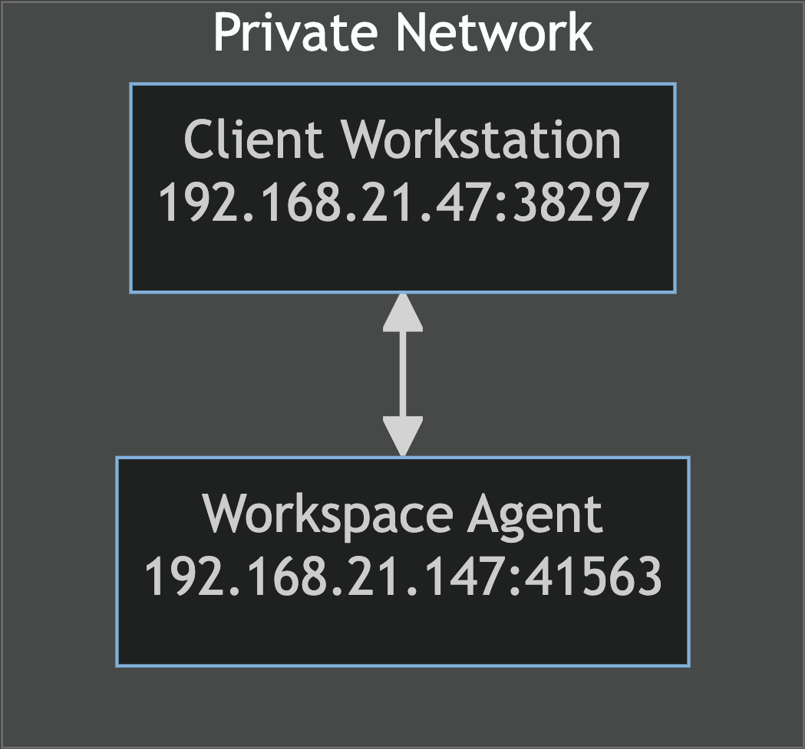
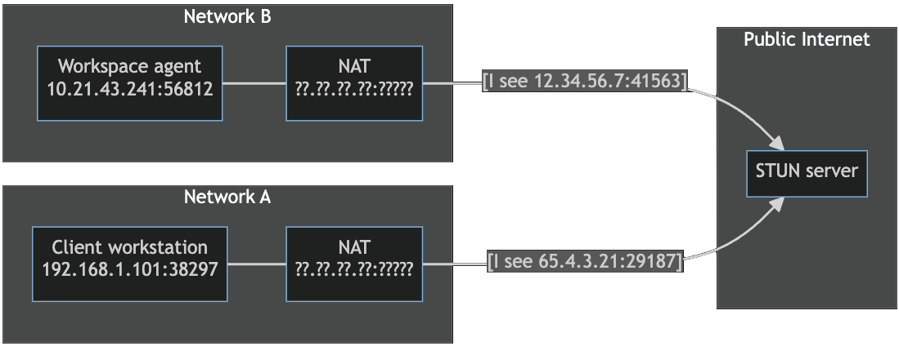
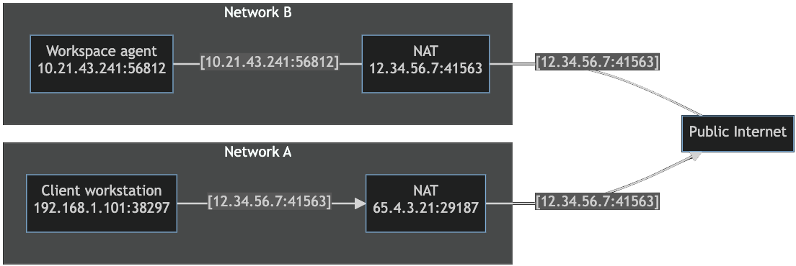
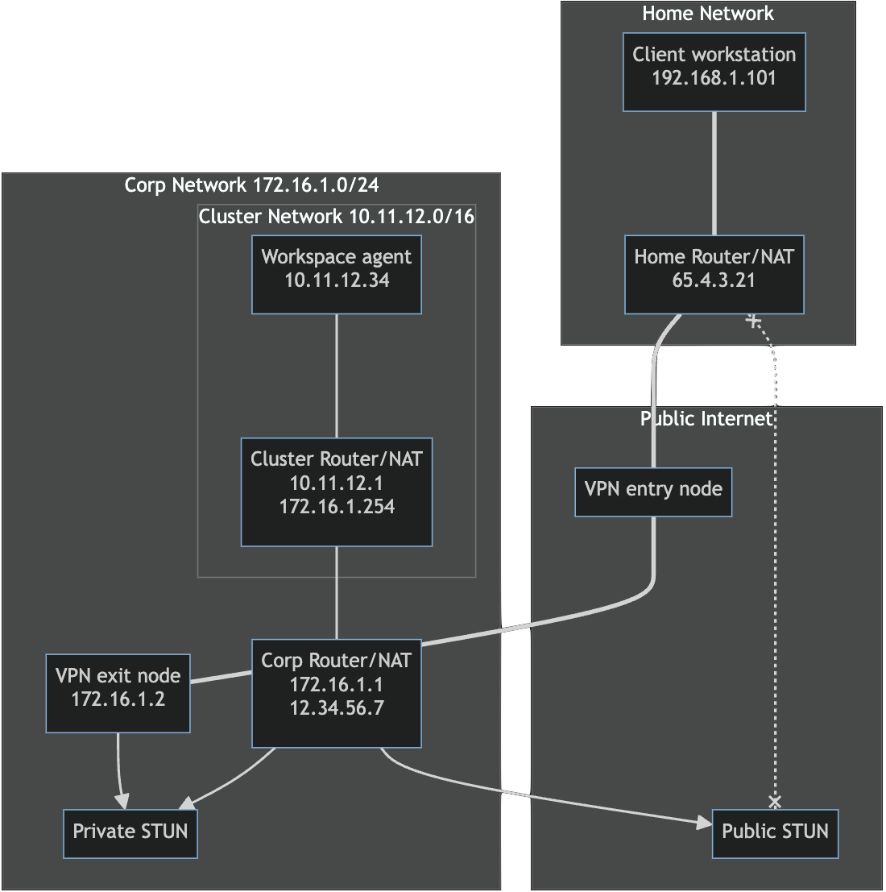

# STUN and NAT

[Session Traversal Utilities for NAT (STUN)](https://www.rfc-editor.org/rfc/rfc8489.html)
is a protocol used to assist applications in establishing peer-to-peer
communications across Network Address Translations (NATs) or firewalls.

[Network Address Translation (NAT)](https://en.wikipedia.org/wiki/Network_address_translation)
is commonly used in private networks to allow multiple devices to share a
single public IP address. The vast majority of home and corporate internet
connections use at least one level of NAT.

## Overview

In order for one application to connect to another across a network, the
connecting application needs to know the IP address and port under which the
target application is reachable. If both applications reside on the same
network, then they can most likely connect directly to each other. In the
context of a Coder workspace agent and client, this is generally not the case,
as both agent and client will most likely be running in different _private_
networks (e.g. `192.168.1.0/24`). In this case, at least one of the two will
need to know an IP address and port under which they can reach their
counterpart.

This problem is often referred to as NAT traversal, and Coder uses a standard
protocol named STUN to address this.

Inside of that network, packets from the agent or client will show up as having
source address `192.168.1.X:12345`. However, outside of this private network,
the source address will show up differently (for example, `12.3.4.56:54321`). In
order for the Coder client and agent to establish a direct connection with each
other, one of them needs to know the `ip:port` pair under which their
counterpart can be reached. Once communication succeeds in one direction, we can
inspect the source address of the received packet to determine the return
address.

> [!TIP]
> The below glosses over a lot of the complexity of traversing NATs.
> For a more in-depth technical explanation, see
> [How NAT traversal works (tailscale.com)](https://tailscale.com/blog/how-nat-traversal-works).

At a high level, STUN works like this:

- **Discovery:** Both the client and agent will send UDP traffic to one or more
  configured STUN servers. These STUN servers are generally located on the
  public internet, and respond with the public IP address and port from which
  the request came.
- **Coordination:** The client and agent then exchange this information through
  the Coder server. They will then construct packets that should be able to
  successfully traverse their counterpart's NATs successfully.
- **NAT Traversal:** The client and agent then send these crafted packets to
  their counterpart's public addresses. If all goes well, the NATs on the other
  end should route these packets to the correct internal address.
- **Connection:** Once the packets reach the other side, they send a response
  back to the source `ip:port` from the packet. Again, the NATs should recognize
  these responses as belonging to an ongoing communication, and forward them
  accordingly.

At this point, both the client and agent should be able to send traffic directly
to each other.

## Examples

### 1. Direct connections without NAT or STUN

In this example, both the client and agent are located on the network
`192.168.21.0/24`. Assuming no firewalls are blocking packets in either
direction, both client and agent are able to communicate directly with each
other's locally assigned IP address.

### 2. Direct connections with one layer of NAT

In this example, client and agent are located on different networks and connect
to each other over the public Internet. Both client and agent connect to a
configured STUN server located on the public Internet to determine the public IP
address and port on which they can be reached.

They then exchange this information through Coder server, and can then
communicate directly with each other through their respective NATs.

### 3. Direct connections with VPN and NAT hairpinning

In this example, the client workstation must use a VPN to connect to the
corporate network. All traffic from the client will enter through the VPN entry
node and exit at the VPN exit node inside the corporate network. Traffic from
the client inside the corporate network will appear to be coming from the IP
address of the VPN exit node `172.16.1.2`. Traffic from the client to the public
internet will appear to have the public IP address of the corporate router
`12.34.56.7`.

The workspace agent is running on a Kubernetes cluster inside the corporate
network, which is behind its own layer of NAT. To anyone inside the corporate
network but outside the cluster network, its traffic will appear to be coming
from `172.16.1.254`. However, traffic from the agent to services on the public
Internet will also see traffic originating from the public IP address assigned
to the corporate router. Additionally, the corporate router will most likely
have a firewall configured to block traffic from the internet to the corporate
network.

If the client and agent both use the public STUN server, the addresses
discovered by STUN will both be the public IP address of the corporate router.
To correctly route the traffic backwards, the corporate router must correctly
route both:

- Traffic sent from the client to the external IP of the corporate router back
  to the cluster router, and
- Traffic sent from the agent to the external IP of the corporate router to the
  VPN exit node.

This behaviour is known as "hairpinning", and may not be supported in all
network configurations.

If hairpinning is not supported, deploying an internal STUN server can aid
establishing direct connections between client and agent. When the agent and
client query this internal STUN server, they will be able to determine the
addresses on the corporate network from which their traffic appears to
originate. Using these internal addresses is much more likely to result in a
successful direct connection.

## Hard NAT

Some NATs are known to use a different port when forwarding requests to the STUN
server and when forwarding probe packets to peers. In that case, the address a
peer discovers over the STUN protocol will have the correct IP address, but the
wrong port. Tailscale refers to this as "hard" NAT in
[How NAT traversal works (tailscale.com)](https://tailscale.com/blog/how-nat-traversal-works).

If both peers are behind a "hard" NAT, direct connections may take longer to
establish or will not be established at all. If one peer is behind a "hard" NAT
and the other is running a firewall (including Windows Defender Firewall), the
firewall may block direct connections.

In both cases, peers fallback to DERP connections if they cannot establish a
direct connection.

If your workspaces are behind a "hard" NAT, you can:

1. Ensure clients are not also behind a "hard" NAT. You may have limited ability
   to control this if end users connect from their homes.
2. Ensure firewalls on client devices (e.g. Windows Defender Firewall) have an
   inbound policy allowing all UDP ports either to the `coder` or `coder.exe`
   CLI binary, or from the IP addresses of your workspace NATs.
3. Reconfigure your workspace network's NAT connection to the public internet to
   be an "easy" NAT. See below for specific examples.

### AWS NAT Gateway

The
[AWS NAT Gateway](https://docs.aws.amazon.com/vpc/latest/userguide/vpc-nat-gateway.html)
is a known "hard" NAT. You can use a
[NAT Instance](https://docs.aws.amazon.com/vpc/latest/userguide/VPC_NAT_Instance.html)
instead of a NAT Gateway, and configure it to use the same port assignment for
all UDP traffic from a particular source IP:port combination (Tailscale calls
this "easy" NAT). Linux `MASQUERADE` rules work well for this.

### AWS Elastic Kubernetes Service (EKS)

The default configuration of AWS Elastic Kubernetes Service (EKS) includes the
[Amazon VPC CNI Driver](https://github.com/aws/amazon-vpc-cni-k8s), which by
default randomizes the public port for different outgoing UDP connections. This
makes it act as a "hard" NAT, even if the EKS nodes are on a public subnet (and
thus do not need to use the AWS NAT Gateway to reach the Internet).

This behavior can be disabled by setting the environment variable
`AWS_VPC_K8S_CNI_RANDOMIZESNAT=none` in the `aws-node` DaemonSet. Note, however,
if your nodes are on a private subnet, they will still need NAT to reach the
public Internet, meaning that issues with the
[AWS NAT Gateway](#aws-nat-gateway) might affect you.
