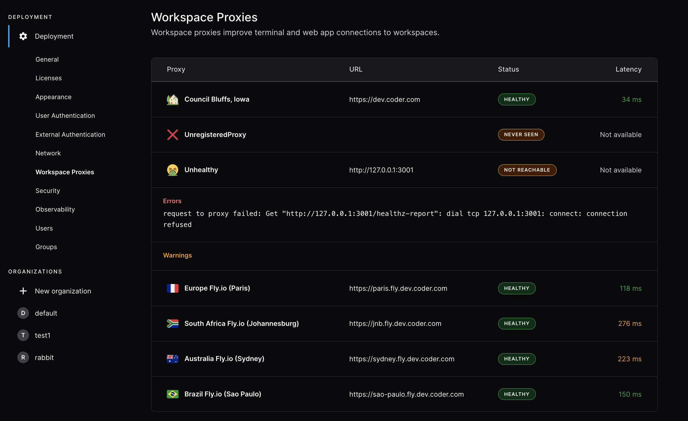

# Workspace Proxies

Workspace proxies provide low-latency experiences for geo-distributed teams.

Coder's networking does a best effort to make direct connections to a workspace.
In situations where this is not possible, such as connections via the web
terminal and
[web IDEs](../../user-guides/workspace-access/index.md#other-web-ides),
workspace proxies are able to reduce the amount of distance the network traffic
needs to travel.

A workspace proxy is a relay connection a developer can choose to use when
connecting with their workspace over SSH, a workspace app, port forwarding, etc.
Dashboard connections and API calls (e.g. the workspaces list) are not served
over workspace proxies.

## Deploy a workspace proxy

Each workspace proxy should be a unique instance. At no point should two
workspace proxy instances share the same authentication token. They only require
port 443 to be open and are expected to have network connectivity to the coderd
dashboard. Workspace proxies **do not** make any database connections.

Workspace proxies can be used in the browser by navigating to the user
`Account -> Workspace Proxy`

## Requirements

- The [Coder CLI](../../reference/cli/index.md) must be installed and
  authenticated as a user with the Owner role.

## Step 1: Create the proxy

Create the workspace proxy and make sure to save the returned authentication
token for said proxy. This is the token the workspace proxy will use to
authenticate back to primary coderd.

```bash
$ coder wsproxy create --name=newyork --display-name="USA East" --icon="/emojis/2194.png"
Workspace Proxy "newyork" created successfully. Save this token, it will not be shown again.
Token: 2fb6500b-bb47-4783-a0db-dedde895b865:05271b4ef9432bac14c02b3c56b5a2d7f05453718a1f85ba7e772c0a096c7175
```

To verify it was created.

```bash
$ coder wsproxy ls
NAME         URL                    STATUS STATUS
newyork                             unregistered
```

## Step 2: Deploy the proxy

Deploying the workspace proxy will also register the proxy with coderd and make
the workspace proxy usable. If the proxy deployment is successful,
`coder wsproxy ls` will show an `ok` status code:

```shell
$ coder wsproxy ls
NAME              URL                         STATUS STATUS
primary           https://dev.coder.com        ok
brazil-saopaulo   https://brazil.example.com   ok
europe-frankfurt  https://europe.example.com   ok
sydney            https://sydney.example.com   ok
```

Other Status codes:

- `unregistered` : The workspace proxy was created, and not yet deployed
- `unreachable` : The workspace proxy was registered, but is not responding.
  Likely the proxy went offline.
- `unhealthy` : The workspace proxy is reachable, but has some issue that is
  preventing the proxy from being used. `coder wsproxy ls` should show the error
  message.
- `ok` : The workspace proxy is healthy and working properly!

### Configuration

Workspace proxy configuration overlaps with a subset of the coderd
configuration. To see the full list of configuration options:
`coder wsproxy server --help`

```bash
# Proxy specific configuration. These are REQUIRED
# Example: https://coderd.example.com
CODER_PRIMARY_ACCESS_URL="https://<url_of_coderd_dashboard>"
CODER_PROXY_SESSION_TOKEN="<session_token_from_proxy_create>"

# Runtime variables for "coder start".
CODER_HTTP_ADDRESS=0.0.0.0:80
CODER_TLS_ADDRESS=0.0.0.0:443
# Example: https://east.coderd.example.com
CODER_ACCESS_URL="https://<access_url_of_proxy>"
# Example: *.east.coderd.example.com
CODER_WILDCARD_ACCESS_URL="*.<app_hostname_of_proxy>"

CODER_TLS_ENABLE=true
CODER_TLS_CLIENT_AUTH=none
CODER_TLS_CERT_FILE="<cert_file_location>"
CODER_TLS_KEY_FILE="<key_file_location>"

# Additional configuration options are available.
```

### Running on Kubernetes

Make a `values-wsproxy.yaml` with the workspace proxy configuration.

Notice the `workspaceProxy` configuration which is `false` by default in the
Coder Helm chart:

```yaml
coder:
  env:
    - name: CODER_PRIMARY_ACCESS_URL
      value: "https://<url_of_coderd_dashboard>"
    - name: CODER_PROXY_SESSION_TOKEN
      value: "<session_token_from_proxy_create>"
    # Example: https://east.coderd.example.com
    - name: CODER_ACCESS_URL
      value: "https://<access_url_of_proxy>"
    # Example: *.east.coderd.example.com
    - name: CODER_WILDCARD_ACCESS_URL
      value: "*.<app_hostname_of_proxy>"

  tls:
    secretNames:
      - kubernetes-wsproxy-secret

  # enable workspace proxy
  workspaceProxy: true
```

Using Helm, install the workspace proxy chart

```bash
helm install coder coder-v2/coder --namespace <your workspace proxy namespace> -f ./values-wsproxy.yaml
```

Test that the workspace proxy is reachable with `curl -vvv`. If for some reason,
the Coder dashboard still shows the workspace proxy is `UNHEALTHY`, scale down
and up the deployment's replicas.

### Running on a VM

```bash
# Set configuration options via environment variables, a config file, or cmd flags
coder wsproxy server
```

### Running as a system service

If you've installed Coder via a [system package](../../install/index.md), you
can configure the workspace proxy by settings in
`/etc/coder.d/coder-workspace-proxy.env`

To run workspace proxy as a system service on the host:

```bash
# Use systemd to start workspace proxy now and on reboot
sudo systemctl enable --now coder-workspace-proxy

# View the logs to ensure a successful start
journalctl -u coder-workspace-proxy.service -b
```

To restart workspace proxy after applying system changes:

```shell
sudo systemctl restart coder-workspace-proxy
```

### Running in Docker

Modify the default entrypoint to run a workspace proxy server instead of a
regular Coder server.

#### Docker Compose

Change the provided
[`docker-compose.yml`](https://github.com/coder/coder/blob/main/docker-compose.yaml)
file to include a custom entrypoint:

```diff
  image: ghcr.io/coder/coder:${CODER_VERSION:-latest}
+ entrypoint: /opt/coder wsproxy server
```

#### Docker run

```bash
docker run --rm -it --entrypoint /opt/coder ghcr.io/coder/coder:latest wsproxy server
```

#### Custom Dockerfile

```Dockerfile
FROM ghcr.io/coder/coder:latest
ENTRYPOINT ["/opt/coder", "wsproxy", "server"]
```

### Selecting a proxy

Users can select a workspace proxy at the top-right of the browser-based Coder
dashboard. Workspace proxy preferences are cached by the web browser. If a proxy
goes offline, the session will fall back to the primary proxy. This could take
up to 60 seconds.



## Observability

Coder workspace proxy exports metrics via the HTTP endpoint, which can be
enabled using either the environment variable `CODER_PROMETHEUS_ENABLE` or the
flag `--prometheus-enable`.

The Prometheus endpoint address is `http://localhost:2112/` by default. You can
use either the environment variable `CODER_PROMETHEUS_ADDRESS` or the flag
`--prometheus-address <network-interface>:<port>` to select a different listen
address.
