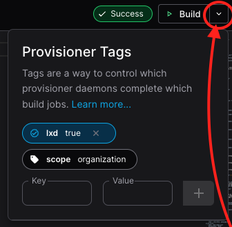

# External provisioners

By default, the Coder server runs
[built-in provisioner daemons](../reference/cli/server.md#--provisioner-daemons),
which execute `terraform` during workspace and template builds. However, there
are often benefits to running external provisioner daemons:

- **Secure build environments:** Run build jobs in isolated containers,
  preventing malicious templates from gaining sh access to the Coder host.

- **Isolate APIs:** Deploy provisioners in isolated environments (on-prem, AWS,
  Azure) instead of exposing APIs (Docker, Kubernetes, VMware) to the Coder
  server. See
  [Provider Authentication](../admin/templates/extending-templates/provider-authentication.md)
  for more details.

- **Isolate secrets**: Keep Coder unaware of cloud secrets, manage/rotate
  secrets on provisioner servers.

- **Reduce server load**: External provisioners reduce load and build queue
  times from the Coder server. See
  [Scaling Coder](../admin/infrastructure/index.md#scale-tests) for more
  details.

Each provisioner runs a single
[concurrent workspace build](../admin/infrastructure/scale-testing.md#control-plane-provisionerd).
For example, running 30 provisioner containers will allow 30 users to start
workspaces at the same time.

Provisioners are started with the
[`coder provisioner start`](../reference/cli/provisioner_start.md) command in
the [full Coder binary](https://github.com/coder/coder/releases). Keep reading
to learn how to start provisioners via Docker, Kubernetes, Systemd, etc.

## Authentication

The provisioner daemon must authenticate with your Coder deployment.

<div class="tabs">

## Scoped Key (Recommended)

We recommend creating finely-scoped keys for provisioners. Keys are scoped to an
organization, and optionally to a specific set of tags.

1. Use `coder provisioner` to create the key:

   - To create a key for an organization that will match untagged jobs:

     ```sh
     coder provisioner keys create my-key \
       --org default

     Successfully created provisioner key   my-key! Save this authentication token, it   will not be shown    again.

     <key omitted>
     ```

   - To restrict the provisioner to jobs with specific tags:

     ```sh
     coder provisioner keys create kubernetes-key \
       --org default \
       --tag environment=kubernetes

     Successfully created provisioner key kubernetes-key! Save this    authentication token, it will not be    shown again.

     <key omitted>
     ```

1. Start the provisioner with the specified key:

   ```sh
   export CODER_URL=https://<your-coder-url>
   export CODER_PROVISIONER_DAEMON_KEY=<key>
   coder provisioner start
   ```

Keep reading to see instructions for running provisioners on
Kubernetes/Docker/etc.

## User Tokens

A user account with the role `Template Admin` or `Owner` can start provisioners
using their user account. This may be beneficial if you are running provisioners
via [automation](../reference/index.md).

```sh
coder login https://<your-coder-url>
coder provisioner start
```

To start a provisioner with specific tags:

```sh
coder login https://<your-coder-url>
coder provisioner start \
  --tag environment=kubernetes
```

Note: Any user can start [user-scoped provisioners](#user-scoped-provisioners),
but this will also require a template on your deployment with the corresponding
tags.

## Global PSK (Not Recommended)

> Global pre-shared keys (PSK) make it difficult to rotate keys or isolate
> provisioners.
>
> We do not recommend using global PSK.

A deployment-wide PSK can be used to authenticate any provisioner. To use a
global PSK, set a
[provisioner daemon pre-shared key (PSK)](../reference/cli/server.md#--provisioner-daemon-psk)
on the Coder server.

Next, start the provisioner:

```sh
coder provisioner start --psk <your-psk>
```

</div>

## Provisioner Tags

You can use **provisioner tags** to control which provisioners can pick up build
jobs from templates (and corresponding workspaces) with matching explicit tags.

Provisioners have two implicit tags: `scope` and `owner`. Coder sets these tags
automatically.

- Organization-scoped provisioners always have the implicit tags
  `scope=organization owner=""`
- User-scoped provisioners always have the implicit tags
  `scope=user owner=<uuid>`

For example:

```sh
# Start a provisioner with the explicit tags
# environment=on_prem and datacenter=chicago
coder provisioner start \
  --tag environment=on_prem \
  --tag datacenter=chicago

# In another terminal, create/push
# a template that requires the explicit
# tag environment=on_prem
coder templates push on-prem \
  --provisioner-tag environment=on_prem

# Or, match the provisioner's explicit tags exactly
coder templates push on-prem-chicago \
  --provisioner-tag environment=on_prem \
  --provisioner-tag datacenter=chicago
```

This can also be done in the UI when building a template:

> 

Alternatively, a template can target a provisioner via
[workspace tags](https://github.com/coder/coder/tree/main/examples/workspace-tags)
inside the Terraform. See the
[workspace tags documentation](../admin/templates/extending-templates/workspace-tags.md)
for more information.

<blockquote class="admonition note">

Workspace tags defined with the `coder_workspace_tags` data source
template **do not** automatically apply to the template import job! You may
need to specify the desired tags when importing the template.

</blockquote>

A provisioner can run a given build job if one of the below is true:

1. A job with no explicit tags can only be run on a provisioner with no explicit
   tags. This way you can introduce tagging into your deployment without
   disrupting existing provisioners and jobs.
1. If a job has any explicit tags, it can only run on a provisioner with those
   explicit tags (the provisioner could have additional tags).

The external provisioner in the above example can run build jobs in the same
organization with tags:

- `environment=on_prem`
- `datacenter=chicago`
- `environment=on_prem datacenter=chicago`

However, it will not pick up any build jobs that do not have either of the
`environment` or `datacenter` tags set. It will also not pick up any build jobs
from templates with the tag `scope=user` set, or build jobs from templates in
different organizations.

<blockquote class="admonition note">

If you only run tagged provisioners, you will need to specify a set of
tags that matches at least one provisioner for _all_ template import jobs and
workspace build jobs.

You may wish to run at least one additional provisioner with no additional
tags so that provisioner jobs with no additional tags defined will be picked
up instead of potentially remaining in the Pending state indefinitely.

</blockquote>

This is illustrated in the below table:

| Provisioner Tags                                                  | Job Tags                                                         | Same Org | Can Run Job? |
|-------------------------------------------------------------------|------------------------------------------------------------------|----------|--------------|
| scope=organization owner=                                         | scope=organization owner=                                        | ✅        | ✅            |
| scope=organization owner= environment=on-prem                     | scope=organization owner= environment=on-prem                    | ✅        | ✅            |
| scope=organization owner= environment=on-prem datacenter=chicago  | scope=organization owner= environment=on-prem                    | ✅        | ✅            |
| scope=organization owner= environment=on-prem datacenter=chicago  | scope=organization owner= environment=on-prem datacenter=chicago | ✅        | ✅            |
| scope=user owner=aaa                                              | scope=user owner=aaa                                             | ✅        | ✅            |
| scope=user owner=aaa environment=on-prem                          | scope=user owner=aaa                                             | ✅        | ✅            |
| scope=user owner=aaa environment=on-prem                          | scope=user owner=aaa environment=on-prem                         | ✅        | ✅            |
| scope=user owner=aaa environment=on-prem datacenter=chicago       | scope=user owner=aaa environment=on-prem                         | ✅        | ✅            |
| scope=user owner=aaa environment=on-prem datacenter=chicago       | scope=user owner=aaa environment=on-prem datacenter=chicago      | ✅        | ✅            |
| scope=organization owner=                                         | scope=organization owner= environment=on-prem                    | ✅        | ❌            |
| scope=organization owner= environment=on-prem                     | scope=organization owner=                                        | ✅        | ❌            |
| scope=organization owner= environment=on-prem                     | scope=organization owner= environment=on-prem datacenter=chicago | ✅        | ❌            |
| scope=organization owner= environment=on-prem datacenter=new_york | scope=organization owner= environment=on-prem datacenter=chicago | ✅        | ❌            |
| scope=user owner=aaa                                              | scope=organization owner=                                        | ✅        | ❌            |
| scope=user owner=aaa                                              | scope=user owner=bbb                                             | ✅        | ❌            |
| scope=organization owner=                                         | scope=user owner=aaa                                             | ✅        | ❌            |
| scope=organization owner=                                         | scope=user owner=aaa environment=on-prem                         | ✅        | ❌            |
| scope=user owner=aaa                                              | scope=user owner=aaa environment=on-prem                         | ✅        | ❌            |
| scope=user owner=aaa environment=on-prem                          | scope=user owner=aaa environment=on-prem datacenter=chicago      | ✅        | ❌            |
| scope=user owner=aaa environment=on-prem datacenter=chicago       | scope=user owner=aaa environment=on-prem datacenter=new_york     | ✅        | ❌            |
| scope=organization owner= environment=on-prem                     | scope=organization owner= environment=on-prem                    | ❌        | ❌            |

> **Note to maintainers:** to generate this table, run the following command and
> copy the output:
>
> ```go
> go test -v -count=1 ./coderd/provisionerdserver/ -test.run='^TestAcquirer_MatchTags/GenTable$'
> ```

## Types of provisioners

Provisioners can broadly be categorized by scope: `organization` or `user`. The
scope of a provisioner can be specified with
[`-tag=scope=<scope>`](../reference/cli/provisioner_start.md#-t---tag) when
starting the provisioner daemon. Only users with at least the
[Template Admin](./users/index.md#roles) role or higher may create
organization-scoped provisioner daemons.

There are two exceptions:

- [Built-in provisioners](../reference/cli/server.md#--provisioner-daemons) are
  always organization-scoped.
- External provisioners started using a
  [pre-shared key (PSK)](../reference/cli/provisioner_start.md#--psk) are always
  organization-scoped.

### Organization-Scoped Provisioners

**Organization-scoped Provisioners** can pick up build jobs created by any user.
These provisioners always have the implicit tags `scope=organization owner=""`.

```sh
coder provisioner start --org <organization_name>
```

If you omit the `--org` argument, the provisioner will be assigned to the
default organization.

```sh
coder provisioner start
```

### User-scoped Provisioners

**User-scoped Provisioners** can only pick up build jobs created from
user-tagged templates. Unlike the other provisioner types, any Coder user can
run user provisioners, but they have no impact unless there exists at least one
template with the `scope=user` provisioner tag.

```sh
coder provisioner start \
  --tag scope=user

# In another terminal, create/push
# a template that requires user provisioners
coder templates push on-prem \
  --provisioner-tag scope=user
```

## Example: Running an external provisioner with Helm

Coder provides a Helm chart for running external provisioner daemons, which you
will use in concert with the Helm chart for deploying the Coder server.

1. Create a provisioner key:

   ```sh
   coder provisioner keys create my-cool-key --org default
   # Optionally, you can specify tags for the provisioner key:
   # coder provisioner keys create my-cool-key --org default --tag location=auh --tag kind=k8s

   Successfully created provisioner key kubernetes-key! Save this authentication
   token, it will not be shown again.

   <key omitted>
   ```

1. Store the key in a kubernetes secret:

   ```sh
   kubectl create secret generic coder-provisioner-keys --from-literal=my-cool-key=`<key omitted>`
   ```

1. Create a `provisioner-values.yaml` file for the provisioner daemons Helm
   chart. For example:

   ```yaml
   coder:
     env:
       - name: CODER_URL
         value: "https://coder.example.com"
     replicaCount: 10
   provisionerDaemon:
     # NOTE: in older versions of the Helm chart (2.17.0 and below), it is required to set this to an empty string.
     pskSecretName: ""
     keySecretName: "coder-provisioner-keys"
     keySecretKey: "my-cool-key"
   ```

   This example creates a deployment of 10 provisioner daemons (for 10
   concurrent builds) authenticating using the above key. The daemons will
   authenticate using the provisioner key created in the previous step and
   acquire jobs matching the tags specified when the provisioner key was
   created. The set of tags is inferred automatically from the provisioner key.

   > Refer to the
   > [values.yaml](https://github.com/coder/coder/blob/main/helm/provisioner/values.yaml)
   > file for the coder-provisioner chart for information on what values can be
   > specified.

1. Install the provisioner daemon chart

   ```sh
   helm install coder-provisioner coder-v2/coder-provisioner \
       --namespace coder \
       --version <your version> \
       --values provisioner-values.yaml
   ```

   You can verify that your provisioner daemons have successfully connected to
   Coderd by looking for a debug log message that says
   `provisioner: successfully connected to coderd` from each Pod.

## Example: Running an external provisioner on a VM

```sh
curl -L https://coder.com/install.sh | sh
export CODER_URL=https://coder.example.com
export CODER_SESSION_TOKEN=your_token
coder provisioner start
```

## Example: Running an external provisioner via Docker

```sh
docker run --rm -it \
  -e CODER_URL=https://coder.example.com/ \
  -e CODER_SESSION_TOKEN=your_token \
  --entrypoint /opt/coder \
  ghcr.io/coder/coder:latest \
  provisioner start
```

## Disable built-in provisioners

As mentioned above, the Coder server will run built-in provisioners by default.
This can be disabled with a server-wide
[flag or environment variable](../reference/cli/server.md#--provisioner-daemons).

```sh
coder server --provisioner-daemons=0
```

## Prometheus metrics

Coder provisioner daemon exports metrics via the HTTP endpoint, which can be
enabled using either the environment variable `CODER_PROMETHEUS_ENABLE` or the
flag `--prometheus-enable`.

The Prometheus endpoint address is `http://localhost:2112/` by default. You can
use either the environment variable `CODER_PROMETHEUS_ADDRESS` or the flag
`--prometheus-address <network-interface>:<port>` to select a different listen
address.

If you have provisioners daemons deployed as pods, it is advised to monitor them
separately.
