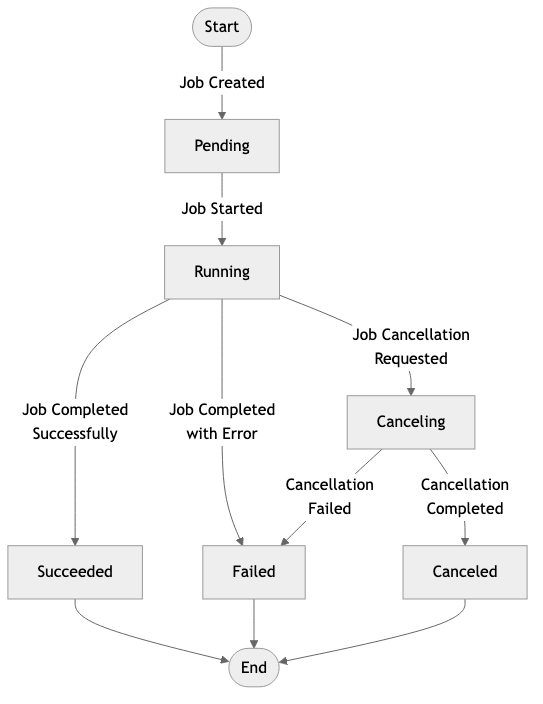

# Manage provisioner jobs

[Provisioners](./index.md) start and run provisioner jobs to create or delete workspaces.
Each time a workspace is built, rebuilt, or destroyed, it generates a new job and assigns
the job to an available provisioner daemon for execution.

While most jobs complete smoothly, issues with templates, cloud resources, or misconfigured
provisioners can cause jobs to fail or hang indefinitely (these are in a `Pending` state).


## How to find provisioner jobs

Coder admins can view and manage provisioner jobs.

Use the dashboard, CLI, or API:

- **Dashboard**:

   Select **Admin settings** > **Organizations** > **Provisioner Jobs**

   Provisioners are organization-specific. If you have more than one organization, select it first.

- **CLI**: `coder provisioner jobs list`
- **API**: `/api/v2/provisioner/jobs`

## Manage provisioner jobs from the dashboard

View more information about and manage your provisioner jobs from the Coder dashboard.

1. Under **Admin settings** select **Organizations**, then select **Provisioner jobs**.

1. Select the **>** to expand each entry for more information.

1. To delete a job, select the 🚫 at the end of the entry's row.

   If your user doesn't have the correct permissions, this option is greyed out.

## Provisioner job status

Each provisioner job has a lifecycle state:

| Status        | Description                                                    |
|---------------|----------------------------------------------------------------|
| **Pending**   | Job is queued but has not yet been picked up by a provisioner. |
| **Running**   | A provisioner is actively working on the job.                  |
| **Completed** | Job succeeded.                                                 |
| **Failed**    | Provisioner encountered an error while executing the job.      |
| **Canceled**  | Job was manually terminated by an admin.                       |

The following diagram shows how a provisioner job transitions between lifecycle states:



## When to cancel provisioner jobs

A job might need to be cancelled when:

- It has been stuck in **Pending** for too long. This can be due to misconfigured tags or unavailable provisioners.
- It is **Running** indefinitely, often caused by external system failures or buggy templates.
- An admin wants to abort a failed attempt, fix the root cause, and retry provisioning.
- A workspace was deleted in the UI but the underlying cloud resource wasn’t cleaned up, causing a hanging delete job.

Cancelling a job does not automatically retry the operation.
It clears the stuck state and allows the admin or user to trigger the action again if needed.

## Troubleshoot provisioner jobs

Provisioner jobs can fail or slow workspace creation for a number of reasons.
Follow these steps to identify problematic jobs or daemons:

1. Filter jobs by `pending` status in the dashboard, or use the CLI:

   ```bash
   coder provisioner jobs list -s pending
   ```

1. Look for daemons with multiple failed jobs and for template [tag mismatches](./index.md#provisioner-tags).

1. Cancel the job through the dashboard, or use the CLI:

   ```shell
   coder provisioner jobs cancel <job-id>
   ```
