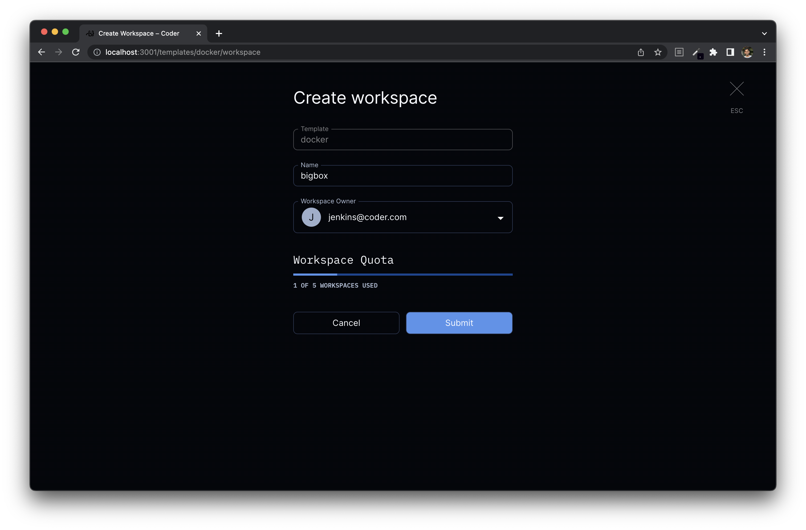

# Quotas

Coder Enterprise admins may define deployment-level quotas to protect against
Denial-of-Service, control costs, and ensure equitable access to cloud resources.

The quota is enabled by either the `CODER_USER_WORKSPACE_QUOTA`
environment variable or the `--user-workspace-quota` flag. For example,
you may limit each user in a deployment to 5 workspaces like so:

```bash
coder server --user-workspace-quota=5
```

Then, when users create workspaces they would see:



## Enabling this feature

This feature is only available with an enterprise license. [Learn more](../enterprise.md)

## Up next

- [Enterprise](../enterprise.md)
- [Configuring](./configure.md)
