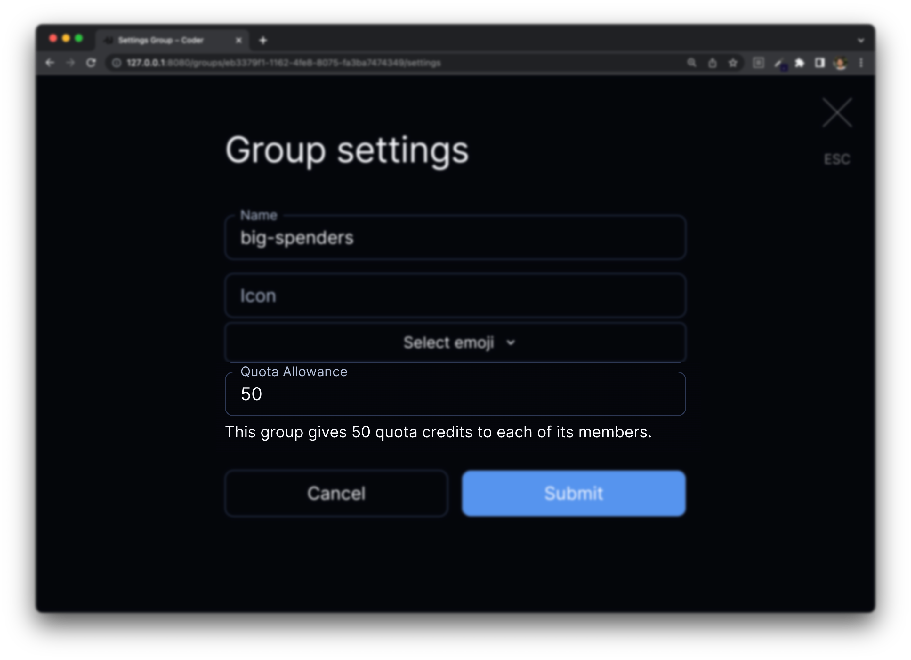
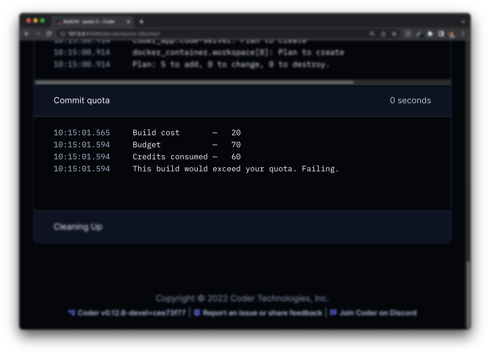

# Quotas

Quotas are a mechanism for controlling spend by associating costs with workspace
templates and assigning budgets to users. Users that exceed their budget will be
blocked from launching more workspaces until they either delete their other
workspaces or get their budget extended.

For example: A template is configured with a cost of 5 credits per day, and the
user is granted 15 credits, which can be consumed by both started and stopped
workspaces. This budget limits the user to 3 concurrent workspaces.

Quotas are licensed with [Groups](./groups.md).

## Definitions

- **Credits** is the fundamental unit representing cost in the quota system.
  This integer can be arbitrary, or it can map to your preferred currency.
- **Budget** is the per-user, enforced, upper limit to credit spend.
- **Allowance** is a grant of credits to the budget.

## Establishing Costs

Templates describe their cost through the `daily_cost` attribute in
[`resource_metadata`](https://registry.terraform.io/providers/coder/coder/latest/docs/resources/metadata).
Since costs are associated with resources, an offline workspace may consume less
quota than an online workspace.

A common use case is separating costs for a persistent volume and ephemeral
compute:

```hcl
resource "docker_volume" "home_volume" {
  name = "coder-${data.coder_workspace_owner.me.name}-${data.coder_workspace.me.name}-root"
}

resource "coder_metadata" "home_volume" {
    resource_id = docker_volume.home_volume.id
    daily_cost  = 10
}

resource "docker_container" "workspace" {
  count = data.coder_workspace.me.start_count
  image = "codercom/code-server:latest"
  ...
  volumes {
    container_path = "/home/coder/"
    volume_name    = docker_volume.home_volume.name
    read_only      = false
  }
}

resource "coder_metadata" "workspace" {
    count       = data.coder_workspace.me.start_count
    resource_id = docker_container.workspace.id
    daily_cost  = 20
}
```

When the workspace above is shut down, the `docker_container` and
`coder_metadata` both get deleted. This reduces the cost from 30 credits to 10
credits.

Resources without a `daily_cost` value are considered to cost 0. If the cost was
removed on the `docker_volume` above, the template would consume 0 credits when
it's offline. This technique is good for incentivizing users to shut down their
unused workspaces and freeing up compute in the cluster.

## Establishing Budgets

Each group has a configurable Quota Allowance. A user's budget is calculated as
the sum of their allowances.



For example:

| Group Name | Quota Allowance |
| ---------- | --------------- |
| Frontend   | 10              |
| Backend    | 20              |
| Data       | 30              |

<br/>

| Username | Groups            | Effective Budget |
| -------- | ----------------- | ---------------- |
| jill     | Frontend, Backend | 30               |
| jack     | Backend, Data     | 50               |
| sam      | Data              | 30               |
| alex     | Frontend          | 10               |

By default, groups are assumed to have a default allowance of 0.

## Quota Enforcement

Coder enforces Quota on workspace start and stop operations. The workspace build
process dynamically calculates costs, so quota violation fails builds as opposed
to failing the build-triggering operation. For example, the Workspace Create
Form will never get held up by quota enforcement.



## Up next

- [Enterprise](../enterprise.md)
- [Configuring](./configure.md)
