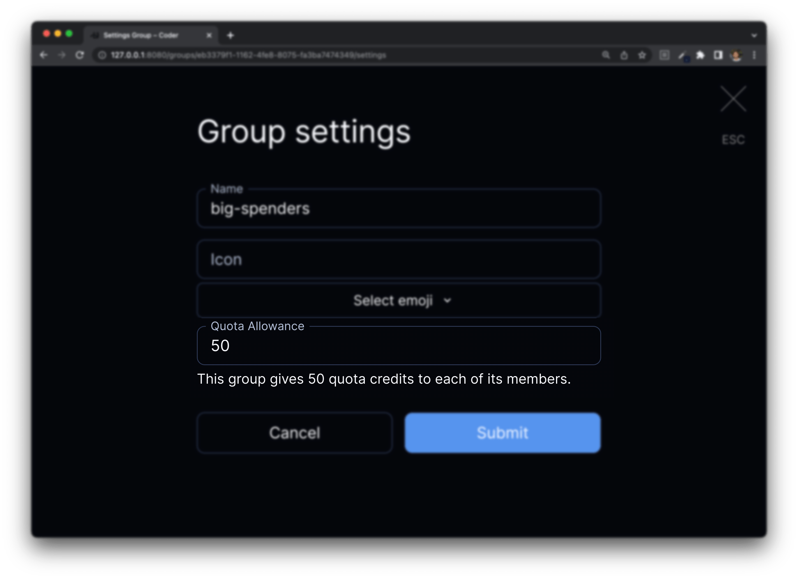

# Quotas

Coder Enterprise admins may define quotas to control costs
and ensure equitable access to cloud resources. The quota system controls
instantaneous cost. For example, the system can ensure that every user in your
deployment has a spend rate lower than $10/day at any given moment.

The workspace provisioner enforces quota during workspace start and stop operations.
When users reach their quota, they may unblock themselves by stopping or deleting
their workspace(s).

Quotas are licensed with [Groups](./groups.md).

## Definitions

- **Credits** is the fundamental unit of the quota system. They map to the
  smallest denomination of your preferred currency. For example, if you work with USD,
  think of each credit as a cent.
- **Budget** is the per-user, enforced, upper limit to credit spend.
- **Allowance** is a grant of credits to the budget.

## Establishing Costs

Templates describe their cost through the `daily_cost` attribute in
[`resource_metadata`](https://registry.terraform.io/providers/coder/coder/latest/docs/resources/metadata).
Since costs are associated with resources, an offline workspace may consume
less quota than an online workspace.

A common use case is separating costs for a persistent volume and ephemeral compute:

```hcl
resource "coder_metadata" "volume" {
    resource_id = "${docker_volume.home_volume.id}"
    cost = 10
}

resource "docker_volume" "home_volume" {
  name = "coder-${data.coder_workspace.me.owner}-${data.coder_workspace.me.name}-root"
}

resource "coder_metadata" "container" {
    resource_id = "${docker_container.workspace.id}"
    cost = 20
}

resource "docker_container" "workspace" {
  count = data.coder_workspace.me.start_count
  image = "codercom/code-server:latest"
  ...
  volumes {
    container_path = "/home/coder/"
    volume_name    = docker_volume.home_volume.name
    read_only      = false
  }
}
```

In that template, the workspace consumes 10 quota credits when it's offline, and
30 when it's online.

## Establishing Budgets

Each group has a configurable Quota Allowance. A user's budget is calculated as
the sum of their allowances.



For example:

| Group Name | Quota Allowance |
| ---------- | --------------- |
| Frontend   | 100             |
| Backend    | 200             |
| Data       | 300             |

<br/>

| Username | Groups            | Effective Budget |
| -------- | ----------------- | ---------------- |
| jill     | Frontend, Backend | 300              |
| jack     | Backend, Data     | 500              |
| sam      | Data              | 300              |
| alex     | Frontend          | 100              |

## Quota Enforcement

Coder enforces Quota on workspace start and stop operations. The workspace
build process dynamically calculates costs, so quota violation fails builds
as opposed to failing the build-triggering operation. For example, the Workspace
Create Form will never get held up by quota enforcement.


## Up next

- [Enterprise](../enterprise.md)
- [Configuring](./configure.md)
