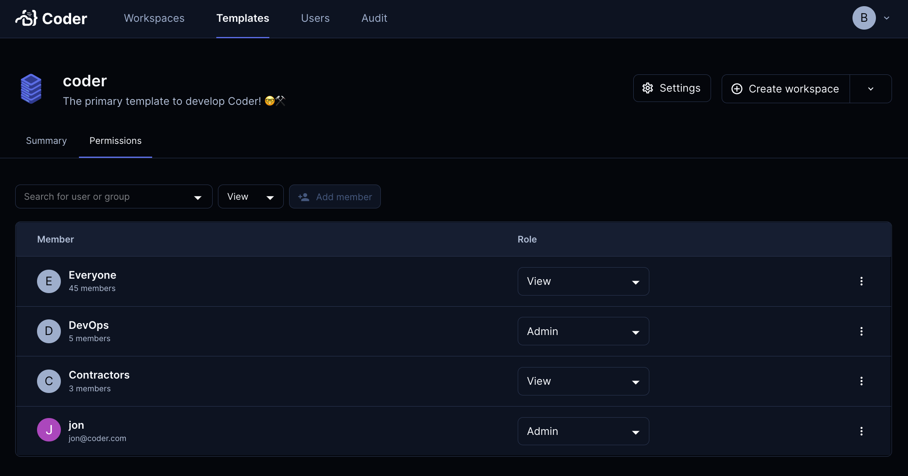

# Role Based Access Control (RBAC)

Use RBAC to define which users and [groups](./groups.md) can use specific
templates in Coder. These can be defined via the Coder web UI,
[synced from your identity provider](./auth.md) or
[managed via Terraform](https://registry.terraform.io/providers/coder/coderd/latest/docs/resources/template).

The "Everyone" group makes a template accessible to all users. This can be
removed to make a template private.

## Permissions

You can set the following permissions:

- **Admin**: Read, use, edit, push, and delete
- **View**: Read, use

## Enabling this feature

This feature is only available with an
[enterprise license](https://coder.com/pricing).
