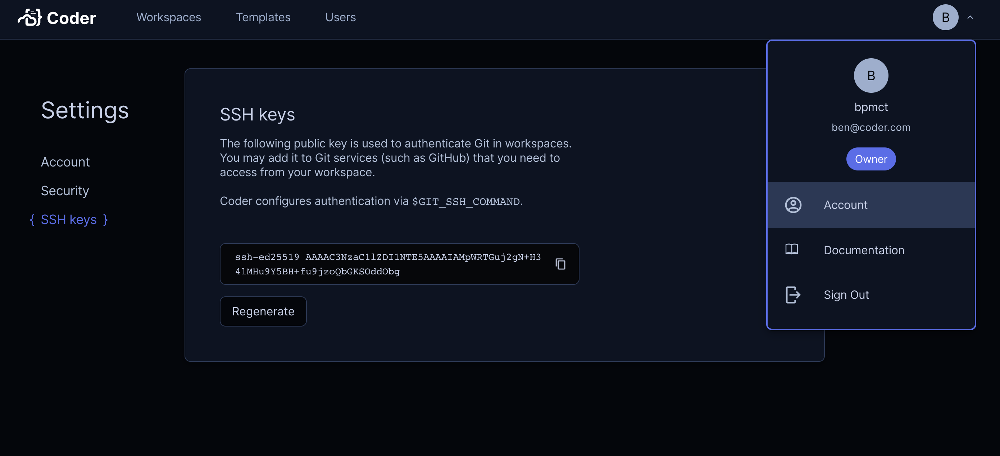
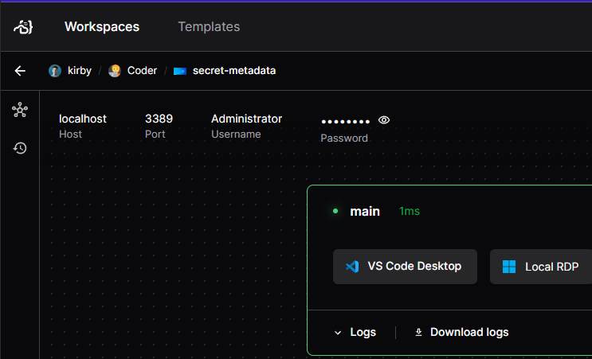

# Secrets

Coder is open-minded about how you get your secrets into your workspaces. For
more information about how to use secrets and other security tips, visit our
guide to
[security best practices](../../tutorials/best-practices/security-best-practices.md#secrets).

This article explains how to use secrets in a workspace. To authenticate the
workspace provisioner, see the
<a href="../provisioners/index.md#authentication">provisioners documentation</a>.

## Before you begin

Your first attempt to use secrets with Coder should be your local method. You
can do everything you can locally and more with your Coder workspace, so
whatever workflow and tools you already use to manage secrets may be brought
over.

Often, this workflow is simply:

1. Give your users their secrets in advance
1. Your users write them to a persistent file after they've built their
   workspace

[Template parameters](../templates/extending-templates/parameters.md) are a
dangerous way to accept secrets. We show parameters in cleartext around the
product. Assume anyone with view access to a workspace can also see its
parameters.

## SSH Keys

Coder generates SSH key pairs for each user. This can be used as an
authentication mechanism for git providers or other tools. Within workspaces,
git will attempt to use this key within workspaces via the `$GIT_SSH_COMMAND`
environment variable.

Users can view their public key in their account settings:



> [!NOTE]
> SSH keys are never stored in Coder workspaces, and are fetched only when
> SSH is invoked. The keys are held in-memory and never written to disk.

## User Secrets

User secrets let each user store their own secret values in Coder and make
them available in workspaces without adding those values to template code.
They are a good fit for per-user credentials such as API keys, cloud
credentials, or other values that should follow a user across workspaces.

Use the CLI to create and manage user secrets:

```sh
# Create a secret from stdin and inject it into workspaces as an environment
# variable.
printf %s "$API_KEY" | coder secret create api-key \
  --description "API key for workspace tools" \
  --env API_KEY

# Create a secret from stdin and inject it into a file in your workspace.
printf %s "$TOOL_CONFIG_CONTENTS" | coder secret create tool-config \
  --description "Tool configuration" \
  --file ~/.config/tool/config.json

# List all of your secrets.
coder secret list

# Show a single secret by name.
coder secret list api-key

# Delete a secret you no longer need.
coder secret delete api-key
```

Use `--env` to inject a secret into your workspaces as an environment
variable. Use `--file` to inject it as a file in the workspace. File
paths must start with `~/` or `/`. Provide a secret value with `--value`,
or non-interactive stdin (pipe or redirect). Stdin is read verbatim. This
means `echo "$API_KEY" | ...` usually adds a trailing newline to the stored
value. Prefer `printf %s "$API_KEY" | ...` or `echo -n "$API_KEY" | ...`
when you do not want that newline.

You can update a secret later with `coder secret update`, including rotating
the value or clearing an injection target by passing an empty string. Use
`coder secret delete` to remove a secret entirely. The secret value itself is
never returned by the API or CLI list output. For full command details, see
[`coder secret`](../../reference/cli/secret.md) and the
[Secrets API reference](../../reference/api/secrets.md).

## Dynamic Secrets

Dynamic secrets are attached to the workspace lifecycle and automatically
injected into the workspace. With a little bit of up front template work, they
make life simpler for both the end user and the security team.

This method is limited to
[services with Terraform providers](https://registry.terraform.io/browse/providers),
which excludes obscure API providers.

Dynamic secrets can be implemented in your template code like so:

```tf
resource "twilio_iam_api_key" "api_key" {
  account_sid   = "ACXXXXXXXXXXXXXXXXXXXXXXXXXXXXXXXX"
  friendly_name = "Test API Key"
}

resource "coder_agent" "main" {
  # ...
  env = {
    # Let users access the secret via $TWILIO_API_SECRET
    TWILIO_API_SECRET = "${twilio_iam_api_key.api_key.secret}"
  }
}
```

A catch-all variation of this approach is dynamically provisioning a cloud
service account (e.g
[GCP](https://registry.terraform.io/providers/hashicorp/google/latest/docs/resources/google_service_account_key#private_key))
for each workspace and then making the relevant secrets available via the
cloud's secret management system.

## Displaying Secrets

While you can inject secrets into the workspace via environment variables, you
can also show them in the Workspace UI with
[`coder_metadata`](https://registry.terraform.io/providers/coder/coder/latest/docs/resources/metadata).



Can be produced with

```tf
resource "twilio_iam_api_key" "api_key" {
  account_sid   = "ACXXXXXXXXXXXXXXXXXXXXXXXXXXXXXXXX"
  friendly_name = "Test API Key"
}


resource "coder_metadata" "twilio_key" {
  resource_id = twilio_iam_api_key.api_key.id
  item {
    key   = "Username"
    value = "Administrator"
  }
  item {
    key       = "Password"
    value     = twilio_iam_api_key.api_key.secret
    sensitive = true
  }
}
```

## Secrets Management

For more advanced secrets management, you can use a secrets management tool to
store and retrieve secrets in your workspace. For example, you can use
[HashiCorp Vault](https://www.vaultproject.io/) to inject secrets into your
workspace.

Refer to our [HashiCorp Vault Integration](../integrations/vault.md) guide for
more information on how to integrate HashiCorp Vault with Coder.

## Next steps

- [Security - best practices](../../tutorials/best-practices/security-best-practices.md)
