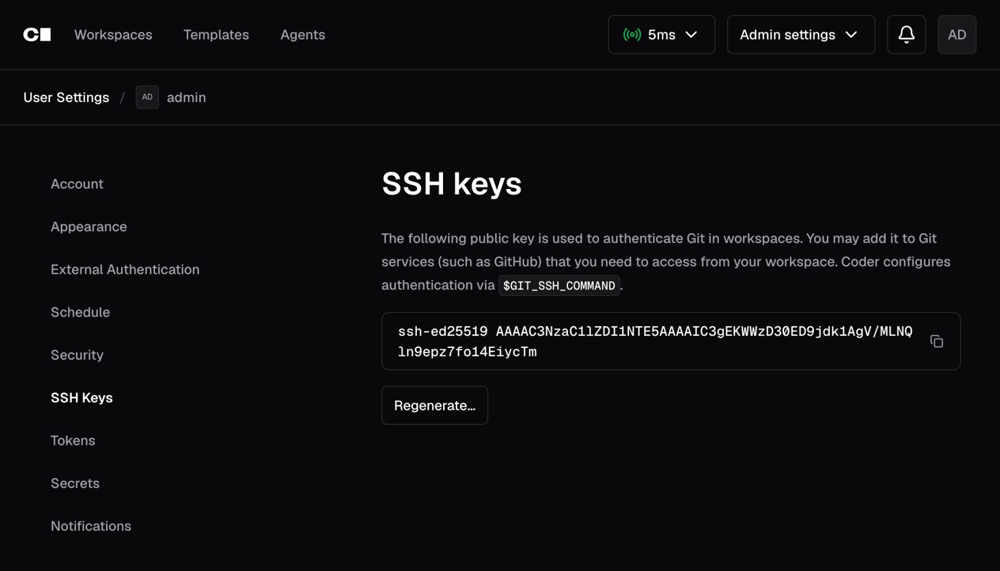
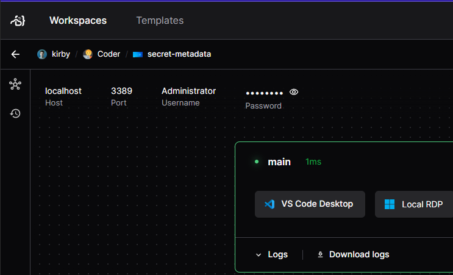

# Secrets

Coder is open-minded about how you get your secrets into your workspaces. For
more information about how to use secrets and other security tips, visit our
guide to
[security best practices](../../tutorials/best-practices/security-best-practices.md#secrets).

Use this guide to configure how templates make secrets available to Coder
workspaces. To authenticate workspace provisioners with Coder, see the
<a href="../provisioners/index.md#authentication">provisioners documentation</a>.
For secret values that developers manage themselves, see
[User secrets](../../user-guides/user-secrets.md).

## Before you begin

Your first attempt to use secrets with Coder should be your local method. You
can do everything you can locally and more with your Coder workspace, so
whatever workflow and tools you already use to manage secrets may be brought
over.

Often, this workflow is simply:

1. Give your users their secrets in advance
1. Your users write them to a persistent file after they've built their
   workspace

[Template parameters](../templates/extending-templates/parameters.md) are a
dangerous way to accept secrets. We show parameters in cleartext around the
product. Assume anyone with view access to a workspace can also see its
parameters.

## SSH Keys

Coder generates SSH key pairs for each user. This can be used as an
authentication mechanism for git providers or other tools. Within workspaces,
git will attempt to use this key within workspaces via the `$GIT_SSH_COMMAND`
environment variable.

Users can view their public key in their account settings:



> [!NOTE]
> SSH keys are never stored in Coder workspaces, and are fetched only when
> SSH is invoked. The keys are held in-memory and never written to disk.

## User secrets

User secrets are developer-managed values that Coder injects through environment variable and file path targets.
If a user secret targets the same environment variable name or file path as a template-provided value, the user secret takes precedence in that workspace.
The secret's `enabled` setting records the user's intent, but deployment policy determines which target types are effective.
User secret values are covered by [Database Encryption](./database-encryption.md) when it is enabled.
Refer to the [user secrets guide](../../user-guides/user-secrets.md) for user workflows.

### Turn off file path delivery

Deployment administrators can turn off Coder-managed file path delivery while preserving environment variable delivery.
This setting is deployment-scoped and defaults to `false`, which permits file path delivery.
Configure it with one of the following forms:

```sh
coder server --user-secrets-disable-file-path
```

```sh
CODER_USER_SECRETS_DISABLE_FILE_PATH=true coder server
```

```yaml
userSecretsDisableFilePath: true
```

Apply the same value to every Coder replica and restart replicas whose deployment configuration changed.
Inconsistent values in a high-availability deployment can produce different API validation and agent manifests depending on which replica handles a request.

> [!WARNING]
> This setting controls Coder's sanctioned injection mechanisms.
> It isn't a filesystem security boundary.
> Users who receive a secret through an environment variable can write the value to disk or send it elsewhere.

When this setting is `true`:

- Coder rejects new non-empty file paths and changes to existing non-empty paths.
- Coder preserves stored legacy paths and permits users to clear them.
- Environment-only secrets continue to work.
- Dual-target secrets continue environment variable delivery, but their file paths are blocked.
- File-only secrets have no effective target, and Coder doesn't transmit their plaintext values in agent manifests.
- Coder preserves each secret's stored `enabled` setting instead of silently changing it.

The policy takes effect for a workspace when its agent fetches a new manifest.
An agent fetches a manifest when it connects or reconnects, including after the workspace or agent restarts.
Coder doesn't force an immediate refresh for a connected agent.
Existing processes keep environment values that they already received, and Coder doesn't remove files that an agent previously wrote.

### Migrate existing file targets

Before you turn off file path delivery, identify file-only and dual-target user secrets and notify their owners.
Use the following migration sequence:

1. Add environment variable targets to file-only secrets when applications can consume them.
2. Confirm that dual-target secrets work through their environment variable targets.
3. Clear file paths that aren't needed for rollback.
4. Set file-only secrets to `enabled = false` or delete them when no effective target remains.
5. Remove stale files and cached credentials from affected workspaces.
6. Rotate or revoke credentials when previous copies might remain accessible.

Coder doesn't perform steps 5 or 6.
Workspace owners and credential administrators remain responsible for removing files, stopping processes that retain values, and rotating credentials.

If you later set `userSecretsDisableFilePath` back to `false`, preserved paths become effective after each agent's next manifest fetch.
The agent writes the current stored secret value and can overwrite a file that users or automation changed while delivery was off.
Coordinate rollback with secret owners before you change the setting.

## Dynamic Secrets

Dynamic secrets are attached to the workspace lifecycle and automatically
injected into the workspace. With a little bit of up front template work, they
make life simpler for both the end user and the security team.

This method is limited to
[services with Terraform providers](https://registry.terraform.io/browse/providers),
which excludes obscure API providers.

Dynamic secrets can be implemented in your template code like so:

```tf
resource "twilio_iam_api_key" "api_key" {
  account_sid   = "ACXXXXXXXXXXXXXXXXXXXXXXXXXXXXXXXX"
  friendly_name = "Test API Key"
}

resource "coder_agent" "main" {
  # ...
  env = {
    # Let users access the secret via $TWILIO_API_SECRET
    TWILIO_API_SECRET = "${twilio_iam_api_key.api_key.secret}"
  }
}
```

A catch-all variation of this approach is dynamically provisioning a cloud
service account (e.g
[GCP](https://registry.terraform.io/providers/hashicorp/google/latest/docs/resources/google_service_account_key#private_key))
for each workspace and then making the relevant secrets available via the
cloud's secret management system.

## Displaying Secrets

While you can inject secrets into the workspace via environment variables, you
can also show them in the Workspace UI with
[`coder_metadata`](https://registry.terraform.io/providers/coder/coder/latest/docs/resources/metadata).



Can be produced with

```tf
resource "twilio_iam_api_key" "api_key" {
  account_sid   = "ACXXXXXXXXXXXXXXXXXXXXXXXXXXXXXXXX"
  friendly_name = "Test API Key"
}


resource "coder_metadata" "twilio_key" {
  resource_id = twilio_iam_api_key.api_key.id
  item {
    key   = "Username"
    value = "Administrator"
  }
  item {
    key       = "Password"
    value     = twilio_iam_api_key.api_key.secret
    sensitive = true
  }
}
```

## Secrets Management

For more advanced secrets management, you can use a secrets management tool to
store and retrieve secrets in your workspace. For example, you can use
[HashiCorp Vault](https://www.vaultproject.io/) to inject secrets into your
workspace.

Refer to our [HashiCorp Vault Integration](../integrations/vault.md) guide for
more information on how to integrate HashiCorp Vault with Coder.

## Learn more

- [Security - best practices](../../tutorials/best-practices/security-best-practices.md)
