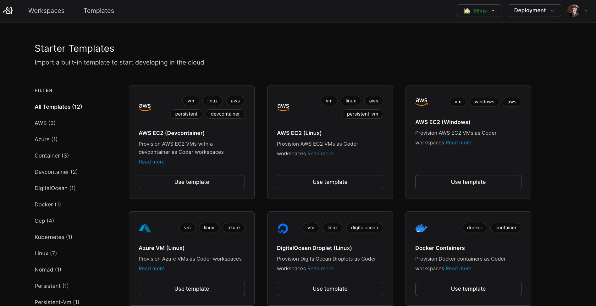

# Template

Templates are written in [Terraform](https://developer.hashicorp.com/terraform/intro) and define the underlying infrastructure that all Coder workspaces run on.

<small>The "Starter Templates" page within the Coder dashboard.</small>

## Getting Started

Learn the underlying concepts by [creating your first template](../../tutorials/template-from-scratch.md). After that, visit the [Coder Registry](https://registry.coder.com/templates) to learn how to install example templates for various cloud providers and platforms (e.g. AWS, Kubernetes).

## Best Practices

We recommend starting with a universal template that can be used for basic tasks. As your Coder deployment grows, you can create more templates to meet the needs of different teams.

- [Image management](../../tutorials/image-management.md): Learn how to create and publish images for use within Coder workspaces & templates.
- [Dev Container support](#): Enable dev containers to allow teams to bring their own tools into Coder workspaces.
- [Template hardening](./): Configure your template to prevent certain resources from being destroyed (e.g. user disks).
- [Manage templates with Ci/Cd pipelines](#): Learn how to source control your templates and use GitOps to ensure template changes are reviewed and tested.

## Template Features

## Template Settings

- [Template Permissions]()
- [Display name]
