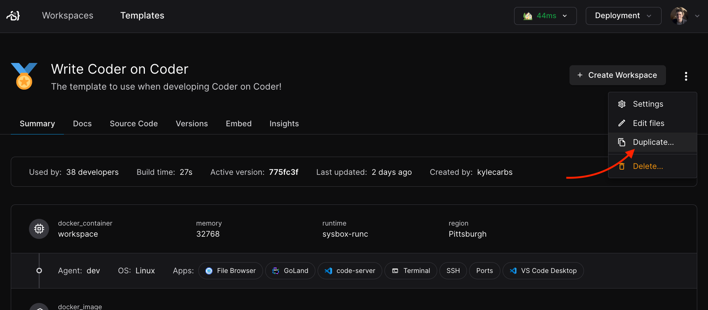

# Creating Templates

Users with the `Template Administrator` role or above can create templates
within Coder.

## From a starter template

In most cases, it is best to start with a starter template.

<div class="tabs">

### Web UI

After navigating to the Templates page in the Coder dashboard, choose
`Create Template > Choose a starter template`.


From there, select a starter template for desired underlying infrastructure for
workspaces.


Give your template a name, description, and icon and press `Create template`.


> [!NOTE]
> If template creation fails, Coder is likely not authorized to
> deploy infrastructure in the given location. Learn how to configure
> [provisioner authentication](./extending-templates/provider-authentication.md).

### CLI

You can the [Coder CLI](../../install/cli.md) to manage templates for Coder.
After [logging in](../../reference/cli/login.md) to your deployment, create a
folder to store your templates:

```sh
# This snippet applies to macOS and Linux only
mkdir $HOME/coder-templates
cd $HOME/coder-templates
```

Use the [`templates init`](../../reference/cli/templates_init.md) command to
pull a starter template:

```sh
coder templates init
```

After pulling the template to your local machine (e.g. `aws-linux`), you can
rename it:

```sh
# This snippet applies to macOS and Linux only
mv aws-linux universal-template
cd universal-template
```

Next, push it to Coder with the
[`templates push`](../../reference/cli/templates_push.md) command:

```sh
coder templates push
```

> [!NOTE]
> If `template push` fails, Coder is likely not authorized to deploy
> infrastructure in the given location. Learn how to configure
> [provisioner authentication](../provisioners.md).

You can edit the metadata of the template such as the display name with the
[`templates edit`](../../reference/cli/templates_edit.md) command:

```sh
coder templates edit universal-template \
  --display-name "Universal Template" \
  --description "Virtual machine configured with Java, Python, Typescript, IntelliJ IDEA, and Ruby. Use this for starter projects. " \
  --icon "/emojis/2b50.png"
```

### CI/CD

Follow the [change management](./managing-templates/change-management.md) guide
to manage templates via GitOps.

</div>

## From an existing template

You can duplicate an existing template in your Coder deployment. This will copy
the template code and metadata, allowing you to make changes without affecting
the original template.

<div class="tabs">

### Web UI

After navigating to the page for a template, use the dropdown menu on the right
to `Duplicate`.



Give the new template a name, icon, and description.


Press `Create template`. After the build, you will be taken to the new template
page.


### CLI

First, ensure you are logged in to the control plane as a user with permissions
to read and write permissions.

```console
coder login
```

You can list the available templates with the following CLI invocation.

```console
coder templates list
```

After identified the template you'd like to work from, clone it into a directory
with a name you'd like to assign to the new modified template.

```console
coder templates pull <template-name> ./<new-template-name>
```

Then, you can make modifications to the existing template in this directory and
push them to the control plane using the `-d` flag to specify the directory.

```console
coder templates push <new-template-name> -d ./<new-template-name>
```

You will then see your new template in the dashboard.

</div>

## From scratch (advanced)

There may be cases where you want to create a template from scratch. You can use
[any Terraform provider](https://registry.terraform.io) with Coder to create
templates for additional clouds (e.g. Hetzner, Alibaba) or orchestrators
(VMware, Proxmox) that we do not provide example templates for.

Refer to the following resources:

- [Tutorial: Create a template from scratch](../../tutorials/template-from-scratch.md)
- [Extending templates](./extending-templates/index.md): Features and concepts
  around templates (agents, parameters, variables, etc)
- [Coder Registry](https://registry.coder.com/templates): Official and community
  templates for Coder
- [Coder Terraform Provider Reference](https://registry.terraform.io/providers/coder/coder)

### Next steps

- [Extending templates](./extending-templates/index.md)
- [Managing templates](./managing-templates/index.md)
