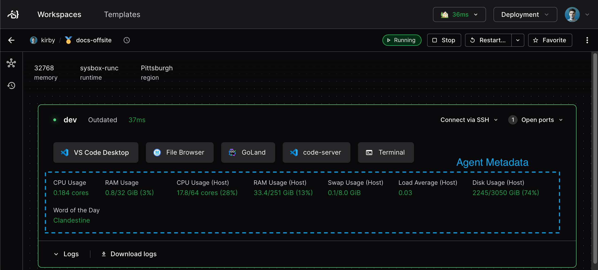

# Agent metadata



You can show live operational metrics to workspace users with agent metadata. It
is the dynamic complement of [resource metadata](./resource-metadata.md).

You specify agent metadata in the
[`coder_agent`](https://registry.terraform.io/providers/coder/coder/latest/docs/resources/agent).

## Examples

All of these examples use
[heredoc strings](https://developer.hashicorp.com/terraform/language/expressions/strings#heredoc-strings)
for the script declaration. With heredoc strings, you can script without messy
escape codes, just as if you were working in your terminal.

Some of the examples use the [`coder stat`](../../../reference/cli/stat.md)
command. This is useful for determining CPU and memory usage of the VM or
container that the workspace is running in, which is more accurate than resource
usage about the workspace's host.

Here's a standard set of metadata snippets for Linux agents:

```tf
resource "coder_agent" "main" {
  os             = "linux"
  ...
  metadata {
    display_name = "CPU Usage"
    key  = "cpu"
    # Uses the coder stat command to get container CPU usage.
    script = "coder stat cpu"
    interval = 1
    timeout = 1
  }

  metadata {
    display_name = "Memory Usage"
    key  = "mem"
    # Uses the coder stat command to get container memory usage in GiB.
    script = "coder stat mem --prefix Gi"
    interval = 1
    timeout = 1
  }

  metadata {
    display_name = "CPU Usage (Host)"
    key  = "cpu_host"
    # calculates CPU usage by summing the "us", "sy" and "id" columns of
    # top.
    script = <<EOT
    top -bn1 | awk 'FNR==3 {printf "%2.0f%%", $2+$3+$4}'
    EOT
    interval = 1
    timeout = 1
  }

    metadata {
    display_name = "Memory Usage (Host)"
    key  = "mem_host"
    script = <<EOT
    free | awk '/^Mem/ { printf("%.0f%%", $4/$2 * 100.0) }'
    EOT
    interval = 1
    timeout = 1
  }

  metadata {
    display_name = "Disk Usage"
    key  = "disk"
    script = "df -h | awk '$6 ~ /^\\/$/ { print $5 }'"
    interval = 1
    timeout = 1
  }

  metadata {
    display_name = "Load Average"
    key  = "load"
    script = <<EOT
        awk '{print $1,$2,$3}' /proc/loadavg
    EOT
    interval = 1
    timeout = 1
  }
}
```

## Useful utilities

You can also show agent metadata for information about the workspace's host.

[top](https://manpages.ubuntu.com/manpages/jammy/en/man1/top.1.html) is
available in most Linux distributions and provides virtual memory, CPU and IO
statistics. Running `top` produces output that looks like:

```text
%Cpu(s): 65.8 us,  4.4 sy,  0.0 ni, 29.3 id,  0.3 wa,  0.0 hi,  0.2 si,  0.0 st
MiB Mem :  16009.0 total,    493.7 free,   4624.8 used,  10890.5 buff/cache
MiB Swap:      0.0 total,      0.0 free,      0.0 used.  11021.3 avail Mem
```

[vmstat](https://manpages.ubuntu.com/manpages/jammy/en/man8/vmstat.8.html) is
available in most Linux distributions and provides virtual memory, CPU and IO
statistics. Running `vmstat` produces output that looks like:

```text
procs -----------memory---------- ---swap-- -----io---- -system-- ------cpu-----
r  b   swpd   free   buff  cache   si   so    bi    bo   in   cs us sy id wa st
0  0  19580 4781680 12133692 217646944    0    2     4    32    1    0  1  1 98  0  0
```

[dstat](https://manpages.ubuntu.com/manpages/jammy/man1/dstat.1.html) is
considerably more parseable than `vmstat` but often not included in base images.
It is easily installed by most package managers under the name `dstat`. The
output of running `dstat 1 1` looks like:

```text
--total-cpu-usage-- -dsk/total- -net/total- ---paging-- ---system--
usr sys idl wai stl| read  writ| recv  send|  in   out | int   csw
1   1  98   0   0|3422k   25M|   0     0 | 153k  904k| 123k  174k
```

## Managing the database load

Agent metadata can generate a significant write load and overwhelm your Coder
database if you're not careful. The approximate writes per second can be
calculated using the formula:

```text
(metadata_count * num_running_agents * 2) / metadata_avg_interval
```

For example, let's say you have

- 10 running agents
- each with 6 metadata snippets
- with an average interval of 4 seconds

You can expect `(10 * 6 * 2) / 4`, or 30 writes per second.

One of the writes is to the `UNLOGGED` `workspace_agent_metadata` table and the
other to the `NOTIFY` query that enables live stats streaming in the UI.

## Querying metadata from a workspace

You can query agent metadata from within a running workspace using the
`GET /api/v2/workspaceagents/me/metadata` endpoint. This is useful for scripts
or tools inside the workspace that need to read collected metrics
programmatically.

The Coder agent automatically sets `CODER_AGENT_URL` in the workspace
environment. To authenticate, expose the agent token as an environment variable
using the
[`coder_env`](https://registry.terraform.io/providers/coder/coder/latest/docs/resources/env)
resource:

```tf
resource "coder_env" "agent_token" {
  agent_id = coder_agent.main.id
  name     = "CODER_AGENT_TOKEN"
  value    = coder_agent.main.token
}
```

Then query the endpoint from inside the workspace:

```sh
curl -s \
  -H "Coder-Session-Token: $CODER_AGENT_TOKEN" \
  "$CODER_AGENT_URL/api/v2/workspaceagents/me/metadata"
```

The endpoint returns a JSON array of metadata entries:

```json
[
  {
    "result": {
      "collected_at": "2025-01-01T00:00:00Z",
      "age": 5,
      "value": "3.14",
      "error": ""
    },
    "description": {
      "display_name": "CPU Usage",
      "key": "cpu",
      "script": "coder stat cpu",
      "interval": 10,
      "timeout": 1
    }
  }
]
```

Each entry contains a `result` object with the latest collected value and a
`description` object with the metadata configuration from the template.

## Next Steps

- [Resource metadata](./resource-metadata.md)
- [Parameters](./parameters.md)
