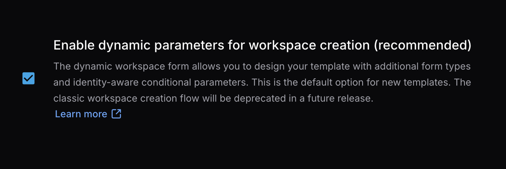
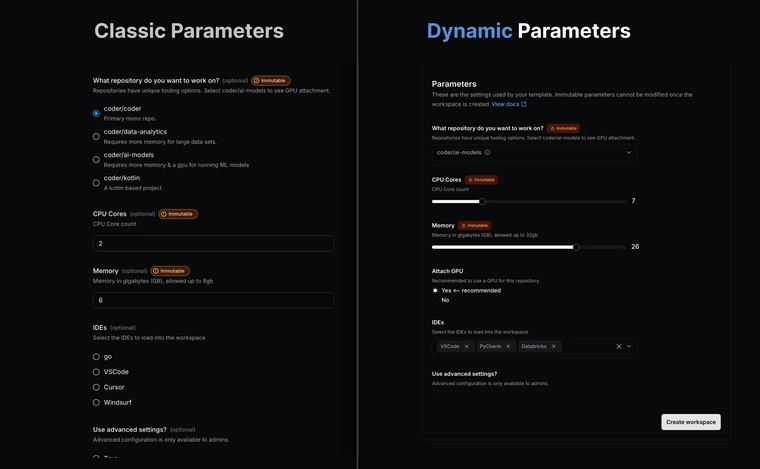

# Dynamic Parameters

Coder v2.24.0 introduces Dynamic Parameters to extend Coder [parameters](./parameters.md) with conditional form controls,
enriched input types, and user identity awareness.
This allows template authors to create interactive workspace creation forms with more environment customization,
and that means fewer templates to maintain.


All parameters are parsed from Terraform, so your workspace creation forms live in the same location as your provisioning code.
You can use all the native Terraform functions and conditionality to create a self-service tooling catalog for every template.

Administrators can use Dynamic Parameters to:

- Create parameters which respond to the inputs of others.
- Only show parameters when other input criteria are met.
- Only show select parameters to target Coder roles or groups.

You can try the Dynamic Parameter syntax and any of the code examples below in the
[Parameters Playground](https://playground.coder.app/parameters).
You should experiment with parameters in the playground before you upgrade live templates.

## When You Should Upgrade to Dynamic Parameters

While Dynamic parameters introduce a variety of new powerful tools, all functionality is backwards compatible with
existing coder templates.
When you opt-in to the new experience, no functional changes will be applied to your production parameters.

Some reasons Coder template admins should try Dynamic Parameters:

- You maintain or support many templates for teams with unique expectations or use cases.
- You want to selectively expose privileged workspace options to admins, power users, or personas.
- You want to make the workspace creation flow more ergonomic for developers.

Dynamic Parameters help you reduce template duplication by setting the conditions for which users should see specific parameters.
They reduce the potential complexity of user-facing configuration by allowing administrators to organize a long list of options into interactive, branching paths for workspace customization.
They allow you to set resource guardrails by referencing Coder identity in the `coder_workspace_owner` data source.

## How to enable Dynamic Parameters

In Coder v2.25.0 and later, Dynamic Parameters are automatically enabled for new templates. For Coder v2.24 and below, you can opt-in to Dynamic Parameters for individual existing templates via template settings.

1. Go to your template's settings and enable the **Enable dynamic parameters for workspace creation** option.

   

1. Update your template to use version >=2.4.0 of the Coder provider with the following Terraform block.

   ```terraform
   terraform {
     required_providers {
       coder = {
         source = "coder/coder"
         version = ">=2.4.0"
       }
     }
   }
   ```

1. This enables Dynamic Parameters in the template.
   Add some [conditional parameters](#available-form-input-types).

   Note that these new features must be declared in your Terraform to start leveraging Dynamic Parameters.

1. Save and publish the template.

1. Users should see the updated workspace creation form.

Dynamic Parameters features are backwards compatible, so all existing templates may be upgraded in-place.
If you decide to revert to the legacy flow later, disable Dynamic Parameters in the template's settings.

## Features and Capabilities

Dynamic Parameters introduces three primary enhancements to the standard parameter system:

- **Conditional Parameters**

  - Parameters can respond to changes in other parameters
  - Show or hide parameters based on other selections
  - Modify validation rules conditionally
  - Create branching paths in workspace creation forms

- **Reference User Properties**

  - Read user data at build time from [`coder_workspace_owner`](https://registry.terraform.io/providers/coder/coder/latest/docs/data-sources/workspace_owner)
  - Conditionally hide parameters based on user's role
  - Change parameter options based on user groups
  - Reference user name, groups, and roles in parameter text

- **Additional Form Inputs**

  - Searchable dropdown lists for easier selection
  - Multi-select options for choosing multiple items
  - Secret text inputs for sensitive information
  - Slider input for disk size, model temperature
  - Disabled parameters to display immutable data

> [!IMPORTANT]
> Dynamic Parameters does not support external data fetching via HTTP endpoints at workspace build time.
>
> External fetching would introduce unpredictability in workspace builds after publishing a template.
> Instead, we recommend that template administrators pull in any required data for a workspace build as a
> [locals](https://developer.hashicorp.com/terraform/tutorials/configuration-language/locals) or JSON file,
> then reference that data in Terraform.
>
> If you have a use case for external data fetching, please file an issue or create a discussion in the
> [Coder GitHub repository](https://github.com/coder/coder).

## Available Form Input Types

Dynamic Parameters supports a variety of form types to create rich, interactive user experiences.



Different parameter types support different form types.
You can specify the form type using the
[`form_type`](https://registry.terraform.io/providers/coder/coder/latest/docs/data-sources/parameter#form_type-1) attribute.

The **Options** column in the table below indicates whether the form type supports options (**Yes**) or doesn't support them (**No**).
When supported, you can specify options using one or more `option` blocks in your parameter definition,
where each option has a `name` (displayed to the user) and a `value` (used in your template logic).

| Form Type      | Parameter Types                            | Options | Notes                                                                                                                  |
|----------------|--------------------------------------------|---------|------------------------------------------------------------------------------------------------------------------------|
| `radio`        | `string`, `number`, `bool`, `list(string)` | Yes     | Radio buttons for selecting a single option with all choices visible at once. </br>The classic parameter option.       |
| `dropdown`     | `string`, `number`                         | Yes     | Choose a single option from a searchable dropdown list. </br>Default for `string` or `number` parameters with options. |
| `multi-select` | `list(string)`                             | Yes     | Select multiple items from a list with checkboxes.                                                                     |
| `tag-select`   | `list(string)`                             | No      | Default for `list(string)` parameters without options.                                                                 |
| `input`        | `string`, `number`                         | No      | Standard single-line text input field. </br>Default for `string/number` parameters without options.                    |
| `textarea`     | `string`                                   | No      | Multi-line text input field for longer content.                                                                        |
| `slider`       | `number`                                   | No      | Slider selection with min/max validation for numeric values.                                                           |
| `checkbox`     | `bool`                                     | No      | A single checkbox for boolean parameters. </br>Default for boolean parameters.                                         |

### Available Styling Options

The `coder_parameter` resource supports an additional `styling` attribute for special cosmetic changes that can be used
to further customize the workspace creation form.

This can be used for:

- Masking private inputs
- Marking inputs as read-only
- Setting placeholder text

Note that the `styling` attribute should not be used as a governance tool, since it only changes how the interactive
form is displayed.
Users can avoid restrictions like `disabled` if they create a workspace via the CLI.

This attribute accepts JSON like so:

```terraform
data "coder_parameter" "styled_parameter" {
  ...
  styling = jsonencode({
    disabled = true
  })
}
```

Not all styling attributes are supported by all form types, use the reference below for syntax:

| Styling Option | Compatible parameter types | Compatible form types | Notes                                                                               |
|----------------|----------------------------|-----------------------|-------------------------------------------------------------------------------------|
| `disabled`     | All parameter types        | All form types        | Disables the form control when `true`.                                              |
| `placeholder`  | `string`                   | `input`, `textarea`   | Sets placeholder text. </br>This is overwritten by user entry.                      |
| `mask_input`   | `string`, `number`         | `input`, `textarea`   | Masks inputs as asterisks (`*`). Used to cosmetically hide token or password entry. |

## Use Case Examples

### New Form Types

The following examples show some basic usage of the
[`form_type`](https://registry.terraform.io/providers/coder/coder/latest/docs/data-sources/parameter#form_type-1)
attribute [explained above](#available-form-input-types).
These are used to change the input style of form controls in the create workspace form.

<div class="tabs">

### Dropdowns

Single-select parameters with options can use the `form_type="dropdown"` attribute for better organization.

[Try dropdown lists on the Parameter Playground](https://playground.coder.app/parameters/kgNBpjnz7x)

```terraform
locals {
  ides = [
    "VS Code",
    "JetBrains IntelliJ",
    "PyCharm",
    "GoLand",
    "WebStorm",
    "Vim",
    "Emacs",
    "Neovim"
  ]
}

data "coder_parameter" "ides_dropdown" {
  name = "ides_dropdown"
  display_name = "Select your IDEs"
  type = "string"

  form_type = "dropdown"

  dynamic "option" {
    for_each = local.ides
    content {
      name  = option.value
      value = option.value
    }
  }
}
```

### Text Area

The large text entry option can be used to enter long strings like AI prompts, scripts, or natural language.

[Try textarea parameters on the Parameter Playground](https://playground.coder.app/parameters/RCAHA1Oi1_)

```terraform

data "coder_parameter" "text_area" {
  name = "text_area"
  description  = "Enter multi-line text."
  mutable      = true
  display_name = "Textarea"

  form_type = "textarea"
  type      = "string"

  default = <<-EOT
    This is an example of multi-line text entry.

    The 'textarea' form_type is useful for
    - AI prompts
    - Scripts
    - Read-only info (try the 'disabled' styling option)
  EOT
}

```

### Multi-select

Multi-select parameters allow users to select one or many options from a single list of options.
For example, adding multiple IDEs with a single parameter.

[Try multi-select parameters on the Parameter Playground](https://playground.coder.app/parameters/XogX54JV_f)

```terraform
locals {
  ides = [
    "VS Code", "JetBrains IntelliJ",
    "GoLand", "WebStorm",
    "Vim", "Emacs",
    "Neovim", "PyCharm",
    "Databricks", "Jupyter Notebook",
  ]
}

data "coder_parameter" "ide_selector" {
  name = "ide_selector"
  description  = "Choose any IDEs for your workspace."
  mutable      = true
  display_name = "Select multiple IDEs"


  # Allows users to select multiple IDEs from the list.
  form_type = "multi-select"
  type      = "list(string)"


  dynamic "option" {
    for_each = local.ides
    content {
      name  = option.value
      value = option.value
    }
  }
}
```

### Radio

Radio buttons are used to select a single option with high visibility.
This is the original styling for list parameters.

[Try radio parameters on the Parameter Playground](https://playground.coder.app/parameters/3OMDp5ANZI).

```terraform
data "coder_parameter" "environment" {
  name         = "environment"
  display_name = "Environment"
  description  = "An example of environment listing with the radio form type."
  type         = "string"
  default      = "dev"

  form_type    = "radio"

  option {
    name  = "Development"
    value = "dev"
  }
  option {
    name  = "Experimental"
    value = "exp"
  }
  option {
    name  = "Staging"
    value = "staging"
  }
  option {
    name  = "Production"
    value = "prod"
  }
}
```

### Checkboxes

A single checkbox for boolean values.
This can be used for a TOS confirmation or to expose advanced options.

[Try checkbox parameters on the Parameters Playground](https://playground.coder.app/parameters/ycWuQJk2Py).

```terraform
data "coder_parameter" "enable_gpu" {
  name         = "enable_gpu"
  display_name = "Enable GPU"
  type         = "bool"
  form_type    = "checkbox" # This is the default for boolean parameters
  default      = false
}
```

### Slider

Sliders can be used for configuration on a linear scale, like resource allocation.
The `validation` block is used to constrain (or clamp) the minimum and maximum values for the parameter.

[Try slider parameters on the Parameters Playground](https://playground.coder.app/parameters/RsBNcWVvfm).

```terraform
data "coder_parameter" "cpu_cores" {
  name         = "cpu_cores"
  display_name = "CPU Cores"
  type         = "number"
  form_type    = "slider"
  default      = 2
  validation {
    min = 1
    max = 8
  }
}
```

### Masked Input

Masked input parameters can be used to visually hide secret values in the workspace creation form.
Note that this does not secure information on the backend and is purely cosmetic.

[Try private parameters on the Parameters Playground](https://playground.coder.app/parameters/wmiP7FM3Za).

Note: This text may not be properly hidden in the Playground.
The `mask_input` styling attribute is supported in v2.24.0 and later.

```terraform
data "coder_parameter" "private_api_key" {
  name         = "private_api_key"
  display_name = "Your super secret API key"
  type         = "string"

  form_type = "input" # | "textarea"

  # Will render as "**********"
  default = "privatekey"

  styling = jsonencode({
    mask_input = true
  })
}
```

</div>

### Conditional Parameters

Using native Terraform syntax and parameter attributes like `count`, we can allow some parameters to react to user inputs.

This means:

- Hiding parameters unless activated
- Conditionally setting default values
- Changing available options based on other parameter inputs

Use these in conjunction to build intuitive, reactive forms for workspace creation.

<div class="tabs">

### Hide/Show Options

Use Terraform conditionals and the `count` block to allow a checkbox to expose or hide a subsequent parameter.

[Try conditional parameters on the Parameter Playground](https://playground.coder.app/parameters/xmG5MKEGNM).

```terraform
data "coder_parameter" "show_cpu_cores" {
  name         = "show_cpu_cores"
  display_name = "Toggles next parameter"
  description  = "Select this checkbox to show the CPU cores parameter."
  type         = "bool"
  form_type    = "checkbox"
  default      = false
  order        = 1
}

data "coder_parameter" "cpu_cores" {
  # Only show this parameter if the previous box is selected.
  count = data.coder_parameter.show_cpu_cores.value ? 1 : 0

  name         = "cpu_cores"
  display_name = "CPU Cores"
  type         = "number"
  form_type    = "slider"
  default      = 2
  order        = 2
  validation {
    min = 1
    max = 8
  }
}
```

### Dynamic Defaults

Influence which option is selected by default for one parameter based on the selection of another.
This allows you to suggest an option dynamically without strict enforcement.

[Try dynamic defaults in the Parameter Playground](https://playground.coder.app/parameters/DEi-Bi6DVe).

```terraform
locals {
  ides = [
    "VS Code",
    "IntelliJ", "GoLand",
    "WebStorm", "PyCharm",
    "Databricks", "Jupyter Notebook",
  ]
  mlkit_ides = jsonencode(["Databricks", "PyCharm"])
  core_ides = jsonencode(["VS Code", "GoLand"])
}

data "coder_parameter" "git_repo" {
  name = "git_repo"
  display_name = "Git repo"
  description = "Select a git repo to work on."
  order = 1
  mutable = true
  type = "string"
  form_type = "dropdown"

  option {
    # A Go-heavy repository
    name = "coder/coder"
    value = "coder/coder"
  }

  option {
    # A python-heavy repository
    name = "coder/mlkit"
    value = "coder/mlkit"
  }
}

data "coder_parameter" "ide_selector" {
  # Conditionally expose this parameter
  count = try(data.coder_parameter.git_repo.value, "") != "" ? 1 : 0

  name = "ide_selector"
  description  = "Choose any IDEs for your workspace."
  order        = 2
  mutable      = true

  display_name = "Select IDEs"
  form_type = "multi-select"
  type      = "list(string)"
  default   = try(data.coder_parameter.git_repo.value, "") == "coder/mlkit" ? local.mlkit_ides : local.core_ides


  dynamic "option" {
    for_each = local.ides
    content {
      name  = option.value
      value = option.value
    }
  }
}
```

## Dynamic Validation

A parameter's validation block can leverage inputs from other parameters.

[Try dynamic validation in the Parameter Playground](https://playground.coder.app/parameters/sdbzXxagJ4).

```terraform
data "coder_parameter" "git_repo" {
  name = "git_repo"
  display_name = "Git repo"
  description = "Select a git repo to work on."
  order = 1
  mutable = true
  type = "string"
  form_type = "dropdown"

  option {
    # A Go-heavy repository
    name = "coder/coder"
    value = "coder/coder"
  }

  option {
    # A python-heavy repository
    name = "coder/mlkit"
    value = "coder/mlkit"
  }
}

data "coder_parameter" "cpu_cores" {
  # Only show this parameter if the previous box is selected.
  count = data.coder_parameter.show_cpu_cores.value ? 1 : 0

  name         = "cpu_cores"
  display_name = "CPU Cores"
  type         = "number"
  form_type    = "slider"
  order        = 2

  # Dynamically set default
  default      = try(data.coder_parameter.git_repo.value, "") == "coder/mlkit" ? 12 : 6

  validation {
    min = 1

    # Dynamically set max validation
    max = try(data.coder_parameter.git_repo.value, "") == "coder/mlkit" ? 16 : 8
  }
}
```

<!-- ## Daisy Chaining

You can daisy-chain the conditionals shown here to create a dynamically expanding form.
Note that parameters must be indexed when using the `count` attribute.

[Try daisy-chaining parameters in the Parameter Playground](https://playground.coder.app/parameters/jLUUhoDLIa).

```terraform

locals {
  ides = [
    "VS Code",
    "JetBrains IntelliJ",
    "GoLand",
    "WebStorm",
    "PyCharm",
    "Databricks",
    "Jupyter Notebook",
  ]

  is_ml_repo = data.coder_parameter.git_repo == "coder/mlkit"

  selected = jsondecode(data.coder_parameter.ide_selector[0].value)

  # selected = try(jsondecode(data.coder_parameter.ide_selector[0].value), [])
}

data "coder_parameter" "git_repo" {
  name = "git_repo"
  display_name = "Git repo"
  description = "Select a git repo to work on."
  order = 1
  mutable = true
  type = "string"
  form_type = "dropdown"

  option {
    name = "coder/coder"
    value = "coder/coder"
  }

  option {
    name = "coder/mlkit"
    value = "coder/mlkit"
  }
}

data "coder_parameter" "ide_selector" {
  # Only show this parameter if a git repo has been selected.
  count = try(data.coder_parameter.git_repo.value, "") != "" ? 1 : 0
  name = "ide_selector"
  description  = "Choose any IDEs for your workspace."
  mutable      = true
  display_name = "Select multiple IDEs"
  order = 1
  default = "[]"

  # Allows users to select multiple IDEs from the list.
  form_type = "multi-select"
  type      = "list(string)"

  dynamic "option" {
    for_each = local.ides
    content {
      name  = option.value
      value = option.value
    }
  }
}

data "coder_parameter" "cpu_cores" {
  # Only show this parameter if the IDEs have been selected.
  count = length(local.selected) > 0 ? 1 : 0

  name         = "cpu_cores"
  display_name = "CPU Cores"
  type         = "number"
  form_type    = "slider"
  default      = local.is_ml_repo ? 12 : 6
  order        = 2
  validation {
    min = 1
    max = local.is_ml_repo ? 16 : 8
  }
}
``` -->

</div>

## Identity-Aware Parameters (Premium)

Premium users can leverage our roles and groups to conditionally expose or change parameters based on user identity.
This is helpful for establishing governance policy directly in the workspace creation form,
rather than creating multiple templates to manage RBAC.

User identity is referenced in Terraform by reading the
[`coder_workspace_owner`](https://registry.terraform.io/providers/coder/coder/latest/docs/data-sources/workspace_owner) data source.

<div class="tabs">

### Role-aware Options

Template administrators often want to expose certain experimental or unstable options only to those with elevated roles.
You can now do this by setting `count` based on a user's group or role, referencing the
[`coder_workspace_owner`](https://registry.terraform.io/providers/coder/coder/latest/docs/data-sources/workspace_owner)
data source.

[Try out admin-only options in the Playground](https://playground.coder.app/parameters/5Gn9W3hYs7).

```terraform

locals {
  roles = [for r in data.coder_workspace_owner.me.rbac_roles: r.name]
  is_admin = contains(data.coder_workspace_owner.me.groups, "admin")
  has_admin_role = contains(local.roles, "owner")
}

data "coder_workspace_owner" "me" {}

data "coder_parameter" "advanced_settings" {
  # This parameter is only visible when the user is an administrator
  count = local.is_admin ? 1 : 0

  name         = "advanced_settings"
  display_name = "Add an arbitrary script"
  description  = "An advanced configuration option only available to admins."
  type         = "string"
  form_type    = "textarea"
  mutable      = true
  order        = 5

  styling = jsonencode({
    placeholder = <<-EOT
  #!/usr/bin/env bash
  while true; do
    echo "hello world"
    sleep 1
  done
  EOT
  })
}

```

### Group-aware Regions

You can expose regions depending on which group a user belongs to.
This way developers can't accidentally induce low-latency with world-spanning connections.

[Try user-aware regions in the parameter playground](https://playground.coder.app/parameters/tBD-mbZRGm)

```terraform

locals {
  eu_regions = [
    "eu-west-1 (Ireland)",
    "eu-central-1 (Frankfurt)",
    "eu-north-1 (Stockholm)",
    "eu-west-3 (Paris)",
    "eu-south-1 (Milan)"
  ]

  us_regions = [
    "us-east-1 (N. Virginia)",
    "us-west-1 (California)",
    "us-west-2 (Oregon)",
    "us-east-2 (Ohio)",
    "us-central-1 (Iowa)"
  ]

  eu_group_name = "eu-helsinki"
  is_eu_dev = contains(data.coder_workspace_owner.me.groups, local.eu_group_name)
  region_desc_tag = local.is_eu_dev ? "european" : "american"
}

data "coder_parameter" "region" {
  name         = "region"
  display_name = "Select a Region"
  description  = "Select from ${local.region_desc_tag} region options."
  type         = "string"
  form_type    = "dropdown"
  order        = 5
  default      = local.is_eu_dev ? local.eu_regions[0] : local.us_regions[0]

  dynamic "option" {
    for_each = local.is_eu_dev ? local.eu_regions : local.us_regions
    content {
      name        = option.value
      value       = option.value
      description = "Use ${option.value}"
    }
  }
}
```

### Groups As Namespaces

A slightly unorthodox way to leverage this is by filling the selections of a parameter from the user's groups.
Some users associate groups with namespaces, such as Kubernetes, then allow users to target that namespace with a parameter.

[Try groups as options in the Parameter Playground](https://playground.coder.app/parameters/lKbU53nYjl).

```terraform
locals {
  groups = data.coder_workspace_owner.me.groups
}

data "coder_workspace_owner" "me" {}

data "coder_parameter" "your_groups" {
  type         = "string"
  name         = "your_groups"
  display_name = "Your Coder Groups"
  description  = "Select your namespace..."
  default      = "target-${local.groups[0]}"
  mutable      = true
  form_type = "dropdown"

  dynamic "option" {
    # options populated directly from groups
    for_each = local.groups
    content {
      name  = option.value
      # Native terraform be used to decorate output
      value = "target-${option.value}"
    }
  }
}
```

</div>

## Troubleshooting

Dynamic Parameters is now in general availability. We're tracking a list of known issues [here in Github](https://github.com/coder/coder/issues?q=sort%3Aupdated-desc%20is%3Aissue%20is%3Aopen%20label%3Aparameters) as we continue to polish and improve the workflow.
If you have any issues during upgrade, please file an issue in our
[GitHub repository](https://github.com/coder/coder/issues/new?labels=parameters) with the `parameters` label and include a
[Playground link](https://playground.coder.app/parameters) where applicable.
We appreciate the feedback and look forward to what the community creates with this system!

You can also [search or track the list of known issues](https://github.com/coder/coder/issues?q=is%3Aissue%20state%3Aopen%20label%3Aparameters).

You can share anything you build with Dynamic Parameters in our [Discord](https://coder.com/chat).

### Enabled Dynamic Parameters, but my template looks the same

Ensure that the following version requirements are met:

- `coder/coder`: >= [v2.25.0](https://github.com/coder/coder/releases/tag/v2.25.0)
- `coder/terraform-provider-coder`: >= [v2.5.3](https://github.com/coder/terraform-provider-coder/releases/tag/v2.5.3)

Enabling Dynamic Parameters on an existing template requires administrators to publish a new template version.
This will resolve the necessary template metadata to render the form.

### Reverting to classic parameters

To revert Dynamic Parameters on a template:

1. Prepare your template by removing any conditional logic or user data references in parameters.
1. As a template administrator or owner, go to your template's settings:

   **Templates** > **Your template** > **Settings**

1. Uncheck the **Enable dynamic parameters for workspace creation** option.
1. Create a new template version and publish to the active version.

### Template variables not showing up

Dynamic Parameters are GA as of [v2.25.0](https://github.com/coder/coder/releases/tag/v2.25.0). Template variables are fully supported in Dynamic Parameters.

If you are experiencing issues with template variables, try upgrading to the latest version. Otherwise, please file an issue in our Github.

### Can I use registry modules with Dynamic Parameters?

Yes, registry modules are supported with Dynamic Parameters.

Unless explicitly mentioned, no registry modules require Dynamic Parameters.
Later in 2025, more registry modules will be converted to Dynamic Parameters to improve their UX.

In the meantime, you can safely convert existing templates and build new parameters on top of the functionality provided in the registry.
